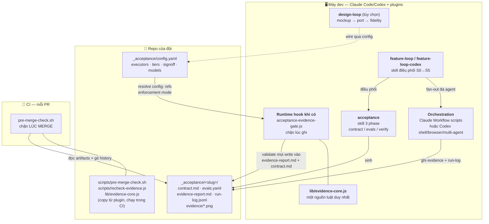
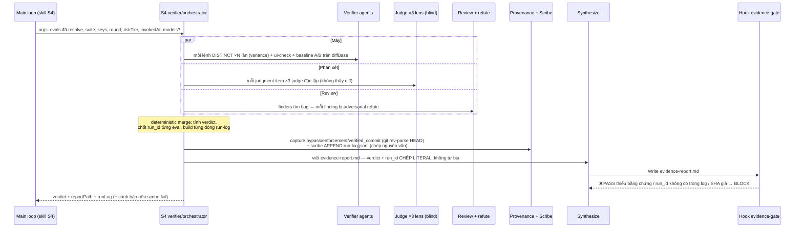

# Hướng dẫn sử dụng đầy đủ — Acceptance-Gate Kit

> Đọc nhanh 5 phút → [QUICKSTART.md](QUICKSTART.md). Tài liệu này là **bản đầy đủ**:
> kiến trúc, cài đặt, vận hành hằng ngày, tra cứu enforcement, xử lý sự cố và tinh chỉnh.
> Khớp phiên bản: acceptance-gate ≥ 1.10.0 · feature-loop / feature-loop-codex ≥ 1.10.0 · design-loop ≥ 0.1.1.

## Mục lục

1. [Kit giải quyết vấn đề gì](#1-kit-giải-quyết-vấn-đề-gì)
2. [Kiến trúc tổng thể](#2-kiến-trúc-tổng-thể)
3. [Vòng đời một tính năng](#3-vòng-đời-một-tính-năng)
4. [Bên trong S4 VERIFY — evidence từ đâu ra](#4-bên-trong-s4-verify--evidence-từ-đâu-ra)
5. [Cài đặt](#5-cài-đặt)
6. [Vận hành hằng ngày](#6-vận-hành-hằng-ngày)
7. [Tra cứu enforcement — hook và CI chặn gì](#7-tra-cứu-enforcement--hook-và-ci-chặn-gì)
8. [Tinh chỉnh cho repo của đội](#8-tinh-chỉnh-cho-repo-của-đội)
9. [Xử lý sự cố](#9-xử-lý-sự-cố)
10. [Dành cho người bảo trì kit](#10-dành-cho-người-bảo-trì-kit)

---

## 1. Kit giải quyết vấn đề gì

AI code rất nhanh, nhưng nghiệm thu vẫn là người click tay 1–2 giờ — hoặc tệ hơn:
tin lời AI tự khai "done". Kit thay thế cả hai bằng một hợp đồng ba bên:

- **Máy chứng minh** — mỗi tiêu chí nghiệm thu có eval chạy được; PASS bắt buộc kèm
  bằng chứng máy (`run_id`, `exit_code: 0`, verifier thật, commit đã verify).
- **Người quyết** — đúng **2 điểm dừng**: Cổng 1 duyệt *tiêu chí* trước khi code,
  Cổng 2 ký *bằng chứng* sau khi verify. Mỗi cổng 5–10 phút.
- **Enforcement tất định** — không dựa "AI ngoan": hook chặn ngay lúc ghi file,
  CI chặn lại lúc merge. Nói dối phải thắng được cả hai lớp máy.

Ba nguyên tắc không thương lượng:

| Nguyên tắc | Nghĩa là |
|---|---|
| **Doer ≠ grader** | Agent viết code không bao giờ tự chấm; verify luôn là agent context sạch |
| **Evidence over assertion** | REJECT/BLOCKED trung thực luôn hợp lệ; PASS không bằng chứng thì không tồn tại |
| **2 cổng người duy nhất** | Không bắt người kiểm lại thứ máy đã chứng minh |

## 2. Kiến trúc tổng thể

Kit gồm **3 plugin** (cài trên máy dev) + **artifacts trong repo** + **1 chốt chặn CI**.
Mọi luật evidence nằm trong **một file duy nhất** (`lib/evidence-core.js`) được cả hook
lẫn CI re-check dùng chung — hai lớp không bao giờ lệch luật nhau.



| Thành phần | Vai trò một dòng |
|---|---|
| `acceptance` (plugin acceptance-gate) | Biến yêu cầu → contract + evals; verify → evidence report |
| `feature-loop` / `feature-loop-codex` | "Cả con đường": brainstorm → contract → plan → code → verify đa-agent → PR |
| `design-loop` | Làn design cho web UI: mockup/reference chuẩn → so pixel khi verify (tùy chọn) |
| Hook `acceptance-evidence-gate.js` | Chặn PASS thiếu bằng chứng + contract nhảy cóc Cổng 1 khi runtime hook đang active |
| `lib/evidence-core.js` | Toàn bộ luật L1/L2/L3 — hook và CI re-check cùng require file này |
| `scripts/pre-merge-check.sh` | Chốt chặn CI độc lập: kiểm cả những gì hook không thấy (người sửa tay, git history) |
| `_acceptance/` trong repo | Nguồn sự thật: config + hồ sơ nghiệm thu từng tính năng |

**Vì sao cần cả hook lẫn CI?** Hook chỉ thấy những write mà runtime gửi qua hook.
Người mở editor sửa tay evidence, hoặc một runtime không bật hook, thì hook mù — CI
re-check chạy đúng bộ luật đó trên file **đã commit**, cộng thêm các kiểm tra chỉ làm
được bằng git history (evidence có bị cũ so với code không, ai đưa chữ ký vào, PR có né
gate không). Vì vậy CI là lớp enforce chung cho cả Claude Code và Codex.

## 3. Vòng đời một tính năng

```mermaid
flowchart LR
  START(("💡 ý tưởng")) --> S1["<b>S1 DESIGN</b><br/>brainstorm → design-doc<br/>+ contract (status: draft)<br/>+ evals.yaml"]
  S1 --> G1{"🚪 <b>CỔNG 1</b><br/>người duyệt tiêu chí<br/>5–10 phút"}
  G1 -->|"status: approved<br/>+ approved_by"| S2["<b>S2 PLAN</b><br/>task list + verify per-task"]
  S2 -->|"T3: 🚪 Cổng 1.5 duyệt plan"| S3["<b>S3 EXECUTE</b><br/>code; task độc lập →<br/>song song, mỗi task 1 worktree"]
  S3 -->|"status: implemented"| S4["<b>S4 VERIFY</b><br/>workflow đa-agent<br/>(xem mục 4)"]
  S4 -->|"REJECT — tự sửa,<br/>tối đa 3 vòng"| S3
  S4 -->|"PASS / PENDING-JUDGMENT<br/>status: verified<br/>+ COMMIT evidence máy-viết"| G2{"🚪 <b>CỔNG 2</b><br/>người kiểm UNCERTAIN<br/>+ ký signoff"}
  G2 -->|"human_signoff (COMMIT RIÊNG)<br/>status: signed-off"| S5["<b>S5 SHIP</b><br/>tạo PR"]
  S5 --> CI["CI pre-merge-check<br/>chốt chặn độc lập"]
  CI --> DONE(("✅ merge"))
```

Nguồn sự thật duy nhất là frontmatter **`status`** trong `_acceptance/<slug>/contract.md`.
Mọi resume (`/feature-loop <slug>`) đọc status và vào đúng chỗ.



| `status` hiện tại | Ai set | Resume vào |
|---|---|---|
| *(chưa có contract)* | — | S0 → S1 |
| `draft` | S1 (máy) | Cổng 1 — trình lại gói duyệt |
| `approved` | Cổng 1 (người duyệt → máy ghi `approved_by`) | S2 PLAN (T3: Cổng 1.5 nếu plan chưa duyệt) |
| `implemented` | S3 — hành động CUỐI của agent code | S4 VERIFY |
| `verified` | S4 (sau verdict PASS/PENDING-JUDGMENT) | Cổng 2 — **sau guard staleness** (mục 7) |
| `signed-off` | Cổng 2 (người ký) | S5 SHIP |

**Risk tier** quyết định độ dày của gate — xác định ở S0 từ path dự kiến, đối chiếu
lại bằng diff thật ở S4:

| Tier | Là gì | Gate |
|---|---|---|
| **T1** | docs, typo, config vặt (khớp `t1_skip_globs`) | Bỏ qua kit — nhưng phải **xác nhận** bảng path→glob, và CI backstop sẽ bắt nếu PR thực tế đụng code |
| **T2** | mặc định | Flow đầy đủ, 2 cổng |
| **T3** | path nhạy cảm (`t3_paths`: auth/billing/migrations...) | Thêm Cổng 1.5 duyệt plan; verdict AI-judge chỉ tham khảo — người phải kiểm **mọi** judgment item |

## 4. Bên trong S4 VERIFY — evidence từ đâu ra

Hiểu mục này là hiểu vì sao evidence đáng tin: **mọi con số do máy quyết, LLM chỉ chép**.



Những chốt toàn vẹn đáng chú ý:

- **Dedupe + variance**: các eval trỏ cùng một lệnh chỉ chạy 1 lần; eval ngẫu nhiên
  (`runs: N`) chạy N lần → `pass_rate` (hỗn hợp → người quyết ở Cổng 2, không auto-pass).
- **A/B baseline**: lệnh eval chạy lại trên code gốc — eval "xanh cả hai phía" bị bêu
  trong mục `## Analyst` (nó chứng minh harness, không chứng minh feature).
- **`run-log.jsonl`**: sổ cái máy ghi *tại lúc chạy*; hook + CI đối chiếu từng `run_id`
  trong report với sổ này — PASS bịa tay không qua được.
- **`verified_commit`**: evidence bị neo vào đúng cây code đã verify; code đổi sau đó
  → evidence STALE, phải verify lại (resume tự hạ status, CI chặn merge).
- **Provenance**: `enforcement_mode` / `bypass_used` đo bằng máy và đóng dấu vào report
  — merge một PASS "xanh nhưng gate đang tắt" là việc CI không cho phép.
- **Observed (v1.10):** agent ui-check phải MỞ từng frame đã lưu (Read đa
  phương thức) và ghi `observed:` — thấy gì cụ thể, đối chiếu expected — vào
  block evidence. Frame mâu thuẫn expected = eval FAIL dù lệnh exit 0. Hook
  chặn report PASS (schema v2) có `screenshot:` mà thiếu `observed:` thực chất
  — đóng lỗ "chụp mà không xem".

## Sổ quyết định & 2 công tắc design (1.11.0)

**decisions.jsonl** — mỗi workspace có sổ rationale append-only: quyết định
descope/approach/fix kèm trade-off, seal tại Gate 1 (dòng sau seal = provisional,
card Gate 2 trình riêng "CHƯA duyệt" cho bạn phê). Ledger KHÔNG override contract —
descope một AC vẫn phải sửa contract + re-approve. Card 2 gate tự render mục
"Quyết định & trade-off" (descope lên đầu); chưa ghi gì → in "(chưa ghi quyết định
nào)" để bạn đòi khi cần.

**Làn design 2 công tắc** — CT1 (chạm UI, tự động): static checks (token/contrast/
tap, thiếu capture là BLOCKED) + screenshot như thường. CT2 (ceremony đắt, bạn bật
bằng 1 câu cuối S1 hoặc chạy `/design-mockup`): mockup + state-matrix + fidelity +
panel Gate 2. Không có field tier nào — trạng thái nhận từ artifact (provenance /
eval fidelity); D0/D1/D2 chỉ là cách gọi. Bỏ ceremony = 1 entry `descope` hiện trên
card. `/design-init` hỏi thêm `design.surface_globs` để S4 bắt "diff chạm surface
mà lane không có design eval".

## 5. Cài đặt

### 5.1 Mỗi máy dev (một lần)

Codex:

```bash
codex plugin marketplace add phanlemanh/acceptance-gate-kit
codex plugin add acceptance-gate@acceptance-gate-kit
codex plugin add feature-loop-codex@acceptance-gate-kit
codex plugin add design-loop@acceptance-gate-kit          # tùy chọn — repo có web UI
codex plugin add superpowers@openai-curated               # nếu dùng brainstorm/plan
```

Claude Code:

```bash
claude plugin marketplace add phanlemanh/acceptance-gate-kit
claude plugin install acceptance-gate@acceptance-gate-kit
claude plugin install feature-loop@acceptance-gate-kit      # vòng lặp trọn gói
claude plugin install superpowers@claude-plugins-official   # dependency của feature-loop
claude plugin install design-loop@acceptance-gate-kit       # tùy chọn — repo có web UI
```

Sau khi cài, **mở phiên Claude Code/Codex mới** để runtime nạp plugin.

**Kỷ luật cập nhật** — hai dev chạy 2 version kit trên cùng repo = 2 chuẩn gate khác
nhau (verifier bị chặn "oan", feature lọt eval). Chạy khi có release hoặc đầu sprint:

```bash
claude plugin update acceptance-gate@acceptance-gate-kit
claude plugin update feature-loop@acceptance-gate-kit
codex plugin marketplace upgrade
```

### 5.2 Mỗi repo (một lần)

1. Trong Claude Code hoặc Codex: chạy **`/acceptance-init`** hoặc yêu cầu agent
   "run acceptance init" — trả lời lệnh test/smoke của repo,
   path nhạy cảm (`t3_paths`), glob bỏ qua (`t1_skip_globs`), người ký. Kết quả:
   `_acceptance/config.yaml` (indent **2-space bắt buộc** — parser của kit đọc theo dòng).
2. Repo có web UI: `npm i -D jsdom` (design gate chạy chế độ DOM; thiếu → eval design BLOCKED).
3. (Tùy chọn) design-loop: chạy `/design-init` để wire khối `executors.design.*`.

Tham chiếu đầy đủ `config.yaml` — mục 8 có phần tinh chỉnh:

| Khóa | Ý nghĩa | Khi thiếu |
|---|---|---|
| `enforcement` | Hook: `strict` chặn · `warn` chỉ cảnh báo · `off` tắt | `strict` |
| `recheck` | CI re-check evidence đã commit: `strict`/`warn`/`off` | `warn` (repo mới nên để `strict`) |
| `executors.test.*` `executors.script.*` | Lệnh thật của repo; evals chỉ tham chiếu `config:executors...` | — |
| `executors.design.*` | Design gate (do `/design-init` ghi) | design eval bị skip |
| `risk_tiers.t1_skip_globs` | Glob an toàn bỏ qua gate (docs, *.md) | không gì được miễn |
| `risk_tiers.t3_paths` | Path critical → T3 | không gì bị nâng T3 |
| `signoff.required_for` | Tier nào bắt buộc ký trước merge | `[T2, T3]` |
| `signoff.require_human_commit` | Chữ ký Cổng 2 phải nằm trong commit riêng (mục 7) | `false` (scaffold mới: `true`) |
| `signoff.agent_authors` | Blocklist email-glob cho commit chữ ký (bot CI) | tắt |
| `dev_server.start` / `url` | Cho eval `ui-check` | ui-check bị hạ cấp |
| `capture.ui` | Lệnh chụp `<cmd> <url> <out.png>` → slideshow Cổng 2 | evidence UI = HTML |
| `feature_loop.suite_keys` | Lệnh chạy MỌI vòng verify (build/typecheck...) — S4 tự hỏi rồi tự ghi | S4 hỏi một lần |
| `feature_loop.models.<role>` | Override model từng vai trò verify (mục 8) | bảng default |

### 5.3 Wire CI (bắt buộc để gate có răng ở PR)

Copy **đủ 3 file** từ plugin vào repo, giữ đúng layout (re-check `require ../lib`):

```
scripts/pre-merge-check.sh
scripts/recheck-evidence.js
lib/evidence-core.js
```

> Chỉ copy mỗi `pre-merge-check.sh` là repo âm thầm **mất lớp re-check** evidence đã
> commit — nó chỉ còn in NOTE.

GitHub Actions mẫu:

```yaml
acceptance-gate:
  runs-on: ubuntu-latest
  steps:
    - uses: actions/checkout@v4
      with: { fetch-depth: 0 }   # cần lịch sử để kiểm verified_commit + chữ ký
    - run: bash scripts/pre-merge-check.sh . --base "origin/$GITHUB_BASE_REF"
```

`--base` bật **backstop chống né T1**: PR đổi code gated mà không mang artifact
`_acceptance/` nào → VIOLATION. Không truyền base → backstop chỉ in NOTE (chủ đích,
để nâng cấp kit không làm đỏ CI cũ — nhưng hãy wire nó).

## 6. Vận hành hằng ngày

### 6.1 Luồng khuyến nghị — `/feature-loop` hoặc `feature-loop-codex`

```
/feature-loop <mô tả tính năng>     # bắt đầu
/feature-loop <slug>                # resume — đọc status, vào đúng stage
Run feature-loop-codex for <mô tả>  # Codex edition
```

Máy tự chạy S1→S5; bạn chỉ làm việc ở các điểm dừng:

**🚪 Cổng 1 — duyệt tiêu chí (5–10 phút, đáng giá nhất).** Máy trình thẻ quyết định
(`/acceptance-card <slug>`) bằng ngôn ngữ sản phẩm: "sẽ làm / sẽ KHÔNG làm" + cờ phủ
biên. Bạn kiểm:

- Tiêu chí Given/When/Then đúng ý nghiệp vụ? Thiếu ca biên/ca *không được xảy ra*?
- `Out of scope` có tối thiểu 2 mục thật không?
- Mỗi AC có ≥1 eval, executor hợp lý (ưu tiên máy nhất có thể)?

Duyệt xong máy ghi `approved_by` + `approved_at` (hook chặn contract tiến lên mà thiếu
bước này). Muốn bỏ cổng? Nói rõ — máy ghi `gate1_skipped: true` làm dấu vết audit.

**🚪 Cổng 1.5 (chỉ T3)** — duyệt plan: task list + files + thứ tự.

**🚪 Cổng 2 — ký nghiệm thu (5–10 phút).** Evidence máy-viết đã được **commit trước đó**
(cuối S4). Bạn:

1. Đọc thẻ quyết định / trang `evidence-page` (bảng per-eval, screenshot slideshow).
2. Tự tay kiểm **chỉ** các item `UNCERTAIN` (T3: **mọi** judgment item) → nhờ agent điền
   `human_override: <Tên> <ngày>` (agent ghi thì hook mới re-validate được).
3. Verdict `PENDING-JUDGMENT` → nhờ agent nâng thành `PASS`.
4. Điền `human_signoff: <Tên> <ngày>` + số phút vào `time_human_minutes.gate2`.
5. **Commit các sửa đổi Cổng-2 thành commit RIÊNG** — chỉ chạm các dòng human-owned
   (`human_signoff` / `human_override` / `verdict` / `bypass_ack`). Chính bạn commit
   (hoặc ra lệnh agent commit đúng phần đó). Repo bật `require_human_commit` thì CI
   chặn chữ ký sinh cùng commit với body report — commit chữ ký là dấu vết "người đã duyệt".

Sau đó máy set `status: signed-off` và S5 tạo PR theo quy trình repo.

### 6.2 Luồng gọn — chỉ plugin acceptance-gate

Không dùng feature-loop (không cài superpowers, muốn tự code tay):

```
/acceptance <tên tính năng>   # Phase 1+2: contract + evals → Cổng 1
# ... code như bình thường; xong thì agent set contract status: implemented ...
/acceptance <slug>            # Phase 3: verify subagent context sạch → evidence → Cổng 2
```

Khác biệt: verify chạy bằng một fresh context/subagent khi runtime có, hoặc một
grader pass tách biệt trong Codex (không fan-out đa agent như S4), nhưng **cùng
template, cùng evidence rules, cùng CI** — mức bằng chứng không đổi.

### 6.3 Lệnh tiện ích

| Lệnh | Dùng khi |
|---|---|
| `/acceptance-status` | Xem trạng thái mọi tính năng trong `_acceptance/` |
| `/acceptance-card <slug>` | Render thẻ quyết định Cổng 1/Cổng 2 (tự nhận cổng theo trạng thái) |
| `node scripts/evidence-page.js --root . --slug <slug>` | Trang HTML evidence đầy đủ: output, screenshot slideshow, checklist Cổng 2 |
| `node scripts/eval-coverage-lint.js . --slug <slug>` | Lint phủ biên: tiêu chí ngưỡng thiếu ca *không-được-bắn*, out-of-scope thiếu eval âm |
| `node scripts/config-patch.mjs --key <a.b.c> --value <v> --write` | Ghi key mới vào config.yaml an toàn (dry-run mặc định, `.bak`, từ chối đè key sống) |

### 6.4 Quy tắc vàng khi bị chặn

Hook chặn nghĩa là **bằng chứng thiếu, không phải chữ sai**. Sửa evidence — chạy
verifier thật, điền số thật. REJECT trung thực luôn hợp lệ và không bao giờ bị chặn;
mọi cách "sửa lời cho lọt" đều để lại dấu vết ở lớp sau (re-check, provenance, run-log).

## 7. Tra cứu enforcement — hook và CI chặn gì

```mermaid
flowchart LR
  subgraph W["⏱️ Lúc AI GHI file — hook (chỉ thấy agent edit)"]
    direction TB
    W1["L1 SHAPE — PASS thiếu run_id / exit 0 /<br/>verifier / verified_at; verified_commit không phải SHA"]
    W2["L1 CONSISTENCY — report PASS chứa<br/>exit≠0 hay 'verdict: FAIL'"]
    W3["L2 SUBSTANCE — verifier manual/không tồn tại"]
    W4["L2 PROVENANCE — run_id không có trong run-log.jsonl"]
    W5["L3 JUDGMENT — UNCERTAIN thiếu human_override<br/>(T3: mọi judgment item)"]
    W6["Contract guard — nhảy cóc Cổng 1"]
  end
  subgraph C["🚦 Lúc MERGE — CI pre-merge (thấy mọi thứ đã commit + git history)"]
    direction TB
    C1["Gate 1 có thật: approved_by / gate1_skipped"]
    C2["Report PASS + human_signoff"]
    C3["Provenance: bypass_used / enforcement_mode"]
    C4["Chữ ký người: commit riêng, đúng author<br/>(require_human_commit / agent_authors)"]
    C5["Evidence không STALE (verified_commit vs diff)"]
    C6["Re-check L1/L2/L3 trên file đã commit (recheck)"]
    C7["Backstop T1: code gated đổi mà PR không có artifact"]
    C8["Lint config.yaml 2-space"]
  end
  W -->|"commit"| C
```



**Hook** (`enforcement: strict|warn|off`; bypass khẩn cấp `ACCEPTANCE_GATE_BYPASS=1`):

| Luật | Chặn khi | Xử lý đúng |
|---|---|---|
| L1 SHAPE | PASS thiếu `run_id`(≥4 ký tự)/`exit_code: 0`/`verifier`/`verified_at`; `verified_commit` có mặt nhưng không phải hex SHA 7-40 | Chạy verifier thật; `verified_commit` = nguyên văn `git rev-parse HEAD` |
| L1 CONSISTENCY | Report PASS chứa token `exit_code: 1`/`exit=1` hay chuỗi `verdict: FAIL` (kể cả trong log dán) | Sanitize excerpt; nếu có eval fail thật → verdict REJECT |
| L2 SUBSTANCE | Verifier là "manual review"/heuristic, script không tồn tại, `config:` key không resolve | Verifier = script thật hoặc `config:executors.<type>.<surface>` |
| L2 PROVENANCE | `run-log.jsonl` tồn tại mà report chứa `run_id` không có trong log | Verify lại — không mint run_id tay |
| L3 JUDGMENT | `UNCERTAIN` chưa có `human_override` giá trị thật; T3 thiếu override trên mọi judgment | Người kiểm rồi điền qua agent |
| L2 OBSERVED | Report PASS schema v2: block có `screenshot:` thiếu `observed:` thực chất (≥20 ký tự, không placeholder) — chặn cả lúc hook ghi lẫn CI recheck | Mở từng frame bằng Read, viết observed thật; report cũ (v1) chỉ bị NOTE |
| Contract guard | Đặt `status: approved/signed-off` khi `approved_by` rỗng; `draft` → `implemented/verified` nhảy cóc (tha khi `gate1_skipped: true`) | Duyệt Cổng 1 tử tế |

**CI pre-merge** — với mọi feature T2/T3 có status `implemented`+:

| VIOLATION (chặn merge) | NOTE (cảnh báo, không chặn) |
|---|---|
| Thiếu evidence-report / verdict ≠ PASS | `recheck: warn` — banner "backstop đang advisory" |
| `approved_by` rỗng, không `gate1_skipped` | `gate1_skipped: true` — dấu vết bỏ Cổng 1 |
| `bypass_used: true` không có `bypass_ack` | Report cũ không có `verified_commit` / `run-log.jsonl` |
| `enforcement_mode: off` lúc verify | `verified_commit` không tìm thấy trong clone (rebase/shallow) |
| `human_signoff` rỗng | Không truyền `--base` — backstop T1 tắt |
| Chữ ký chưa commit / commit chữ ký chạm body report / author khớp `agent_authors` | Không phải git repo — staleness/chữ ký không kiểm được |
| Evidence STALE — file ngoài `_acceptance/` + ngoài `t1_skip_globs` đổi sau `verified_commit` | |
| `recheck: strict` + evidence đã commit rớt luật L1/L2/L3 | |
| Backstop T1 (`--base`): đổi `t3_paths`/file non-T1 mà PR không có `_acceptance/` | |
| config.yaml có tab / indent lẻ | |

**Các lối thoát đều CÓ dấu vết** — dùng được, nhưng không tàng hình:

| Lối thoát | Dấu vết để lại |
|---|---|
| `gate1_skipped: true` | NOTE ở mọi lần pre-merge |
| `ACCEPTANCE_GATE_BYPASS=1` | `bypass_used: true` đóng dấu trong report; CI chặn tới khi có `bypass_ack: <tên> <ngày>` |
| `enforcement: warn/off` | Đóng dấu `enforcement_mode` — CI cảnh báo/chặn |
| `recheck: warn/off` | Banner WARNING mỗi lần chạy CI |

## 8. Tinh chỉnh cho repo của đội

**Model routing** (`feature_loop.models.<role>`) — chỉnh chi phí/chất lượng đội verify
mà không sửa plugin. Không khai gì = default (đã cân nhắc):

```yaml
feature_loop:
  models:            # optional
    judge: opus      # ví dụ: judge mạnh hơn cho nghiệp vụ khó
    finder: session  # 'session' = kế thừa model phiên chính
```

| Vai trò | Default | Làm gì |
|---|---|---|
| `machine`, `scribe` | haiku | Chạy lệnh/chép file — thuần cơ học |
| `ui`, `judge`, `refute`, `baseline`, `provenance`, `synthesize` | sonnet | Việc scoped, không cần suy luận sâu |
| `finder` (review tìm bug), `executor` (S3 code) | *kế thừa session* | Chỗ trí tuệ tạo giá trị — dùng model lớn nhất đang chạy |

**Ghi config bằng máy?** Luôn đi qua `scripts/config-patch.mjs` (dry-run mặc định,
`--write` tạo `.bak`, **từ chối đè key đang tồn tại**, tự kiểm kết quả bằng đúng parser
của hook). Sửa tay thì được — nhưng CI lint sẽ chặn tab/indent lẻ.

**Siết dần theo mức trưởng thành của repo:** repo mới scaffold sẵn mức chặt
(`recheck: strict`, `require_human_commit: true`); repo cũ nâng cấp kit thì các luật mới
chỉ NOTE cho artifact cũ (presence-based) — bật chặt khi đội sẵn sàng.

### 8.1 Second-opinion khác nhà cho frame UI (tùy chọn)

Grader cùng một nhà model chia sẻ cùng thiên kiến "trông-có-vẻ-xong". Kit mở
seam cho một model khác nhà (mặc định Gemini) đọc lại frame đã lưu và trả lời
MỘT câu hỏi đóng YES/NO — là assertion, không phải judge:

- `/acceptance-init` bước 3c scaffold `scripts/vlm-assert.mjs` (script sống ở
  repo, key `GEMINI_API_KEY` của repo — kit không ôm dependency). Model mặc
  định `gemini-3.5-flash`; đổi qua env `VLM_MODEL` (đổi provider = sửa 1 URL +
  1 payload trong script).
- Mỗi assertion = một wrapper mỏng (`scripts/vlm/<ten>.sh`) mà eval `script`
  trỏ tới; exit 0=YES, 1=NO, 2=không-chạy-được → BLOCKED, không bao giờ
  xanh-giả.
- CHỈ câu hỏi đóng ("có thấy video player không?"); câu hỏi mở về thẩm mỹ
  thuộc judgment/design-loop — No blind VLM judge. Opt-in từng eval, EVAL-GEN
  không tự thêm.

## 9. Xử lý sự cố

| Triệu chứng | Nguyên nhân thường gặp | Xử lý |
|---|---|---|
| `BLOCKED by acceptance-evidence-gate` khi ghi report | Xem bảng hook (mục 7) — message nói rõ thiếu gì | Sửa **evidence**, đừng sửa chữ |
| `BLOCKED by ... (Gate-1 contract guard)` | Contract tiến status khi chưa duyệt Cổng 1 | Duyệt Cổng 1, hoặc user chủ động skip → `gate1_skipped: true` |
| Verdict `BLOCKED` từ S4 | Verifier không chạy được: thiếu env, DB local chưa bật, script không tồn tại | Sửa môi trường rồi chạy lại **cùng round** — không phải sửa code |
| `evidence is stale — code changed after verify` | Code đổi sau khi verify (kể cả sửa theo review PR) | Resume → kit tự hạ `implemented` → S4 round mới |
| `run_id(s) not found in run-log.jsonl` | Report bị sửa tay / synthesize bịa id | Verify lại; nếu scribe fail, main loop tự append `result.runLog` |
| `signoff ... also edits the report body` | Chữ ký commit chung với body report | Tách: commit evidence trước, chữ ký là commit riêng (mục 6.1 bước 5) |
| `T3 paths changed but the PR carries NO _acceptance/...` | Khai T1 nhưng PR đụng code gated | Chạy gate cho phần code đó, hoặc sửa khai báo tier |
| Design eval `BLOCKED` hàng loạt | Thiếu `jsdom` trong repo web UI | `npm i -D jsdom` |
| Verifier bị chặn "oan" khác nhau giữa 2 máy | 2 dev chạy 2 version plugin | `claude plugin update ...` / `codex plugin marketplace upgrade` cả đội |
| Workflow/Codex S4 đứt giữa chừng | Crash/cancel | Resume cùng round nếu chưa sửa code; đã sửa code → chạy round mới |
| `config.yaml breaks the 2-space line schema` | Tab / indent lẻ sau khi sửa tay | Sửa indent; lần sau ghi qua `config-patch.mjs` |
| Slug bị "chiếm" (`_acceptance/<slug>/` của feature khác) | Trùng tên tính năng | Kit bắt đổi slug (suffix) — không im lặng ghi đè |

## 10. Dành cho người bảo trì kit

```bash
# chạy toàn bộ 5 suite test của kit (fixture-driven, không cần framework)
for t in hooks scripts plugins design-loop workflows; do bash tests/$t/run-tests.sh; done

# sau khi sửa source ở root: đồng bộ bản đóng gói (4 manifest cùng version)
bash scripts/sync-plugin-packages.sh
```

- Luật gate mới → thêm vào `lib/evidence-core.js` (hook + CI tự hưởng), kèm case trong
  `tests/hooks` hoặc `tests/scripts`, và cập nhật prompt synthesize trong
  `feature-loop/workflows/acceptance-verify.js` nếu luật ảnh hưởng report.
- 2 file workflow **không** parse được bằng `node --check` (top-level return) — suite
  `tests/workflows` nạp chúng qua `vm` với harness giả lập; bảng routing bị pin bởi test
  W10/E05.
- Bump version khi ship (minor cho luật gate mới) → sync → 5 suite xanh → commit theo
  nhóm logic. Backward-tolerant là mặc định: luật mới trên artifact cũ ra NOTE,
  chỉ enforce cứng khi artifact có field mới.

---

*Tài liệu đồng hành: [README.md](README.md) (tổng quan + giới hạn đã biết) ·
[QUICKSTART.md](QUICKSTART.md) (lối 5 phút cho thành viên mới).*
