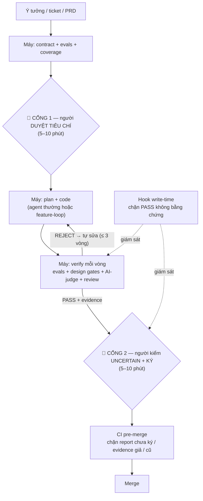
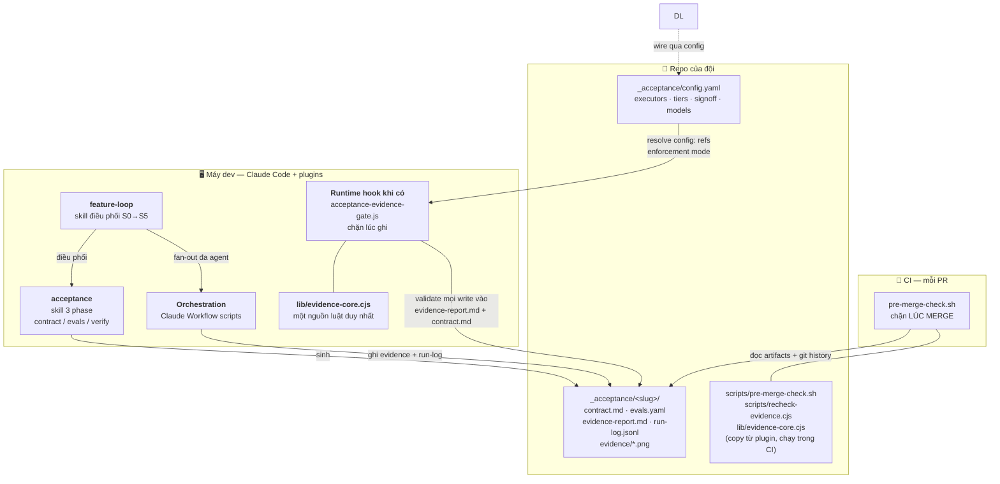
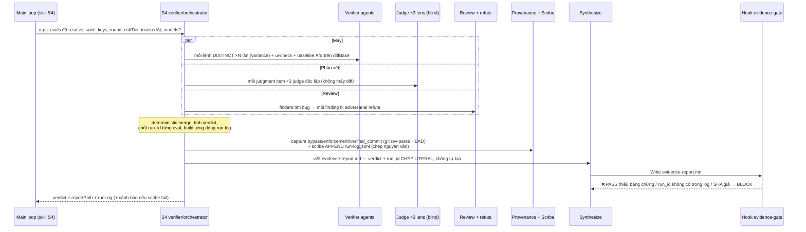

# Hướng dẫn sử dụng đầy đủ — Acceptance-Gate Kit

> Đọc nhanh 5 phút → [QUICKSTART.md](QUICKSTART.md). Tài liệu này là **bản đầy đủ**:
> kiến trúc, cài đặt, vận hành hằng ngày, tra cứu enforcement, xử lý sự cố và tinh chỉnh.
> Khớp phiên bản: acceptance-gate 1.41.0 · feature-loop 1.28.0.

## Mục lục

0. [Giới thiệu — mục đích, mục tiêu, kim chỉ nam](#0-giới-thiệu--mục-đích-mục-tiêu-kim-chỉ-nam)
1. [Kit giải quyết vấn đề gì](#1-kit-giải-quyết-vấn-đề-gì)
2. [Kiến trúc tổng thể](#2-kiến-trúc-tổng-thể)
3. [Vòng đời một tính năng](#3-vòng-đời-một-tính-năng)
4. [Bên trong S4 VERIFY — evidence từ đâu ra](#4-bên-trong-s4-verify--evidence-từ-đâu-ra)
4.5. [Sổ quyết định & 2 công tắc design (1.11.0)](#sổ-quyết-định--2-công-tắc-design-1110)
4.6. [Chạy không-người-trông đoạn máy với /goal (1.11.1)](#chạy-không-người-trông-đoạn-máy-với-goal-1111--claude-code--21139)
4.7. [Model theo giai đoạn (feature_loop.models) (1.11.2)](#model-theo-giai-đoạn-feature_loopmodels-1112)
4.8. [Round tiết kiệm — carry-forward P1/P2/P3 (1.12.0)](#round-tiết-kiệm--carry-forward-p1p2p3-1120)
4.9. [Skill ux-ui-craft — design engineer trong kit (1.12.0 → 1.17.0)](#skill-ux-ui-craft--design-engineer-trong-kit-1120--1170)
4.10. [Công tắc coverage CT-S — chống sót AC (1.16.0)](#công-tắc-coverage-ct-s--chống-sót-ac-feature-loop-1130--acceptance-gate-1160)
4.11. [Gap-probe S1 — phản biện context sạch (1.18.0)](#gap-probe-s1--phản-biện-context-sạch-feature-loop-1140--acceptance-gate-1180)
5. [Cài đặt](#5-cài-đặt)
6. [Vận hành hằng ngày](#6-vận-hành-hằng-ngày)
7. [Tra cứu enforcement — hook và CI chặn gì](#7-tra-cứu-enforcement--hook-và-ci-chặn-gì)
8. [Tinh chỉnh cho repo của đội](#8-tinh-chỉnh-cho-repo-của-đội)
9. [Xử lý sự cố](#9-xử-lý-sự-cố)
10. [Dành cho người bảo trì kit](#10-dành-cho-người-bảo-trì-kit)

---

## 0. Giới thiệu — mục đích, mục tiêu, kim chỉ nam

> Đọc mục này trước mọi đợt nâng cấp kit. Nó tồn tại để trả lời một câu hỏi
> duy nhất: *việc sắp làm có phục vụ đúng thứ kit sinh ra để làm không?*

### Mục đích

AI viết code nhanh hơn tốc độ con người kiểm chứng nó. Hệ quả là hai thái cực
đều tệ: người click tay 1–2 giờ mỗi tính năng, hoặc tin lời AI tự khai "done".
Kit tồn tại để thay cả hai bằng một mô hình duy nhất — **người quyết định, máy
chứng minh**: con người chỉ đưa những quyết định giá trị cao nhất (tiêu chí
nào, chấp nhận hay không), máy làm toàn bộ phần giữa và *không thể khai gian*
nhờ enforcement tất định (hook lúc ghi file + CI lúc merge). Niềm tin vào code
AI không đến từ "AI ngoan" — nó đến từ bằng chứng đối chiếu được.

### Mục tiêu (đo được — không đo được thì không phải mục tiêu)

| # | Mục tiêu | Thước đo |
|---|---|---|
| 1 | Giảm **≥ 50%** thời gian người/tính năng so với baseline | `time_human_minutes` (mỗi contract) vs `baseline_minutes` (config) |
| 2 | **0** defect nghiệp vụ lọt qua gate | Đếm defect phát hiện sau signoff |
| 3 | Đúng **2 điểm dừng người**, 5–10 phút/cổng (T3: +1 duyệt plan) | Vòng đời chuẩn — mọi tính năng T2/T3 |
| 4 | **100%** verdict PASS có bằng chứng máy đối chiếu được | `run_id` khớp `run-log.jsonl`, `exit_code 0`, verifier thật, SHA thật |
| 5 | **1** chuẩn gate cho mọi thành viên | `lib/evidence-core.cjs` dùng chung + kỷ luật update plugin |

### Lợi ích khi sử dụng

| Ai | Được gì |
|---|---|
| **Người duyệt** | 1–2 giờ click tay → 15–20 phút đọc 2 card quyết định; máy đẩy lên đúng những item nó *không dám chắc* (UNCERTAIN) thay vì giấu chúng |
| **Cả đội** | Một chuẩn nghiệm thu đếm được thay vì khẩu vị từng người; audit trail đầy đủ (`approved_by`, `human_signoff`, `bypass_used`) — ai duyệt gì, khi nào, có né gate không |
| **AI agent** | Tiêu chí chốt *trước* khi code (sửa 1 dòng ở Cổng 1 rẻ hơn 10 lần sửa sau); mỗi vòng verify nhận phản hồi tất định (file:line, exit code) thay vì nhận xét mơ hồ |
| **Sản phẩm** | Defect bị chặn ở điểm rẻ nhất; sàn chất lượng UI được ép bằng máy (contrast, layout, coverage AC) chứ không bằng lời dặn |

### Tính năng chính

| Tính năng | Một dòng | Chi tiết |
|---|---|---|
| **Gate 3-phase** (acceptance-gate) | Yêu cầu → contract + evals → evidence report; hook chặn PASS giả lúc ghi, CI chặn lúc merge | §3, §7 |
| **Decision card + evidence page** | Cổng 1/Cổng 2 trình bày để quyết trong 5–10 phút; screenshot + output thật, mở bằng `file://` | §6.3 |
| **feature-loop** | Một lệnh từ ý tưởng → PR: brainstorm, contract, plan, code song song, verify đa-agent (3 AI-judge + adversarial review), tự sửa ≤ 3 vòng | §3, §4 |
| **Skill ux-ui-craft** | Kỷ luật design-engineer tự kích hoạt: token, Layout Contract "bản vẽ", gate đo được (contrast/type/alignment) | §4.9 |
| **Skill morphological-scan (CT-S)** | Quét không gian tiêu chí theo trục chống sót AC; mục Coverage hiện trên card Cổng 1 | §4.10 |
| **Risk tiers T1/T2/T3** | Đơn giản bỏ qua gate, mặc định flow đủ, nhạy cảm ép người kiểm mọi judgment | §6 |

### Sơ đồ hoạt động


```mermaid
flowchart TB
  IN["Ý tưởng / ticket / PRD"] --> S1["Máy: contract + evals + coverage"]
  S1 --> G1{"🚪 CỔNG 1 — người DUYỆT TIÊU CHÍ<br/>(5–10 phút)"}
  G1 --> CODE["Máy: plan + code<br/>(agent thường hoặc feature-loop)"]
  CODE --> V["Máy: verify mỗi vòng<br/>evals + design gates + AI-judge + review"]
  V -- "REJECT → tự sửa (≤ 3 vòng)" --> CODE
  V -- "PASS + evidence" --> G2{"🚪 CỔNG 2 — người kiểm UNCERTAIN + KÝ<br/>(5–10 phút)"}
  G2 --> CI2["CI pre-merge<br/>chặn report chưa ký / evidence giả / cũ"]
  CI2 --> MERGE["Merge"]
  HK["Hook write-time<br/>chặn PASS không bằng chứng"] -. giám sát .-> V
  HK -. giám sát .-> G2
```

### Bài kiểm tra chống lạc hướng — 3 câu hỏi trước mỗi đợt nâng cấp

1. **Nó phục vụ mục tiêu số mấy ở trên?** Không chỉ ra được số → không làm.
2. **Nó có thêm điểm dừng người thứ 3 không?** Có → sai hướng (trừ Gate 1.5
   của T3 đã định nghĩa). Kit tăng giá trị bằng cách làm 2 điểm dừng *tốt
   hơn*, không phải *nhiều hơn*.
3. **Enforcement mới có tất định không** — đếm được, chặn được bằng máy? Chỉ
   là lời khuyên trong văn bản → chưa xong việc (*"a rule you cannot verify
   is decoration"*).

## 1. Kit giải quyết vấn đề gì

AI code rất nhanh, nhưng nghiệm thu vẫn là người click tay 1–2 giờ — hoặc tệ hơn:
tin lời AI tự khai "done". Kit thay thế cả hai bằng một hợp đồng ba bên:

- **Máy chứng minh** — mỗi tiêu chí nghiệm thu có eval chạy được; PASS bắt buộc kèm
  bằng chứng máy (`run_id`, `exit_code: 0`, verifier thật, commit đã verify).
- **Người quyết** — đúng **2 điểm dừng**: Cổng 1 duyệt *tiêu chí* trước khi code,
  Cổng 2 ký *bằng chứng* sau khi verify. Mỗi cổng 5–10 phút.
- **Enforcement tất định** — không dựa "AI ngoan": hook chặn ngay lúc ghi file,
  CI chặn lại lúc merge. Nói dối phải thắng được cả hai lớp máy.

Ba nguyên tắc không thương lượng:

| Nguyên tắc | Nghĩa là |
|---|---|
| **Doer ≠ grader** | Agent viết code không bao giờ tự chấm; verify luôn là agent context sạch |
| **Evidence over assertion** | REJECT/BLOCKED trung thực luôn hợp lệ; PASS không bằng chứng thì không tồn tại |
| **2 cổng người duy nhất** | Không bắt người kiểm lại thứ máy đã chứng minh |

## 2. Kiến trúc tổng thể

Kit gồm **3 plugin** (cài trên máy dev) + **artifacts trong repo** + **1 chốt chặn CI**.
Mọi luật evidence nằm trong **một file duy nhất** (`lib/evidence-core.cjs`) được cả hook
lẫn CI re-check dùng chung — hai lớp không bao giờ lệch luật nhau.


```mermaid
flowchart TB
  subgraph DEV["🖥️ Máy dev — Claude Code + plugins"]
    FL["<b>feature-loop</b><br/>skill điều phối S0→S5"]
    AC["<b>acceptance</b><br/>skill 3 phase<br/>contract / evals / verify"]
    WF["<b>Orchestration</b><br/>Claude Workflow scripts"]
    HOOK["<b>Runtime hook khi có</b><br/>acceptance-evidence-gate.js<br/>chặn lúc ghi"]
    CORE["<b>lib/evidence-core.cjs</b><br/>một nguồn luật duy nhất"]
  end

  subgraph REPO["📁 Repo của đội"]
    CFG["_acceptance/config.yaml<br/>executors · tiers · signoff · models"]
    ART["_acceptance/&lt;slug&gt;/<br/>contract.md · evals.yaml<br/>evidence-report.md · run-log.jsonl<br/>evidence/*.png"]
    VEND["scripts/pre-merge-check.sh<br/>scripts/recheck-evidence.cjs<br/>lib/evidence-core.cjs<br/>(copy từ plugin, chạy trong CI)"]
  end

  subgraph CI["🤖 CI — mỗi PR"]
    PM["pre-merge-check.sh<br/>chặn LÚC MERGE"]
  end

  FL -->|"điều phối"| AC
  FL -->|"fan-out đa agent"| WF
  AC -->|"sinh"| ART
  WF -->|"ghi evidence + run-log"| ART
  HOOK -->|"validate mọi write vào<br/>evidence-report.md + contract.md"| ART
  HOOK --- CORE
  CFG -->|"resolve config: refs<br/>enforcement mode"| HOOK
  DL -.->|"wire qua config"| CFG
  PM -->|"đọc artifacts + git history"| ART
  PM --- VEND
```

| Thành phần | Vai trò một dòng |
|---|---|
| `acceptance` (plugin acceptance-gate) | Biến yêu cầu → contract + evals; verify → evidence report |
| `feature-loop` | "Cả con đường": brainstorm → contract → plan → code → verify đa-agent → PR |
| Hook `acceptance-evidence-gate.js` | Chặn PASS thiếu bằng chứng + contract nhảy cóc Cổng 1 khi runtime hook đang active |
| `lib/evidence-core.cjs` | Toàn bộ luật L1/L2/L3 — hook và CI re-check cùng require file này |
| `scripts/pre-merge-check.sh` | Chốt chặn CI độc lập: kiểm cả những gì hook không thấy (người sửa tay, git history) |
| `_acceptance/` trong repo | Nguồn sự thật: config + hồ sơ nghiệm thu từng tính năng |

**Vì sao cần cả hook lẫn CI?** Hook chỉ thấy những write mà runtime gửi qua hook.
Người mở editor sửa tay evidence, hoặc một runtime không bật hook, thì hook mù — CI
re-check chạy đúng bộ luật đó trên file **đã commit**, cộng thêm các kiểm tra chỉ làm
được bằng git history (evidence có bị cũ so với code không, ai đưa chữ ký vào, PR có né
gate không). Vì vậy CI là lớp enforce chung, không phụ thuộc phiên nào.

## 3. Vòng đời một tính năng

Nguồn sự thật duy nhất là frontmatter **`status`** trong `_acceptance/<slug>/contract.md`.
Mọi resume (`/feature-loop <slug>`) đọc status và vào đúng chỗ.


```mermaid
flowchart LR
  START(("💡 ý tưởng")) --> S1["<b>S1 DESIGN</b><br/>brainstorm → design-doc<br/>+ contract (status: draft)<br/>+ evals.yaml"]
  S1 --> G1{"🚪 <b>CỔNG 1</b><br/>người duyệt tiêu chí<br/>5–10 phút"}
  G1 -->|"status: approved<br/>+ approved_by"| S2["<b>S2 PLAN</b><br/>task list + verify per-task"]
  S2 -->|"T3: 🚪 Cổng 1.5 duyệt plan"| S3["<b>S3 EXECUTE</b><br/>code; task độc lập →<br/>song song, mỗi task 1 worktree"]
  S3 -->|"status: implemented"| S4["<b>S4 VERIFY</b><br/>workflow đa-agent<br/>(xem mục 4)"]
  S4 -->|"REJECT — tự sửa,<br/>tối đa 3 vòng"| S3
  S4 -->|"PASS / PENDING-JUDGMENT<br/>status: verified<br/>+ COMMIT evidence máy-viết"| G2{"🚪 <b>CỔNG 2</b><br/>người kiểm UNCERTAIN<br/>+ ký signoff"}
  G2 -->|"human_signoff (COMMIT RIÊNG)<br/>status: signed-off"| S5["<b>S5 SHIP</b><br/>tạo PR"]
  S5 --> CI["CI pre-merge-check<br/>chốt chặn độc lập"]
  CI --> DONE(("✅ merge"))
```

> **Bump version thuộc S3, KHÔNG phải S5.** Bump sau Cổng 2 làm
> evidence stale — report pin commit TRƯỚC bump — nên nó huỷ chính chữ ký vừa
> lấy, và bạn phải chạy thêm một vòng verify rồi xin chữ ký lần hai. Đã dẫm
> 2026-07-26: ký ở `827f549`, bump ở `834eae8`, staleness guard nổ ngay sau đó.
> Nếu repo có suite ghim số version bằng literal thì bump còn SỬA cả suite —
> tức code đổi thật, stale là đúng luật. Cách chữa gốc: suite kiểm các manifest
> **khớp nhau** thay vì ghim một con số.

| `status` hiện tại | Ai set | Resume vào |
|---|---|---|
| *(chưa có contract)* | — | S0 → S1 |
| `draft` | S1 (máy) | Cổng 1 — trình lại gói duyệt |
| `approved` | Cổng 1 (người duyệt → máy ghi `approved_by`) | S2 PLAN (T3: Cổng 1.5 nếu plan chưa duyệt) |
| `implemented` | S3 — hành động CUỐI của agent code | S4 VERIFY |
| `verified` | S4 (sau verdict PASS/PENDING-JUDGMENT) | Cổng 2 — **sau guard staleness** (mục 7) |
| `signed-off` | Cổng 2 (người ký) | S5 SHIP |

**Risk tier** quyết định độ dày của gate — xác định ở S0 từ path dự kiến, đối chiếu
lại bằng diff thật ở S4:

| Tier | Là gì | Gate |
|---|---|---|
| **T1** | docs, typo, config vặt (khớp `t1_skip_globs`) | Bỏ qua kit — nhưng phải **xác nhận** bảng path→glob, và CI backstop sẽ bắt nếu PR thực tế đụng code |
| **T2** | mặc định | Flow đầy đủ, 2 cổng |
| **T3** | path nhạy cảm (`t3_paths`: auth/billing/migrations...) | Thêm Cổng 1.5 duyệt plan; verdict AI-judge chỉ tham khảo — người phải kiểm **mọi** judgment item |

## 4. Bên trong S4 VERIFY — evidence từ đâu ra

Hiểu mục này là hiểu vì sao evidence đáng tin: **mọi con số do máy quyết, LLM chỉ chép**.


```mermaid
sequenceDiagram
  participant M as Main loop (skill S4)
  participant W as S4 verifier/orchestrator
  participant V as Verifier agents
  participant J as Judge ×3 lens (blind)
  participant R as Review + refute
  participant P as Provenance + Scribe
  participant F as Synthesize
  participant H as Hook evidence-gate

  M->>W: args: evals đã resolve, suite_keys, round, riskTier, invokedAt, models?
  par Máy
    W->>V: mỗi lệnh DISTINCT ×N lần (variance) + ui-check + baseline A/B trên diffBase
  and Phán xét
    W->>J: mỗi judgment item ×3 judge độc lập (không thấy diff)
  and Review
    W->>R: finders tìm bug → mỗi finding bị adversarial refute
  end
  Note over W: deterministic merge: tính verdict,<br/>chốt run_id từng eval, build từng dòng run-log
  W->>P: capture bypass/enforcement/verified_commit (git rev-parse HEAD)<br/>+ scribe APPEND run-log.jsonl (chép nguyên văn)
  W->>F: viết evidence-report.md — verdict + run_id CHÉP LITERAL, không tự bịa
  F->>H: Write evidence-report.md
  H-->>F: ❌ PASS thiếu bằng chứng / run_id không có trong log / SHA giả → BLOCK
  W-->>M: verdict + reportPath + runLog (+ cảnh báo nếu scribe fail)
```

Những chốt toàn vẹn đáng chú ý:

- **Dedupe + variance**: các eval trỏ cùng một lệnh chỉ chạy 1 lần; eval ngẫu nhiên
  (`runs: N`) chạy N lần → `pass_rate` (hỗn hợp → người quyết ở Cổng 2, không auto-pass).
- **A/B baseline**: lệnh eval chạy lại trên code gốc — eval "xanh cả hai phía" bị bêu
  trong mục `## Analyst` (nó chứng minh harness, không chứng minh feature).
- **`run-log.jsonl`**: sổ cái máy ghi *tại lúc chạy*; hook + CI đối chiếu từng `run_id`
  trong report với sổ này — PASS bịa tay không qua được.
- **`verified_commit`**: evidence bị neo vào đúng cây code đã verify; code đổi sau đó
  → evidence STALE, phải verify lại (resume tự hạ status, CI chặn merge).
- **Provenance**: `enforcement_mode` / `bypass_used` đo bằng máy và đóng dấu vào report
  — merge một PASS "xanh nhưng gate đang tắt" là việc CI không cho phép.
- **Observed (v1.10):** agent ui-check phải MỞ từng frame đã lưu (Read đa
  phương thức) và ghi `observed:` — thấy gì cụ thể, đối chiếu expected — vào
  block evidence. Frame mâu thuẫn expected = eval FAIL dù lệnh exit 0. Hook
  chặn report PASS (schema v2) có `screenshot:` mà thiếu `observed:` thực chất
  — đóng lỗ "chụp mà không xem".

## Sổ quyết định & 2 công tắc design (1.11.0)

**decisions.jsonl** — mỗi workspace có sổ rationale append-only: quyết định
descope/approach/fix kèm trade-off, seal tại Gate 1 (dòng sau seal = provisional,
card Gate 2 trình riêng "CHƯA duyệt" cho bạn phê). Ledger KHÔNG override contract —
descope một AC vẫn phải sửa contract + re-approve. Card 2 gate tự render mục
"Quyết định & trade-off" (descope lên đầu); chưa ghi gì → in "(chưa ghi quyết định
nào)" để bạn đòi khi cần.

**Làn design — một công tắc** — CT1 (chạm UI): static checks (token/contrast/tap,
thiếu capture là BLOCKED) + screenshot như thường. Không có field tier nào —
trạng thái nhận từ artifact; D0/D1 chỉ là cách gọi. Điều kiện bật là khoá
`executors.design.*` trong `_acceptance/config.yaml`, wire bằng tay — xem mục
"Wire `executors.design`" ở §5.2. Khoá `design.surface_globs` cho S4 bắt "diff
chạm surface mà lane không có design eval".

Nghi lễ design-of-record (mockup → evidence → push) **đã lưu kho 2026-08-12**:
ba bước của nó không tự động được, và vai "khoảnh khắc visual trước Cổng 1" nay
do nghi thức S1-D (skill `design-pass`, chạy trên bản bấm được) đảm nhiệm, chấm
bằng eval `ui-check`/`design-gate`. Lý do + đường lấy lại:
**ADR 0009** trong `docs/adr/`.

## Chạy không-người-trông đoạn máy với /goal (1.11.1 · Claude Code ≥ 2.1.139)

Đoạn S2→S4 của feature-loop toàn việc máy — nhưng chỉ tự chạy khi phiên còn sống.
`/goal` của Claude Code (≥ 2.1.139, workspace trusted, hooks bật) là backstop tầng
harness: sau mỗi turn một checker nhỏ đọc transcript, điều kiện chưa thỏa thì tự nổ
turn mới. Dùng đúng cách với feature-loop:

**Khi nào:** ngay sau khi bạn duyệt Gate 1, trước khi rời máy.

**Combo rời-máy trọn bộ (phiên đang chạy model đắt cho phần thiết kế):** duyệt Gate 1 →
`/model opus` + `/effort high` (alias `opus` tự trỏ bản opus mới nhất — KHÔNG ghim model ID
có số version kẻo lỗi thời; đoạn máy S2→S4 không cần tier thiết kế nhưng giữ effort cao —
S3 tuần tự + điều phối S4 chạy model phiên; CLI chưa có `/effort` thì bỏ qua, effort mặc
định auto) → dán `/goal` theo template dưới → rời máy. Các vai agent-hóa được đã
ghim qua `feature_loop.models` (xem mục "Model theo giai đoạn" ngay dưới).

**Template (điền slug của bạn, dán thành 1 dòng — xuống dòng dưới đây chỉ để dễ đọc; bản runtime nằm ngay trong SKILL feature-loop mục Gate 1, hai bản được test P85 giữ khớp):**

<!-- <<<GOAL-TEMPLATE -->
```
/goal Feature <slug>: coi là HOÀN THÀNH chỉ khi transcript tường thuật rõ
S4 verdict PASS hoặc PENDING-JUDGMENT và xác nhận đã set contract
_acceptance/<slug>/contract.md sang status: verified. Loop đã escalate cho
user (REJECT quá 3 round / BLOCKED / chờ input người) cũng coi là HOÀN THÀNH
— để dừng. Thông tin mơ hồ hoặc không chắc = CHƯA hoàn thành. Hoặc dừng
sau 15 turns.
```
<!-- GOAL-TEMPLATE>>> -->

**Vì sao template dài vậy:** checker của `/goal` đọc *transcript*, không đọc file —
điều kiện phải neo vào tường thuật của loop (verdict + set status), không neo vào
trạng thái file. Vế "mơ hồ = CHƯA hoàn thành" giữ checker khỏi dừng-sớm-sai khi log
lấp lửng; vế escalate và "15 turns" là hai lối thoát để không đốt token vô ích.

**Giới hạn cứng:**
- **KHÔNG BAO GIỜ đặt goal tới `signed-off`.** Hook của kit chặn agent tự điền chữ
  ký (đúng thiết kế) → điều kiện không bao giờ thỏa bằng máy → spin đốt token tới
  bound. Gate 2 là việc của người.
- `/goal` **không thay grader**: checker chỉ trả lời "chạy tiếp không"; S4 verify
  (fresh agents + evals máy + hook) mới là chấm thật — doer≠grader giữ nguyên.
- Đạt `verified` → goal tự thỏa và tắt; quay lại duyệt Gate 2 bằng mắt người như thường.

**Phạm vi runtime:** Claude Code ≥ 2.1.139 có `/goal` native. Chỉ đặt goal tới
transcript xác nhận `verified` hoặc trạng thái escalate; **không bao giờ** đặt
goal tới `signed-off`. `/goal` là bộ kiểm tra tiếp tục/dừng, không thay grader và
không tự cấp chữ ký Gate 2. Kit không phụ thuộc: không dùng `/goal` thì mọi thứ
chạy y nguyên.

## Model theo giai đoạn (feature_loop.models) (1.11.2)

Một feature đi qua nhiều loại việc: **thiết kế** (S1 brainstorm, S2 plan — giải-không-gian
mở, sai số compound xuống dưới), **săn bug** (S4 finder — recall, không có lưới đỡ),
**thực thi + chấm scoped** (S3 coding, judge, ui — có lưới: verify per-task + S4 re-grade +
majority + người ở Gate 2), và **cơ học** (machine chạy lệnh, scribe chép log). Nguyên tắc
xếp model: **đắt nhất nơi không-có-lưới và sai số compound · vừa nơi có lưới · rẻ nơi cơ học.**

Bảng route mặc định của kit **đã encode sẵn** nguyên tắc này — machine/scribe→haiku,
ui/judge/refute/baseline/provenance/synthesize→sonnet — và **chỉ 2 vai kế thừa model
phiên**: `finder` (S4 bug-recall) và `executor` (S3 nhánh song song). Muốn ghim khác
mặc định, khai trong `_acceptance/config.yaml`:

```yaml
feature_loop:
  models:
    finder: opus      # S4 bug-recall — không kế thừa model phiên nữa
    executor: opus    # S3 nhánh song song (muốn rẻ hơn: sonnet)
```

Vai nhận override: `machine · ui · judge · finder · refute · baseline · provenance ·
scribe · synthesize` (S4 verify) + `executor` (S3 execute). Giá trị `session` = kế thừa
model phiên (mặc định của `finder`/`executor`).

**⚠ Alias model:** harness CHỈ nhận **tier alias** — `sonnet` · `opus` · `haiku` · `fable`
— alias tự trỏ bản mới nhất của tier đó. Chuỗi có số version hoặc model ID đầy đủ (kiểu
`claude-opus-5`, `sonnet-5`) bị harness **từ chối** khi spawn agent. Luôn dùng alias trần.

**Giới hạn phạm vi:** pin `executor` chỉ cắn nhánh S3 **song song** (khi plan có ≥2 task
`independent`). S3 **tuần tự** (đường mặc định) code ngay trong main loop = **model phiên** —
config không với tới; muốn đổi phải đổi ca model tại Gate 1 (xem mục /goal ở trên).

## Round tiết kiệm — carry-forward P1/P2/P3 (1.12.0)

Kiểm chứng trên 147 round S4 thật (07/2026): **50% số round là "xanh-nối-xanh"** — staleness
guard fire vì merge trực giao của feature anh em, toàn bộ dàn máy chạy lại và không phát hiện
gì mới, median 22 phút/round. Đợt 5 thu hẹp **phạm vi tính lại** mà không hạ chuẩn niềm tin:
mọi carry-forward ghi rõ nguồn round trong report + run-log; hook/CI giữ nguyên luật.

| Cơ chế | Khi nào | Làm gì |
|---|---|---|
| **P1 — delta staleness** | Round staleness (report trước PASS-family + có `verified_commit`) | Eval máy/ui khai `paths: [glob]` trong evals.yaml mà delta không chạm + round trước xanh → **không chạy lại**; block report ghi `carried_from_round: <N>` + run_id gốc. Suite LUÔN chạy lại. Thiếu `paths` → eval luôn chạy (an toàn). Round fix sau REJECT → full re-run. |
| **P2 — baseline một lần** | Mọi round | `sha256(evals.yaml)` trùng dòng `kind:"baseline"` cuối trong run-log → **không đo lại A/B baseline** (tín hiệu "eval có phân biệt" là thuộc tính của eval+code, không đổi theo re-pin); Analyst carry từ round gốc. |
| **P3 — memo judge panel** | Mọi round ≥2 | `sha256(question + inputs)` trùng dòng `kind:"panel"` cuối → **không chấm lại 3 judge**; panel giữ nguyên đề xuất + ghi "carried từ round N". Item UNCERTAIN chờ chữ ký người cũng carried — câu trả lời ở Gate 2, không ở máy. |

Sổ memo duy nhất là `run-log.jsonl` (dòng `kind:"panel"` / `kind:"baseline"` — không có
`run_id` nên hook/recheck bỏ qua an toàn; dòng eval carried mang run_id GỐC đã có trong log
→ đối chiếu pass tự nhiên). **Lưới chống rỗng:** round mà mọi thứ đều carried + suite rỗng →
BLOCKED, không bao giờ PASS chay. Card Gate 2 phải trình rõ round này carry gì.

## Skill ux-ui-craft — design engineer trong kit (1.12.0 → 1.17.0)

Từ 1.12.0, plugin acceptance-gate ship kèm skill `ux-ui-craft` (`skills/ux-ui-craft/`):
kỷ luật design-engineer cho MỌI task chạm UI. **Không cần gọi** — skill tự kích hoạt khi
task tạo/sửa thứ người dùng nhìn thấy, kể cả ask mơ hồ ("làm đẹp hơn") và tiếng Việt.
Đã kiểm chứng blind A/B trên bề mặt sản phẩm thật: thắng 3/4 test case; giá trị lặp lại
được rõ nhất là **gate Type budget** — không skill, model trôi 11-15 cỡ chữ (5/5 lần đo);
có skill → 6-7 cỡ, đếm bằng getComputedStyle trên artifact render. Từ 1.15.0 có thêm
gate **Alignment budget** cho bố cục, cùng nguyên tắc: đếm trên bản render, báo ô tệ nhất.

| Trong kit | Skill làm gì |
|---|---|
| S1-D (nghi thức design-pass) | **System mode**: bám token của design system repo (không hex/webfont mới); **Prototype mode**: quyết định nằm trong control bấm được, done = ma trận state × theme × viewport được capture — khớp chuẩn design-of-record; khai nấc ngữ cảnh (`context:` 3 nấc — `standalone` cần cảnh ngữ-cảnh hoặc descope có tên trước Cổng 1) |
| Review UI có sẵn | **Audit mode** (1.13.0): đo trước phán sau — chạy gate table trên bản render, findings chia 3 sổ (defect đo được / drift đếm được / taste dán nhãn), kèm "cái gì phải giữ lại" |
| Form / wizard / connector | **guidance-craft** (1.14.0): helper-text chỉ đường cho giá trị ngoài hệ thống (API key lấy ở đâu, shape mẫu), error = what + why + nút bấm kế tiếp; **Access-per-contract**: mỗi noun quen (player, table, wizard…) kèm ARIA pattern chuẩn, walk present/descoped như control thường |
| Màn nhiều vùng / "bố cục loạn" | **layout-craft** (1.15.0): khai grid cùng token (≤3-4 container width, MỘT hệ gutter, indent 1 bước) + chọn archetype theo job (focus flow · two-seat split · master–detail · dashboard grid · full-bleed · prose spine) + phép thử tận-dụng-desktop; kèm **gate Alignment budget** đếm được — mép trái các block dùng lại ≈≤8-10 đường đã khai/màn desktop, mép lẻ không khai báo = lệch hàng. Đo trên bản render (getBoundingClientRect, cụm ±3px). Hiệu chuẩn trên bề mặt thật: trang bị chê "loạn" đo 37 đường/23 mép lẻ, shell kỷ luật 6/1 |

Chi phí thực đo: +10-35% token/lần chạy — đáng trên surface mới, wizard, settings,
trang khách; với micro-edit (đổi 1 label) cứ nói "bỏ qua ux-ui-craft". Version skill nằm
trong frontmatter `SKILL.md` (`version:`); nguồn phát triển + eval harness bảo trì ngoài
kit, đổ về qua release có test đầy đủ.

**1.17 — Layout Contract + máy đo layout (skill 1.4.0).** Skill buộc
viết "bản vẽ" trước màn hình đầu tiên: khối `:root` (`--container-*` / `--gutter` /
`--space-*` 3 cấp tăng dần) + named grid lines + sitemap ≤10 dòng; code chỉ được tiêu
`var()`. Máy đo `skills/ux-ui-craft/scripts/measure_layout.js` chạy trong browser thật
(Playwright / console — jsdom không có layout) đếm đường canh lề, singleton, container
widths, gap lệch scale — trả evidence JSON (`run_id`/`verdict`/`exit_code`, chuẩn
evidence của kit). Gate mới **Structure–space coherence**: khoảng cách giữa 2 block phải
đúng cấp với khoảng cách trong sitemap, ngân sách lệch = 0. Cùng đợt đó, rule
**layout-token-only** (BLOCK raw px/rem trong margin/padding/gap/inset/top/right/bottom/
left + Tailwind `mt-[13px]` ngoài tầng token) được đưa vào máy đo design của kit.

## Công tắc coverage CT-S — chống sót AC (feature-loop 1.13.0 · acceptance-gate 1.16.0)

Kit vốn **dày ở verify, mỏng ở discovery**: S4 có fan-out evals + judge panel + adversarial
review, nhưng bộ AC đầu vào sinh từ brainstorm tự do — AC bị sót thì S4 dày mấy cũng không
cứu (máy chỉ chấm được thứ đã viết ra). CT-S cân lại đầu vào bằng skill
`morphological-scan` (plugin acceptance-gate ≥ 1.16): quét không gian AC theo Zwicky box
— chọn trục (First Principles) → quét MECE từng trục, bắt buộc nêu *thước CE* = nguồn đối
chiếu ("đủ" phải kiểm được: bug history, user journey, spec…) → cắt Pareto Core/Later/Never.

Chống bỏ-qua-thầm-lặng bằng đảo mặc định + 3 lớp:

| Lớp | Cơ chế |
|---|---|
| Kích hoạt | CT-S bật ⟺ tier T2/T3 (máy-derive ở S0, zero phán đoán ngữ nghĩa). Bỏ quét phải append entry `descope` — bỏ im lặng là vi phạm |
| Structural slot | Contract PHẢI có section `## Coverage` (trục + thước CE, hoặc 1 dòng skip trỏ entry) — thiếu thì chưa vào được Gate 1 |
| Card render | Card Cổng 1 hiện khối "Độ phủ AC" + cờ vàng khi thiếu section hoặc trục còn `[CE chưa kiểm chứng]` |

Máy chỉ enforce **có mặt + truy vết được**; "đủ thật hay chưa" là việc human soi ở Gate 1 —
cùng phân công máy/người như judgment eval. Workspace cũ (contract trước 1.13) → cờ vàng
trên card, không chặn resume, không bắt migrate. Output scan map thẳng vào artifact:
Core → AC (Core >15 thì hợp nhất ô, giữ cap 5-15) · Later/Never → Out of scope + entry
`descope` · trục + thước CE → `## Coverage`. Preset sẵn trong skill: entity-feature,
test-matrix, content-matrix, benchmark, risk-premortem, metrics-tree — giá trị trục đứng
hai chân: chân sản phẩm từ Product Context per-repo (CLAUDE.md `## Product Context` → đào
repo → hỏi user; repo mới tinh đi thẳng nấc hỏi) + chân ngành bắt buộc (preset + đối chiếu
chuẩn/sản phẩm thật có tên — nguồn sinh chính khi repo mới, ứng viên chờ người gật/cắt).
Chân ngành có **thang nguồn riêng** (biết chắc tên → web-search tìm+xác minh tên → neo
chuẩn/cận-kề CÓ TÊN + hạ `[GIẢ ĐỊNH: chưa có chuẩn ngành]`): không được dừng ở "không biết
ngành" mà bỏ, cũng không bịa tên. Repo mới chưa có thước CE nội bộ (spec/bug/analytics) thì
chính đối chiếu ngành làm thước, coverage là "đủ-để-bắt-đầu" — dữ liệu thật đầu tiên đưa
ngược vào trục (đóng vòng).

## Gap-probe S1 — phản biện context sạch (feature-loop 1.14.0 · acceptance-gate 1.18.0)

CT-S quét *không gian* AC (liệt kê có hệ thống); gap-probe bổ khuyết chiều còn
lại: **đối kháng trên bản nháp cuối** ngay trước điểm cam kết Gate 1 — chỗ
sửa-trên-giấy rẻ nhất. Cuối S1 (T2/T3), một subagent context sạch (doer ≠
grader) nhận đúng 4 file — design doc, contract, evals, ledger; không hội
thoại, không code — và câu hỏi giả-định-sẵn-thiếu-sót, trả tối đa 5 finding
(mỗi cái bắt buộc kịch bản fail + thước đo, thiếu = loại; cross-check AC↔eval,
GWT đo được, trục Coverage có AC), hoặc verdict `clean` — escape hatch tường
minh chống chế-lỗ-để-thỏa-giả-định. Main loop định đoạt one-pass (P0 = sửa
artifact ngay hoặc `human-gate1`, không im lặng; không re-probe — code đã có 3
round S4), ghi `_acceptance/<slug>/gap-probe.md`; card Cổng 1 render khối
"Phản biện context sạch" + cờ vàng khi vắng/probe-failed — backward-tolerant:
workspace cũ không bắt migrate, bỏ chủ động = entry `descope` bắt đầu
`"bỏ gap-probe"` (dấu vết hiện trên thẻ). Không thêm pre-mortem lens riêng cho
T3 — preset `risk-premortem` của morphological-scan đã phủ. Spec:
`docs/superpowers/specs/2026-07-23-s1-gap-probe-design.md`.

## Vào phiên bằng /start (1.30.0)

Bước 0 của mọi phiên — mở Claude Code lên rồi *gõ gì đầu tiên* — vốn là
xổ số câu chữ: mỗi cách mở đầu ra một biến thể phiên, có phiên đọc đúng việc
đang chờ, có phiên tự chọn việc, có phiên hỏi lan man. `/start` thay câu tự do
bằng một nghi thức: **người gõ một lệnh — máy nhìn quanh xưởng — người chọn
một chữ cái — bàn giao**.

Thẻ trình đúng ba nhóm, theo thứ tự ưu tiên:

| Nhóm | Nghĩa |
|---|---|
| Chờ chữ ký của anh | Các cổng đang đợi người quyết — cổng chờ lâu nhất lên đầu, mỗi cổng ~10 phút |
| Đang dở | Các vòng đang giữa chừng — mỗi vòng một dòng: người dùng sẽ được gì + bước kế |
| Bắt đầu việc mới | Đúng ba lối: ý mơ hồ → buổi khai thác; việc rõ → `/feature-loop`; việc vặt miễn T1 → sửa thẳng |

Người chọn một dòng là lệnh bàn giao sang nghi thức đích (thẻ cổng, vòng lặp,
hay buổi khai thác) — lệnh **không tự làm nội dung**, không đọc/ghi file sản
phẩm; phần phân loại nằm trong bộ quét `scripts/start-scan.mjs` (chỉ-đọc).
Thẻ nói luôn bản đồ sản phẩm đang mới hay đã lệch, để người biết mình đang
nhìn bức tranh nào. Chọn tiếp một vòng dở khi cây làm việc đang bẩn
hay dùng chung → lệnh nhắc mở worktree/phiên riêng trước.

Đây là thao tác cổng người thứ sáu: khoá model-invocation ở CẢ HAI harness
(cùng lý do ADR 0002) — nghi thức vào phiên là của người; model tự gọi giữa
chừng chỉ tạo nhiễu định hướng lại, đúng loại biến thể lệnh này sinh ra để
diệt.

## Bản đồ sản phẩm và phiên nghiệm thu (1.31.0)

Trước bản này, câu "đội đang làm gì, và những thứ đã giao có ăn thua không?"
chỉ trả lời được bằng cách mở từng thư mục hồ sơ ra đọc. Hai thứ mới lấp chỗ đó.

**`PRODUCT-MAP.md` ở gốc repo** — một trang, mở đầu bằng sơ đồ các chặng kèm số
việc thật ở mỗi chặng, rồi danh sách từng việc đang nằm đâu. Nó là **view máy
sinh**, không phải kho: mỗi lần một cổng người đóng lại, `/approve`, `/signoff`
và phiên nghiệm thu vẽ lại nó và đưa vào chính commit chữ ký. Không ai sửa tay
bản đồ; muốn bản đồ khác thì sửa hồ sơ.

Vì nó máy sinh, `acceptance-init` xếp nó vào `risk_tiers.t1_skip_globs` — bắt
một view tự sinh phải đi qua cổng nghiệm thu là bắt người ký một thứ máy vừa
viết. Đổi lại, CI chạy `product-map.mjs --root . --check`: bản đồ lệch với hồ
sơ, hay biến mất, thì đỏ. Đó là cổng canh duy nhất của miễn trừ này — lý do và
đánh đổi ghi ở [ADR 0007](docs/adr/0007-product-map-t1-exemption.md).

Repo dựng trước 1.31.0 không tự bật: các thân cổng đọc `t1_skip_globs`, không
thấy `PRODUCT-MAP.md` thì **bỏ qua** bước vẽ lại và in hai dòng chỉ cách bật.
Không có bước này thì chính commit chữ ký làm bằng chứng cũ đi và merge kẹt.

**Phiên nghiệm thu (Cổng Giá trị)** — cổng người sau khi ship, cho những việc
đi từ một cơ hội đã quyết `build`/`iterate`. Cổng Bằng chứng hỏi "làm đúng thứ
đã hứa chưa?"; Cổng Giá trị hỏi "thứ đó có ăn thua không?". Nghi thức chép
nguyên văn ngưỡng đã chốt từ lúc mở vòng và **cấm sửa ngưỡng sau khi thấy số**,
thu điểm kín trước mọi thảo luận chung, rồi người — không phải agent — điền
`verdict`: `release`, `iterate`, hay `kill`. Kết quả `kill` là **thành công của
quy trình**: câu trả lời mua bằng giá một vòng dựng.

Kết quả phiên ghi vào `_acceptance/<slug>/uat-session.md`; `/start` và bản đồ
đọc nó để biết việc đã nghiệm thu hay còn chờ.

## 5. Cài đặt

### 5.1 Mỗi máy dev (một lần)

```bash
claude plugin marketplace add phanlemanh/acceptance-gate-kit
claude plugin install acceptance-gate@acceptance-gate-kit
claude plugin install feature-loop@acceptance-gate-kit      # vòng lặp trọn gói
claude plugin install superpowers@claude-plugins-official   # dependency của feature-loop
```

Sau khi cài, **mở phiên Claude Code mới** để runtime nạp plugin. Khi runtime hook
chưa bật hoặc bị tắt, CI vendored vẫn là lớp enforce chung và có thẩm quyền.

**Kỷ luật cập nhật** — hai dev chạy 2 version kit trên cùng repo = 2 chuẩn gate khác
nhau (verifier bị chặn "oan", feature lọt eval). Chạy khi có release hoặc đầu sprint:

```bash
claude plugin update acceptance-gate@acceptance-gate-kit
claude plugin update feature-loop@acceptance-gate-kit
```

### 5.2 Mỗi repo (một lần)

1. Chạy **`/acceptance-init`** — trả lời lệnh test/smoke của repo, path nhạy cảm
   (`t3_paths`), glob bỏ qua (`t1_skip_globs`), người ký. Kết quả:
   `_acceptance/config.yaml` (indent **2-space bắt buộc** — parser của kit đọc theo dòng).
2. Repo có web UI: `npm i -D jsdom` (design gate chạy chế độ DOM; thiếu → eval design BLOCKED).

#### Wire `executors.design` (repo có web UI)

Không còn lệnh khởi tạo riêng cho làn design — thêm tay vào `_acceptance/config.yaml`:

```yaml
executors:
  design:
    static: "node scripts/design-scan.js --slug {slug}"   # lệnh THẬT của repo bạn
    gate:   "node scripts/design-gate.mjs --slug {slug}"
design:
  surface_globs:                    # để S4 bắt "diff chạm surface mà lane không có design eval"
    - "src/app/**"
    - "src/components/**"
```

Thiếu khối này thì làn design tắt: feature chạm UI vẫn chạy được, chỉ mất eval
design và kit sẽ cảnh báo một dòng ở Cổng 1 (không chặn).

Tham chiếu đầy đủ `config.yaml` — mục 8 có phần tinh chỉnh:

| Khóa | Ý nghĩa | Khi thiếu |
|---|---|---|
| `enforcement` | Hook: `strict` chặn · `warn` chỉ cảnh báo · `off` tắt | `strict` |
| `recheck` | CI re-check evidence đã commit: `strict`/`warn`/`off` | `warn` (repo mới nên để `strict`) |
| `gap_probe` | Luật phản biện context sạch ở pre-merge check: `required` (chặn) / `advisory` (NOTE) / `off` (im) | `advisory` — bỏ qua vẫn thấy được, nhưng không chặn merge của repo chưa quen |
| `executors.test.*` `executors.script.*` | Lệnh thật của repo; evals chỉ tham chiếu `config:executors...` | — |
| `executors.design.*` | Design gate (wire tay — xem §5.2) | design eval bị skip |
| `risk_tiers.t1_skip_globs` | Glob an toàn bỏ qua gate (docs, *.md). Từ 1.31.0 `/acceptance-init` phát sẵn `PRODUCT-MAP.md` — bản đồ là view máy sinh lại ở mỗi lần đóng cổng, không phải thứ để nghiệm thu | `PRODUCT-MAP.md` |
| `risk_tiers.t3_paths` | Path critical → T3 | không gì bị nâng T3 |
| `signoff.required_for` | Tier nào bắt buộc ký trước merge | `[T2, T3]` |
| `signoff.approvers` | Danh sách người được ký — **thông tin, KHÔNG được cổng cưỡng chế** (1.24.0: bốn bản vá cố đọc khoá này từ YAML bằng công cụ text của shell đều hỏng theo một hình dạng hợp lệ mới, nên cả lớp bị gỡ). Chữ ký vẫn bị kiểm bằng chốt rỗng + lưới giữ-chỗ | — |
| `signoff.require_human_commit` | Chữ ký Cổng 2 phải nằm trong commit riêng (mục 7) | `false` (scaffold mới: `true`) |
| `signoff.agent_authors` | Blocklist email-glob cho commit chữ ký (bot CI) | tắt |
| `dev_server.start` / `url` | Cho eval `ui-check` | ui-check bị hạ cấp |
| `capture.ui` | Lệnh chụp `<cmd> <url> <out.png>` → slideshow Cổng 2 | evidence UI = HTML |
| `feature_loop.suite_keys` | Lệnh chạy MỌI vòng verify (build/typecheck...) — S4 tự hỏi rồi tự ghi | S4 hỏi một lần |
| `feature_loop.models.<role>` | Override model từng vai trò verify (mục 8) | bảng default |
| `feature_loop.ui_standards_skill` | Tên skill chuẩn-plugin/DS của repo (vd `create-<org>-plugin`) — feature chạm UI thì S1 BẮT BUỘC nạp nó trước khi sinh contract/evals (đối trọng chuẩn nội với vật liệu ngoài) | ghi chú vàng 1 dòng trong gói Cổng 1, không chặn |

### 5.3 Wire CI (bắt buộc để gate có răng ở PR)

Copy **đủ 7 file** từ plugin vào repo, giữ đúng layout (re-check `require
../lib`; đuôi `.cjs` là cố ý — repo khai `"type": "module"` sẽ đọc file `.js`
chép sang thành ESM và `require()` bên trong nổ ReferenceError, lớp cưỡng chế
chết câm):

```
scripts/pre-merge-check.sh
scripts/recheck-evidence.cjs
lib/evidence-core.cjs
lib/gap-probe.cjs
lib/workspace-record.cjs
lib/ac-line.cjs
lib/md-section.cjs
```

> Chỉ copy mỗi `pre-merge-check.sh` là repo âm thầm **mất lớp re-check** evidence đã
> commit — nó chỉ còn in NOTE. Thiếu `lib/gap-probe.cjs` thì luật phản biện
> context sạch in `GAP-PROBE: NOT ENFORCED` trên mọi lần chạy.

GitHub Actions mẫu:

```yaml
acceptance-gate:
  runs-on: ubuntu-latest
  steps:
    - uses: actions/checkout@v4
      with: { fetch-depth: 0 }   # cần lịch sử để kiểm verified_commit + chữ ký
    - run: bash scripts/pre-merge-check.sh . --base "origin/$GITHUB_BASE_REF"

```

Job chạy trên `push` (không phải PR) cần một bước RIÊNG — và phải chép lại
`scripts/pre-merge-check.sh` từ plugin trước, vì bản cũ nuốt cờ lạ thành đường
dẫn rồi thoát 0 với TOÀN BỘ cổng không chạy (cần acceptance-gate 1.22.0+ — bản 1.21.0 phát hành KHÔNG có cờ này lẫn chốt cờ-lạ, thêm cờ trên bản đó là tự kích hoạt đúng lỗ vừa tả):

```bash
# CẦN fetch-depth: 0 ở bước checkout (y như job PR). Với fetch-depth: 1 mặc
# định, `git rev-parse HEAD~1` chết trong command substitution mà bash -e của
# GithubActions KHÔNG bắt được — cờ suy biến thành --base "" và cả gap-probe
# lẫn T1-escape tắt kèm declared-off trong khi job vẫn xanh. Dùng dạng ref
# trần (HEAD~1) thay vì $(rev-parse): ref không resolve được thì cổng exit 2
# to tiếng, không suy biến im lặng.
bash scripts/pre-merge-check.sh . --base HEAD~1 --no-t1-escape
```

Răng T1-escape đòi thay đổi phải kèm `_acceptance/<slug>/` — tiền đề đó sai với
commit đóng gói bản phát hành / đồng bộ bản sao trên nhánh chính, để nguyên là
job đỏ vĩnh viễn. VẪN giữ `--base`: luật gap-probe cần phạm vi diff. Xem
[ADR 0005](docs/adr/0005-t1-escape-opt-out-flag.md).

### Sổ luật-đã-chạy (acceptance-gate 1.22.0+)

`pre-merge-check.sh` chỉ in `clean` khi CHỨNG MINH được rằng các luật đã chạy:
mỗi khối luật kết thúc bằng đúng một dòng `ran <tên>` hoặc `declared-off <tên>`.

`declared-off` nghĩa là luật đó KHÔNG cưỡng chế trong lần chạy này, và có hai
nhóm nguyên nhân — nhóm thứ hai là nhóm hay bị đọc nhầm:

- **Tắt có chủ đích:** cờ `--no-t1-escape`; khoá `gap_probe: off` trong config
  (kể cả khi giá trị sai chính tả rơi về `off` sau `VIOLATION [config]`); chạy
  không có `--base` — trường hợp này sinh `declared-off` cho CẢ HAI luật
  `t1-escape` và `gap-probe`, vì không luật nào xác định được phạm vi diff.
- **Môi trường không cho cưỡng chế** (danh sách MỞ — mọi đường đi qua
  `gap_probe_not_enforced`): runner không có `node`; repo tiêu thụ chép
  `scripts/` mà quên `lib/gap-probe.cjs`; `node lib/gap-probe.cjs classify` lỗi
  trên một slug; `git diff <base>...HEAD` thất bại dù ĐÃ truyền `--base` (clone
  shallow/grafted, lịch sử rời nhau, base bị force-push).

Nên khi trực CI thấy `declared-off gap-probe` mà không ai truyền cờ và config
không `off`, đừng dừng ở ba nguyên nhân đầu — đọc dòng `GAP-PROBE: NOT ENFORCED
reason=` ngay phía trên, nó nói đúng nguyên nhân. Một lần chạy chỉ cưỡng chế
được MỘT PHẦN (classifier chạy ở slug này, hỏng ở slug kia) cũng khai là
`declared-off`: cưỡng chế một phần không phải là đã chạy.

Cuối mỗi lần chạy có một dòng máy-đọc:

```
pre-merge-check: rules ran=<n> declared-off=<m> expected=<k>
```

`k` tính từ danh sách EXPECTED cố định trong script, KHÔNG phải `n+m` — nhờ vậy
dòng này hiển thị được sự lệch thay vì luôn tự khớp.

Dòng này KHÔNG in ở lối thoát sớm `no _acceptance/ — nothing to check` (chưa có
đối tượng nào để luật chạy), và cũng không in khi `enforcement: off`. Nếu CI của
bạn muốn chặn cả trường hợp chạy sai thư mục — `working-directory` đặt nhầm,
chạy từ subdir — thì hãy fail-closed bằng cách đòi dòng `pre-merge-check: rules
ran=` phải có mặt. Ba cái bẫy trong đoạn dưới đều là bẫy thật, đừng rút gọn:

```bash
# 1. `set +e`: GitHub Actions chạy step dưới `bash -e`, nên nếu không tắt thì
#    phép gán ABORT ngay khi cổng thoát khác 0 — không dòng output nào được in,
#    kể cả dòng NOTE giải thích VIOLATION [ledger].
set +e
out="$(bash scripts/pre-merge-check.sh . --base "origin/$GITHUB_BASE_REF" 2>&1)"; st=$?
set -e
printf '%s\n' "$out"

# 2. Chỉ đòi dòng sổ khi lần chạy ĐÃ kết luận sạch (st = 0). Cổng thoát 1 hoặc 2
#    thì đã có kết luận riêng, và exit 2 ở vòng parse vốn KHÔNG in dòng sổ.
# 3. `enforcement: off` tắt cả sổ một cách hợp lệ — đòi dòng đó ở repo như vậy
#    là job đỏ vĩnh viễn kèm chẩn đoán trỏ sai nguyên nhân.
if [ "$st" -eq 0 ] \
   && ! grep -qE '^enforcement[[:space:]]*:[[:space:]]*off[[:space:]]*(#.*)?$' _acceptance/config.yaml \
   && ! printf '%s\n' "$out" | grep -q '^pre-merge-check: rules ran='; then
  echo "cổng thoát 0 mà KHÔNG chạy luật nào — kiểm lại đường dẫn repo (working-directory)"
  exit 1
fi

# giữ NGUYÊN mã thoát của cổng: 1 = feature vi phạm, 2 = lỗi nội tại của cổng.
exit $st
```

Nếu sổ lệch, script in `VIOLATION [ledger]: ...` và thoát **2**. Đây là lỗi NỘI
TẠI của cổng — một khối luật bị trượt qua — **không phải** lỗi trong thay đổi
của bạn: gửi toàn bộ output cho maintainer của kit, đừng sửa feature để né nó.
`enforcement: off` tắt cả sổ (off là off toàn cục); `warn` KHÔNG hạ điểm nghẽn.
Lý do và trade-off: [ADR 0006](docs/adr/0006-rules-ledger-fail-closed-at-output.md).


`--base` bật **backstop chống né T1**: PR đổi code gated mà không mang artifact
`_acceptance/` nào → VIOLATION. Không truyền base → backstop chỉ in NOTE (chủ đích,
để nâng cấp kit không làm đỏ CI cũ — nhưng hãy wire nó).

## 6. Vận hành hằng ngày

### 6.1 Luồng khuyến nghị — `/feature-loop`

```
/feature-loop <mô tả tính năng>     # bắt đầu
/feature-loop <slug>                # resume — đọc status, vào đúng stage
```

Máy tự chạy S1→S5; bạn chỉ làm việc ở các điểm dừng:

**🚪 Cổng 1 — duyệt tiêu chí (5–10 phút, đáng giá nhất).** Máy trình thẻ quyết định
(`/acceptance-card <slug>`) bằng ngôn ngữ sản phẩm: "sẽ làm / sẽ KHÔNG làm" + cờ phủ
biên. Bạn kiểm:

- Tiêu chí Given/When/Then đúng ý nghiệp vụ? Thiếu ca biên/ca *không được xảy ra*?
- `Out of scope` có tối thiểu 2 mục thật không?
- Mỗi AC có ≥1 eval, executor hợp lý (ưu tiên máy nhất có thể)?

Duyệt xong máy ghi `approved_by` + `approved_at` (hook chặn contract tiến lên mà thiếu
bước này). Muốn bỏ cổng? Nói rõ — máy ghi `gate1_skipped: true` làm dấu vết audit.

**🚪 Cổng 1.5 (chỉ T3)** — duyệt plan: task list + files + thứ tự.

**🚪 Cổng 2 — ký nghiệm thu (5–10 phút).** Evidence máy-viết đã được **commit trước đó**
(cuối S4). Bạn:

1. Đọc thẻ quyết định / trang `evidence-page` (bảng per-eval, screenshot slideshow).
2. Tự tay kiểm **chỉ** các item `UNCERTAIN` (T3: **mọi** judgment item) → nhờ agent điền
   `human_override: <Tên> <ngày>` (agent ghi thì hook mới re-validate được).
3. Verdict `PENDING-JUDGMENT` → nhờ agent nâng thành `PASS`.
4. Điền `human_signoff: <Tên> <ngày>` + số phút vào `time_human_minutes.gate2`.
5. **Commit các sửa đổi Cổng-2 thành commit RIÊNG** — chỉ chạm các dòng human-owned
   (`human_signoff` / `human_override` / `verdict` / `bypass_ack`). Chính bạn commit
   (hoặc ra lệnh agent commit đúng phần đó). Repo bật `require_human_commit` thì CI
   chặn chữ ký sinh cùng commit với body report — commit chữ ký là dấu vết "người đã duyệt".

Sau đó máy set `status: signed-off` và S5 tạo PR theo quy trình repo.

### 6.2 Luồng gọn — chỉ plugin acceptance-gate

Không dùng feature-loop (không cài superpowers, muốn tự code tay):

```
/acceptance <tên tính năng>   # Phase 1+2: contract + evals → Cổng 1
# ... code như bình thường; xong thì agent set contract status: implemented ...
/acceptance <slug>            # Phase 3: verify subagent context sạch → evidence → Cổng 2
```

Khác biệt: verify chạy bằng một fresh context/subagent khi runtime có, hoặc một
grader pass tách biệt khi không (không fan-out đa agent như S4), nhưng **cùng
template, cùng evidence rules, cùng CI** — mức bằng chứng không đổi.

### 6.3 Lệnh tiện ích

| Lệnh | Dùng khi |
|---|---|
| `/acceptance-status` | Xem trạng thái mọi tính năng trong `_acceptance/` |
| `/acceptance-card <slug>` | Render thẻ quyết định Cổng 1/Cổng 2 (tự nhận cổng theo trạng thái) |
| `/approve [slug]` | Ghi quyết định Cổng 1: card → 1 câu hỏi → máy ghi `approved_by`/`approved_at` sau YES tường minh (không bao giờ tự duyệt) |
| `/signoff [slug]` | Trợ lý Cổng 2: precondition → `human_override`/`human_signoff` → commit chữ ký riêng (human-fields-only) → re-check pre-merge |
| `/acceptance-report` | Đo hiệu quả kit: phút người vs `baseline_minutes` (mục tiêu ≥50%), verdict mix, vệ sinh gate (skip/bypass/stale) — read-only |
| `node scripts/evidence-page.js --root . --slug <slug>` | Trang HTML evidence đầy đủ: output, screenshot slideshow, checklist Cổng 2 |
| `node scripts/eval-coverage-lint.js . --slug <slug>` | Lint phủ biên: tiêu chí ngưỡng thiếu ca *không-được-bắn*, out-of-scope thiếu eval âm |
| `node scripts/config-patch.mjs --key <a.b.c> --value <v> --write` | Ghi key mới vào config.yaml an toàn (dry-run mặc định, `.bak`, từ chối đè key sống) |

### 6.4 Quy tắc vàng khi bị chặn

Hook chặn nghĩa là **bằng chứng thiếu, không phải chữ sai**. Sửa evidence — chạy
verifier thật, điền số thật. REJECT trung thực luôn hợp lệ và không bao giờ bị chặn;
mọi cách "sửa lời cho lọt" đều để lại dấu vết ở lớp sau (re-check, provenance, run-log).

## 7. Tra cứu enforcement — hook và CI chặn gì


```mermaid
flowchart LR
  subgraph W["⏱️ Lúc AI GHI file — hook (chỉ thấy agent edit)"]
    direction TB
    W1["L1 SHAPE — PASS thiếu run_id / exit 0 /<br/>verifier / verified_at; verified_commit không phải SHA"]
    W2["L1 CONSISTENCY — report PASS chứa<br/>exit≠0 hay 'verdict: FAIL'"]
    W3["L2 SUBSTANCE — verifier manual/không tồn tại"]
    W4["L2 PROVENANCE — run_id không có trong run-log.jsonl"]
    W5["L3 JUDGMENT — UNCERTAIN thiếu human_override<br/>(T3: mọi judgment item)"]
    W6["Contract guard — nhảy cóc Cổng 1"]
  end
  subgraph C["🚦 Lúc MERGE — CI pre-merge (thấy mọi thứ đã commit + git history)"]
    direction TB
    C1["Gate 1 có thật: approved_by / gate1_skipped"]
    C2["Report PASS + human_signoff"]
    C3["Provenance: bypass_used / enforcement_mode"]
    C4["Chữ ký người: commit riêng, đúng author<br/>(require_human_commit / agent_authors)"]
    C5["Evidence không STALE (verified_commit vs diff)"]
    C6["Re-check L1/L2/L3 trên file đã commit (recheck)"]
    C7["Backstop T1: code gated đổi mà PR không có artifact"]
    C8["Lint config.yaml 2-space"]
  end
  W -->|"commit"| C
```

**Hook** (`enforcement: strict|warn|off`; bypass khẩn cấp `ACCEPTANCE_GATE_BYPASS=1`):

| Luật | Chặn khi | Xử lý đúng |
|---|---|---|
| L1 SHAPE | PASS thiếu `run_id`(≥4 ký tự)/`exit_code: 0`/`verifier`/`verified_at`; `verified_commit` có mặt nhưng không phải hex SHA 7-40 | Chạy verifier thật; `verified_commit` = nguyên văn `git rev-parse HEAD` |
| L1 CONSISTENCY | Report PASS chứa token `exit_code: 1`/`exit=1` hay chuỗi `verdict: FAIL` (kể cả trong log dán) | Sanitize excerpt; nếu có eval fail thật → verdict REJECT |
| L2 SUBSTANCE | Verifier là "manual review"/heuristic, script không tồn tại, `config:` key không resolve | Verifier = script thật hoặc `config:executors.<type>.<surface>` |
| L2 PROVENANCE | `run-log.jsonl` tồn tại mà report chứa `run_id` không có trong log | Verify lại — không mint run_id tay |
| L3 JUDGMENT | `UNCERTAIN` chưa có `human_override` giá trị thật; T3 thiếu override trên mọi judgment | Người kiểm rồi điền qua agent |
| L2 OBSERVED | Report PASS schema v2: block có `screenshot:` thiếu `observed:` thực chất (≥20 ký tự, không placeholder) — chặn cả lúc hook ghi lẫn CI recheck | Mở từng frame bằng Read, viết observed thật; report cũ (v1) chỉ bị NOTE |
| Contract guard | Đặt `status: approved/signed-off` khi `approved_by` rỗng; `draft` → `implemented/verified` nhảy cóc (tha khi `gate1_skipped: true`) | Duyệt Cổng 1 tử tế |

**CI pre-merge** — với mọi feature T2/T3 có status `implemented`+:

| VIOLATION (chặn merge) | NOTE (cảnh báo, không chặn) |
|---|---|
| Thiếu evidence-report / verdict ≠ PASS | `recheck: warn` — banner "backstop đang advisory" |
| `approved_by` rỗng, không `gate1_skipped` | `gate1_skipped: true` — dấu vết bỏ Cổng 1 |
| `bypass_used: true` không có `bypass_ack` | Report cũ không có `verified_commit` / `run-log.jsonl` |
| `enforcement_mode: off` lúc verify | `verified_commit` không tìm thấy trong clone (rebase/shallow) |
| `human_signoff` rỗng | Không truyền `--base` — backstop T1 tắt |
| `human_signoff` là **giữ-chỗ** — khớp tiền tố `pending`/`tbd`/`todo`/`n/a`/`none`/`unsigned`/`waiting`, một `>` `|` `-` trần, hay template `<…>` chưa điền (1.24.0) | Kèm dòng NOTE nói rõ bảng tiền tố này NGẮN và CỐ ĐỊNH — `FIXME`, `LGTM`, `ok`, hay một cách viết bằng ngôn ngữ khác đều QUA; đổi cách viết **không** phải là cách sửa |
| Thư mục **tự khai đã phát hành** (evidence `verdict: PASS`, hoặc contract `status: implemented`+) nhưng **không có `contract.md`** — slug vô hình với cổng (1.24.0) | |
| Thư mục tự khai đã phát hành nhưng contract **thiếu `risk_tier` hoặc `status`** — cùng lớp tàng hình (1.24.0) | Scaffold bỏ hoang (chưa khai gì) vẫn im lặng — đúng thiết kế, không phải lỗ |
| `gap_probe: required` + slug trong diff PR thiếu `gap-probe.md` hợp lệ và thiếu entry descope | `gap_probe: advisory` (mặc định) cùng tình huống · `verdict: probe-failed` · đã bỏ có chủ đích theo entry ledger · không có `--base` nên luật bỏ qua |
| `gap_probe` khai giá trị không hợp lệ (sai chính tả) | |
| Chữ ký chưa commit / commit chữ ký chạm body report / author khớp `agent_authors` | Không phải git repo — staleness/chữ ký không kiểm được |
| Evidence STALE — file ngoài `_acceptance/` + ngoài `t1_skip_globs` đổi sau `verified_commit` | |
| `recheck: strict` + evidence đã commit rớt luật L1/L2/L3 | |
| Backstop T1 (`--base`): đổi `t3_paths`/file non-T1 mà PR không có `_acceptance/` | |
| config.yaml có tab / indent lẻ | |

**Các lối thoát đều CÓ dấu vết** — dùng được, nhưng không tàng hình:

| Lối thoát | Dấu vết để lại |
|---|---|
| `gate1_skipped: true` | NOTE ở mọi lần pre-merge |
| `ACCEPTANCE_GATE_BYPASS=1` | `bypass_used: true` đóng dấu trong report; CI chặn tới khi có `bypass_ack: <tên> <ngày>` |
| `enforcement: warn/off` | Đóng dấu `enforcement_mode` — CI cảnh báo/chặn |
| `recheck: warn/off` | Banner WARNING mỗi lần chạy CI |
| Entry `decisions.jsonl` mở đầu `"bỏ gap-probe"` | NOTE nêu `id` entry ở mỗi lần pre-merge; thẻ Cổng 1 cũng nhận cùng luật |
| `gap_probe: advisory/off` | `advisory` in NOTE mỗi lần chạy; `off` thì im — dùng khi repo cố ý không theo nghi thức này |

## 8. Tinh chỉnh cho repo của đội

**Model routing** (`feature_loop.models.<role>`) — chỉnh chi phí/chất lượng đội verify
mà không sửa plugin. Không khai gì = default (đã cân nhắc):

```yaml
feature_loop:
  models:            # optional
    judge: opus      # ví dụ: judge mạnh hơn cho nghiệp vụ khó
    finder: session  # 'session' = kế thừa model phiên chính
```

| Vai trò | Default | Làm gì |
|---|---|---|
| `machine`, `scribe` | haiku | Chạy lệnh/chép file — thuần cơ học |
| `ui`, `judge`, `refute`, `baseline`, `provenance`, `synthesize` | sonnet | Việc scoped, không cần suy luận sâu |
| `finder` (review tìm bug), `executor` (S3 code) | *kế thừa session* | Chỗ trí tuệ tạo giá trị — dùng model lớn nhất đang chạy |

**Ghi config bằng máy?** Luôn đi qua `scripts/config-patch.mjs` (dry-run mặc định,
`--write` tạo `.bak`, **từ chối đè key đang tồn tại**, tự kiểm kết quả bằng đúng parser
của hook). Sửa tay thì được — nhưng CI lint sẽ chặn tab/indent lẻ.

**Siết dần theo mức trưởng thành của repo:** repo mới scaffold sẵn mức chặt
(`recheck: strict`, `require_human_commit: true`); repo cũ nâng cấp kit thì các luật mới
chỉ NOTE cho artifact cũ (presence-based) — bật chặt khi đội sẵn sàng.

### 8.1 Second-opinion khác nhà cho frame UI (tùy chọn)

Grader cùng một nhà model chia sẻ cùng thiên kiến "trông-có-vẻ-xong". Kit mở
seam cho một model khác nhà (mặc định Gemini) đọc lại frame đã lưu và trả lời
MỘT câu hỏi đóng YES/NO — là assertion, không phải judge:

- `/acceptance-init` bước 3c scaffold `scripts/vlm-assert.mjs` (script sống ở
  repo, key `GEMINI_API_KEY` của repo — kit không ôm dependency). Model mặc
  định `gemini-3.5-flash`; đổi qua env `VLM_MODEL` (đổi provider = sửa 1 URL +
  1 payload trong script).
- Mỗi assertion = một wrapper mỏng (`scripts/vlm/<ten>.sh`) mà eval `script`
  trỏ tới; exit 0=YES, 1=NO, 2=không-chạy-được → BLOCKED, không bao giờ
  xanh-giả.
- CHỈ câu hỏi đóng ("có thấy video player không?"); câu hỏi mở về thẩm mỹ
  thuộc judgment/design-pass — No blind VLM judge. Opt-in từng eval, EVAL-GEN
  không tự thêm.

## 9. Xử lý sự cố

| Triệu chứng | Nguyên nhân thường gặp | Xử lý |
|---|---|---|
| `BLOCKED by acceptance-evidence-gate` khi ghi report | Xem bảng hook (mục 7) — message nói rõ thiếu gì | Sửa **evidence**, đừng sửa chữ |
| `BLOCKED by ... (Gate-1 contract guard)` | Contract tiến status khi chưa duyệt Cổng 1 | Duyệt Cổng 1, hoặc user chủ động skip → `gate1_skipped: true` |
| Verdict `BLOCKED` từ S4 | Verifier không chạy được: thiếu env, DB local chưa bật, script không tồn tại | Sửa môi trường rồi chạy lại **cùng round** — không phải sửa code |
| `evidence is stale — code changed after verify` | Code đổi sau khi verify (kể cả sửa theo review PR) | Resume → kit tự hạ `implemented` → S4 round mới |
| `run_id(s) not found in run-log.jsonl` | Report bị sửa tay / synthesize bịa id | Verify lại; nếu scribe fail, main loop tự append `result.runLog` |
| `signoff ... also edits the report body` | Chữ ký commit chung với body report | Tách: commit evidence trước, chữ ký là commit riêng (mục 6.1 bước 5) |
| `T3 paths changed but the PR carries NO _acceptance/...` | Khai T1 nhưng PR đụng code gated | Chạy gate cho phần code đó, hoặc sửa khai báo tier |
| Design eval `BLOCKED` hàng loạt | Thiếu `jsdom` trong repo web UI | `npm i -D jsdom` |
| Verifier bị chặn "oan" khác nhau giữa 2 máy | 2 dev chạy 2 version plugin | `claude plugin update ...` cả đội |
| Workflow S4 đứt giữa chừng | Crash/cancel | Resume cùng round nếu chưa sửa code; đã sửa code → chạy round mới |
| `config.yaml breaks the 2-space line schema` | Tab / indent lẻ sau khi sửa tay | Sửa indent; lần sau ghi qua `config-patch.mjs` |
| Slug bị "chiếm" (`_acceptance/<slug>/` của feature khác) | Trùng tên tính năng | Kit bắt đổi slug (suffix) — không im lặng ghi đè |

## 10. Dành cho người bảo trì kit

```bash
# chạy toàn bộ 6 suite test của kit (fixture-driven, không cần framework)
for t in hooks scripts plugins design-eval workflows skills; do bash tests/$t/run-tests.sh; done
```

- Luật gate mới → thêm vào `lib/evidence-core.cjs` (hook + CI tự hưởng), kèm case trong
  `tests/hooks` hoặc `tests/scripts`, và cập nhật prompt synthesize trong
  `feature-loop/workflows/acceptance-verify.js` nếu luật ảnh hưởng report.
- 2 file workflow **không** parse được bằng `node --check` (top-level return) — suite
  `tests/workflows` nạp chúng qua `vm` với harness giả lập; bảng routing bị pin bởi test
  W10/E05.
- Bump version khi ship (minor cho luật gate mới) → 6 suite xanh → commit theo
  nhóm logic. Lưu ý: suite `plugins` PIN version release (skill-routing) — bump
  release là phải chạy CẢ 6 suite, không chỉ suite của phần vừa sửa (đợt 1.16 từng
  để một suite đỏ 1 ngày vì chỉ chạy 3 suite).

### Chuẩn tự phản biện trước push (áp dụng từ 1.17)

Chạy TRƯỚC khi push mọi đợt. Mỗi nhóm phải có bằng chứng dán được — một ô
không có bằng chứng là một ô FAIL, không phải "chắc ổn":

| Nhóm | Câu hỏi phải trả lời | Bằng chứng bắt buộc |
|---|---|---|
| **A. Đúng hướng** | Đợt phục vụ mục tiêu số mấy (§0)? Có thêm điểm dừng người? Enforcement mới có tất định? | Trả lời 3 câu §0 thành văn |
| **B. Đúng lời** | Mọi con số/khẳng định trong docs và commit message đối chiếu được với artifact thật? | Lệnh đếm + output thật |
| **C. Code** | Review bởi context sạch (doer ≠ grader)? File <800 dòng, function tập trung, không secret/debug sót? | Báo cáo reviewer độc lập + grep |
| **D. Kiểm chứng** | Mỗi behavior mới có test? TDD có RED thật trước GREEN? 6 suite xanh? | Output 6 suite, log RED |
| **E. Nhất quán** | Version khớp 3 tầng (manifest × pin test × docs)? | `git status` rỗng |
| **F. Giới hạn** | Giới hạn v1 và rủi ro đã ghi thành văn (spec/report), không im lặng? | Trỏ tới mục known-limits | Backward-tolerant là mặc định: luật mới trên artifact cũ ra NOTE,
  chỉ enforce cứng khi artifact có field mới.

---

*Tài liệu đồng hành: [README.md](README.md) (tổng quan + giới hạn đã biết) ·
[QUICKSTART.md](QUICKSTART.md) (lối 5 phút cho thành viên mới).*
