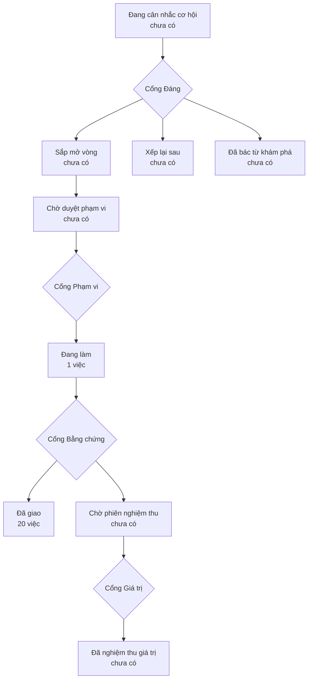

# Bản đồ sản phẩm

> Bản đồ vẽ lại từ hồ sơ của xưởng mỗi lần một người ký một cổng — đừng sửa tay.
> (đọc từ thư mục `_acceptance/` và `.out-of-scope/`)

> **Bốn cổng người** — mỗi cổng là một câu hỏi chỉ người trả lời được:
> **Cổng Đáng** việc này có đáng làm không · **Cổng Phạm vi** bộ tiêu chí
> đã đủ và đúng chưa · **Cổng Bằng chứng** đã làm đúng thứ đã hứa chưa ·
> **Cổng Giá trị** thứ đã giao có ăn thua không.

## Đang làm

- Gom luật đọc hồ sơ xưởng về một chỗ — mọi bên đọc phải cho cùng một kết luận (`workspace-reader-unification`) · liên quan: product-map-uat-session

## Đã giao

- đóng lớp câm-lặng của 6 cửa parse trong claim-scan.mjs (5 lỗ: section-EOF, id sai khuôn, id trùng xuyên-feature, frontmatter không đọc được, nội dung rỗng) (`claim-scan-parser-hardening`)
- Trục ngữ cảnh cho bản mẫu — khoá context 3 nấc trong sổ phiên design-pass, card Cổng 1 render nấc, generic mọi repo (`context-ladder`)
- gap-probe S1 đọc bài học lớp-lỗi từ các feature trước qua claim-scan.mjs (index dẫn xuất, không persist) (`cross-feature-claim-index`)
- re-pin 1 lượt machine-lane + N chữ ký cùng run_id (chống gian lận 2 tầng bằng máy) + P1 carry-forward cho round fix sau REJECT; không hạ một chuẩn bằng chứng nào (`delta-verify-repin`)
- skill mới `design-pass`: nghi thức thiết kế in-harness cho bước S1-D (phiên chuyên trách thẩm mỹ+UX trên proto C2 trong Browser pane, owner phản ứng bằng lời; thay vai ceremony design-mockup đã khai tử) (`design-pass-skill`)
- Tài liệu first-run một khuôn — CI snippet, /start, jsdom, attribution version (`docs-first-run-audit`)
- luật ranh giới section PER-SECTION đặt một chỗ có marker trong lib/md-section.js; gate-card + evidence-page hết bản sao, claim-scan ghim bằng round-trip (`findings-section-boundary`)
- Pre-merge enforce gap-probe presence (merge-boundary, thay cho hook write-time) (`gap-probe-presence-hook`)
- Card Cổng 1 phải hiện ĐỦ criterion contract khai — hoặc kêu to khi không đọc được (`gate-card-ac-visibility`)
- Hình chọn theo mặt phẳng, không theo định dạng — vá luật N5 (`hinh-theo-mat-phang`)
- acceptance-verify.js DỪNG fail-closed khi eval thiếu field mà prompt fan-out phụ thuộc (question/expected/steps/cmd/id/criterion/executor); judgment thiếu inputs hạ về UNCERTAIN cơ học thay vì chấm mù (`judgment-question-guard`)
- Luật ngôn ngữ mặt người — cưỡng chế bằng file tham chiếu + khuôn trình bày (`ngon-ngu-mat-nguoi`)
- Pha 3 — gói lưới 5 món cho discovery + feature-loop (template opportunity + platform-fit gap-probe + nạp DS skill + Gate 1 tự in /goal + wire S1-D design-pass) (`pha3-goi-luoi`)
- Sổ luật-đã-chạy — `clean` phải được chứng minh, không phải mặc định (`premerge-rules-ledger`)
- Chặn PASS chưa ai phán ở biên merge (chữ ký giữ-chỗ + slug tự khai phát hành không được tàng hình) (`premerge-unjudged-pass`)
- PRODUCT-MAP + phiên nghiệm thu — bộ sinh bản đồ sản phẩm từ hồ sơ xưởng, nghi thức Cổng Giá trị, start-scan đọc 2 nguồn mới (`product-map-uat-session`)
- Scope-triage cho review findings ở S4 — ngăn thứ ba "thật nhưng ngoài hợp đồng" (`s4-scope-triage`)
- Lệnh /start — nghi thức vào phiên, quét workspace trình thẻ 3 nhóm rồi bàn giao (`start-command`)
- Làm cứng bộ quét /start — lỗi phải có tên, không đổi nghĩa (`start-scan-hardening`)
- Tách phạm vi răng T1-escape khỏi phạm vi diff (cờ opt-out + thứ tự bump version) (`t1-escape-event-scope`)

## Ngoài phạm vi đã ký

- Cưỡng chế gap-probe ở write-time (hook PreToolUse) — ĐÃ TỪ CHỐI (`.out-of-scope/gap-probe-write-time-hook.md`)
- Miễn trừ `.github/**` và `.claude-plugin/plugin.json` khỏi `t1_skip_globs` — ĐÃ TỪ CHỐI (`.out-of-scope/t1-skip-globs-github-and-manifests.md`)
