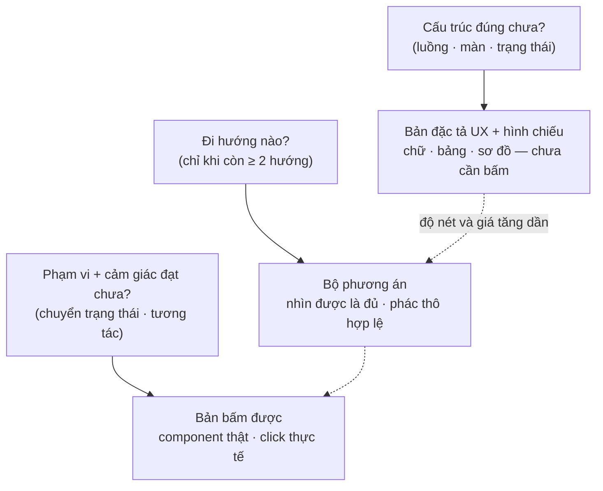

# Phân vai đặc tả – hình – bản bấm được: chữ là nguồn, click là mặt người

*Ghi từ phiên 26/08 với owner, sau audit dây hai việc đã gộp
`dac-ta-ux-vat-hoa-cau-truc` (#107) và `design-pass-nac-khong-dong-bo` (#112).
Đây là bài giảng-lại-cho-rõ, không phải quyết định mới — mọi luật trích ở đây
đều đã sống trong vật đã ship; tài liệu này chỉ gom chúng thành một khung đọc.*

Từ dùng: «bản đặc tả UX» = section `## Đặc tả UX` trong design-doc, điền từ
khuôn `skills/acceptance/references/ux-spec-template.md` (owner gọi tắt là
«spec» trong phiên — chữ đó tránh dùng trong kho vì đã bị `CONTEXT.md` gác cho
nghĩa khác); «bộ phương án» = vật của bước phân kỳ; «bản bấm được» = proto dựng
bằng component thật (thang vật liệu của nghi thức design-pass).

---

## 1. Nhầm lẫn gốc — và cái tách đúng

Hình dung ban đầu của owner: có một thứ tên là «Design» đứng giữa tài liệu và
code, sinh proto sớm bằng công cụ vẽ (vd `/design`) để «loại bỏ thời gian
code». Phiên 26/08 gỡ ra được ba mệnh đề đúng và hai chỗ phải chỉnh:

**Đúng:**

1. Tài liệu mấu chốt là UX/IA — cấu trúc là *dữ liệu nguồn*, mọi thứ khác sinh
   ra từ nó (kết luận nghiên cứu 22/08, mô hình Relume/Mobbin; hồ sơ
   `_acceptance/dac-ta-ux-vat-hoa-cau-truc/discovery/`).
2. Các vật thị giác sinh ra để *trực quan hoá* nguồn đó — hình luồng/màn tại
   Cổng Phạm vi bắt buộc vẽ TỪ section Đặc tả UX, cấm vẽ tay.
3. Bản-vẽ-để-nhìn và bản-bấm-để-cảm là **hai vật khác nhau**, sinh ở hai thời
   điểm, trả lời hai câu hỏi khác nhau — nhầm chúng làm một là nguồn của mọi
   kỳ vọng sai về `/design`.

**Phải chỉnh:**

1. Không có MỘT «Design» — có một **thang vật theo quyết định** (mục 2).
2. «Click thực tế so với ngôn từ» không phải cuộc thay thế — là **phân vai**
   (mục 3).

## 2. Thang vật theo quyết định

Mỗi quyết định được trả bằng vật **rẻ nhất đủ để quyết**. Câu luật gốc nằm
trong nghi thức design-pass: *«độ nét = đủ cho quyết định đang mở»*.

Ghi chú từng nấc:

- **Nấc chữ** — bản đặc tả UX khai trước khi ai nhìn; owner duyệt cấu trúc
  trên hình vẽ từ khuôn (giả định sinh tử #1 của hồ sơ dac-ta-ux). Chốt chặn
  là mắt người tại Cổng Phạm vi — vòng này cố ý không có lưới máy (cắt trọn
  24/08 sau 5 vòng «thước tự dối»).
- **Nấc nhìn được** — bộ phương án của bước phân kỳ: nhánh cụt, tham chiếu ở
  khoá `options:`, không vào chuỗi bằng chứng. `/design` chỉ là nấc cao nhất
  của thang vật dựng 4 nấc — có thì đẹp, không có thang vẫn đứng.
- **Nấc bấm được** — proto dựng bằng component thật (17 phút ở ván thử b1
  19/08), Cổng Phạm vi duyệt trên nó («không duyệt UI bằng chữ»), rồi code
  đầy đủ **lớn lên từ chính nó** — không có bước «code lại từ bản vẽ».

Hệ quả cho câu «proto sớm loại bỏ thời gian code»: proto sớm không loại bỏ
thời gian code — nó loại bỏ thời gian **code-lại**. Proto bằng bản vẽ
(`/design`) vẫn phải port thành component thật và đẻ bề mặt thứ hai phải giữ
đồng bộ (ngưỡng chết đã khai: «chọn trên canvas rồi bản thật lệch»); proto
bằng component thật là code mầm, công port ~0.

## 3. Phân vai: vì sao không bỏ được bên nào

### Ngôn từ (bản đặc tả UX) không bỏ được, dù đã có vật để bấm

1. **Click chỉ cho thấy đường đã đi; chữ ép khai đủ không gian.** Bấm proto là
   đi đường suôn sẻ; màn rỗng, ca lỗi, đường quay lại không tự lộ dưới ngón
   tay — bảng trạng thái ép liệt kê chúng trước. Demo đẹp vì demo chỉ đi một
   đường.
2. **Chữ chốt ý định trước khi làm** — chống sức hút tự-biện-minh của vật đã
   dựng (nguyên tố 1). Quyết định đầu tiên diễn ra trên proto thì mọi kết quả
   tự bào chữa được.
3. **Chữ là thứ máy đọc và đo được** — bảng trạng thái có id `ST-…`, có
   marker; S4 đo giao diện thật *đối chiếu về* nó. Proto không diff được,
   không làm hợp đồng được.
4. **Chữ là thứ veto rẻ** — trả lại một dòng đặc tả tốn một câu; trả lại một
   proto tốn 17 phút dựng lại nhân số vòng.

### Click (bản bấm được) không bỏ được, dù đặc tả đã chặt

1. **Có lớp câu hỏi chỉ lộ khi nhìn vật thật.** Ván thử b1 19/08: canvas hỏi
   «phiếu khuyên đứng đâu», owner nhìn ảnh bề mặt thật và trả lời «thứ này còn
   đáng tồn tại không» — câu hỏi đó không tồn tại trên giấy.
2. **«Chọn khi chưa thấy vật là chọn vô hiệu»** (vay huashu-design, nay nằm
   trong nghi thức): cảm giác, nhịp, độ nặng tay không mô tả được bằng lời đủ
   trung thực để quyết.
3. Vì thế Cổng Phạm vi có luật cứng: trình kèm bản bấm được, không duyệt giao
   diện bằng chữ.

### Bằng chứng cuối = hai đầu khớp nhau

Chữ là NGUỒN (máy đọc, máy đo); vật nhìn/bấm là MẶT NGƯỜI của cùng nguồn đó
(người quyết). Bằng chứng không nằm ở một bên — nó là phép so khớp: bảng trạng
thái đã khai ↔ giao diện thật đang chạy. (Phép đo khớp vòng tự động chưa tồn
tại — hạt giống `docs/plans/2026-08-24-hat-giong-khop-vong-dac-ta-ux.md` giữ đề
bài; hiện tại người soi tại cổng.)

## 4. Vị trí công cụ ngoài — một nguyên tắc áp nhiều lần

Mobbin và `/design` cùng chịu một câu trả lời: **công cụ ngoài là một nấc có
tên trong thang, không bao giờ là chân móng** — vì kit phải chạy ở mọi repo,
mọi phiên, mọi mức quyền; máy đi trước không được dừng vì thiếu đồ; mọi lần hạ
nấc phải để vết cho người veto.

- Mobbin: nấc 1 của thang tra mẫu hai nấc, chỉ mở khi máy không tự chắc khuôn
  IA (≥ 2 khuôn khả dĩ); nấc 2 là danh sách 7 khuôn IA có tên trong khuôn.
  Dòng căn cứ bỏ trống = đoán chay — người thấy tại cổng, máy không kiểm.
- `/design`: nấc 1 («dựng + lưu được») của thang vật dựng 4 nấc cho bộ phương
  án. Re-check 26/08 từ chính bản skill: là preview của Claude Design trong
  Claude Code; quyền tổ chức gác việc LƯU, không gác dựng-và-xem — khớp từng
  nấc với thang đã khai (lưu được → chỉ-xem/PNG-PDF → file mở tại máy → không
  có gì: khuyên một hướng + vết, đi tiếp).

## 5. Câu chốt + con trỏ

> Bản đặc tả UX là hợp đồng, hình là bản chiếu của hợp đồng, bản bấm được là
> mặt người của hợp đồng — còn `/design` chỉ là cái giá vẽ mượn tạm ở nấc
> «nhìn được»: có thì đẹp, không có thì thang vẫn đứng.

Số còn thiếu của toàn bộ khung này (chi phí thật của bước phân kỳ, số lần gọi
người, token) chỉ sinh ở **ván thử chung** của hai hồ sơ — chưa chạy, hạn
2026-09-30, quá hạn cả hai tự xếp kho (`decision: park`).

- Khuôn: `skills/acceptance/references/ux-spec-template.md` · lời S1:
  `feature-loop/skills/feature-loop/SKILL.md` · nghi thức + hai thang:
  `skills/design-pass/SKILL.md`
- Hồ sơ: `_acceptance/dac-ta-ux-vat-hoa-cau-truc/` ·
  `_acceptance/design-pass-nac-khong-dong-bo/`
- Tổng kết vòng B: `docs/findings/2026-08-25-tong-ket-vong-design-pass-nac.md`
- Hạt giống phần cắt: `docs/plans/2026-08-24-hat-giong-khop-vong-dac-ta-ux.md` ·
  `docs/plans/2026-08-25-hat-giong-do-loi-hua-van-xuoi.md`
