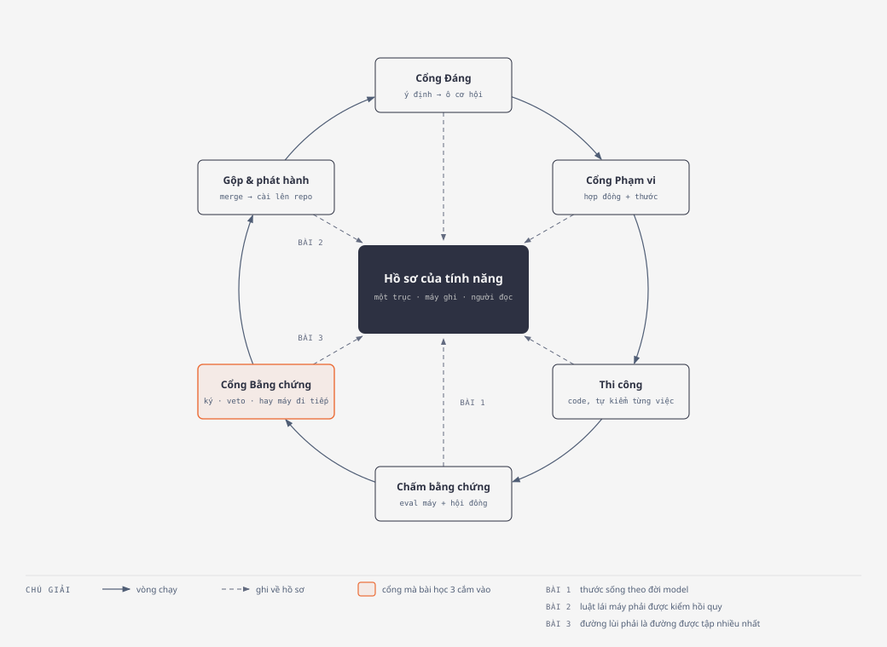
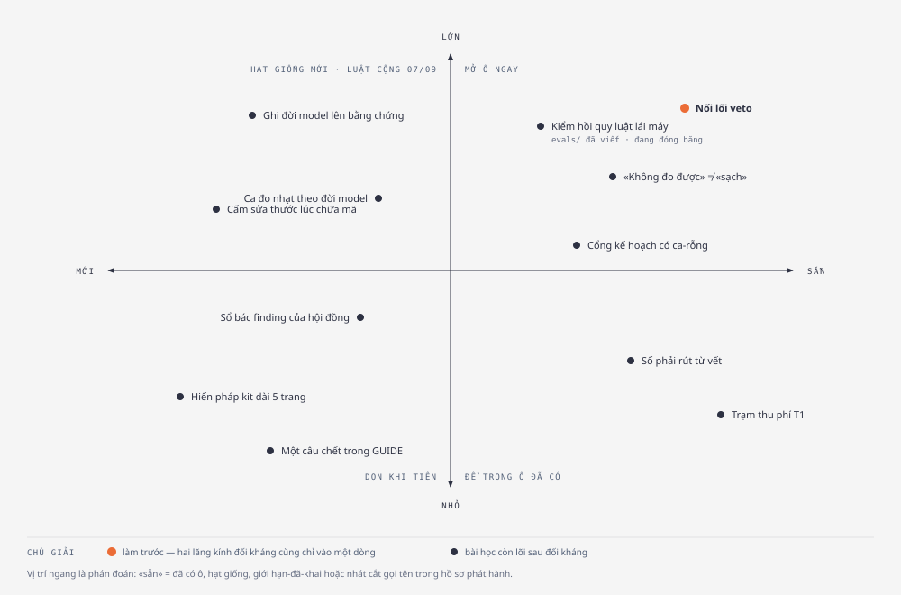
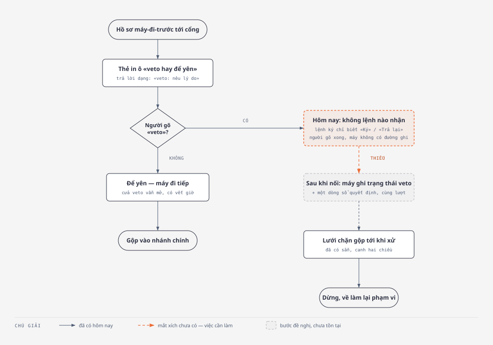

# Bài học từ «The AI-Native SDLC playbook» — bản dễ đọc, 07/09/2026

> Đọc trong 5 phút. Bản kỹ thuật (mọi khẳng định kèm `file:line`, hai lăng kính
> đối kháng, ba đính chính) ở
> [2026-09-07-doi-chieu-ai-native-sdlc-playbook.md](2026-09-07-doi-chieu-ai-native-sdlc-playbook.md).
> Playbook gốc đã lưu: [docs/research/2026-09-07-ai-native-sdlc-playbook.md](../research/2026-09-07-ai-native-sdlc-playbook.md).
> Hình tầng 2 trong `docs/plans/assets/2026-09-07-bai-hoc-playbook/` (HTML + SVG;
> PNG cần `pip install playwright && playwright install chromium` rồi chạy lại
> lệnh export).
>
> **Bối cảnh luật:** owner tuyên 07/09 — vẫn giữ North Star, nhưng lúc này kit
> chấp nhận lắng nghe và **mở luật «có thể cộng»**, phạm vi rộng hơn. Vì thế bản
> này xếp lại: thứ bị bác hôm qua *chỉ vì là CỘNG* nay được xét lại theo tác động.

---

## 1. Playbook nói gì — ba câu

1. **Viết code không còn là chỗ nghẽn.** Chỗ nghẽn dời sang các bước người phải
   nghĩ: lên kế hoạch, review, phát hành. Kiểm soát cũ (đọc từng dòng, họp duyệt)
   không theo kịp khi máy viết phần lớn diff.
2. **Mỗi bước kết thúc bằng một vật ghi vào git, bước sau đọc vật đó.** Ý định →
   đặc tả → kế hoạch → diff + test → PR + phát hiện review → hồ sơ sự cố. Chuỗi
   commit chính là dấu vết kiểm toán: ai xin gì, máy làm gì, ai duyệt.
3. **Người chỉ xuất hiện ở cổng**, đọc thứ máy đã cắm cờ thay vì làm lại từ đầu;
   luật được ép bằng hook (chạy mỗi lần máy hành động), không bằng thói quen.

Kit đã sống theo cả ba câu này từ trước — mục 5 liệt bằng chứng. Vì thế phần
đáng đọc không phải «kit thiếu gì so với playbook» mà là **bốn lớp máy-tin-nhầm-
chính-nó** playbook chỉ ra mà kit chưa canh.

---

## 2. Ba bài học tác động lớn nhất tới hiệu quả phát triển sản phẩm

*Cách đọc:* vòng chạy theo chiều kim đồng hồ, sáu trạm quanh một hồ sơ chung ở
giữa (ô đen); nét đứt là mỗi trạm ghi về hồ sơ. Ba nhãn `BÀI 1·2·3` đứng trên ba
nan hoa ở nửa dưới — tức ba bài đều bám vào chỗ **máy tự kết luận rồi người ký**,
không bám vào chỗ máy làm việc. Ô cam là Cổng Bằng chứng: cả hai nửa của bài 3
đứng ở đó.

### Bài 1 — Thước phải sống theo đời model

**Nói đơn giản:** một hồ sơ đã ký là lời hứa «đã kiểm». Lời hứa đó có ngày hết
hạn theo hai trục — *mã đổi* và *model đổi*. Kit chỉ theo dõi trục thứ nhất.
Trong 78 hồ sơ bằng chứng của kho, **không hồ sơ nào ghi nó được sinh ra dưới
model nào**. Hồ sơ ký dưới model đời cũ đọc y hệt hồ sơ đời nay, mãi mãi.

**Vì sao tác động lớn:** khi model đời mới thấy lớp lỗi mà đời cũ không thấy,
mọi hồ sơ cũ **tự động sai** mà không đổi màu. Hoặc ta tin nhầm, hoặc phải kiểm
lại tất cả bằng tay — cả hai đều đánh thẳng vào «tin được» và vào số lượt gọi
người.

**Playbook nói gì:** một lượt quét là «phát biểu tại một thời điểm, *dưới một
model*, và cả hai vế đều cũ đi»; độ phủ tính từ lần chạy **gần nhất**, không từ
lần đầu. Ca đo cũng nhạt dần khi model khoẻ lên — ca từng phân biệt được nay
không còn, phải thêm ca mới.

**Việc cụ thể:** (a) ghi tên model + ngày vào mỗi hồ sơ bằng chứng lúc sinh; hồ
sơ cũ không có trường → cờ vàng, không bắt sửa hàng loạt; (b) «cũ theo model»
thành một lý do ghim lại, bên cạnh «cũ theo diff»; (c) khi trường
`non_discriminating` bật liên tiếp, kit đã có số — thiếu là bước *thêm ca mới*.

### Bài 2 — Luật lái máy đổi thì phải được kiểm hồi quy như code

**Nói đơn giản:** sản phẩm thật của kit là 23 file lời dặn (SKILL.md, lệnh,
hook). Mỗi mốc phát hành đổi những file đó, và **không thước nào chạm** — CI của
kit chạy 6 bộ kiểm tất định trên script, không bộ nào chạy một skill rồi chấm
đầu ra. Lịch sử 2.4.0 → 2.8.0 đầy «hạ tầng phiên đốt lượt chấm» là hệ quả trực
tiếp: luật đổi, hành vi máy đổi, không ai đo cho tới khi một vòng thật nổ.

**Vì sao tác động lớn:** đây là chỗ *lượt gọi người ngoài thiết kế* sinh ra
nhiều nhất (≥6 ở mốc 2.7.0), và là lớp lỗi kit tự gọi tên «thước tôi dựng mắc
đúng lỗi nó đi bắt». Kiểm hồi quy cấu hình là cách duy nhất biến nó thành số
trước khi thành vòng.

**Playbook nói gì:** bộ ca chạy **khi `CLAUDE.md`, skill hoặc hook đổi** (không
chỉ theo lịch); **chặn merge theo tỉ lệ đạt**; **mỗi sự cố thành một ca vĩnh
viễn**; coi bộ ca là *sống* — ca hết phân biệt thì thay.

**Kit đang ở đâu:** đã biết lỗ này, đã viết sẵn 3 ca ở `evals/` (PR #120) theo
khuôn `claude plugin eval`; harness đó org chưa được bật; owner quyết 30/08:
không chờ, không xin. **Dưới luật cộng 07/09**, ứng viên là harness-lite chạy
bằng `claude -p` trong CI theo đúng YAML playbook đưa (trang 4, play «Continuous
evals»), đọc cùng khuôn `evals/` để khi harness thật mở thì bỏ được ngay.

### Bài 3 — Đường lùi phải là đường được tập nhiều nhất

**Nói đơn giản:** mọi lần kit cho máy đi trước đều tựa vào một câu: «đường đảo
còn sống». Hôm nay câu đó chưa được chứng minh ở **hai** cửa:

- **Cửa của người — veto.** Thẻ Cổng Bằng chứng của hồ sơ máy-đi-trước in ô
  «veto hay để yên» và dạy trả lời «veto: nêu lý do». Nhưng lệnh ký chỉ biết
  «Ký» hoặc «Trả lại» — **không lệnh nào nhận chữ «veto»**. Lưới chặn gộp thì
  đã canh sẵn trạng thái đó hai chiều. Tức răng có, cửa có, thiếu cái tay nắm.
- **Cửa của máy — «không đo được».** Ở chốt trước-merge, «soi lại bằng chứng
  thấy hỏng» là vi phạm ở chế độ nghiêm; còn «soi lại **không chạy được**» chỉ
  là một dòng ghi chú rồi cho qua — kể cả ở chế độ nghiêm. Cổng chết đọc y hệt
  cổng sạch.

**Vì sao tác động lớn:** làn máy-đi-trước là nơi kit cắt lượt gọi người nhiều
nhất. Nếu đường lùi không thật, owner chỉ có hai lựa chọn xấu: ngừng tin làn đó
(quay lại ký tay — tăng lượt), hoặc tin mà không có cách dừng.

**Playbook nói gì:** «rollback phải là đường được tập nhiều nhất trong pipeline,
chứng minh **trước** khi cần»; và một lớp chỉ thành cổng thật khi «hỏng thì
không chạy» (`failIfUnavailable`), lệnh trượt trong hộp cát không được chạy lại
ngoài hộp cát.

---

## 3. Bài học nào đã có chỗ trong kit

*Cách đọc:* trục ngang là «đã có chỗ trong kit chưa» — bên phải là đã có ô, hạt
giống, giới hạn-đã-khai hoặc nhát cắt gọi tên trong hồ sơ phát hành; bên trái
là hoàn toàn mới. Trục dọc là tác động. Chấm cam duy nhất là việc cả hai lăng
kính đối kháng cùng chỉ vào một dòng. Góc trên-phải là «mở ô ngay»; góc
trên-trái là «hạt giống mới, chỉ mở được nhờ luật cộng 07/09».

| Bài học | Chỗ đã có trong kit | Trạng thái |
|---|---|---|
| Nối lối veto | Audit dây nghi thức 22/08, mục *Later*: «veto không động từ» | chưa mở, chưa có ô |
| «Không đo được» ≠ «sạch» | Ô **Ngoài-4 «họ fail-open trong phép đo + hậu-chữ-ký»** — nhát cắt gọi tên trong hồ sơ 2.8.0, cửa sổ 2.8→2.9 | ô đã có, đây là **thành viên mới** của họ |
| Kiểm hồi quy luật lái máy | `evals/` 3 ca (PR #120) + ô plugin-eval | **đóng băng** theo quyết 30/08; mở lại được dưới luật cộng |
| Cổng kế hoạch có ca-rỗng | Audit 22/08 *Later*: «Gate 1.5 không vết» + A6 (bộ quét suy trạng thái từ sự tồn tại file plan) | chưa mở |
| Số phải rút từ vết | Giới hạn đã khai trong hồ sơ 2.7.0 («≥10») và 2.8.0 («chưa đếm») | chưa có ô |
| Trạm thu phí T1 | Ô `t1-tuyen-kem-can-cu` — thi công 14/08 rồi hoàn nguyên sau hai vòng trượt cùng lớp | discovery, có điều kiện mở lại |
| Ca đo nhạt theo đời model | **Một nửa:** trường `non_discriminating` + băm baseline đã có; bước «thêm ca mới» chưa | mới một nửa |
| Sổ bác finding của hội đồng | **Một nửa:** claim-scan mang bài học xuyên tính năng + sổ giới hạn 270 dòng; đếm *tái phát* chưa | mới một nửa |
| Ghi đời model lên bằng chứng | — | **mới** |
| Cấm sửa thước lúc chữa mã | Kit có khoản khai-sinh-phép-đo (case hai chiều) nhưng không gì *chặn* việc nới thước | **mới** |
| Hiến pháp kit dài 5 trang (playbook: dưới 1 trang) | — | mới; là vật owner viết → owner quyết |
| Một câu chết trong GUIDE (§7.1: «mỗi lần một lượt gọi người») | Làn ghim-lại máy-một-mình đã sống từ 16/08 | rác, dọn được ngay |

Hai điều playbook nói mà kit **cố ý** làm ngược, và nên giữ: gộp hai lần chạm
trước thiết kế còn một (Cổng Đáng) · không để chủ sản phẩm ngồi lặp đồng bộ trên
bản mẫu. Lý do chung: playbook viết cho tổ chức nơi thứ khan hiếm là *người
trực*; kit viết cho một owner nơi thứ khan hiếm là *lượt chú ý*. Chi tiết và giá
đã trả: bản kỹ thuật, mục D.

---

## 4. Hạng mục cần sửa ngay

Tiêu chí «ngay»: rẻ · đảo được · **0 lượt gọi người thêm** · chiều đỏ đã biết
hoặc đã đo. Bốn việc, theo thứ tự:

*Cách đọc:* cột trái là đường «để yên» — đã chạy tốt. Nhánh «có» rẽ phải và
dừng ở ô cam nét đứt: hôm nay không lệnh nào nhận chữ «veto». Mũi tên cam nét
đứt là **mắt xích còn thiếu** — chỉ một mắt; hai ô dưới nó (ghi trạng thái, lưới
chặn gộp) đã có sẵn hoặc chỉ là một lượt ghi máy vốn đã làm cho mọi ô khác của
cùng câu trả lời.

1. **Nối lối veto.** Lệnh ký nhận thêm ô «veto: lý do» trong câu gộp → ghi trạng
   thái `da-veto` + một dòng sổ quyết định trong cùng lượt. Không đổi schema
   (trạng thái đã hợp lệ), không lệnh mới. *Chiều đỏ:* gõ «veto: lý do» trên một
   hồ sơ máy-đi-trước → phải ra trạng thái + dòng sổ, và lưới trước-merge phải
   chặn; *đối chứng dương:* hồ sơ để yên phải qua.
2. **«Không soi lại được» = vi phạm ở chế độ nghiêm.** Một nhánh trong chốt
   trước-merge, dạng TRỪ. *Chiều đỏ đã đo thật trong phiên đối kháng* (bẻ lõi
   luật → hôm nay xanh, phải đỏ). Lưu ý: file này được chép sang repo tiêu thụ,
   nên đi theo mốc phát hành, không rải.
3. **Gỡ câu chết ở GUIDE §7.1** («mỗi lần một lượt gọi người») — đang dạy sai
   mô hình chi phí từ 16/08. Việc T1.
4. **Ghi đời model vào bằng chứng** — chỉ phía ghi; phía đọc thêm cờ vàng khi
   vắng. Là hạt của bài 1, nhưng phần này đủ nhỏ để đi cùng đợt.

**Không sửa ngay, dù tác động lớn:** kiểm hồi quy luật lái máy (cần dựng
harness-lite — một ô có hợp đồng) · cổng kế hoạch ca-rỗng (đụng nghi thức T3,
cần ô riêng) · rút gọn hiến pháp kit (vật owner viết, khó-đảo về luật → câu hỏi
cho người, không phải việc máy).

---

## 5. Playbook xác nhận kit đang đúng — để không đổi những chỗ này

- Bằng chứng đến từ bộ công cụ, không từ lời thuật → kit cấm «verifier: manual
  review», đối chiếu mã lần chạy.
- Phép kiểm tồn tại trước bản vá → khoản khai-sinh-phép-đo: thước mới chỉ tính
  xong khi có cặp case hai chiều.
- Chặn lúc hành động, soi lại ở cửa ra → hook lúc ghi + soi lại toàn kho mỗi
  lượt CI.
- Bác kèm lý do để phát hiện không quay lại như mới → `.out-of-scope/` bắt buộc.
- Chuẩn nạp lúc *viết* thiết kế → phản biện ngữ cảnh sạch, đóng-khi-hỏng.
- Và một chỗ kit đi **xa hơn** playbook: playbook không đòi ai chứng minh phép
  đo từng đỏ; luật «màu xanh phải từng chạy chiều đỏ» là của riêng kit.

---

## 6. Trạng thái

Bốn việc ở mục 4 chưa làm — chúng chạm engine nên đi qua chính cổng của kit.
Hai việc đầu đã có chỗ đứng sẵn (mục *Later* của audit 22/08 · ô Ngoài-4 của
2.8.0), nên gộp được thành **một ô** «đường lùi phải sống», mở dưới luật cộng
07/09. Bài 1 và bài 2 ghi hạt giống, chưa mở.
