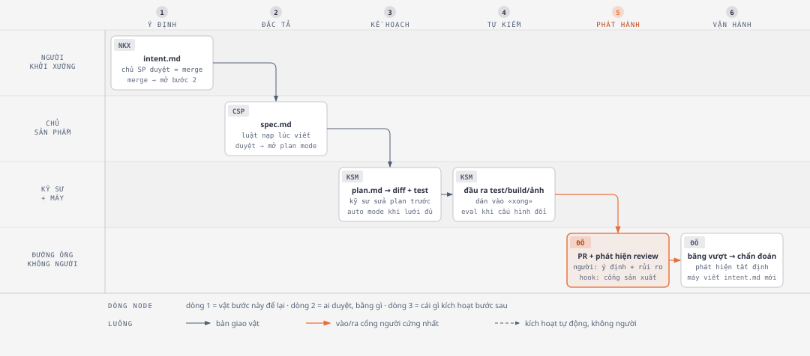
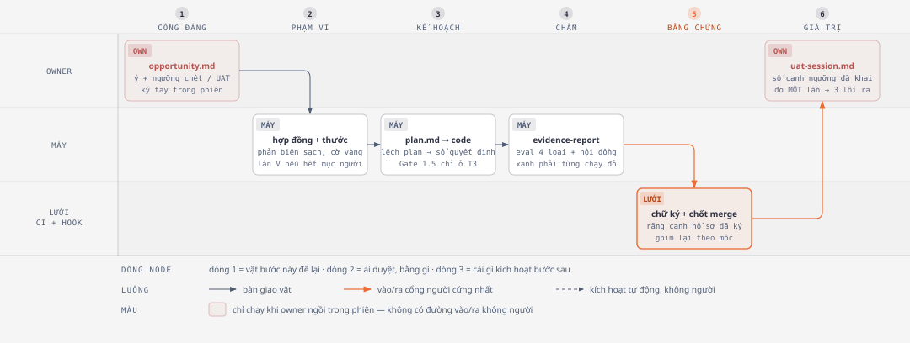

# Toàn trình một sản phẩm theo playbook — đặt cạnh toàn trình của kit, 07/09/2026

> Trả lời câu owner: *«Đây là toàn trình của một sản phẩm tôi muốn làm rõ hơn,
> và những bài học của roadmap → plan…»*. Bản này làm rõ **cả sáu bước** của
> playbook theo cùng bốn cột (vật để lại · ai duyệt, bằng gì · cái gì kích hoạt
> bước sau · đo bằng gì), đặt kit cạnh từng cột, rồi rút bài học cho **đầu
> vòng** — chỗ hai lượt đối chiếu trước đọc hụt (lượt phê bình 07/09 tự chỉ ra:
> đã đọc playbook như danh mục đối chứng cho cổng và bằng chứng, chưa đọc nó
> như một **chuỗi bàn giao**).
>
> Nguồn: [playbook đã lưu](../research/2026-09-07-ai-native-sdlc-playbook.md) ·
> bản kỹ thuật [đối chiếu](2026-09-07-doi-chieu-ai-native-sdlc-playbook.md) ·
> [bản dễ đọc](2026-09-07-bai-hoc-playbook-ban-de-doc.md). Hình tầng 2 ở
> `docs/plans/assets/2026-09-07-bai-hoc-playbook/04-*, 05-*` (HTML + SVG).

---

## 1. Toàn trình playbook, làm rõ

*Cách đọc:* bốn làn là bốn vai; sáu cột là sáu bước. Mỗi ô ghi ba dòng: **vật
bước này để lại** · **ai duyệt, bằng gì** · **cái gì kích hoạt bước sau**. Mũi
tên cam vào/ra cột 5 — cổng sản xuất — là cổng người **cứng** duy nhất; người
còn xuất hiện ở cột 1 (duyệt ý định bằng merge) và cột 2 (duyệt đặc tả). Làn
dưới cùng không có người: cột 6 tự viết một `intent.md` mới và vòng quay lại
cột 1.

Ba ý playbook lặp ở mọi bước, viết lại cho dễ nhớ:

1. **Mỗi bước kết thúc bằng một vật commit vào git; bước sau bắt đầu bằng việc
   đọc vật ấy.** Chuỗi commit là dấu vết kiểm toán — ai xin gì, máy làm gì, ai
   duyệt.
2. **Việc chấp nhận vật là cái kích hoạt bước sau** — `intent.md` được merge thì
   lượt đặc tả chạy; `spec.md` được duyệt thì plan mode mở; PR merge thì pipeline
   chạy; băng vượt ngưỡng thì `intent.md` mới được viết. Lúc đầu người bấm tay
   từng bước; đích đến là mỗi vật được chấp nhận **tự** bắn bước kế.
3. **Người đứng ở cổng, đọc thứ máy đã cắm cờ** — không làm lại từ đầu; và
   **luật được ép bằng hook** chạy mỗi lần máy hành động, không bằng thói quen.

| Bước | Vật để lại | Ai duyệt, bằng gì | Kích hoạt bước sau | Đo bằng gì (playbook) |
|---|---|---|---|---|
| **1 · Ý định** | `intent.md` — vấn đề, kết quả mong muốn, ai/hệ bị ảnh hưởng, ràng buộc, câu hỏi mở; **người khởi xướng** viết bằng lời của họ cùng Claude, theo khuôn của tổ chức; nằm trong «nhà ý định» (thư mục `intent/` trong repo sản phẩm) | **Chủ sản phẩm** duyệt bằng **merge** (bác = đóng review); tác giả + dấu thời gian + lịch sử sửa nằm trong git | merge → lượt đặc tả | thời gian từ buổi nói chuyện đầu → `intent.md` commit (tuần → giờ) · tỉ lệ ý định sống qua duyệt · **số lần sửa `intent.md` sau khi `spec.md` đầu tiên đã commit** |
| **2 · Đặc tả** | `spec.md` — yêu cầu + thiết kế trong **một** phiên; luật thương hiệu / bảo mật / tuân thủ / UX nạp **lúc viết** dưới dạng skill; lo ngại cắm cờ đưa tới **chủ luật** trước khi kỹ sư thấy | Chủ sản phẩm duyệt; việc rủi ro cao hỏi thêm tech lead; luôn là người | duyệt → mở plan mode | khoảng cách `intent` commit → `spec` commit · **số lần sửa `spec.md` sau khi `plan.md` đầu tiên đã commit** |
| **3 · Kế hoạch + xây** | `plan.md` — file đổi, thứ tự, test chứng minh; kỹ sư tra hỏi rồi sửa plan **trước khi** có dòng code; lệch plan giữa chừng → sửa `plan.md` trong **cùng commit** (hook ép) · `CLAUDE.md` · skill · hook chặn đường cấm | Kỹ sư duyệt plan (rủi ro cao → tech lead); auto mode khi lưới đã đủ: spec chặt, bán kính nổ nhỏ, test đã phủ | plan được chấp nhận → máy thi công | tỉ lệ merge ngay lần thi công đầu · rework/thay đổi · **diff cuối còn khớp `plan.md` không** |
| **4 · Tự kiểm** | Đầu ra thật của test / build / ảnh chụp, **dán vào câu «xong»**; bug → viết test đỏ trước, commit, rồi mới sửa; **hook cấm sửa file test trong lúc chữa**; bộ eval 20–50 việc thật chạy khi `CLAUDE.md`/skill/hook đổi | Code owner ở PR — chỉ còn xét ý định + rủi ro vì bằng chứng máy đã đính | eval đạt ngưỡng → cho merge cấu hình | tỉ lệ CI xanh lần đầu cho diff máy viết · thời gian review/PR · tỉ lệ eval theo thời gian · thời gian từ sự cố → thành ca eval |
| **5 · Review + phát hành** | PR + phát hiện review theo `REVIEW.md` (ba lượt: lỗi · bảo mật · khớp spec/plan; Important ≠ Nit; trần nit; bỏ thứ CI đã ép); hook làm **cổng duyệt** (cho / hỏi / chặn); cài đặt quản trị không tắt được | **Người** duyệt qua branch protection; phát hiện máy không tự chặn/tự duyệt; **hook cổng sản xuất** đòi tên người cho phát hành | merge → pipeline; máy đi tới cổng sản xuất và **không qua nó** | thời gian tới review đầu · % comment máy tự xử · lỗi bắt trước merge vs lọt · **thời gian chờ ở từng cổng, đọc từ vết hook** · DORA |
| **6 · Vận hành** | Script **tất định** canh một chỉ số với băng 1σ/2σ/3σ trong `bands.yaml` (có unit test, không model); vượt băng → máy chẩn đoán, viết `intent.md` mới; bác phải kèm lý do để **nuôi lại băng**; sửa xong → thêm ca eval | Chủ dịch vụ triage hàng đợi: làm ngay / xếp lịch / bác | băng vượt → `intent.md` → về cột 1 **không cần ai khởi động** | thời gian băng vượt → `intent.md` · tỉ lệ phát hiện thành fix merge · sự cố lặp cùng lớp |

Kèm một sidebar quan trọng cho tổ chức có hệ thống cũ: **mỗi vật chỉ có MỘT
nguồn sự thật** — repo, hay hệ thống cũ (Jira/ServiceNow) với markdown là bản
làm việc, hay tối thiểu là **liên kết hai chiều** (vật ghi ID hồ sơ, hồ sơ ghi
SHA commit).

Điều đáng chú ý nhất về **roadmap**: playbook **không có bước roadmap**. Vòng
bắt đầu ở ý định (từ người, từ ticket, từ sự cố) và «roadmap» chính là **hàng
đợi triage** — chủ sản phẩm chấp nhận hay đóng từng ý định, chủ dịch vụ triage
từng phát hiện. Ưu tiên không phải một tài liệu, mà là **quyết định ở cửa vào
của mỗi ý định**, ghi bằng merge/đóng.

---

## 2. Toàn trình kit, đặt cạnh

*Cách đọc:* cùng sáu cột. Kit **mạnh hơn ở giữa** — thước có chiều đỏ, phản biện
ngữ cảnh sạch, răng canh hồ sơ đã ký. Hai ô **đỏ nhạt** ở hai đầu là chỗ khác
biệt cấu trúc: cả ý định (cột 1) lẫn đo giá trị (cột 6) chỉ chạy khi owner
**ngồi trong phiên**; không có đường vào và đường ra **không người**. Cổng cứng
(cam) đặt ở cùng cột 5 như playbook.

| Bước | Vật kit để lại | Ai duyệt, bằng gì | Kích hoạt bước sau | Đo bằng gì (kit hôm nay) |
|---|---|---|---|---|
| **1 · Cổng Đáng** | `opportunity.md` — vấn đề & ai gặp · giả định sinh tử · **ngưỡng chết / ngưỡng UAT khai trước** · timebox; máy được đề xuất ngưỡng với tiền tố `[đề xuất]`, người gỡ tiền tố = chốt | Owner ký `decision: build/iterate/park/kill` — **chưa có lệnh**, ký ghi tay trong phiên; làn thẻ Cổng Đáng đã dựng rồi trả về ô 01/09 | owner mở vòng bằng lời trong phiên | ba dòng số đếm tay mỗi mốc phát hành (làm-xong→quyết-được · lượt gọi người · vòng bị hạ tầng đốt); **không số nào đo chất lượng ý định** |
| **2 · Cổng Phạm vi** | `contract.md` (5–15 AC Given/When/Then, Coverage, Đường đo, Out of scope) + `evals.yaml` (mỗi AC ≥1 thước) + `gap-probe.md` (phản biện ngữ cảnh sạch, fail-closed) + design doc ngoài `_acceptance/` | Owner duyệt bằng `/approve`; **làn V**: hết mục chỉ-người-biết và không khó-đảo → máy đi tiếp, cửa veto mở | duyệt / làn V → S2 | cờ vàng khi thiếu Coverage / Đường đo; số P0 của phản biện |
| **3 · Kế hoạch + xây** | `plan.md` (task · file · lệnh kiểm mỗi việc · cờ độc lập); lệch plan → **sổ quyết định** (không sửa plan); thi công song song bằng worktree; CLAUDE.md + skill; hook canh file bằng chứng | Gate 1.5 **chỉ T3**, viết cứng «chờ duyệt», chưa có ca-rỗng; T2 đi thẳng | S3 xong theo lời khai «đã kiểm từng việc» → `implemented` | — (plan chỉ được đọc bằng sự tồn tại của file) |
| **4 · Chấm** | `evidence-report.md` — eval 4 loại executor + hội đồng phán đoán + rà soát đối kháng, phiên tươi; `run-log.jsonl` là vết; khoản khai-sinh-phép-đo: thước mới phải có cặp case hai chiều | Máy; trần 3 vòng; dừng-vá = thu phạm vi (người) | verdict → Cổng Bằng chứng | `non_discriminating` · cờ đỏ trên thẻ · giới hạn đã khai |
| **5 · Cổng Bằng chứng + gộp** | chữ ký `human_signoff` trên hồ sơ · `pre-merge-check` trong CI canh hồ sơ đã ký, staleness theo diff, veto · ghim lại **theo mốc phát hành** | Owner ký một chạm (hoặc làn V xanh-sạch → máy thông, cửa veto); branch protection | merge → mốc phát hành → cài lên repo tiêu thụ | «không soi lại được» hiện là NOTE (fail-open) · thuế ghim sau chữ ký |
| **6 · Cổng Giá trị** | `stranger-drive.md` (lái-thử người-lạ) → `uat-session.md`: chấm kín trước thảo luận, **số đặt cạnh ngưỡng đã khai ở cột 1** → release / iterate / kill; kill → `stage: archived` | Owner ký; skill dẫn phiên, không quyết | `iterate` → mở vòng mới **bằng tay** | đo **một lần**, trong phiên; 0/78 hồ sơ trong chính kho kit từng tới đây |

**Chỗ kit đi xa hơn playbook** (giữ, đừng đổi): ngưỡng khai *trước* ở cột 1 rồi
đo ở cột 6 — playbook không có «ý định chốt trước khi làm» ở mức số; thước phải
từng chạy chiều đỏ; phản biện ngữ cảnh sạch trước khi người duyệt; sổ quyết định
thay cho «sửa plan cùng commit».

**Chỗ chuỗi kit bị đứt** (lượt lập bản đồ 07/09 đếm 11; ba chỗ trực tiếp thuộc
đầu và cuối vòng): Cổng Đáng không có nghi thức nên bước sau «không có gì để
đọc» (ĐỨT 1) · plan chỉ được đọc bằng sự tồn tại (ĐỨT 3) · `## Đường đo` chốt ở
cột 2 nhưng phiên nghiệm thu ở cột 6 chép ngưỡng từ `opportunity.md`, không
từ hợp đồng (ĐỨT 7) · ba vật cuối chuỗi chưa từng tồn tại trong kho kit (ĐỨT 8)
· bài học đắt nhất của cột 4 (`review-findings`, eval đỏ) không được `claim-scan`
mang sang vòng sau (ĐỨT 10).

---

## 3. Khớp — lệch — đứt, nhìn một lượt

| | Playbook | Kit | Đọc thế nào |
|---|---|---|---|
| Vật mỗi bước | 6 vật, đều trong git | 6 vật, đều trong `_acceptance/` + git | **khớp** |
| Ai bắn bước kế | vật được chấp nhận **tự** bắn | owner nói trong phiên; máy đi tiếp giữa các stage | **lệch có chủ đích** ở giữa (kit tốt hơn: không hỏi «tiếp chứ?»), **đứt** ở hai đầu |
| Cổng người cứng | 1 (sản xuất) + 2 duyệt nhẹ | 3 (Đáng · Phạm vi · Bằng chứng) + Gate 1.5 (T3) + Giá trị | kit nhiều cổng hơn nhưng có làn V; playbook không có ca-rỗng |
| Thước cho «ý định chốt trước» | có: sửa `intent`/`spec` **sau khi** bước sau đã bắt đầu | **không có** | **thiếu** — nguyên tố 1 chưa có số |
| Luật nạp lúc viết đặc tả | skill thương hiệu/bảo mật/tuân thủ/UX | ổ cắm `ds_skill`, critic hỏi «luật nào chưa nạp» | khớp một nửa; **hạt giống Bất biến sản phẩm** (02/09) là phần còn lại |
| Đóng vòng | máy phát hiện → viết ý định mới, không người khởi động | người mở phiên nghiệm thu, đo một lần | **đứt** — và làn V không bao giờ tới cột 6 |
| Bác kèm lý do | nuôi lại băng phát hiện | `.out-of-scope/` + `decision: kill` | khớp về hình; kit chưa có gì để «nuôi lại» |

---

## 4. Bài học cho đầu vòng: roadmap → ý định → đặc tả → kế hoạch

Năm bài, xếp từ cửa vào tới kế hoạch. Mỗi bài nêu: playbook nói gì · kit đang
thế nào · việc cụ thể · trace về nguyên tố nào.

### R1 · Ý định phải là một vật có nhà riêng — viết được khi không có phiên máy, duyệt bằng merge

**Playbook:** người khởi xướng (không cần là chủ sản phẩm, không cần biết git)
viết `intent.md` theo khuôn, đẩy vào **nhà ý định**; chủ sản phẩm duyệt **không
đồng bộ** bằng merge. Ý tưởng không phải chờ ai viết hộ, và không phải chờ ai
rảnh để ngồi cùng.

**Kit:** vật tương đương là `opportunity.md`, nhưng nó **sinh ra trong phiên có
owner** — `/start` liệt ý «đang cân nhắc», owner chọn, máy điền, owner ký ngay
trong lượt. Cửa vào đòi owner có mặt. Với kit đang «xuống ĐỘI» (tái lập 07/08),
người nêu ý ngày càng **không** phải người ký — và hôm nay họ không có đường
nào ngoài nhắn owner.

**Việc:** một khuôn `opportunity.md` **nháp** bất kỳ ai commit được (stage
`discovery`, `decision` trống) + `/start` đọc thư mục đó thành hàng đợi + Cổng
Đáng có lệnh ký thật (ô đã có: memory *Cổng Đáng không có nghi thức*). Không
thêm cổng người — chỉ tách **viết** khỏi **ký**.

**Trace:** nguyên tố 1 (ý định chốt trước) + nguyên tố 3 (quyết thật ở cửa
vào). Người hưởng: người nêu ý trong đội; owner được ký lúc rảnh.

### R2 · Nguyên tố 1 chưa có thước — ba con số rẻ, rút từ git

**Playbook:** đo chất lượng ý định bằng **cái gì phải sửa sau khi bước sau đã
bắt đầu**: số lần sửa `intent.md` sau `spec.md` đầu tiên; số lần sửa `spec.md`
sau `plan.md` đầu tiên; diff cuối còn khớp `plan.md` không. Tất cả đọc từ dấu
thời gian git, không ai đếm tay.

**Kit:** «ý định chốt trước khi làm» là nguyên tố số 1 của hiến pháp, nhưng ba
dòng số đếm tay mỗi mốc không có dòng nào đo nó. Kit có sẵn vật để đo: mốc
commit của `opportunity.md`, `contract.md`, `plan.md`, và sổ quyết định ghi mỗi
lần đổi phạm vi (`descope`/`fix`).

**Việc:** ba số, máy rút, in trên hồ sơ phát hành cạnh ba dòng số hiện có:
(a) ý → `opportunity.md` commit; (b) tỉ lệ ô sống qua Cổng Đáng; (c) **số lần
hợp đồng/ô cơ hội bị sửa sau khi `plan.md` hoặc commit code đầu tiên** — đây là
số đo *trực tiếp* của nguyên tố 1. Không mở vòng đo-thước-của-thước: chúng đo
**vòng sản phẩm**, không đo thước.

**Trace:** nguyên tố 1. Người hưởng: owner — biết ý định có thật sự chốt trước
hay đang chốt sau bằng cách sửa hợp đồng.

### R3 · Luật sản phẩm nạp lúc viết đặc tả, và lo ngại cắm cờ phải có chủ

**Playbook:** đặc tả được viết **dưới ràng buộc** của skill thương hiệu / bảo
mật / tuân thủ / UX; máy **cắm cờ** chỗ hai luật mâu thuẫn; chủ sản phẩm giải
từng cờ **với chủ luật** trước khi kỹ sư thấy spec; phiên bản skill đang có hiệu
lực được ghi vào git cùng spec.

**Kit:** phản biện ngữ cảnh sạch đã hỏi «skill / quy định nào của repo lẽ ra
phải nạp mà chưa nạp»; ổ cắm `ds_skill`, `reviewSkillPath` đã có. Phần thiếu
đúng là **hạt giống «Bất biến sản phẩm»** owner gật 02/09 (`PRODUCT-INVARIANTS.md`
ở gốc repo tiêu thụ, đơn vị = bề mặt). Playbook **xác nhận** hướng đó và thêm
hai điều nhỏ: (i) cờ lo ngại phải có **chủ luật** được nêu tên, không chỉ «P0
đẩy lên Gate 1»; (ii) hồ sơ ghi **phiên bản** luật/skill đã nạp lúc viết — hôm
nay không hồ sơ nào ghi.

**Trace:** nguyên tố 1 + 2. Người hưởng: engineer repo tiêu thụ (không phát
hiện mâu thuẫn luật lúc review).

### R4 · Roadmap là hàng đợi có cửa, và mỗi lần bác phải nuôi lại thứ gì

**Playbook:** không có tài liệu roadmap; ưu tiên là **quyết định ở cửa vào** của
từng ý định/phát hiện (làm ngay · xếp lịch · bác), và **bác kèm lý do** để cùng
phát hiện không quay lại như mới và để **chỉnh băng** phát hiện.

**Kit:** đã có nhiều hơn playbook ở đây — `/start` bảng điều khiển, bản đồ
xưởng `PRODUCT-MAP.md`, `.out-of-scope/` với «Prior requests», `decision:
park/kill`. Chỗ hụt: quyết `kill`/`park` **không nuôi lại** bộ phát hiện nào —
vì kit chưa có bộ phát hiện (xem R5). Và «Đang cân nhắc» được máy xếp hạng chỉ
khi có thước khai trước (ý owner 23/08) — playbook đồng ý: không có thước thì
hiện hết, đừng cắt.

**Việc:** không thêm gì bây giờ; R4 chỉ khẳng định kit đang đúng, và chờ R5.

### R5 · Đuôi vòng: ngưỡng đã khai ở cột 1 nên thành «băng» theo dõi sau phát hành

**Playbook:** một script **tất định** (có unit test, không model) canh một chỉ
số với băng 1σ/2σ/3σ; vượt băng → máy chẩn đoán (đọc-only) → viết `intent.md`
mới → vào cột 1. Vòng tự nuôi mà **không ai phải khởi động**. Điều kiện an
toàn không phải «có model tốt» mà là **cái bấm là một đại lượng đo ngoài hệ
đang tự sửa**.

**Kit:** ngưỡng khai trước ở `opportunity.md` (mạnh hơn playbook), nhưng chỉ
**đo một lần** ở phiên nghiệm thu; sau `release` không ai canh; `iterate` mở
vòng mới bằng tay; và làn V — nơi kit cắt lượt nhiều nhất — **không bao giờ tới**
Cổng Giá trị (audit 22/08, Core 1). Cho repo **sản phẩm** (không phải kit tự
host), đại lượng ngoài hệ **có thật** — chính là ngưỡng UAT đã khai.

**Việc (hạt giống, dưới luật cộng 07/09):** sau `release`, ngưỡng UAT trở thành
băng trong một file version-control của repo tiêu thụ; script tất định đọc số
từ **Đường đo** đã khai ở hợp đồng (nối luôn ĐỨT 7); vượt băng → máy viết
`opportunity.md` **nháp** (đúng khuôn R1) vào hàng đợi; owner triage ở `/start`.
Không thêm cổng người: ô nháp chờ ở cửa vào, cùng cửa với ý của người.

**Trace:** nguyên tố 1 (ngưỡng đã khai được dùng tiếp) + 3 (quyết ở cửa vào).
Người hưởng: người dùng cuối của repo tiêu thụ — sự cố thành ý định mà không
đợi ai nhớ.

### Kế hoạch: giữ nguyên cách kit làm

Playbook đòi plan là bản ghi có thẩm quyền và cửa ra đối chiếu diff với plan.
Kit **cố ý** neo cửa ra vào hợp đồng + sổ quyết định (lý do P150: ghim thước vào
vật máy sinh là mời «đỏ vì hạ tầng»). Không đổi. Hai lỗ nhỏ đã có chỗ: Gate 1.5
chưa có ca-rỗng, và trạng thái «plan đã duyệt» chưa là vật máy đọc (audit A6).

---

## 5. Sáu bước, tóm một dòng mỗi bước — để owner nhớ

| Bước | Playbook một câu | Kit một câu | Bài học |
|---|---|---|---|
| Ý định | ai cũng viết được, chủ sản phẩm merge | owner ngồi phiên, ký tay | **R1** tách viết khỏi ký |
| Đặc tả | luật nạp lúc viết, cờ có chủ | hợp đồng + thước + phản biện sạch | **R3** = hạt giống Bất biến sản phẩm |
| Kế hoạch | plan là bản ghi, sửa cùng commit | plan + sổ quyết định | giữ; **R2** đo ý định bằng số sửa-sau |
| Tự kiểm | dán đầu ra vào «xong», hook cấm nới thước | eval + hội đồng + chiều đỏ | kit mạnh hơn; thiếu hook cấm nới thước (bản dễ đọc, bài 3) |
| Phát hành | máy tới cổng, không qua cổng | ký + chốt merge + ghim theo mốc | nối veto, «không đo được» = vi phạm |
| Vận hành | băng tất định → ý định mới, không người | nghiệm thu một lần, làn V không tới | **R5** ngưỡng thành băng |

---

## 6. Trạng thái

Không việc nào ở trên đã làm. R1 và R5 là **hạt giống mới** (chỉ mở được nhờ
luật cộng 07/09); R2 là **ba dòng số thêm** vào hồ sơ phát hành (không mở vòng
đo-thước); R3 nhập vào hạt giống Bất biến sản phẩm đã gật 02/09; R4 không cần
việc. Đề nghị ghi thành **một** hạt giống «Ý định có nhà riêng — cửa vào và cửa
ra không người» gộp R1 + R5, với R2 làm thước của chính hạt giống đó.
