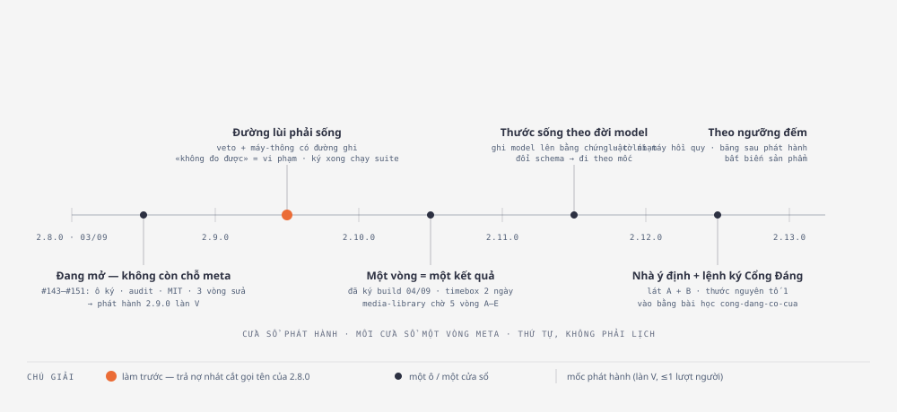

# Tổng hợp hai đợt đối chiếu playbook — hạt giống, ô, việc sửa ngay, và thứ tự

> **Trả lời câu owner 07/09:** *«Review lại các từ 2 đợt báo cáo, từ đó tổng
> hợp và đề xuất các hạt giống, mở ô…»*
>
> Hai đợt: **đợt 1** = 9 bài đối kháng + 4 lớp máy-tin-nhầm-chính-nó + 3 đính
> chính ([bản kỹ thuật](2026-09-07-doi-chieu-ai-native-sdlc-playbook.md) ·
> [bản dễ đọc](2026-09-07-bai-hoc-playbook-ban-de-doc.md)); **đợt 2** = toàn
> trình 6 bước + 11 chỗ đứt của chuỗi vật + 5 bài đầu vòng R1–R5
> ([toàn trình](2026-09-07-toan-trinh-playbook-vs-kit.md)). Bản này không thêm
> phát hiện mới — nó **gộp theo lớp**, đặt cạnh **hàng đợi đang có** của kit, và
> gán cho mỗi thứ **một số phận**.
>
> Hình tầng 2: `docs/plans/assets/2026-09-07-bai-hoc-playbook/06-hang-doi-theo-cua-so.html`
> (+ `.svg`). Mọi số dưới đây đếm lại trên `main 94299f6e` (sau #151) ngày
> 07/09; hai bản kỹ thuật/toàn trình vẫn neo `5c15e065` như colophon của chúng.
>
> **Owner gật thứ tự ở §3 ngày 07/09** («Gật thứ tự này, commit hết lên main»).

---

## 0. Hàng đợi kit đang có — phải đọc trước khi đề xuất thêm

| Loại | Số | Ghi chú |
|---|---|---|
| Ô cơ hội `discovery` (chờ Cổng Đáng) | **17 → 21** | bốn ô mới của PR này là bốn hạt giống ở §2 (luật «vào có ô» — ca VC8 đòi mỗi hạt giống một ô, không có thì CI đỏ). 5 liên quan trực tiếp tới hai đợt này: `lan-may-thong-duong-ghi` · `lan-v-thoat-kiem-stale` · `phep-kiem-sach-do-theo-vung` · `t1-tuyen-kem-can-cu` · `hinh-o-moi-cong-dung-cho-nguoi`. Ba ô mới 06/09 (#147–#148): `viec-ke-theo-plan` (hạt giống «việc kế theo plan» — kit **đọc** ý định phía plan của repo, không giữ; là ranh giới của H1 lát A) · `the-cong-2-giau-loi-trong-hop-dong` · `danh-sach-chep-ci-thieu-product-map` (hai ca thật từ kho crm) |
| Ô **đã ký build, chưa xây** | **1** | `vong-la-mot-ket-qua` (04/09, timebox ≤2 ngày, media-library chờ 5 vòng A–E) |
| Nhát cắt **gọi tên** của mốc 2.8.0 cho cửa sổ này | 1 | **Ngoài-4** «họ fail-open trong phép đo + hậu-chữ-ký» — chưa làm; cửa sổ này đã tiêu **ba vòng sửa**: #146 (`inputs-tinh-tu-goc-kho`) · #149 (`co-qua-timebox-nhom-da-xong`) · #151 (`thuoc-khai-mot-dang-do-mot-neo`, dừng ở trần 3 vòng, thu phạm vi) — vượt trần một-vòng-meta của luật (b) |
| Hạt giống owner đã gật mà **chưa ghi file** | 1 → **0** | «Bất biến sản phẩm» (gật 02/09) — **ghi hôm nay**: [2026-09-02-hat-giong-bat-bien-san-pham.md](../plans/2026-09-02-hat-giong-bat-bien-san-pham.md) |
| Park / kill | 2 / 1 | `khuon-rang-dung-chung` · `baseline-127` park (đo-thước-của-thước, ngưỡng mở lại 0) · `ban-do-dinh-chu-ky` kill |

Kết luận ép: **không đề xuất mở thêm ô nào mà chưa xếp được sau ba thứ đang
nợ** (Ngoài-4 · `vong-la-mot-ket-qua` · phát hành 2.9.0).

---

## 1. Kiểm kê hợp nhất — 24 phát hiện, một số phận mỗi dòng

Số phận: **SỬA NGAY** (T1 hoặc vào ô đã có, không vòng mới) · **Ô** (một vòng
meta) · **HẠT GIỐNG** (ghi file, chờ ngưỡng) · **SỔ** (ghi, không việc) · **GIỮ**
(kit đúng, đừng đổi) · **BÁC** (đã ghi `.out-of-scope/`).

| # | Phát hiện | Đợt | Số phận | Chỗ đã có trong kit | Nguyên tố · lượt |
|---|---|---|---|---|---|
| 1 | Cửa veto là con trỏ chết — thẻ mời «veto: lý do», không lệnh nào nhận | 1·A1 | **Ô «Đường lùi»** | audit 22/08 *Later* «veto không động từ»; răng đã có `pre-merge-check.sh:1226-1247` | 3 · 0 thêm |
| 2 | Ô kết «máy đã thông» có bộ đọc, **chưa có đường ghi** | 0 (ô có sẵn) | **Ô «Đường lùi»** — cùng họ «đường ghi của làn V» | ô `lan-may-thong-duong-ghi` (discovery) | 3 · 0 thêm |
| 3 | «Không soi lại được» = NOTE kể cả chế độ nghiêm | 1·A2 | **Ô «Đường lùi»** — thành viên mới của Ngoài-4 | `pre-merge-check.sh:1185-1188`; chiều đỏ đã đo | 2 · giữ |
| 4 | Làn máy thoát phép kiểm bằng-chứng-cũ ở chốt trước-merge | 0 (ô có sẵn) | **Ô «Đường lùi»** | ô `lan-v-thoat-kiem-stale` (discovery, 63 hồ sơ đo 27/08) | 2 · giữ |
| 5 | Lệnh ký không chạy suite sau khi ghi chữ ký → 1 CI đỏ/chữ ký | 0 (Ngoài-4) | **Ô «Đường lùi»** | Ngoài-4, sổ cái #29, `release-2-8-0/contract.md:111-117` | 2 · giảm |
| 6 | Một vòng = một kết quả người thấy; AC ở tầng kết quả; lint W8 | 0 (ô có sẵn) | **Ô** (đã ký build) | `vong-la-mot-ket-qua` — 4 chỗ cắm đã ghi | 1 · giảm lượt chấm |
| 7 | 78/78 bằng chứng không ghi model sinh ra nó | 1·B1 | **HẠT GIỐNG H2** | — | 2 · giữ |
| 8 | Ca đo nhạt theo đời model, không do ai nới | 1·B3 | **HẠT GIỐNG H2** | nửa: `non_discriminating` + băm baseline | 2 · giữ |
| 9 | 6 hình dạng lỗi đo-lường thiếu «thước bị nới sau khi đỏ» | 1·A4 | **HẠT GIỐNG H2** (hình dạng 7) | vật sẵn: `s4-args.mjs:330-336` + `acceptance-verify.js:943-947` | 2 · giữ |
| 10 | Luật lái máy đổi mỗi mốc, không thước nào chạm | 1·B2 | **HẠT GIỐNG H3** | `evals/` 3 ca (#120); ô plugin-eval đóng băng 30/08 | 2 · giảm ngoài-thiết-kế |
| 11 | Không hook cấm nới thước lúc chữa mã | 1·B4 | **HẠT GIỐNG H3** | khoản khai-sinh-phép-đo (lời), 1 hook duy nhất | 2 · giữ |
| 12 | Thứ tự ghi run-log trước report sống bằng lời dặn | 2·ĐỨT 11 | **HẠT GIỐNG H3** (mục 4) | `SKILL.md:227-228` nhắc 2 lần | 2 · giữ |
| 13 | Làn V ≠ «tác giả không tự duyệt» — lý do chưa viết | 1·B4 phụ | **SỬA NGAY** — ADR nháp, owner ký | ADR 0012 gần nhất; đợt 2 12/08 | 3 · giữ |
| 14 | Ý định sinh trong phiên có owner; Cổng Đáng không lệnh ký | 2·R1, ĐỨT 1 | **HẠT GIỐNG H1** lát A | ô `cong-dang-co-cua` (lỗ gốc, ghim `528caaa8`); hạt giống vào-có-ô | 1+3 · 0 thêm |
| 15 | Nguyên tố 1 chưa có thước — 3 số rút từ git | 2·R2 | **HẠT GIỐNG H1** lát B + **SỬA NGAY** đếm thử tay ở 2.9.0 | luật (c) 3 dòng số | 1 · giữ |
| 16 | Ngưỡng UAT đo một lần; làn V không tới Cổng Giá trị; Đường đo không tới cột 6 | 2·R5, ĐỨT 7·8 | **HẠT GIỐNG H1** lát C | audit 22/08 Core 1; `cong-gia-tri-treo-duong-do` | 1+3 · 0 thêm |
| 17 | Luật sản phẩm nạp lúc viết đặc tả; cờ có chủ luật; ghi phiên bản luật | 2·R3 | **HẠT GIỐNG đã gật** — ghi file hôm nay | memory 02/09 | 1+2 · giữ |
| 18 | Gate 1.5 chưa có ca-rỗng; «plan đã duyệt» không là vật máy đọc | 1·A3, ĐỨT 2·3 | **SỔ** → audit 22/08 *Later* | audit A6 | 3 · giảm 1 ở T3 |
| 19 | Số nuôi luật (c) không rút được («≥10», «chưa đếm») | 1·A5 | **SỔ** — đề nghị luật: thay bằng số lát B khi có n=1 | hồ sơ 2.7.0/2.8.0 | 2 · — |
| 20 | Bài học đắt nhất của S4 không quay lại vòng sau (claim-scan không quét review-findings) | 2·ĐỨT 10, 1·B5 | **SỔ** — ứng viên ô nhỏ, ngưỡng đã chạm (3 lớp tái phát r1→r2 ở `cong-dang-co-cua`) | `claim-scan.mjs:2-4,27-45`; sổ giới hạn 270 dòng | 2 · giảm vòng chấm |
| 21 | Design doc / figures / card-plain / usage-report — vật không bên máy nào đọc | 2·ĐỨT 4·5·6·9 | **SỔ** — dọn khi có ô chạm | — | — |
| 22 | Trạm thu phí T1 | 1·A6 | **GIỮ trong ô** `t1-tuyen-kem-can-cu` (điều kiện mở lại đã ghi 14/08) | ô discovery | 3 · giảm 1 ở T1 |
| 23 | Ranh giới «đã kiểm từng việc» lật bằng lời khai | 1·A7 | **SỔ** — giới hạn đã khai, ngưỡng 0/2 | `.out-of-scope/gap-probe-write-time-hook.md` | 2 · — |
| 24 | Câu chết GUIDE §7.1 «mỗi lần một lượt gọi người» · hiến pháp 5 trang | 1 phụ | **SỬA NGAY** (câu chết) · **SỔ** (5 trang — vật owner viết) | làn ghim-lại máy-một-mình từ 16/08 | — |

**Đã bác (7) và cố ý ngược (4):** ghi ở `.out-of-scope/doi-chieu-playbook-ai-native.md`
và mục D bản kỹ thuật — không lặp ở đây. **Kế hoạch (plan.md):** giữ nguyên
cách kit làm (sổ quyết định thay vì sửa plan cùng commit).

Ba đính chính của đợt 1 vẫn đứng (mẫu số veto 78/31, kho quét trọn, 4/9 bài không
neo playbook) — không phát sinh việc.

---

## 2. Bảy lớp — và số phận của từng lớp

| Lớp | Gồm (#) | Số phận | Vật đã ghi hôm nay |
|---|---|---|---|
| **I · Đường lùi phải sống** | 1 · 2 · 3 · 4 · 5 | **MỘT Ô** — kế thừa Ngoài-4 (nhát cắt gọi tên của 2.8.0), gom 2 ô discovery cùng họ | — (ô mở khi owner gọi tên) |
| **II · Hai đầu vòng không người** | 14 · 15 · 16 | **HẠT GIỐNG H1** — ba lát A/B/C | [hat-giong-y-dinh-co-nha-rieng](../plans/2026-09-07-hat-giong-y-dinh-co-nha-rieng.md) |
| **III · Thước sống theo đời model** | 7 · 8 · 9 | **HẠT GIỐNG H2** | [hat-giong-thuoc-song-theo-doi-model](../plans/2026-09-07-hat-giong-thuoc-song-theo-doi-model.md) |
| **IV · Luật lái máy được hồi quy** | 10 · 11 · 12 · 13 | **HẠT GIỐNG H3** (+ ADR nháp) | [hat-giong-luat-lai-may-duoc-hoi-quy](../plans/2026-09-07-hat-giong-luat-lai-may-duoc-hoi-quy.md) |
| **V · Bất biến sản phẩm** | 17 | **HẠT GIỐNG đã gật 02/09** — nợ ghi file, trả hôm nay | [hat-giong-bat-bien-san-pham](../plans/2026-09-02-hat-giong-bat-bien-san-pham.md) |
| **VI · Một vòng = một kết quả** | 6 | **Ô đã ký** — xếp lịch | `_acceptance/vong-la-mot-ket-qua/` |
| **VII · Sổ và dọn** | 18–24 | SỔ / SỬA NGAY T1 | mục 1 ở trên là sổ |

Vì sao **gộp I thành một ô** thay vì hai: năm mục cùng nằm trong hai file
(`commands/signoff.md` · `scripts/pre-merge-check.sh`) và cùng một câu hỏi —
*làn máy-đi-trước có đường lùi thật không?* — ở hai phía: **người** (veto ghi
được, máy-thông ghi được) và **máy** («không đo được» không được đọc như sạch,
làn V không thoát phép kiểm cũ, ký xong không đẻ CI đỏ). Cắt lát bên trong ô:
lát 1 = đường ghi (#1 · #2), lát 2 = fail-open ở chốt (#3 · #4 · #5). Dừng-vá áp
như mọi ô.

Vì sao **H1 là hạt giống, không phải ô ngay**: lát A phần «lệnh ký» đã nổ hai
vòng 01/09; lát C cần một phiên nghiệm thu thật ở repo tiêu thụ (kho kit 0/78).
Ngưỡng đếm cho lát A đã ghi (lần 1: `vong-la-mot-ket-qua` ký trong hội thoại).

---

## 3. Thứ tự đề nghị theo cửa sổ phát hành

*Cách đọc:* trục là **thứ tự cửa sổ**, không phải lịch; mỗi vạch là một mốc phát
hành (làn V, ≤1 lượt người); giữa hai vạch chỉ có **một** chấm — luật chiều rộng
(b). Chấm cam là việc đề nghị làm trước: nó trả nợ nhát cắt gọi tên của 2.8.0.
Nhóm «theo ngưỡng đếm» ở cuối không có chấm — chúng chỉ vào hàng khi ngưỡng
trong file hạt giống chạm.

| Cửa sổ | Việc | Căn cứ xếp |
|---|---|---|
| **Đang mở (2.8 → 2.9)** | **Phát hành 2.9.0 làn V** — gom #143–#151: ô ký `vong-la-mot-ket-qua` · audit 05/09 + ADR 0013 · MIT · ba vòng sửa (#146 · #149 · #151) · hai chip crm · hạt giống việc-kế-theo-plan · bộ tài liệu playbook 07/09. Nhát cắt gọi tên cho cửa sổ kế: **«Đường lùi phải sống»** | cửa sổ này đã tiêu **ba** vòng sửa — gom về mốc là cách duy nhất còn đúng luật (b); ba hồ sơ phát hành gần nhất đều ≤1 lượt người |
| **2.9 → 2.10** | **Ô «Đường lùi phải sống»** (lớp I) | trả nợ Ngoài-4; răng có sẵn ở cả 5 mục; 0 lượt gọi người thêm; là bảo hiểm cho mọi làn V phía sau |
| **2.10 → 2.11** | **`vong-la-mot-ket-qua`** (đã ký 04/09) | timebox 2 ngày; giá trị chạm repo tiêu thụ (media-library 5 vòng A–E); ba chỗ cắm là chữ, một là lint |
| **2.11 → 2.12** | **H2 Thước sống theo đời model** | đổi schema → đi theo mốc; một câu hỏi người: *cờ hay chặn* (mặc định cờ) |
| **2.12 → 2.13** | **H1 lát A + B** (nhà ý định · lệnh ký Cổng Đáng · 3 số nguyên tố 1) | vào bằng bài học `cong-dang-co-cua`; lát B đã có n=1 từ mốc 2.9.0 |
| **Theo ngưỡng** | H3 luật lái máy hồi quy (ngưỡng ≥2 lượt hạ tầng phiên/mốc — **đã chạm 2 mốc liên tiếp**, nhưng còn vế «harness thật vẫn đóng ở lần dò kế») · H1 lát C băng sau phát hành (sau ván UAT thật) · Bất biến sản phẩm (≥2 lần máy tự thêm bề mặt) | ghi trong từng file hạt giống |

Hai điều làm thứ tự này **đảo được rẻ**: (i) đảo «Đường lùi» ↔ `vong-la-mot-
ket-qua` không tốn gì ngoài răng của luật (c) — nhát cắt gọi tên trượt một mốc;
(ii) H3 nhảy lên đầu nếu mốc 2.9.0 lại có ≥2 lượt hạ tầng phiên.

---

## 4. Việc sửa ngay — không mở ô, không vòng

| # | Việc | Loại | Trạng thái |
|---|---|---|---|
| a | Ghi hạt giống Bất biến sản phẩm (nợ 02/09) | T1 docs | **xong 07/09** |
| b | Ghi 3 hạt giống H1 · H2 · H3 + bốn ô discovery `_acceptance/<slug>/opportunity.md` (luật VC8: hạt giống nào cũng có ô; trạng thái sống ở ô, hạt giống chỉ trỏ) | T1 docs + hồ sơ xưởng | **xong 07/09** |
| c | Gỡ câu chết GUIDE §7.1 «mỗi lần một lượt gọi người» → nói đúng làn ghim-lại máy-một-mình (16/08) | T1 docs | **xong 07/09** (một dòng) |
| d | Đếm thử 3 số lát B bằng tay ở hồ sơ phát hành 2.9.0 (n = 1) — chưa vào luật | nghi thức phát hành | chờ mốc 2.9.0 |
| e | ADR nháp «làn V và tách-nhiệm-vụ: đặt ở lưới ngoài phiên, không ở người» — owner ký | docs, quyết của người | chờ owner gọi |

Mọi thứ khác ở mục 1 hàng SỔ: không việc.

---

## 5. Điều đáng nhớ nhất sau hai đợt

1. **0/9 bài sống nguyên văn** — đọc tài liệu ngoài như danh mục đối chứng thì
   chỉ trích trúng vùng kit đã mạnh. Giá trị thật đến khi đọc nó như **chuỗi bàn
   giao**: hai đầu vòng của kit đòi người ngồi phiên.
2. **Kit mạnh hơn playbook ở giữa vòng** (chiều đỏ, phản biện sạch, sổ quyết
   định) — giữ; **yếu hơn ở hai đầu và ở thời gian** (đời model, luật lái máy
   không hồi quy).
3. **Hàng đợi kit đã đầy** (17 discovery + 1 build + 1 nhát cắt nợ, chưa kể
   bốn ô discovery mà chính PR này thêm cho bốn hạt giống). Đề xuất
   hôm nay **không thêm ô nào mới** trong cửa sổ này; nó xếp một ô kế thừa nợ,
   ghi bốn hạt giống có ngưỡng, và gộp hai ô discovery đang lẻ vào đúng họ.
