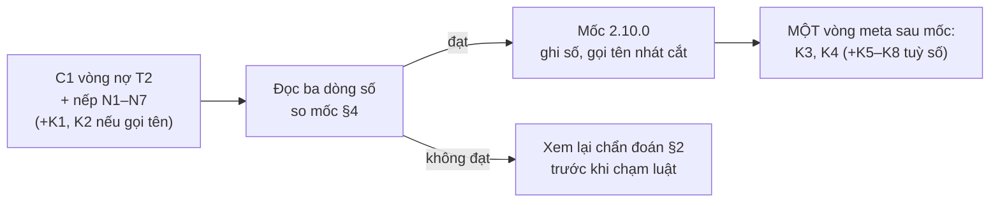

# Tổng hợp phát hiện và đề xuất sau vòng `lop-bang-chung-nhin-thay` — để kit đúng north star, rẻ giờ và token

Ngày 08/09/2026, bản 3 (tổng hợp). Nguồn số: hồ sơ tổng kết cùng ngày §1–§9 (đo từ bản
ghi phiên), quét toàn máy §8, số đo dòng danh tính (phụ lục A). Văn bản này là **đầu vào
gọi tên** cho mốc 2.10.0: meta-work mặc định đóng băng, chỉ mở khi owner gọi tên, giữa hai
mốc tối đa một vòng meta. Mọi đề xuất trace về một trong ba nguyên tố và nêu người hưởng.

## 1. Vòng này so với north star, bằng số

| Thước của kit | Vòng này | Trần / kỳ vọng | Mốc cùng hạng (kit T2) |
|---|---|---|---|
| Làm-xong → quyết-được | 8h43 (tổng vòng 11h47, 4,5h chờ hạn mức) | quyết trong buổi | chưa có mốc |
| Lượt gọi người / vòng | 15 (4 trong thiết kế, 11 ngoài) | 4 (T3) · 3 (T2) | chưa có mốc bằng máy |
| Vòng bị hạ tầng đốt | 5 | 0 | — |
| Token cả vòng | 578M, 93% cache-read, 571K ngữ cảnh/lượt | — | chưa có mốc theo hồ sơ |
| Token S4 (`usage-report`) | 100,3M / 3 round | 1 round | 43,8M / 3,06 round · 14,3M mỗi round |
| Round S4 | 3, rồi một lượt chỉ-TRỪ | trần 3 · lý tưởng 1 | 1 round chỉ 10/35 hồ sơ; T3 kit TB 5,5 |

## 2. Phát hiện — tám điểm, mỗi điểm một số đo

| # | Phát hiện | Bằng chứng | Ở repo tiêu thụ? |
|---|---|---|---|
| F1 | **Thước đo lệch mục đích**: so chữ với danh sách, cây với sha, thay vì lời hứa với hành vi | 6/6 eval `cmd` = cả suite, không phân biệt nhánh/base (≈2 giờ máy chạy lặp); AC viết như ca kiểm → 2/3 lượt vá chỉ sửa test, 4 lỗi hành vi thật ra Known limits; stale theo cây → 3 lần ghim lại, 51 phút, 0 thông tin; W6 127 dòng không ai xử; W8-token 140/15/4 dòng giả so nghĩa vụ 16/2/9 | có (W6/W8-token, ghim lại) |
| F2 | **Một phiên dài đắt hơn việc** | 327M cache-read ở phiên chính; 13 tiếng; ≥1/3 lượt gọi là thức dậy không sinh việc | có: cache-read 94–98% mọi repo, oneflow 22,5 tỉ |
| F3 | **Người bị gọi ngoài thiết kế** | 11/15 lượt: hạ tầng 2 · danh tính 2 · bàn giao hỏi menu 2 · người tự kiểm/giục 5 (máy không báo tiến độ khi chờ) | có (danh tính, xem F6) |
| F4 | **Hạ tầng đốt vòng** | hạn mức phiên 2 lần (4,5h đứng im); workflow sập `prov.enforcement_mode` null 2 lần | có: 110 lần hạn mức, 24 lần sập null trên máy |
| F5 | **Nhiều round là chuẩn; round 2–3 chỉ tìm lỗi ở phép đo tự viết** | round 2+3 = 120M token, ~4 giờ, 2 lượt gọi người; kit T2 TB 2,7–3,1 round, T3 5,5 | có: TB 2–3,3 ở 5/7 repo, media-library 4,9; finding «Hình dạng» ở mọi repo có làn rà soát |
| F6 | **Dòng «với danh tính … Enter xác nhận» là trạm thu phí** | 16/22 repo có `approvers` lệch `git user.name` → lượt chờ bắn ở mọi cổng; 8 lần hỏi trong bản ghi phiên: 5 suông, 2 sửa thành đúng giá trị đã có trong `approvers`; ≈99 hồ sơ ghi hai tên cho một người; không script nào cưỡng chế tên | có (16 repo) |
| F7 | **Ba dòng số của luật (c) chưa có máy đếm** | `sweep.mjs`/`tokproj.mjs` là bản nháp; `loop-health.sh` (kế hoạch 28/07, đã duyệt) chưa dựng | — |
| F8 | **Hồ sơ đã ký tự mâu thuẫn về vòng nợ** | một dòng: mở theo ngưỡng (hồ sơ tiêu thụ ship không frame); dòng ký sau: «trước mốc 2.10.0» → dòng ký thắng; vòng nợ là đo-thước-của-thước theo luật (a), mở vì chữ ký | — |

**Điều đã tăng tin cậy thật, đừng cắt:** gap-probe F1 (thẻ Cổng 2 đọc báo cáo, không đọc
bản khai), rà soát bắt câu «hook đã bắt screenshot» sai so với mã, mutant `&&`→`||`, hội
đồng bốn giọng ở round 3 (7,2M token Opus, 1 lượt) đảo đúng khuyến nghị sai «mở round 4».
Mẫu chung: đều là kiểm **lời khai đối chiếu thực tại**.

## 3. Đề xuất — một bảng, xếp theo ai quyết

**Nhóm N — nếp máy, làm ngay vòng kế, không chạm luật** (người hưởng: owner ở hoá đơn và
lượt gọi; máy ở ngữ cảnh gọn)

| # | Việc | Chữa | Cắt gì | Nguyên tố |
|---|---|---|---|---|
| N1 | **Chia phiên theo giai đoạn**: điều tra · S1→Cổng Phạm vi · S3 · điều phối S4 · Cổng Bằng chứng→S5; mỗi phiên khởi từ hồ sơ trên đĩa | F2 | phần lớn của 327M cache-read | 2 |
| N2 | Khi chờ tiến trình nền: **một** lượt chờ chặn kèm một dòng «đang chờ X, mốc Y»; không canh song song | F3 | 5 lượt tự kiểm/giục + lượt thức dậy | 3 |
| N3 | **AC viết theo hành vi công cụ**; chi tiết ca kiểm ở `expected` của eval | F1 | lỗi hành vi thật rơi vào «trong hợp đồng» → được vá | 1, 2 |
| N4 | **`cmd` của eval = ca của tính năng**; suite chỉ ở `suite_keys` | F1 | ~10 phút mỗi round; eval phân biệt được nhánh/base | 2 |
| N5 | **Tự-soi phép đo ở S3** theo sáu hình dạng đã có tên, trước khi khai `implemented` | F5 | round 2+3: ~120M, ~4h, 2 lượt | 2 |
| N6 | Xếp S4 nặng tránh mốc reset 13:30 · 22:00 · 08:30 | F4 | ~4,5h đứng im | 2 |
| N7 | Worktree riêng khi có phiên khác; kiểm nhánh trước commit; không ghép `grep -n` với `git commit` | F3 | ghim lại vì `main` bị đẩy; commit hụt | 2 |

**Nhóm K — kit, chờ owner gọi tên** (mỗi mục ghi CỘNG/TRỪ, hạng, bằng chứng ở repo tiêu thụ)

| # | Việc | Chữa | CỘNG/TRỪ · hạng | Bằng chứng tiêu thụ | Người hưởng |
|---|---|---|---|---|---|
| K1 | **Null-guard `acceptance-verify.js`**: agent chết → BLOCKED có tên | F4 | sửa răng · T2 (`feature-loop/workflows/`) | 24 lần sập | mọi repo chạy workflow |
| K2 | **Danh tính**: bỏ lượt chờ ở mọi ca (ghi thẳng, một dòng tên + nguồn, sửa bằng một câu; chỉ hỏi khi không còn nguồn nào) · bỏ CẢNH BÁO lệch `approvers` · tên người đã sửa ở cổng trước của cùng hồ sơ thắng git khi cùng tác giả commit · không chiến dịch sửa 16 config / 99 hồ sơ | F6, F3 | TRỪ · T2 (luật + 2 bản chép + 2 neo test ghim chuỗi «Enter xác nhận» → đổi thành cặp dương/âm) | 16 repo, 2 lượt/hồ sơ | người ký ở mọi repo |
| K3 | **W6 thu về Criteria** + tokenizer coi định danh gạch nối là một từ + `_Allow_` từ đa nghĩa; **bỏ nhánh token-lạ W8** (là AC đã ký → một dòng `revisit` trong sổ hồ sơ trước) | F1 | TRỪ · T2 nếu chỉ `scripts/` | kit 127, AP 36 / AP 140 | repo có `CONTEXT.md` hoặc surface theo domain |
| K4 | **Stale theo `paths:`** của eval thay vì cả `tests/` | F1 | TRỪ · **T3** (`lib/evidence-core.cjs` + `pre-merge-check.sh`) | kit 277 ghim lại, oneflow 112, map 46 | repo nhiều vòng song song |
| K5 | S5 mặc định PR, không menu | F3 | TRỪ · T2 | −1 lượt mỗi vòng | owner |
| K6 | **`loop-health`** từ `sweep.mjs` + `tokproj.mjs`: ba dòng số + mốc cùng hạng bằng máy mỗi mốc | F7 | **CỘNG** (mục 5 kế hoạch 28/07 đã duyệt) · T2 | ba dòng số đang đếm tay | owner đọc 1 phút mỗi mốc |
| K7 | **Triage xếp theo tác hại**: lỗi hành vi thật trong `paths` vào «vá», lỗi thước có thể vào Known limits; thẻ Cổng 2 đặt lỗi hành vi lên trên | F1 | **CỘNG** (luật nới 07/09) · T2 | **chỉ kit** — đo ở ≥2 repo tiêu thụ trước | người dùng cuối |
| K8 | Làn «conventions» chỉ chấm file chữ có đổi so round trước | F5 | TRỪ · T2 | **chỉ kit** (13/34 finding) | owner (round) |

**Nhóm C — nợ đã ký, không phải đề xuất mới**

| # | Việc | Ghi chú |
|---|---|---|
| C1 | Vòng T2 docs+tests cho 7 mục Known limits của `lop-bang-chung-nhin-thay` trước 2.10.0 | dòng ký thắng dòng ngưỡng (F8); đây là chỗ **đo** nếp N |
| C2 | Cài kit mới ở oneflow (ca gốc của W8) | để ngưỡng «2 hợp đồng ký không frame / mốc» bắt đầu có số |

## 4. Mốc để biết đã cắt được chưa — cùng hạng, không so với 578M

| Số | Mốc T2 của kit hôm nay | Mục tiêu vòng C1 với nếp N |
|---|---|---|
| Round S4 | TB 3,06 (usage) / 2,69 (Iterations); 1 round chỉ 10/35 | **1** |
| Token S4 (`usage-report`) | 43,8M / hồ sơ; 14,3M / round | **≤ 20M** |
| Lượt gọi người | trần thiết kế T2 = 3 | **≤ 3 trong, 0 ngoài** (danh tính 0 nếu K2 đã vào) |
| Vòng bị hạ tầng đốt | — | **0** |
| Token phiên chính | chưa có mốc | **lập mốc**: ghi tổng + cache-read từng phiên đã chia vào `usage-report` |

Nếu C1 với nếp N không đạt (round vẫn >1, còn lượt ngoài thiết kế) thì chẩn đoán ở §2 sai
ở đâu đó và phải xem lại trước khi chạm luật.

## 5. Thứ tự làm và điểm mở

1. **C1 chạy với nếp N1–N7.** Khuyến nghị gộp **K1 + K2** vào C1 (đều T2, docs+tests+một
   guard; K1 bảo vệ chính phép đo, K2 xoá 2 lượt ngoài thiết kế mỗi hồ sơ) — khi đó C1 là
   vòng meta duy nhất trước 2.10.0, đúng luật một-vòng.
2. **Đọc số** theo §4; ghi vào hồ sơ mốc cùng số của C2 ở oneflow (neo ngoài thật của nếp N).
3. **Sau 2.10.0, một vòng meta**: lõi K3 + K4 (K4 kéo cả gói lên T3); K5–K8 đi kèm nếu số ở
   bước 2 còn chỉ vào chúng.

Điểm mở, chỉ owner quyết: (a) K1 + K2 đi cùng C1 hay chờ vòng meta sau mốc — khuyến nghị
đi cùng; (b) K7/K8 đo ở oneflow + artifact-platform một mốc rồi mới mở, hay bỏ — khuyến
nghị đo; (c) `git config user.name` ↔ `approvers` để nguyên (K2 làm nó vô hại) — khuyến
nghị để nguyên.

## 6. Một câu

Kit trả giá không vì kiểm nhiều, mà vì kiểm chữ với danh sách và cây với sha thay vì lời
hứa với hành vi, hỏi người những câu máy đã có câu trả lời, và chạy trong một phiên dài.
Ba việc sửa bằng nếp trước, luật sau, và có mốc cùng hạng để biết đã xong.

---

## Phụ lục A — số đo dòng danh tính (08/09)

Luật hiện hành (`human-facing-language.md`, khối `IDENTITY-ECHO-RULE`, chép byte-đúng vào
`approve.md`/`signoff.md`, LM17 giữ): bậc `--as` → `git config user.name` → `signoff.approvers`
(một tên); hai nguồn khớp tuyệt đối → ghi thẳng (nhát cắt 01/09 mục 5); mọi ca khác → «Enter
xác nhận» và CHỜ; kèm CẢNH BÁO khi tên không có trong `approvers`. Vòng này: Cổng Phạm vi
owner sửa thành «Manh Phan»; Cổng Bằng chứng máy biết điều đó, vẫn đề xuất «Phan Le Manh»
và hỏi lại; kết quả một hồ sơ hai tên (`approved_by: Manh Phan`, chữ ký `Phan Le Manh`).

| Số | Giá trị |
|---|---|
| Repo có `config.yaml` | 22, tất cả `git config user.name` = «Phan Le Manh» |
| `approvers` khớp tuyệt đối | 6 (aes, artifact-platform-design, floorplanstudio, policy-graph-hub ×2, realestate) |
| Lệch → lượt chờ ở mọi cổng | 16 («Manh Phan» kit/crm · «Manh»/«memto» artifact-platform ×6 · «Manh» oneflow/horizon · «manh» map/media-library · «Mạnh Phan» floorplan · «manh-macmini» media-crawler) |
| Cách viết tên cùng một người trong hồ sơ đã ký | ≥12 («Manh» 1 850 dòng · «Manh Phan» 124 · «Phan Le Manh» 82 · «Mạnh» · «manh» · kèm email…) |
| Hồ sơ có tên Cổng 1 ≠ Cổng 2 (khử trùng theo repo) | ≈99 (artifact-platform 53/188 · map 14/14 · media-library 11/12 · kit 9/33 · oneflow 6/36 · PGH 4 · crm 1 · floorplanstudio 1) |
| Lần máy hỏi «Enter xác nhận» trong bản ghi phiên từ 18/08 | 8: 5 xác nhận suông · 2 sửa (cả hai thành «Manh Phan», giá trị đã có trong `approvers`) · 1 khác |
| Bộ đọc cưỡng chế tên | không có: pre-merge chỉ chặn giữ-chỗ; không script nào đọc `approvers` (gỡ từ 1.24.0) |

Phép thử luật 01/09 — *người trả lời khác khuyến nghị thì dựa vào điều gì máy không có?* —
với cách viết tên chính mình: không có gì → loại 2, một lối ra sống, trạm thu phí; và là cả
một lượt, không phải một chạm. Lý do khối luật nêu cho ca khớp («lượt chờ không thêm bảo đảm
nào») đúng y hệt cho ca lệch: hai cách viết khớp hay lệch không nói gì về ai đang gõ; xuất
xứ thật là tác giả commit ghi chữ ký. Rà hết chỗ hỏi trong lệnh cổng: chỉ chỗ này cùng hình
dạng «máy suy được mà vẫn chờ» (khuyến-nghị-trước cho câu người gõ mơ hồ là ca khác: đó là
quyết định người vừa gõ, đọc sai thì ghi sai hồ sơ ký).
