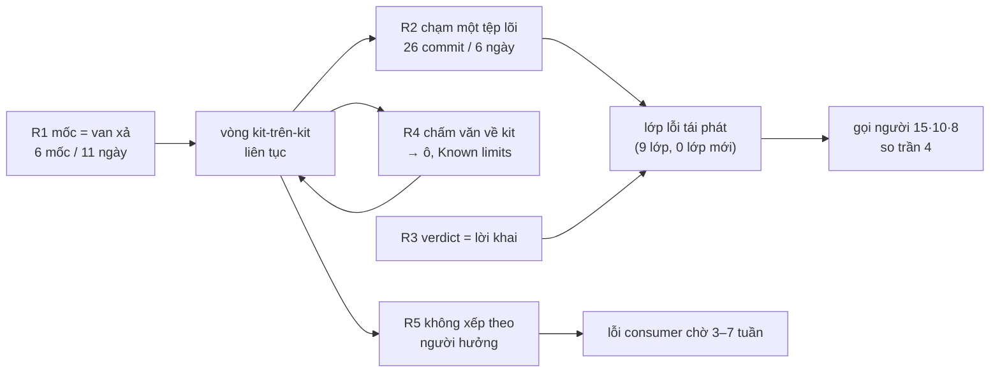

# Truy nguyên «kit vừa qua nhiều lỗi» — số đo, gốc rễ, và đề xuất từ north star

Ngày 12/09/2026. Owner nêu cảm quan: *kit vừa qua xuất hiện rất nhiều lỗi nhưng chưa rõ nguyên
nhân*. Văn bản này đo cảm quan đó bằng số (từ `git log`, `loop-health.mjs`, `start-scan.mjs`,
hồ sơ mốc, sổ tay phiên), truy về gốc rễ thay vì triệu chứng, rồi đối chiếu north star để đề xuất.
Mọi số dưới đây đều có lệnh sinh ra; không số nào ước lượng.

## 0. Một câu

Cảm quan đúng, nhưng «lỗi» không phải lỗi sản phẩm: **12 ngày qua kit chạy 100% vòng kit-trên-kit
với sáu mốc phát hành, và thứ hỏng liên tục là chính bộ đo và lời khai của kit** — vì luật đóng
băng meta lấy «mốc phát hành» làm đơn vị, nên nhịp mốc trở thành van xả; vì bộ đọc hồ sơ bị
nhân bản ba bốn chỗ nên một lớp lỗi vá ba lần vẫn tái phát; và vì mỗi lượt chấm đọc văn kit viết
về kit nên mỗi lượt lại sinh việc mới. Lỗi do kho tiêu thụ phát hiện thì xếp sau.

## 1. Cảm quan «nhiều lỗi», đo bằng số

| Số | Giá trị | Nguồn |
|---|---|---|
| Commit ở kit 01→12/09 | **412** (199 trong ba ngày 07→10/09) | `git log --since` |
| Mốc phát hành trong 11 ngày | **6** (2.6.0 01/09 · 2.7.0 03/09 · 2.8.0 04/09 · 2.9.0 07/09 · 2.10.0 10/09 · 2.11.0 11/09) | commit «Gate 2 signoff: release-*» |
| Lượt chấm S4 của kit từ 01/09 | 17: **8 REJECT · 3 BLOCKED** · 4 PASS · 2 PENDING — cả 11 lượt không-PASS nằm trong 08→11/09 | commit verify/chore(s4) |
| Commit `fix` | **69**, trong đó **31 (45%) không chạm một dòng mã kit nào** — chỉ sửa `_acceptance/`, `tests/`, `docs/` | `git show --name-only` |
| `lib/evidence-core.cjs` | **26 commit trong 6 ngày** (07→12/09) so với 5 commit cả tháng 8; 1 062 dòng | `git log -- lib/evidence-core.cjs` |
| `scripts/pre-merge-check.sh` | 18 commit trong 6 ngày; 1 491 dòng | như trên |
| Lượt gọi người / vòng kit | **15 · 10 · 8 · 5** (bốn vòng gần nhất) so trần 4; mốc phát hành trượt trần ≤1 **ba lần liên tiếp** | hồ sơ mốc 2.9→2.11 |
| Đỏ giả do tool-kill | 2/3 lượt (mốc 2.10.0) · **4/6 lượt** (mốc 2.11.0) | `run-log.jsonl` mốc |
| Làn ghim lại tích luỹ | **302** trên 63 hồ sơ (T2 166 · T3 136) | `loop-health.mjs` |
| Round S4 trung bình | T2 2,88 · T3 3,18 (theo `Iterations` 5,38) | `loop-health.mjs` |
| Known limits mỗi hồ sơ mốc | 7 · 7 · 12 · 10 · (2.10) · (2.11) — không giảm | evidence-report mốc |
| Tồn kho | **26 ô** đang cân nhắc (14 chưa có quyết định, 5 ô đã 21 ngày) · **13 hồ sơ** chờ Cổng Giá trị (phiên nghiệm thu HOÃN) · 3 chờ Cổng Đáng · 31 cửa veto mở | `start-scan.mjs` |
| Quyết định cổng có commit của owner, 12 ngày | kit **29** · crm 35 · oneflow 9 · aes 3 → **kit chiếm ≈38%** giờ ký của owner mà không có người dùng cuối nào hưởng | `git log` bốn kho |
| Rollout 2.11.0 tới 11–12/09 | 3/6 gộp; crm + PGH hoãn; oneflow + media-library còn nút; **không kho nào từng chạy 2.10.0** trước khi 2.11.0 ra | sổ tay rollout |

Cảm quan «nhiều lỗi» khớp với cụm 08→11/09: 11 lượt chấm không-PASS, 26 commit vào một tệp lõi,
ba mốc phát hành, hai lần đổi tài khoản giữa vòng. Trước 07/09 kit yên hơn nhiều (76 + 75
commit/3 ngày, 0 REJECT ghi được).

## 2. Lớp lỗi tái phát — cùng hình dạng, đổi da

| Lớp | Số lần / nơi | Đã vá cách nào | Vì sao tái phát |
|---|---|---|---|
| **Bóc nháy vô điều kiện** trong bộ giải cấu hình/eval | 3 mốc liên tiếp (2.9→2.11); oneflow tự vá 08/09 **trước** kit 10–11/09 | vá từng chỗ (r5 vòng gom), rồi đổi khuôn `parseFlowValue` chín đường ở 2.11.0 | cùng lớp sống ở nhiều bộ đọc kề nhau: `parseEvals` có **3 bản** (`lib/eval-yaml.cjs` · `scripts/eval-coverage-lint.js` · `feature-loop/scripts/carry-plan.mjs`), `frontmatter` có **3 bản** (`evidence-core` · `gate-card.js` · `evidence-page.js`) + `loop-health.mjs` tự dựng bản thứ tư (KL-1 mốc 2.10.0) |
| **Đỏ giả tool-kill** | 2.9.0 · 2.10.0 · 2.11.0 (4 lượt trong một hồ sơ) | lời dặn `TOOL-KILL-RULE` trong prompt; 2.11.0 bọc output một khoá suite | engine tin lời khai `exit_code` của agent; tín hiệu «bị cắt» chỉ agent thấy; không có lượt máy chạy lại trước khi verdict |
| **Lời khai trôi khỏi mã** (`evals.yaml`/contract nói một đằng, mã làm một nẻo) | 31/69 fix; r5 vòng gom «7 lỗi cùng LỚP thước bám VĂN» | kéo lời khai về mã, từng hồ sơ | lời khai là văn tay; máy so văn với văn; không có nguồn sinh |
| **CI đỏ hậu chữ ký** (LM20 routing-baseline) | 3 lần (2.9.0 ký hai lần · 2.10.0 · 2.11.0) | thêm dòng routing-baseline cùng commit chữ ký, nhớ bằng sổ tay | bẫy thủ tục, không có răng ở chỗ ký |
| **Ba dòng số là VĂN** | 3 mốc liên tiếp khai cùng Known limit | `loop-health.mjs` dựng 08/09, vẫn chưa đếm được «gọi người» | số sống trong bản ghi phiên, ngoài repo |
| **Danh sách chép CI không theo kịp** | 2 lần ghi sổ + 4/9 mục đổi ở 2.11.0; repin-lane **sập** trên lớp cũ (không đường đọc-cũ, trái CLAUDE.md) | chép tay mỗi rollout | lớp vendored không có răng ở kho tiêu thụ |
| **Lỗ C3 cửa veto NOTE sai** (audit 22/08) | media-library mất vá `_vapp` **hai lần**; 3 hồ sơ ký mang NOTE sai | vá tay ở kho tiêu thụ, bị ghi đè | kit chưa sửa sau 3 tuần; không hàng đợi theo người hưởng |
| **Thẻ Cổng 1 đọc 0 tiêu chí** (`### AC-n`) | 7 hồ sơ ap + 3 kit | chưa | regex bộ dò điểm mù không bao `###` |
| **Hoá cũ theo cả `tests/`** (K4) | oneflow fork `stale-scope` từ 28/07, **7 lần re-pin «GIỮ fork»** | rút khỏi vòng gom sau lượt 4 | kit ưu tiên vòng tự sinh |

Chín lớp, không lớp nào mới sau 22/08. Tất cả đã có tên trong sổ, finding hoặc Known limits.
Kit không thiếu chẩn đoán; kit thiếu thứ khác.

## 3. Truy nguyên — năm gốc rễ

### R1. Luật đóng băng meta lấy «mốc phát hành» làm đơn vị, nên nhịp mốc thành van xả

Luật (b) 30/08: *giữa hai release tối đa MỘT vòng meta*. Luật chặn số vòng theo số mốc — nhưng
số mốc không bị chặn. Kết quả: **6 mốc trong 11 ngày**, cửa sổ 2.6.0 ký 4 vòng, cửa sổ 2.10.0 ký
4 vòng, và **hai hồ sơ mốc liên tiếp mang bản vá mã** («vá trong mốc» 2.10.0 → tiền lệ → 2.11.0),
hoá T3, 6 lượt chấm, 8 lượt gọi người. Mỗi mốc kéo theo một chiến dịch ghim lại (302 làn tích
luỹ) và một đợt rollout 5 PR — chính rollout 11/09 chạy 5 agent song song làm map đỏ vì tải máy.
Mốc 2.10.0 chưa tới tay kho nào thì 2.11.0 đã ra: mốc không còn là neo ngoài, nó là nghi thức mở
cửa sổ meta kế.

### R2. Bộ đọc hồ sơ bị nhân bản; luật và bộ giải sống chung một tệp

`lib/evidence-core.cjs` vừa là bộ giải YAML tay, vừa là bộ đọc frontmatter, vừa là engine luật
(làn V, hoá cũ, expected_exit, L1 khối). Bốn vòng khác nhau chạm nó trong 6 ngày. Lớp bóc nháy vá
ở `resolveConfigKey` (r5 vòng gom) rồi tái phát ở `frontmatterField` **cách chưa tới trăm dòng**,
rồi ở `s4-args`, rồi `carry-plan` — vì mỗi vòng thêm một bộ đọc mới thay vì dùng một. Kit đã áp
bất biến «biến bất biến từ đầu-người sang vật-máy-giữ» cho HỒ SƠ, nhưng chưa áp cho MÃ CỦA
CHÍNH NÓ: không có ranh giới mô-đun nào nói «bộ giải chỉ có một».

### R3. Bằng chứng là lời khai, không phải tín hiệu cấu trúc

Ba biểu hiện cùng gốc: (a) verdict REJECT tin `exit_code` agent khai, nên tool-kill thành đỏ giả
4/6 lượt; (b) `evals.yaml` và contract là văn tay, máy so văn với mã nên 45% fix là sửa văn cho
khớp; (c) ba dòng số đếm tay. Nguyên tố 2 (bằng chứng không tự dối) được thi hành bằng **lời
dặn** (TOOL-KILL-RULE trong prompt, khuôn «đối chứng dương» trong CLAUDE.md), và CLAUDE.md
tự cấm điều đó: *«cấm dặn-bằng-lời làm nghiệm»*. Khi đỏ có thể giả, máy không dám quyết và đẩy
cho người: «lượt 5 hẹp», «lượt 6 hẹp nhất», hết trần → 4–11 lượt gọi người ngoài thiết kế mỗi vòng.

### R4. Vòng meta không có neo ngoài nên tự sinh việc: chấm văn kit viết về kit

Mỗi lượt chấm mốc sinh 5–14 phát hiện ngoài hợp đồng; gap-probe P0/P1 của các hồ sơ mốc gần
như toàn về **con số trong văn** («Ba dòng số» chép sai nguồn, cửa sổ đếm sai commit, `at` số
tròn). Phát hiện → ô/Known limits → vòng kế: 26 ô cân nhắc, Known limits 7→12 không giảm,
`docs/` 57 752 dòng so 17 000 dòng mã. Bằng chứng mạnh nhất: finding 08/09 đã chẩn ĐÚNG
(«kiểm chữ với danh sách, hỏi người điều máy biết, một phiên dài»), và cách thi hành nó là **một
vòng T3 gom 10 lượt gọi người, 6 lượt chấm**, rồi ba mốc kế vẫn lỗi cùng lớp. Chẩn đoán đúng,
thuốc là thêm vòng — tức thuốc là bệnh.

### R5. Không có hàng đợi theo người hưởng

Luật «nêu người hưởng» tồn tại nhưng không có gì XẾP việc theo nó. Lỗi do kho tiêu thụ phát hiện
chờ lâu nhất: C3 (22/08, 3 tuần, hại media-library hai lần), K4 (oneflow fork từ 28/07, 7 lần
giữ fork), bộ giải nháy (oneflow vá trước kit 2 ngày), Cổng 1 đọc 0 tiêu chí (7 hồ sơ ap). Trong
cùng 12 ngày kit ký 18 hồ sơ của chính nó. Thước đo north star («thời gian làm-xong→quyết-được,
số lần gọi người mỗi kết quả ship») đang đo trên **vòng kit**, không đo trên **vòng crm/oneflow**
— nên kit tối ưu thứ nó đo.

## 4. Đối chiếu north star, ba nguyên tố, phạm vi kit

- **Thước của kit** («làm-xong→quyết-được» · «gọi người mỗi kết quả ship»): kit đang đo trên
  chính mình và trượt cả hai — 924′ cho mốc 2.11.0, 8 lượt gọi người. Ở kho tiêu thụ không có
  số nào được đọc trong 12 ngày. Neo ngoài của việc-kit (bản phát hành tới kho tiêu thụ) bị
  tách khỏi vòng: rollout là «bước 2» sau ký, và bị hoãn.
- **Nguyên tố 1 (ý định chốt trước):** mốc «vá trong mốc» chốt phạm vi SAU khi lỗ nổ giữa vòng;
  hai lần đổi khuôn giữa lượt chấm.
- **Nguyên tố 2 (bằng chứng không tự dối):** đang thi hành bằng lời dặn ở đúng chỗ CLAUDE.md
  cấm. Đây là chỗ máy tin nhầm chính nó — lớp có tỉ lệ cao nhất, như hiến pháp đã nói.
- **Nguyên tố 3 (khoảnh khắc quyết thật):** «lượt 5 hẹp / lượt 6 hẹp nhất» là một lối ra sống
  → trạm thu phí; owner bị gọi để chọn phạm vi lượt chấm — việc máy có đủ căn cứ.
- **Phạm vi kit** («kit là engine, không chứa product context»): kit đang chứa **sản phẩm của
  chính nó** — 63 hồ sơ, 26 ô, 57K dòng docs — và cái đó không chép được sang kho thứ hai.
  Theo phép thử phạm vi của CLAUDE.md, phần lớn khối này không thuộc engine.
- **Luật CHIỀU RỘNG (a)–(c):** (a) «bộ đo được máy kiểm MỘT tầng» bị vượt (răng của răng: BG5/
  BG8 đột biến kiểm răng); (b) bị vượt bằng nhịp mốc; (c) ba dòng số ba mốc vẫn VĂN.

## 5. Đề xuất — chỉ TRỪ trước, mỗi mục có số để biết đã xong

| # | Việc | TRỪ/CỘNG | Trace | Người hưởng | Số «đã xong» |
|---|---|---|---|---|---|
| **Đ1** | **Mốc phát hành theo LỊCH, không theo vòng: 14 ngày một mốc** (hoặc sớm hơn chỉ khi kho tiêu thụ kéo). Hồ sơ mốc **T2 thuần cắt số → làn V**; mọi bản vá đi vòng riêng. Luật (b) đổi đơn vị: «giữa hai mốc» → «trong 14 ngày» | TRỪ | north star (giờ-kit là chi phí) · luật (b)/(c) | owner (số lần ký) · kho tiêu thụ (ít re-pin) | mốc kế ≤1 lượt gọi người; lượt ký kit / 14 ngày ≤ 3 |
| **Đ2** | **Cửa sổ kế chỉ chứa lỗi do kho tiêu thụ phát hiện**, có tên: C3 NOTE veto · K4 hoá cũ theo `paths` · Cổng 1 đọc `###` · repin-lane đường đọc-cũ · răng «đã nâng plugin chưa chép lớp CI». **Park cả 26 ô** bằng một dòng; mở lại chỉ khi có vết ở kho tiêu thụ | TRỪ | nguyên tố 3 + neo ngoài | crm · oneflow · ap · media-library | 5 lỗi đóng; 0 ô mới do kit tự sinh trong cửa sổ |
| **Đ3** | **Một bộ đọc**: gộp 3 `parseEvals` + 3 `frontmatter` + 9 đường nháy về một mô-đun đọc, tách khỏi engine luật, **đóng băng** (chỉ sửa khi có ca thật ở kho tiêu thụ). Lối rẻ: vendor một bộ giải YAML thật có tên + version (kit đã có `vendor/`), xoá bộ giải tay | TRỪ | nguyên tố 2 · «vật-máy-giữ» áp cho mã kit | máy (hết lớp bóc nháy) · consumer (lớp vendored ổn định) | số bản sao bộ đọc = 1; `evidence-core` ≤ 600 dòng |
| **Đ4** | **Đỏ phải qua một lượt MÁY chạy lại trước khi thành verdict**; output bị cắt/killed → BLOCKED có tên từ tín hiệu cấu trúc, không từ lời khai | CỘNG nhỏ, cắt lượt người | nguyên tố 2 | owner (không phải đọc đỏ giả) | đỏ giả / lượt = 0 trên hai mốc |
| **Đ5** | **Ba dòng số đo ở KHO TIÊU THỤ** (`loop-health.mjs --dev-root` đã có); vòng kit không tính vào điểm | TRỪ (bỏ đếm tay ở mốc) | north star (thước) | owner (đọc 1 phút) | mỗi mốc có số của crm + oneflow |
| **Đ6** | «Lượt hẹp / hẹp nhất» là **máy tự chọn và ghi sổ**; chỉ STOP-PATCHING và hết trần gọi người | TRỪ | luật lời mời 01/09 | owner | gọi người / vòng ≤ trần thiết kế |
| **Đ7** | **Ngưng viết tổng kết/rà soát kit-trên-kit**; phát hiện mới = một dòng sổ, không finding mới, không ô mới cho tới mốc kế | TRỪ | luật (a) một tầng | owner (giờ đọc) · máy (ngữ cảnh) | `docs/findings` +0 tệp trong cửa sổ |

Thứ tự: **Đ1 + Đ2 + Đ7 là quyết định luật, làm ngay, không cần vòng**. Đ3 là vòng kỹ thuật DUY
NHẤT của cửa sổ kế (T3, vì chạm `lib/`), gói cùng năm lỗi ở Đ2 vì cùng chạm bộ đọc. Đ4 và Đ6 là
đổi nếp trong feature-loop, T2, đi vòng thứ hai nếu Đ1 cho phép. Đ5 là chạy script đã có.

## 6. Ba điểm chỉ owner quyết

1. **Đ1 lối (a) tách vá khỏi mốc — ngược với khuyến nghị (b) của máy ở hồ sơ 2.11.0.** Lý do đổi:
   (b) hợp pháp hoá đúng cấu trúc đã đốt ba mốc; (a) trả mốc về làn V. Giá: vá tới tay kho tiêu
   thụ chậm hơn một nhịp — nhưng 2.10.0 chưa từng tới tay ai, nên giá đó hôm nay bằng 0.
2. **Park 26 ô một lần** — khó đảo về mặt tâm lý, dễ đảo về mặt kỹ thuật (một dòng `stage`).
3. **Đ3 vendor bộ giải YAML thật hay tự gộp** — vendor là TRỪ 9 đường tay nhưng thêm một phụ
   thuộc có tên; tự gộp giữ zero-dependency nhưng là vòng vá thứ tư cho cùng lớp.

Nếu owner không chọn gì: máy tiếp tục theo luật hiện hành, và tháng 9 lặp lại — số ở §1 nói vậy.
