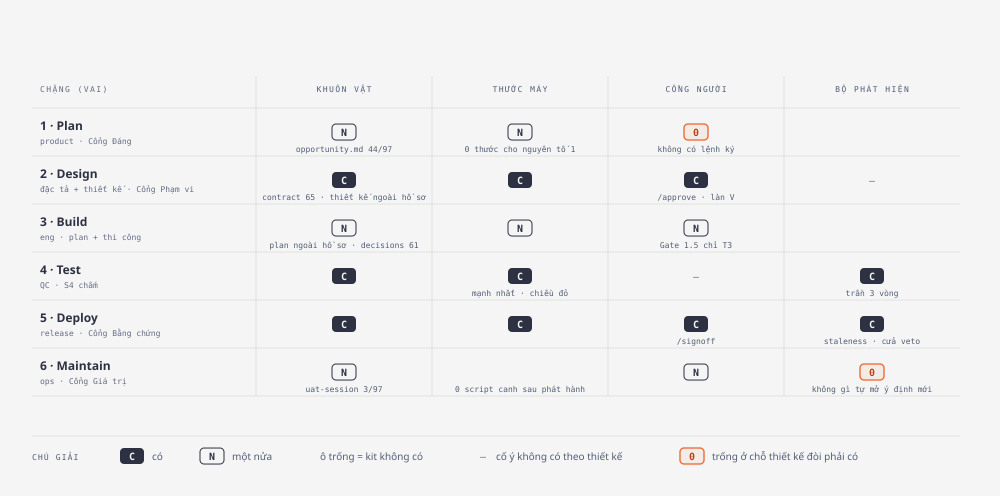
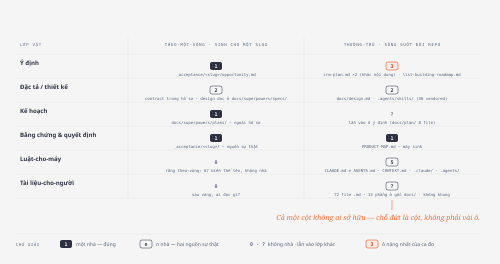

# Bản đồ vùng-làm-việc hai tầng — kit phủ tới đâu, một repo cần nhà nào, 13/09/2026

> Trả lời câu owner 13/09: *«xem lại các tài liệu đã research về mở rộng vùng
> làm việc của product, design, qc… từ tài liệu AI-native SDLC with Anthropic,
> đặc biệt là những mục liên quan về product roadmap»* — rồi *«brainstorm về
> bản đồ vùng-làm-việc, và cấu trúc tổ chức file/folder (intent, design…) hiệu
> quả nhất cho một repo, nhất quán theo guideline Anthropic»*.
>
> Bản đồ dựng bằng quét hình thái (skill `morphological-scan`), hai tầng tách
> bạch theo quyết owner cùng ngày: **ENGINE** (kit phủ tới đâu) và **REPO** (một
> repo sản phẩm cần những vùng nào, vật nào sống ở đâu). Số đo lấy trên chính
> kho kit (97 hồ sơ) và **5 repo tiêu thụ** cùng một thước (khảo sát ở §4).
>
> Nguồn: [playbook đã lưu](../research/2026-09-07-ai-native-sdlc-playbook.md) ·
> [đối chiếu 07/09](2026-09-07-doi-chieu-ai-native-sdlc-playbook.md) ·
> [toàn trình playbook vs kit](2026-09-07-toan-trinh-playbook-vs-kit.md) ·
> [hạt giống «Ý định có nhà riêng»](../plans/2026-09-07-hat-giong-y-dinh-co-nha-rieng.md) ·
> [hạt giống «Việc kế theo plan»](../plans/2026-09-06-hat-giong-viec-ke-theo-plan.md).
> Hình tầng 2 ở `docs/plans/assets/2026-09-13-ban-do-vung-lam-viec/01-*, 02-*`.
> Thiết kế rút từ bản đồ này:
> [spec «Nhà tài liệu khai một chỗ»](../superpowers/specs/2026-09-13-nha-tai-lieu-router-design.md).

---

## 0. Một đoạn

Kit **đặc ở giữa vòng và mỏng ở hai đầu**: chặng Kiểm (QC) là cột mạnh nhất,
không cần mở rộng; chặng Thiết kế đủ thước nhưng vật thiết kế bị đẩy ra ngoài
hồ sơ; chặng Ý định (product) thiếu *cổng người có lệnh*; chặng Vận hành thiếu
*cả thước lẫn bộ phát hiện*. Nhưng phát hiện đáng giá hơn nằm ở tầng REPO: mỗi
lớp vật tồn tại ở **hai vòng đời** — *theo-một-vòng* (sinh cho một slug) và
*thường-trú* (sống suốt đời repo) — và kit chỉ lo nhà cho vòng đời thứ nhất.
Vòng đời thứ hai **không ai sở hữu**, nên 5 repo tiêu thụ ra 5 hình dạng khác
nhau, và một repo có hai `crm-plan.md` khác nội dung ở hai chỗ. «Mở rộng vùng
làm việc» vì thế **không phải thêm chặng** — mà là **lợp mái cho tầng thường-trú**,
bằng đúng cơ chế một repo đã tự dựng: một file router khai «mỗi vật một nhà»,
máy kiểm lời khai.

---

## 1. Cách dựng — trục, trục bị loại, thước

**Chân sản phẩm:** kit (`CLAUDE.md`, `CONTEXT.md`, `PRODUCT-MAP.md`,
`_acceptance/` 97 hồ sơ) + 5 repo tiêu thụ trên đĩa. **Chân ngành:** playbook
Anthropic (bản lưu có số dòng) · quy ước Claude Code (`CLAUDE.md` gốc,
`.claude/skills/<name>/SKILL.md`, `.claude/agents/`) · adr-tools (`docs/adr/`)
· Diátaxis cho khung `docs/`. **Điểm mù khai thẳng:** Anthropic **không** có
chuẩn nào cho cây `docs/` ngoài `CLAUDE.md` + `.claude/` — «nhất quán theo
guideline Anthropic» chỉ ràng được tầng luật-cho-máy; phần còn lại neo Diátaxis
hoặc tự tuyên, không giả vờ là guideline Anthropic.

| Tầng | Trục | Độc lập vì |
|---|---|---|
| ENGINE | 6 chặng (Plan · Design · Build · Test · Deploy · Maintain) × 4 loại bộ phận (khuôn vật · thước máy · cổng người · bộ phát hiện) | đổi chặng không ép đổi loại bộ phận |
| REPO | 6 lớp vật (ý định · đặc tả/thiết kế · kế hoạch · bằng chứng & quyết định · luật-cho-máy · tài liệu-cho-người) × 2 vòng đời (theo-một-vòng · thường-trú) | một lớp vật có thể có bản theo-vòng *và* bản thường-trú cùng lúc — đó chính là phát hiện của lượt quét |

**Trục bị loại: «vai» (product/design/eng/QC/release/ops).** Playbook mở đầu
bằng đúng câu *mỗi chặng truyền thống do một vai sở hữu* — vai là **nhãn trên
trục chặng**, không phải chiều độc lập. Giữ nó thành trục sinh bảng toàn ô vô
nghĩa. **Trục «nguồn sự thật»** (repo · hệ ngoài · linkage) là lớp cross-cutting
áp lên mọi ô, không phải trục thứ ba.

Thước CE: đếm file theo tên trong `_acceptance/*/` (97 hồ sơ) · `ls` `commands/
scripts/ lib/ hooks/` · khảo sát 5 repo bằng một script duy nhất (§4).

---

## 2. Tầng ENGINE — kit phủ tới đâu

Hình cùng khung sáu chặng: `docs/plans/assets/2026-09-13-ban-do-vung-lam-viec/04-kit-vs-playbook.svg`
(kit hôm nay đặt cạnh playbook) · `06-kit-moi-vs-playbook.svg` (thêm lane kit +
router). Hình là chiếu của mục này, không phải nguồn.

*Cách đọc:* cột là loại bộ phận, hàng là chặng; ô tô đậm là chỗ kit đặc, ô trống
là chỗ kit mỏng. Hai hàng đầu-cuối (Plan · Maintain) là chỗ có nhiều ô trống nhất.

| Chặng (vai) | Khuôn vật | Thước máy | Cổng người | Bộ phát hiện |
|---|---|---|---|---|
| **1 Plan** (product) | ⚠ `opportunity.md` 44/97 — không có khuôn nháp cho người ngoài phiên | ⚠ `lib/nguong-o-co-hoi.cjs`, `start-scan` đọc `stage`; **0 thước đo chất lượng ý định** | ✗ **Cổng Đáng không có lệnh** — `commands/approve.md` không chứa «Cổng Đáng»/`opportunity`/`decision`; 2 commit chạm nó từ 07/09 (`b3dbe723`, `5295c2d4`) mà vẫn 0 chữ | ✗ trống |
| **2 Design** (đặc tả + thiết kế gộp một phiên, theo playbook) | ✅ `contract.md` 65 · `evals.yaml` 65 · `gap-probe.md` 64 — ⚠ **thiết kế không có nhà trong hồ sơ**: 1 `design-draft.md` lạc; 67 file ở `docs/superpowers/specs/` | ✅ `eval-coverage-lint`, `lib/ac-line`, gap-probe fail-closed (ADR 0004), `design-gate` + `design-scan` | ✅ `/approve` + làn V | — |
| **3 Build** (eng) | ⚠ `plan.md` sống ngoài hồ sơ (`docs/superpowers/plans/`) · ✅ `decisions.jsonl` 61 | ⚠ hook `acceptance-evidence-gate`; 0 thước đọc plan (cố ý — P150) | ⚠ Gate 1.5 chỉ T3, chưa có ca-rỗng | ✗ |
| **4 Test** (QC) | ✅ `evidence-report.md` 65 · `run-log.jsonl` 65 · `review-findings.md` 59 | ✅✅ mạnh nhất: `evidence-core`, `recheck-evidence`, chiều đỏ, MEASURE-BIRTH-CLAUSE, 4 executor · ⚠ **răng theo-vòng không có tên chuẩn**: 14 `rang.sh` + ~50 tên tự phát (`chan-*.mjs`, `rang-veto.sh`, `neo-thu.mjs`…) | ✗ không — máy chấm, **đúng thiết kế** | ✅ trần 3 vòng, STOP-PATCHING |
| **5 Deploy** (release) | ✅ `human_signoff` frontmatter · `card-plain.json` 22 · hồ sơ phát hành | ✅ `pre-merge-check`, `repin-lane`, `product-map --check`, `mirror-sync-grandfather` | ✅ `/signoff` | ✅ staleness theo diff + cửa veto |
| **6 Maintain** (ops) | ⚠ `uat-session.md` **3/97** · `stranger-drive.md` 0 · không có `bands.yaml` | ✗ **0 script tất định canh sau phát hành** | ⚠ có skill, owner ký — 3 hồ sơ | ✗ **trống** |

**Ba câu trả lời trực tiếp cho «product, design, QC»:**

- **QC (chặng 4)** là cột kit mạnh nhất. Luật «màu xanh phải từng chạy chiều
  đỏ» không có đối ứng trong playbook (đối chiếu 07/09 §C). Không cần mở rộng.
- **Design (chặng 2)** đủ thước; điều thiếu là *vật* thiết kế nằm ngoài hồ sơ —
  và đó là **do chính engine quy định** ([feature-loop SKILL.md:117](../../feature-loop/skills/feature-loop/SKILL.md:117)
  *«Design doc → `docs/superpowers/specs/…` (hoặc convention spec của repo)»*),
  không phải repo tự bày. Nghi thức thiết kế không đồng bộ (ADR 0009) là lựa
  chọn có chủ ý đi ngược playbook, đã khai giá — đừng mở lại như ý mới.
- **Product (chặng 1)** là chỗ trống thật: cổng không có lệnh, ý định chỉ sinh
  trong phiên có owner, không thước nào đo nguyên tố 1. Đã có hạt giống
  (07/09) và ô `y-dinh-co-nha-rieng` chờ ngưỡng đếm.

---

## 3. Tầng REPO — và trục «vòng đời», chỗ bất ngờ của lượt quét

*Cách đọc:* cột trái là vật theo-một-vòng — nhà rõ, kit sở hữu. Cột phải là vật
thường-trú — ô nào cũng nhiều nhà hoặc không nhà. Chỗ đứt là **cả một cột**,
không phải vài ô.

Ca đo: `crm-onehub` (12/09, 38 hồ sơ cổng, 72 file `.md` trong `docs/`).

| Lớp vật | Theo-một-vòng (sinh cho 1 slug, đóng khi vòng xong) | Thường-trú (sống suốt đời repo) |
|---|---|---|
| **Ý định** | `_acceptance/<slug>/opportunity.md` ✅ nhà rõ | ✗ **ba nhà**: `docs/crm-plan.md` (1368 dòng) · `docs/plan/crm-plan.md` (555 dòng, **cùng tên, khác nội dung**) · `docs/list-building-roadmap.md` |
| **Đặc tả / thiết kế** | ⚠ **hai nhà cho cùng một vòng**: `contract.md` trong hồ sơ + `docs/superpowers/specs/<ngày>-<slug>-design.md` | ⚠ `docs/design.md` + 36 skill vendored ở `.agents/skills/` |
| **Kế hoạch** | ⚠ `docs/superpowers/plans/` 21 file — ngoài hồ sơ | ⚠ lẫn vào ô ý định thường-trú (`docs/plan/` 8 file) |
| **Bằng chứng & quyết định** | ✅ `_acceptance/<slug>/` — nguồn sự thật, rõ nhất toàn cây | ✅ `PRODUCT-MAP.md` (ảnh chiếu, máy sinh) |
| **Luật-cho-máy** | ✗ răng theo-vòng: `rang*.sh`/`chan-*.mjs` trong slug, 67 biến thể tên (đo ở kit) | ✗ **năm nhà**: `CLAUDE.md` 122 dòng + `AGENTS.md` 206 dòng (**khác nhau**, không symlink; CLAUDE trỏ AGENTS 4 lần, chiều ngược 0) + `CONTEXT.md` + `.claude/` + `.agents/skills/` |
| **Tài liệu-cho-người** | ✗ không có — sau vòng, ai đọc gì? | ⚠ 72 file `.md`, **13 file phẳng ngay gốc `docs/`**, không khung |

**Kết luận của lượt quét:** chỗ đứt **không** ở vật theo-một-vòng (kit lo kỹ:
7 vật, nhà rõ, nguồn sự thật tuyên minh bạch). Chỗ đứt ở **cột thường-trú** —
thứ kit không sở hữu, và cũng không ai khác sở hữu. Hai `crm-plan.md` khác nội
dung không phải do cẩu thả; nó là hệ quả tất yếu của một lớp vật có hai vòng đời
mà chỉ một vòng đời có nhà.

---

## 4. Khảo sát 5 repo tiêu thụ — cùng một thước

Script khảo sát đo cùng 7 mục trên mỗi repo: file chỉ dẫn ở gốc · nhà skill ·
hình dạng `docs/` · ứng viên ý định thường-trú · ứng viên thiết kế thường-trú ·
trùng basename · trạng thái `_acceptance/`. Loại `node_modules`, `.git`,
`.claude/worktrees`, `.agents/` (vendored), `template/` khỏi phép đếm trùng.

| | artifact-platform | media-library | crm-onehub | floorplanstudio | mapposter |
|---|---|---|---|---|---|
| Commit cuối · hồ sơ cổng | 15/08 · **186** | 05/09 · 26 | 12/09 · 38 | 27/08 · 7 | 26/08 · 17 |
| **Luật-cho-máy** ở gốc | `CLAUDE.md` 44 dòng/10.5K **+ `AGENTS.md`** 50 dòng/11.2K, khác nhau, cùng tuyên «ưu tiên cao nhất» | `CLAUDE.md` 139 dòng + `CONTEXT.md` 12.4K | `CLAUDE.md` 122 **+ `AGENTS.md`** 206, khác nhau + `CONTEXT.md` | `CLAUDE.md` 75 + `CONTEXT.md` | **không có** — `README.md` 50K là tech README, không phải luật |
| Skill riêng | `.claude/skills` 7 **+ `skills-retired/RETIRED.md`** (sổ khai tử, căn cứ audit 84 transcript) | 0 | `.agents/skills` 36 (phần lớn tên bên thứ ba) | `.claude` gốc **+ `engines/digitize/.claude`** lồng trong engine con | 0 |
| **Ý định thường-trú** | `docs/spec/OneHub-Roadmap.md` **LOCKED v1, «sửa qua PR có review»** + `Product-Intent-and-Goals.md` + 3 bản trong `proposals/` | `docs/seed/` 8 file hạt giống có số liệu — **không file luật nào trỏ tới** | **3 nhà** (bảng §3) | 0 | 0 |
| **Thiết kế thường-trú** | `docs/reference/DESIGN-SYSTEM.md` · `DESIGN-WORKFLOW.md` · `PLUGIN-UX-GRAMMAR.md` + `docs/spec/design/` + `ux-architecture/` | `docs/reference/design-system.md` ✅ một nhà | `docs/design.md` | chỉ `style-guide.md` trong skill engine con | 0 |
| Glossary | `docs/spec/GLOSSARY.md` | `CONTEXT.md` | `CONTEXT.md` | `CONTEXT.md` | 0 |
| `docs/` | **471 md** · `spec/` 77 · `superpowers/` 332 · `proposals/` 22 · `reference/` 11 · `archive/` 12 · **`MAP.md` = router 100 dòng** · `STATUS.md` 195 dòng (tự tuyên «≤1 trang») | 52 md · `seed/` `plans/`(1) `runbooks/` `reference/` `archive/` `superpowers/` 33 | 72 md · 13 phẳng ở gốc · `plan/` 8 · `superpowers/` 47 · `adrs/` ở gốc repo (3) | 38 md · **soi gương kit**: `findings/` `handoff/` `archive/` `research/` · `superpowers/` 15 | 16 md · `research/` 4 · `superpowers/` 12 |
| Vật chặng 6 | — | — | — | — | **11 file rơi ở gốc `_acceptance/`** (3 ván lái-thử + rà soát nguyên lý) |
| `.out-of-scope/` | không | không | không | không | không |

**Năm repo, năm hình dạng tầng thường-trú.** Không hai repo nào giống nhau, kể
cả hai repo cùng owner viết cùng tháng. Đó là số đo trực tiếp của «không ai sở
hữu tầng này».

### 4.1 Đính chính so với bản phác trong phiên

1. *«artifact-platform có 15 file design/plan nằm trong hồ sơ»* — **sai**: 15
   thư mục `design/` chỉ chứa `provenance.json` 281 byte của design-pass. Không
   repo nào đặt thiết kế trong hồ sơ; 93/186 slug của artifact-platform có spec
   ở `docs/superpowers/specs/`.
2. Hai nhà đặc tả/kế hoạch của một vòng là **do engine quy định** (SKILL.md:117,
   :164), kèm chữ «hoặc convention spec của repo» không ai kiểm. Lựa chọn «kit
   chỉ đọc, không tuyên» vì thế không tồn tại cho tầng theo-vòng — kit đang
   tuyên rồi, chỉ tuyên hai nhà.
3. Trong chính kho kit, `docs/specs` (12) vs `docs/superpowers/specs` (67) là
   **hai bệnh**: 12 file kia toàn design doc có ngày ≤ 04/08 — quy ước đổi, file
   cũ không dời (*trôi quy ước*). Còn `docs/plans` (44) = 27 hạt giống thường-trú
   **trộn** 16 plan-theo-vòng cũ (*trộn vòng đời*). Cùng triệu chứng, hai nguyên
   nhân — sửa một cách thì sót cách kia.

### 4.2 Bốn mẫu đã tự mọc — không ai bảo

Thiết kế nên đi từ thứ đã sống, không từ giấy:

- **`docs/MAP.md` (artifact-platform):** *«Điểm vào DUY NHẤT. MAP chỉ định
  tuyến — không chứa nội dung gốc. Mỗi sự thật sống ở đúng một nơi; nơi khác chỉ
  link.»* Có bảng «cần gì → đọc đâu», **5 tầng theo nhịp thay đổi + luật phân
  xử «tầng trên thắng»**, và bản đồ thư mục. Đây chính là luật sidebar «Legacy
  systems and the source of truth» của playbook (dòng 307–320), đã được một repo
  viết ra và dùng trước khi kit biết tới playbook. Thiếu đúng một thứ: **máy
  không đọc được nó** — nên nó trỏ tới `STATUS.md` tự tuyên «≤1 trang» đang 195
  dòng, và không gì bắt được.
- **`docs/spec/OneHub-Roadmap.md` LOCKED v1** — ý định thường-trú có trạng thái
  khoá, đổi qua PR có review: mô hình «chủ sản phẩm duyệt bằng merge» của
  playbook, đã sống.
- **`docs/seed/` (media-library)** — hạt giống nấc 1 có số liệu, cùng loại với
  27 `hat-giong` của kit nhưng tên khác, nhà khác, không luật nào biết.
- **`.claude/skills-retired/RETIRED.md`** — sổ khai tử luật-cho-máy kèm căn cứ
  audit: phần «bác kèm lý do» của tầng thường-trú, đã có hình.

**Lỗ có chủ:** 11 file lái-thử ở mapposter rơi vào gốc `_acceptance/` — engine
có khuôn `_acceptance/<slug>/stranger-drive.md` ([uat-session SKILL.md:35](../../skills/uat-session/SKILL.md:35))
nhưng phiên lái-thử **cắt ngang nhiều slug**, không thuộc slug nào, nên không có
nhà. Bằng chứng đầu tiên rằng «mọi vật theo-vòng đều thuộc một slug» có ca ngoại
lệ thật.

---

## 5. Riêng về «product roadmap» — ba điều, và từ vựng

1. **Playbook không có tài liệu roadmap nào.** Ưu tiên sống ở **quyết định tại
   cửa vào** của từng ý định (làm ngay · xếp lịch · bác) + luật **bác kèm lý
   do**. Ở đúng chỗ này kit đã có nhiều hơn playbook: `/start`, `PRODUCT-MAP.md`,
   `.out-of-scope/` với «Prior requests», `decision: park/kill` (R4, 07/09).
2. **Nhưng cửa ấy chưa nuôi lại thứ gì.** Trong playbook, mỗi lần bác là một
   lần chỉnh băng phát hiện. Kit bác kèm lý do đủ, nhưng không nuôi bộ phát hiện
   nào — vì chưa có bộ phát hiện (lát C của hạt giống 07/09; hàng «bộ phát hiện»
   chặng 6 ở §2).
3. **Hạt giống 06/09** sinh từ chính câu owner 05/09 *«roadmap dài hơi nhiều
   phiên, làm sao mỗi phiên giữ bối cảnh và kiểm tiến độ; product-map có giải
   quyết không?»* — trả lời: **không**, bản đồ là ảnh chiếu của sự thật, không
   biết ý định. Nó dựng mô hình bốn lớp (plan = ý định/là cược · hồ sơ = sự thật
   · bản đồ = ảnh chiếu · tiến độ = hiệu số, không phải tài liệu) và ổ cắm
   **chỉ-đọc** in ba dòng trên thẻ start. Số đo của lỗ: phiên 05/09 mất **bốn
   lượt đọc file** mới tìm ra hàng kế; kho kit có 27 file hạt giống không thẻ
   nào đếm.

**Từ vựng:** [`CONTEXT.md`](../../CONTEXT.md) ghi *Product map — _Avoid_:
roadmap, dashboard*. Bản đồ này gọi thứ mà 5 repo đang đặt tên `roadmap` là
**ý định thường-trú**; «bản đồ sản phẩm» vẫn là ảnh chiếu máy sinh từ hồ sơ.
Hai thứ đứng cạnh nhau, không thay nhau.

---

## 6. Điểm mù tài liệu tự khai (07/09 §G) — vẫn chưa trả lời

*Mọi vòng của kit đều bắt đầu bằng owner đã ngồi sẵn trong phiên.* Nếu đó là lý
do vật lý khiến «lượt gọi người» không bao giờ về 0, thì mục tiêu ≤3 đang đo một
thứ và chặn một thứ khác. Bản đồ này **không** trả lời câu đó — nó chỉ chỉ ra ô
tương ứng (chặng 1, cột «cổng người» và «bộ phát hiện» đều trống). Câu hỏi giữ
nguyên ở sổ; owner chọn không mở nó trong lượt 13/09.

---

## 7. Cắt

**Core (5 ô, ≤20%):**

1. **Luật-cho-máy thường-trú về một nguồn** — `CLAUDE.md` gốc + `.claude/skills/`;
   `AGENTS.md` là con trỏ, không phải bản thứ hai. Mọi phiên đọc nó đầu tiên;
   sai ở đây là sai ở mọi vòng. `[NGÀNH: playbook 337–340]`
2. **Ý định thường-trú gọi tên một nhà** — các bản còn lại thành link. Đang có
   3 nhà và 2 file cùng tên khác nội dung.
3. **Vật theo-vòng của cùng một vòng có nhà tường minh và kiểm được** — hôm nay
   một vòng rải vật ở 2–3 cây theo lời tuyên hai nhà của engine.
4. **(engine) Cổng Đáng có lệnh ký** — ô duy nhất ở cột «cổng người» thiết kế
   đòi phải có mà trống (ô `y-dinh-co-nha-rieng` đang đếm ngưỡng).
5. **(engine) Bộ phát hiện chặng 6** — ô trống lớn nhất, cũng là lý do cửa bác
   không nuôi lại được gì (lát C, chờ phiên nghiệm thu thật đầu tiên).

**Later:** răng theo-vòng có tên + nhà chuẩn (67 biến thể) · `docs/` theo khung
Diátaxis · ADR một nhà (`adrs/` gốc ở crm vs `docs/adr/` ở kit) · kit tự dọn
`docs/specs` và `docs/plans` (§4.1 mục 3) · nhà cho vật lái-thử cắt ngang slug.

**Never:** kit **sở hữu** layout của repo tiêu thụ (vi phạm thẳng «kit là
engine — không chứa product context») · dựng kho ý định thứ hai ngoài
`_acceptance/` (hạt giống 07/09 đã khai ranh giới) · bắt 5 repo migrate hàng loạt
(luật đường đọc-cũ) · mở lại nghi thức thiết kế đồng bộ (ADR 0009).

**Cross-cutting mọi ô Core:** một vật ↔ một nguồn sự thật (ba cấu hình hợp lệ
của playbook: repo là nguồn · hệ ngoài là nguồn · linkage là sàn) · đường đọc-cũ
= cờ vàng, không migrate · 0 lượt gọi người thêm.

---

## 8. Điều dẫn tới thiết kế — và một điểm kit-biết

Core 1–3 có **một** nghiệm chung, rút từ mẫu §4.2: nâng `docs/MAP.md` thành
**ổ cắm** — repo khai «lớp vật × vòng đời → một nhà» trong một khối máy đọc
được, máy kiểm hai điều (không lớp nào hai nhà · không nhà nào ngoài lời khai),
repo không khai thì im. Repo mới được `acceptance-init` dựng sẵn bản mặc định
**cũng qua router**. Một cơ chế, hai lối vào; đóng cả tầng theo-vòng (thay chữ
«hoặc» ở SKILL.md:117 bằng «đọc nhà từ router») lẫn tầng thường-trú. Chi tiết,
chiều đỏ, ngưỡng: [spec 13/09](../superpowers/specs/2026-09-13-nha-tai-lieu-router-design.md).

**Điểm kit-biết, không sửa trong lượt này:** `CLAUDE.md` của kit 193 dòng /
16K — gấp 3–4 lần «một trang» playbook khuyên (dòng 337–340). Kit không theo nổi
luật nó sắp khuyên repo mới theo. Ghi ở đây để cây mặc định của repo mới không
chép bệnh này sang.

---

## 9. Trạng thái

**Vào sổ.** Bản đồ là tài liệu, không mở vòng. Thiết kế đã có ô cơ hội
`_acceptance/nha-tai-lieu-router/opportunity.md` (`stage: discovery`) để vào
hàng «đang cân nhắc». Đây là meta-work; cửa sổ 2.11→2.12 đã tiêu hai vòng meta
(`cua-veto-sau-chu-ky`, `lan-doc-status-not-run`) nên luật chiều rộng (b) không
cho mở thêm — **vòng thi công chờ sau mốc 2.12**, owner quyết 13/09.
