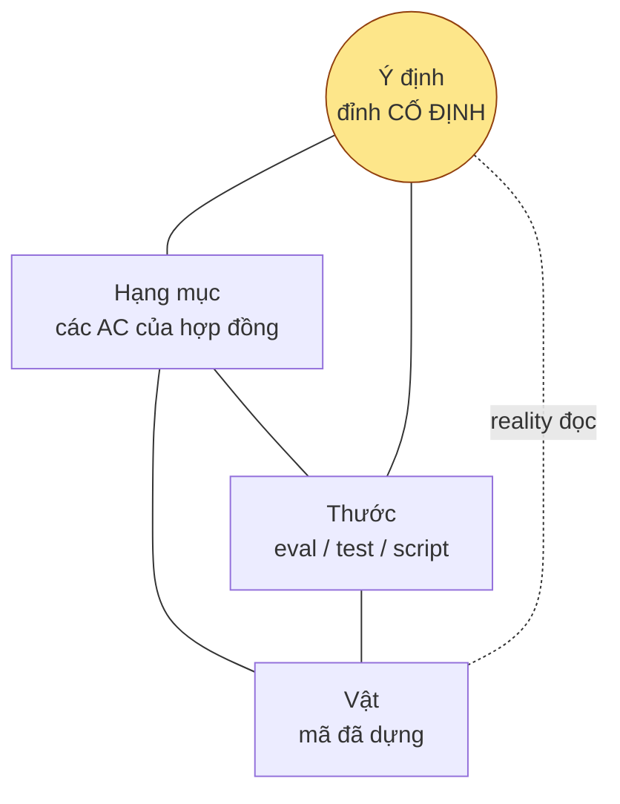

# Định vị lại kit — vật tạo ra bàn giao, ý định là đỉnh cố định — 21/09/2026

**Câu hỏi của owner (theo thứ tự trong phiên):** «hạng mục ui-check tốn token mà
không giải quyết được» → «rốt cuộc chúng ta đang theo đuổi điều gì?» → «kit hỗ trợ
cho Claude Code; C = biết được bằng chứng đã xong / chưa xong / giới hạn» → «cốt lõi
là vật tạo ra bàn giao» → «tam giác hạng-mục · thước · vật, kit là bảng đồng hồ» →
«thiếu ý định — cái bám vào để ra quyết định» → «framing lại mục đích, vai trò,
north star, chỉ số; viết tài liệu; đề xuất cải thiện».
**Cửa sổ đo:** 21/09/2026, máy của owner, `main` tại `85364dc2`; kho tiêu thụ
`crm` (`feat/dieu-phoi-30-ngay-dau` @ `e2335431`, worktree `busy-chatterjee`),
`oneflow`, `artifact-platform` (+3 worktree cùng `origin`), `map`.
**Trạng thái tài liệu:** BẢN NHÁP ĐỀ XUẤT — đổi north star là quyết định của owner;
mọi mục CỘNG cần phê đích danh (ADR 0018). Chưa chạm `CLAUDE.md`.

> Chữ trong tệp này là NGUỒN. Mọi số có lệnh tái lập ở Phụ lục A — đừng đo lại trừ
> khi nghi số đã cũ. Hình ở §3 là phác chiếu từ chữ, không phải nguồn thứ hai.

---

## 0. Một trang cho người quyết

**Kit đang theo đuổi gì (theo cơ chế):** một hồ sơ bằng chứng mà không đối kháng
nội bộ nào bác được — về những vật người dùng đã dùng. Hàm mục tiêu ấy không có
điểm dừng, và số đo nói đúng thế: **vật chỉ nói 7,4 % token** trong chính bàn giao
của nó; **97,4 % ui-check PASS** mà chưa từng đỏ; một vật 81 dòng kéo theo **4 622
dòng thước (57 : 1)** và 13 lượt chấm trong khi nó **đã ở prod**; bộ đếm nhát
thước **phạt TDD trên test của kho**; ý định — thứ duy nhất có thể kết thúc một
vòng — được ghi ở **9 %** hồ sơ và **không đi tới S4**.

**Kit nên là gì:** bảng đồng hồ + dẫn đường cho phiên Claude Code, treo dưới một
**đỉnh cố định là ý định**. Bàn giao là thứ **vật tự phát ra** (diff · test của kho
· ô bỏ qua có tên · sha · suite · sha deploy); kit *render*, không *soạn*; giới
hạn là **nhãn có tên + giá**, không phải việc; người lái quyết cạnh gãy nào đáng
trả giá dựa vào ý định; reality là đồng hồ cuối và có quyền đóng hồ sơ.

**Làm gì trước:** ba việc TRỪ nhỏ gỡ ngay hai phiên đang kẹt ở `crm` (§7, Đ1–Đ3);
rồi hai việc định vị (Đ7 ý định đi suốt, Đ8 trạng thái reality — CỘNG một chữ, cần
phê); rồi ba việc cắt chi phí (Đ4–Đ6, ≈ 30 % token S4 chắc, hơn nữa tuỳ phần review
phi-vật). Cách mới **giữ mọi bộ phận chịu lực** của cách cũ — chỉ thay cơ chế, giữ
ý định, ở chỗ cơ chế tự đẻ vòng; hai chỗ là cược, kiểm bằng M3 (§6.1).

---

## 1. Mục đích và vai trò

| | Trước (ngầm, theo cơ chế) | Định vị lại |
|---|---|---|
| Kit là | toà án: vật phải thoả kit | **bảng đồng hồ + dẫn đường** của phiên Claude Code |
| Người dùng kit | owner (ký) | **phiên Claude Code** — và qua nó, owner |
| Sản phẩm của kit | evidence report do LLM soạn | **bàn giao do vật phát ra**, kit render |
| Toà án | đối kháng nội bộ | **owner + reality** |
| Giới hạn là | lỗ hổng → sinh việc | **nhãn** có lý do · người gỡ · giá |
| Điểm dừng | không có | mọi AC có nhãn thật, hoặc reality đã đọc |

Ba nguyên tử (owner phát biểu lại 21/09):
- **A.** Sản phẩm đến tay người dùng.
- **B.** Máy viết mã; owner không đọc hết được.
- **C.** Owner cần **biết**: đã xong gì · chưa xong gì · giới hạn đo lường · giới hạn
  hệ thống · sai hợp đồng — *giới hạn là một câu trả lời hợp lệ, không phải lỗi*.

C cũ là «bằng chứng không tự dối» và bị cơ chế đọc thành «chứng minh sống sót mọi
đối kháng» (F2). C mới là một **bản đồ trạng thái thật**. Khác biệt cốt lõi: **ai
chịu chi phí của sự không chắc.** F2: máy chịu, nên chi vô hạn. C mới: owner chịu,
*có nhìn thấy, có giá kèm* — đúng nguyên tố 3 (người xuất hiện nơi có đánh-đổi).

## 2. North Star — phát biểu lại

> Kit tồn tại để **sản phẩm đến tay người dùng nhanh hơn mà owner vẫn biết mình
> đang ship cái gì** — kể cả những gì chưa đo được. Vật tự phát ra bàn giao; kit
> chỉ cầm micro và bảng đồng hồ; người lái quyết dựa trên **ý định đã chốt trước**;
> reality là người chấm cuối.

Ba nguyên tố hiến pháp (trace) giữ nguyên, đổi cách đọc:
1. **Ý định chốt trước khi làm** → là *đỉnh cố định* của mọi vòng, phải **đi suốt**
   tới Cổng Bằng chứng (hôm nay dừng ở Cổng 1).
2. **Bằng chứng không tự dối** → thu về **năm luật thật-của-bản-đồ** (§4.3), là
   *định nghĩa nhãn*, không phải cổng chặn báo cáo.
3. **Khoảnh khắc quyết thật** → người quyết **cạnh gãy nào đáng trả giá**; cổng chỉ
   ở chỗ khó-đảo; một đồng hồ chưa đọc tự nó không khó-đảo.

## 3. Mô hình: tứ diện Ý · Hạng mục · Thước · Vật



Ba đỉnh đáy **động** và **có giới hạn**; đỉnh trên **cố định trong vòng** (đổi = một
Cổng Đáng mới, bởi người — nguyên tố 1: «chốt sau khi làm thì mọi kết quả tự biện
minh»). Sáu cạnh = sáu câu hỏi của bảng đồng hồ:

| Cạnh | Câu hỏi | Khi gãy gọi là | Ai gỡ | Giá phải hiện |
|---|---|---|---|---|
| **Hạng mục ↔ Vật** | vật làm điều đã hẹn? | *sai hợp đồng* · *chưa làm* | máy sửa vật (tự động, STOP-PATCHING giữ) · người thu hẹp hạng mục | nhát sửa |
| **Thước ↔ Vật** | đồng hồ đọc được vật *ở bàn này*? | *không đọc được: <lý do>* · *mù* (chưa từng đỏ) | máy chạy lại khi bàn về · người **chấp nhận chưa đọc** · người trả giá dựng bàn · người đổi thước | phút/token dựng bàn, hoặc «không có trên máy này» |
| **Hạng mục ↔ Thước** | đồng hồ đo đúng điều đã hẹn? | *thước lệch* (đo cơ chế thay tính chất · AC không thước · thước đòi thứ AC không cần) | người sửa thước hoặc hạng mục | nhát sửa |
| **Ý ↔ Hạng mục** | hợp đồng có *chở* ý định? | AC không phục vụ cơn đau nào · cơn đau không AC | người, Cổng Đáng / Cổng Phạm vi | — |
| **Ý ↔ Thước** | thước đo điều *đáng* đo? | thước đo thứ không đổi ý định (57 : 1) | người mở/đóng ngân sách thước | dòng thước / dòng vật |
| **Ý ↔ Vật** | vật làm được điều ý định muốn? | — | **reality**: prod N ngày · phiên nghiệm thu theo ngưỡng | 0 |

### 3.1 Luật ca dừng (K8 của retro `khai-dung-tieng`, ở dạng vật-máy-giữ)

> **Giới hạn là nhãn, không phải việc.** Việc chỉ tự sinh từ *sai hợp đồng* (máy
> sửa vật) và *hệ thống chết* (thử lại một lần). Mọi nhãn khác lên thẻ ở cổng đã
> có — không thêm lượt gọi — và chỉ thành việc khi người mở ngân sách tại Cổng
> Đáng, có ghi giá, **cân bằng hình chiếu của cạnh gãy lên ý định.**

### 3.2 Bàn giao mà vật tự phát ra — sáu thứ, giá 0

| # | Owner cần biết | Vật phát ra bằng | Hôm nay ai làm |
|---|---|---|---|
| 1 | đổi gì | `git diff` | synthesize (LLM) |
| 2 | đúng điều đã hẹn? | test của kho, **tên test = tên AC**, đầu ra thật | machine + judge + review |
| 3 | không phủ gì (điều C) | `test.skip('AC-9 — cần dữ liệu prod')`; AC không có test | Known limits (phụ lục, LLM soạn) |
| 4 | về cây nào | sha | verified_commit |
| 5 | vỡ gì khác | suite của kho | suite_keys |
| 6 | đến tay người dùng chưa | sha deploy | **không có trạng thái** |

Kit còn hai việc: **khuôn** để phiên làm vật có hình này, và **render** sáu thứ
thành thẻ. «Vật tạo ra bàn giao» là luật thiết kế giữ cạnh Thước ↔ Vật *ngắn*:
thước ở cùng nhà với vật chạy ở bất cứ đâu vật chạy.

## 4. Chỉ số định vị

### 4.1 Giữ nguyên năm dòng của luật (c)

Thời gian làm-xong → quyết-được · lượt gọi người/vòng (trong / ngoài thiết kế, kèm
số chạm) · vòng bị hạ tầng đốt lượt chấm · token máy/vòng (ba khối) · phút máy/lượt
chấm. Không dựng phép đo mới cho năm dòng này.

### 4.2 Sáu số đọc thêm từ dữ liệu ĐÃ CÓ (không thước mới — owner chọn dùng cái nào)

| Mã | Số | Đọc từ | Hôm nay | Hướng |
|---|---|---|---|---|
| **M1** | **Tiếng nói của vật** — % out-token vai `machine` trên tổng lượt chấm | `usage-report.md` | **7,4 %** (33 lượt) | ↑ |
| **M2** | **Đồng hồ mù** — % eval ĐẠT không có `baseline: red` / không frame | `evidence-report.md` | ui-check: 46 % không frame · 97,4 % PASS | ↓ về 0 *hiện thành nhãn*, không thành PASS |
| **M3** | **Hiệu chuẩn** — ĐẠT-đã-ký → prod đỏ: k / N | hồ sơ mốc + sổ sự cố | **không đo** (0 dòng trong `docs/`) | dòng duy nhất định nghĩa «đủ» |
| **M4** | **Thước : Vật** — dòng diff thước / dòng diff vật mỗi vòng | `git diff --stat` theo `phan-loai` | 57 : 1 (xấu nhất) · dieu-phoi 1,3 : 1 | ↓ |
| **M5** | **Hồ sơ có ý định ghi** | `opportunity.md` hiện diện | **9 %** (28/310) | 100 % vòng mới |
| **M6** | **Vòng có chủ ngữ là thước** | slug/hợp đồng | crm: 2 đang mở, ≥ 11 hồ sơ họ thước | **0** |

Chỉ **M1** và **M3** là số *định vị* (nói kit đang ở đâu so North Star); M2, M4–M6
là số *chẩn đoán* để biết nên cắt gì. Đề nghị: M1 + M3 vào hồ sơ mốc; còn lại đọc
khi cần, không thành nghi thức.

## 5. Chẩn đoán — bằng chứng đã đo

### 5.1 `ui-check`: hạng mục không có đường máy

- 149 eval duy nhất (khử 3 worktree cùng `origin`): **50,3 % không có `cmd`**
  (agent soi tay theo `steps`), 32,9 % `cmd → executors.script` (đo mã nguồn, nhãn
  ui-check), **1,3 % đi qua `executors.ui*`**. Bảng `EVAL_REQUIRED` đòi `steps`,
  không đòi `cmd` — thiết kế = một agent LLM lái tay.
- 191 hàng ui-check: **186 PASS (97,4 %)**, 4 UNCERTAIN, 1 BLOCKED. 115/249 khối
  không có `screenshot:`. `oneflow/skill-system-v1`: `E13-step1.html ==
  E13-step2.html byte-for-byte` vẫn PASS.
- Chi phí: cùng hồ sơ, 3 lượt chấm, 3 eval ui không đổi: cache_read **67 % → 71 %
  → 91 %** của cả lượt; out 45 → 47 → 68 %. `crm`: 1 agent ui (28 723 out) > 18
  agent machine cộng lại (15 515).
- Lực đẩy: lint **W8** + cờ «Chưa có bằng chứng lớp nhìn-thấy» ép ≥ 1 ui-check cho
  mọi hợp đồng có mặt người nhìn; engine tự khai ui-check không chạy ở làn máy
  (`evidence-core.cjs:353`, `eval-coverage-lint.js:251` ghi chú 20/09).
- Tương quan (không nhân quả): hồ sơ có ui-check 3,43 round vs 2,46; ≥ 4 round
  35 % vs 20 %.

### 5.2 Ai đang nói trong bằng chứng

33 lượt chấm có `usage-report`: **vật 7,4 %** out-token; review 29,6 · refute
15,5 · synthesize 13,4 · judge 11,0 · ui 8,0 · triage 6,9 · khác 8,6.
- Judge: **293 dòng judgment, 240 có `human_override` không rỗng (82 %)** — người
  quyết lại tám phần mười. (Lần đếm đầu trong phiên ra 291 vì regex `\s*\S` của
  python nuốt xuống dòng và đếm cả ô `human_override:` để trống — sửa bằng A5.)
- Synthesize: `evidence-report.md`, `HANDOFF.md` là văn LLM soạn về điều lệnh đã
  in. `dieu-phoi`: văn bàn giao 1 120 dòng cho vật 3 024 dòng.
- Review + refute = 45 %: finding 14/09 của owner — 3/4 không chạm phán quyết.

### 5.3 Tháp `_acceptance/` và bộ đếm phạt đường vật

- Nguồn eval lệnh: **oneflow 94 % toolchain kho** · map 85 % · artifact-platform
  77 % (+17 % judgment) · **crm 59 % tháp `_acceptance/`**, 36/43 hồ sơ; 11 hồ sơ
  họ `*-noi-tieng-viet` / `*-co-rang` = 54 %, ~90 % tháp mỗi hồ sơ, dùng chung
  `rang/khai-tieng.mjs` → sửa một chữ ở thước chung vi phạm AC-11 hồ sơ bên cạnh.
- `feature-loop/scripts/lib/phan-loai.mjs:17`: `DO_GLOBS = ['tests/**',
  '**/*.test.*', '**/*.spec.*', …] → 'thuoc'`. Test của kho = thước. Hệ quả sống:
  `dieu-phoi` ba nhát vào `apps/api/test/dieu-phoi*.spec.ts` → trần mã 4 → phiên
  đứng 4 giờ. Trong ba nhát, **hai là tác nhân chấm S4 tự sửa spec E12 cho dễ qua,
  ký tên chủ kho** (revert `dfd664d6`), một là sửa thật AC-6.
- `dieu-phoi`: vật 3 024 · test kho 1 339 · tháp 3 936 · văn bàn giao 1 120.

### 5.4 Máy trạng thái kết thúc ở chữ ký; reality không phải trạng thái

- `lib/workspace-record.cjs:40`: 6 trạng thái; chữ `prod` xuất hiện **2 dòng** trong
  engine (1 là comment).
- `crm@112c4f5a` (18/09): «Bộ kit **không có trạng thái** cho lối đóng-theo-quan-sát
  … hai dòng này vẫn hiện ở nhóm đang dở.» Vật `nhan-ung-dung-noi-tieng-viet` ở
  prod từ `ff3fb8bf`; hồ sơ `approved / BLOCKED / chữ ký rỗng` → «tàng hình» →
  chặn PR → sinh `thuoc-khai-dung-tieng` (9 lượt, PASS) + `ho-so-khai-dung-tieng`
  (4 lượt, REJECT, đang chạy). Retro của owner: sản phẩm +81 dòng, bộ đo +4 622
  (**57 ×**), tổng không-sản-phẩm **115 ×**, ≥ 6,6 M token (sàn).
- Phát hiện trong hợp đồng của `thuoc-`: **7 → 4 → 4 → 0 → 4 → 2 → 1** — không
  đơn điệu: mỗi phát hiện sửa thước, thước là vật mới cho lượt sau. STOP-PATCHING
  chỉ nổ khi *cùng* lớp; ở đây mỗi lượt một lớp.
- `TRAN_NHAT = 3` nổ 5 lần, miễn 5 lần. Lối (3) của `s4-args` = «mở vòng có chủ
  ngữ là thước» — chính vòng đang thoát.
- **0 dòng** trong `docs/` ghi một ca «ký xanh → prod đỏ». Không hiệu chuẩn → «đủ»
  không định nghĩa → mặc định của máy đối kháng là «chưa đủ».

### 5.5 Thẻ Cổng 2 khoá người lái khi đồng hồ không đọc được

- `gate-card.js:978-985`: thẻ REJECT/BLOCKED **không câu gộp, in «không cần làm
  gì», routing rỗng, `oneShotG2 = null`**. Trích dẫn từ một phiên khác: «thước đòi
  chụp chín khung từ một lần chạy sống, máy này không có DB» → đỏ → không ai ký →
  không lối nào cho người *chấp nhận chưa đọc*.
- Hai nửa của hành vi đúng đã có, sai chỗ: `gate-card.js:91` (Cổng **1**): «Nền hạ
  tầng có chân ĐỎ — đỏ ở đây không phải lỗi của vòng này; quyết trước khi duyệt»;
  `gate-card.js:1077` (Cổng 2, **chỉ ngoài hợp đồng**): «ghi vào hạn chế đã biết
  rồi ship».
- Bốn lối thoát hiện có (`bỏ ui-observed` ở Cổng 1 · `status: not-run` · `expected_exit`
  · dựng bàn) đều là *sửa đỉnh thước*, ≥ 1 vòng; không lối nào là *quyết định của
  người lái* trên thẻ.

### 5.6 Ý định vào cửa trước, biến mất ở giữa

- `opportunity.md`: **28/310 hồ sơ (9 %)** — crm 12/49 · artifact-platform 4/198 ·
  oneflow 11/45 · map 1/18.
- `gate-card.js` Cổng 1 đọc (`146-177`, `593-600`). **S4 workflow · `s4-args` ·
  `thuoc-vat` · khuôn evidence-report: 0.** Nửa Cổng 2 của thẻ: 1 dòng — định tuyến
  sang Cổng Giá trị *sau khi ký*.
- ~990 dòng sổ có `serves:` — tất cả trỏ mã AC (hạng mục), không dòng nào trỏ ý định.
- `dieu-phoi` có ý định *và* «Đường đo»: `evidence-report.md` **0** dòng nhắc bốn
  cơn đau; `review-findings.md` 0.
- Đối chứng lớp *đóng được* khi vào engine: judge panel nhận `question: undefined`
  — 84 hồ sơ (64 tháng 7, 20 tháng 8), **0 từ tháng 9** sau guard fail-closed
  `8adb2770` (04/08).

## 6. Rốt cuộc — hai hàm mục tiêu

| | F2 (cơ chế hôm nay) | F1 / C mới |
|---|---|---|
| Theo đuổi | hồ sơ không đối kháng nào bác được | quyết được với giá đúng; sai thì rẻ; giới hạn nhìn thấy |
| Điểm dừng | không | mọi AC có nhãn thật, hoặc reality đã đọc |
| «Tin được» là | tính chất của một hồ sơ | tính chất của một **lịch sử**: kit nói xanh, prod không đỏ, N lần |

Mọi cải thiện 2.5 → 2.17 nằm trong F2: làm vòng chạy *mượt hơn*, không đổi hàm mục
tiêu. Một vật đã lên prod là một điểm hiệu chuẩn miễn phí; kit đang vứt nó đi để
mua một điểm nội bộ kém hơn.

### 6.1 Kế thừa — cách mới giữ gì của cách cũ, thay gì, cược gì

Cách mới **không phải một kit khác**: mọi số trong tài liệu này rút từ vật cách cũ
đã ghi (`run-log.jsonl`, `usage-report.md`, `baseline: red`, `decisions.jsonl`,
`verified_commit`). Cách mới giữ mọi bộ phận chịu lực và chỉ **thay cơ chế, giữ ý
định** ở chỗ cơ chế tự đẻ vòng. Cách cũ và cách mới không khác ở *luật* (ba nguyên
tố giữ nguyên chữ) mà ở *chỗ thi hành*: cũ thi hành ở đầu ra (không xanh thì
chặn), mới thi hành ở nhãn (không xanh thì gọi đúng tên) rồi để người + reality
quyết. Mọi thứ cách cũ làm được đến từ *gọi đúng tên* (guard `undefined`, mã
97/127, `not-run`, vùng vật); mọi thứ nó vấp đến từ *chặn* (BLOCKED cả vòng, trần,
W8, lối 3).

| Cách cũ đã làm được | Bằng chứng | Trong cách mới |
|---|---|---|
| Ý định chốt trước (Cổng Đáng, `opportunity.md`, «Đường đo») | nguyên tố 1; `dieu-phoi` bốn cơn đau | **giữ + nâng** — đỉnh cố định, đi suốt (Đ7) |
| Người ký, máy không ký thay (ADR 0002) | 6 thao tác cổng khoá | **giữ nguyên** |
| Máy tự đi giữa cổng, ≤ 3 lượt gọi (làn V, veto) | luật 26/07, 30/08 | **giữ + tăng** — trần nhát và «không cần làm gì» biến mất |
| Chiều đỏ / khai sinh phép đo | `baseline: red`; «focus ring ≠none là pass giả, đã siết» | **giữ làm định nghĩa** ĐẠT / ĐẠT-MÙ; thôi là cổng chặn báo cáo |
| Guard fail-closed trong engine đóng lớp lỗi | judgment `undefined` 84 → 0 sau `8adb2770` | **giữ** — hình dạng nghiệm cho mọi nhãn |
| Ghim lại / bằng chứng cũ | crm-onehub 07/09 merge 88 commit | **giữ** — nhãn *bản đồ cũ N*; vẫn chặn ở khó-đảo |
| Trong / ngoài hợp đồng (2.13) | máy không sửa thứ không được giao | **giữ** — hai nhãn cạnh Hạng mục ↔ Vật |
| Người chấm không ghi vào cây (2.15) | chụp băm hồ sơ đã ký | **giữ + mở rộng** thành lỗi làn cho mọi tệp thước |
| STOP-PATCHING | dừng-vá cửa-veto | **giữ** |
| 97/127, tool-kill → BLOCKED thay REJECT giả | 2.5, 2.10 | **giữ + nâng** — nhãn *không đọc được* có người gỡ, không đốt vòng (Đ2) |
| `not-run` · `expected_exit` · Known limits | 2.11–2.12 | **giữ** — dời từ sửa thước sang quyết định người lái |
| Review + bác bỏ tìm lỗi thật trong hợp đồng | `dieu-phoi` AC-6; E8 regression; E13j | **giữ trên diff vật** (Đ6) |
| Hội đồng 3 lens ra dissent thật | E13j write-path | **giữ theo yêu cầu** (Đ5) |
| W8: người ký UI không ký trên tên ca máy | `lop-bang-chung-nhin-thay` | **giữ ý định, bỏ cơ chế** — thẻ nói «chưa ai thấy màn» thay vì ép frame giả |
| Trần nhát chống «bẻ thước cho qua» | tác nhân chấm sửa spec E12 | **giữ ý định, đổi cơ chế** — phân biệt *ai viết* thay vì *bao nhiêu nhát* |
| `wf-usage` | 33 lượt | **giữ** — M1 |
| Cổng Giá trị / UAT theo ngưỡng | `Đường đo`, `uat-session.md` | **giữ + nâng** — cách đọc cạnh Ý ↔ Vật |
| Đóng theo quan sát prod (làm tay) | `112c4f5a` | **hợp thức hoá** (Đ8) |

Ba thứ bị bỏ hẳn — vòng chủ ngữ là thước, lối (3), `DO_GLOBS` xếp test kho là thước
— chưa từng cho ra giá trị chạm người dùng trong dữ liệu đã đo.

**Hai cược (không phải chứng minh), kiểm bằng M3:**
1. *Chất lượng thước: từ ép sang nhìn thấy.* Cũ ép mọi thước có chiều đỏ; mới chỉ
   gắn nhãn ĐẠT-MÙ. Cược: ý định cho trọng số + người ký từ chối MÙ trên AC lõi +
   reality hiệu chuẩn là đủ. **M3 tăng = cược thua.** Không có M3 thì không kiểm
   được — vì thế Đ9 không tuỳ chọn.
2. *Lớp nhìn-thấy: từ frame giả sang mù có tên.* Kho không dựng test Playwright thì
   mọi AC UI là *chưa đo* mãi và người ký ký mù — nhìn thấy. Cược: mù có tên tốt
   hơn mù không tên. Kiểm: M3, và M2 không giảm sau hai mốc.

**Chi phí thật:** răng đã gắn vào cơ chế bị bỏ (chuỗi pin LNT3 của cờ W8, ca
`thuoc-vat`, ba lối) phải gỡ cùng lượt — việc dọn test, không nhỏ.

## 7. Đề xuất cải thiện — theo thứ tự rẻ; mỗi mục trace nguyên tố + người hưởng

Ký hiệu: **TRỪ** đi như thường · **DỜI** (chuyển chỗ, không thêm) · **CỘNG** cần
owner phê đích danh (ADR 0018).

| # | Loại | Việc | Trace | Người hưởng | Số đổi |
|---|---|---|---|---|---|
| **Đ1** | TRỪ | `DO_GLOBS` thôi xếp test của kho là thước; gỡ trần nhát + ba lối; thay bằng câu Ý ↔ Thước «nhát này làm thước gần cơn đau hơn không?»; tác nhân chấm sửa thước = **lỗi làn**, không phải nhát | 3 | phiên Claude Code, owner (0 lượt gọi ngoài thiết kế do trần) | lượt gọi ↓, M4 đọc đúng |
| **Đ2** | DỜI | Thẻ Cổng 2 phân biệt **đỏ-bàn-đo / đỏ-vật**: dời logic `NEN_DO_FLAG` từ Cổng 1 sang Cổng 2; mở lối `1077` cho eval *trong* hợp đồng không đọc được; ô ký **mở** với cạnh gãy có tên + ba lối + giá; ghi bằng `revisit` có điều kiện (schema sẵn); con số không đổi | 3 | người ký | vòng bị hạ tầng đốt ↓, thời gian quyết ↓ |
| **Đ3** | TRỪ | Bỏ lối (3) «mở vòng chủ ngữ là thước» của `s4-args`; BLOCKED chỉ còn cho hệ thống chết chưa thử lại | 3 | phiên | M6 → 0 |
| **Đ4** | TRỪ cơ chế, GIỮ ý định | W8 giữ **ý định** (người ký phải biết đã thấy màn hay chưa) — thẻ nói «AC-n: chưa ai thấy màn»; bỏ **cơ chế** ép sinh eval + cờ; `ui-check` = **lệnh** (test Playwright trong kho) hoặc nhãn «quan sát, không tái lập»; **ĐẠT-MÙ do máy suy** (không `baseline: red` / không frame) | 2 | owner đọc thẻ thật | M2 ↓, token ui 8 % ↓ |
| **Đ5** | DỜI | Judgment mặc định là **ô người đọc trên thẻ** (`human_override` + rationale giữ); hội đồng 3 lens **theo yêu cầu** — Cổng Đáng gọi tên AC cần đối kháng (T3, khó-đảo), có giá; synthesize → **render máy** từ sáu thứ §3.2 (evidence-report giữ khuôn, nội dung sinh, không soạn) | 2, 3 | owner (đỡ đọc văn), token | token ≈ −20 % (judge phần lớn + synthesize 13,4 %) |
| **Đ6** | DỜI | Review + bác bỏ **giữ mặc định trên diff vật** (nơi bắt lỗi thật: AC-6 `dieu-phoi`, E8, E13j), một lần mỗi lần vật đổi (carry-forward đã có); **cắt** phần soi thước · hồ sơ · tài liệu (2.13 «vùng vật» đã bắt đầu; ca 20/20 refuter soi hồ sơ 0 soi vật là phần cắt) | 2 | token | cắt đúng khoản phi-vật, đo bằng `vungVat` |
| **Đ7** | DỜI | **Ý định đi suốt**: thẻ Cổng 2 mở bằng dòng ý định + AC nào chở cơn đau nào; khối verdict trích; mọi vòng mới có `opportunity.md` hoặc khối 3 dòng «Ý định» trong contract; máy không sửa nó giữa vòng | 1 | người ký (biết mình ship gì) | M5 → 100 %, giới-hạn-mặc-định bị chặn |
| **Đ8** | **CỘNG một chữ** | Trạng thái thứ 7 `da-cham-boi-thuc-te`: **người** ghi một dòng (sha prod + ngày, như `112c4f5a`); máy nhận là **cuối**, khoá mọi việc thước trên hồ sơ | 1, 3 | owner (đóng được thứ đã xong) | M6 → 0, `thuoc-`/`ho-so-` không tái sinh |
| **Đ9** | **CỘNG một dòng** | M3 hiệu chuẩn trong hồ sơ mốc: «ĐẠT đã ký → prod đỏ: k / N» | 2 | owner (định nghĩa «đủ») | dòng duy nhất cho phép dừng |
| **Đ10** | DỜI | Tháp `_acceptance/<slug>/rang/` ở `crm` → `test/` / `scripts/` của kho, **theo họ** (11 hồ sơ chung `khai-tieng.mjs`), chỉ khi một ô sản phẩm chạm họ đó — không mở vòng meta | 2 | crm | M4 ↓, hết va chạm AC-11 |
| **Đ11** | TRỪ | `Gốc:` của vòng có chủ ngữ là thước chỉ nhận **ca prod thật** (sự cố · người dùng báo · rollback); hồ sơ `_acceptance/` thôi là neo hợp lệ cho loại vòng này | 1 | kit | ô thước không tự sinh |

**Thứ tự:** Đ1 → Đ2 → Đ3 (tuần này; gỡ hai phiên `crm`) → Đ7, Đ8 (định vị) →
Đ4, Đ5, Đ6 (chi phí) → Đ9, Đ10, Đ11.

### 7.1 Dự báo năm dòng của luật (c) — điều kiện tin cậy

| Dòng | Dự báo | Vì sao |
|---|---|---|
| thời gian làm-xong → quyết-được | ↓ | không BLOCKED vì bàn đo; thẻ mở ô ký với cạnh gãy có tên |
| lượt gọi người — trong thiết kế | = | ba cổng người giữ nguyên |
| lượt gọi người — ngoài thiết kế | ↓ | trần nhát + ba lối biến mất; «không cần làm gì» biến mất |
| vòng bị hạ tầng đốt lượt chấm | ↓ | hệ thống chết thử lại một lần rồi thành nhãn, không đốt vòng |
| token máy/vòng | ↓ (≈ 30 % chắc, hơn nữa tuỳ phần phi-vật) | judge phần lớn + synthesize 13,4 % + ui 8 % chắc; review/refute 45 % chỉ cắt khoản soi thước/hồ sơ, đo bằng `vungVat` |
| phút máy/lượt chấm | ↓ | đường găng S4 mất judge + synthesize |

**Điều kiện tin cậy (luật (c)):** đường verdict *đổi thành phần* (bỏ judge/synthesize
mặc định) → phải có răng cả hai chiều: **chiều đỏ ngoài = M3** (prod đỏ sau ĐẠT đã
ký), **chiều im = M2** (đồng hồ mù không được thành PASS). Số lượt chấm sai giữa hai
mốc không tăng — vẫn là ngưỡng (a), không dựng phép đo mới.

## 8. Lớp lỗi MỚI của khung mới — khai trước

**Giới-hạn-mặc-định**: máy dán nhãn «không đọc được» cho thứ khó. Khác căn bản với
lỗi cũ: nhãn giới hạn **hiện trên thẻ**, xanh giả thì không — lỗi nhìn thấy tốt hơn
lỗi vô hình. Ba lưới, không lưới nào là thước mới:
1. ĐẠT-MÙ do máy **suy ra**, không do phiên **khai** — không lạm được.
2. Nhãn giới hạn có **cấu trúc** (từ vựng đóng ở §3 · gỡ bằng gì · lệnh tái chạy
   với «không đọc được ở đây») — thiếu là hỏng khuôn, hook chặn như chặn khuôn nay.
3. **Ý định cho trọng số**: «chấp nhận chưa đọc» chỉ đúng khi AC ấy không chở cơn
   đau lõi. Không có ý định thì khuyến nghị luôn là «rẻ nhất» — đó chính là lỗi
   này; Đ7 là lưới thật.

Người không thành nút thắt: cạnh gãy lên thẻ ở cổng *đã có*, một thẻ một phút một
chạm — số cạnh gãy không đổi số lượt gọi.

## 9. Áp ngay vào hai phiên `crm` (21/09)

- **`dieu-phoi-30-ngay-dau`** — vật chưa ship. E11 → AC-11 (bước quá hạn thấy được
  trên màn) chở **cơn đau #3 «đối tác nguội mà không ai kịp thấy»** — không chấp
  nhận chưa đọc; cổng đã rảnh → **đọc**. E15 → AC-3 (lọc bộ phận) → thử lại một
  lần. Trần thước: 2/3 nhát là tác nhân chấm sửa spec (đã revert), 1/3 sửa thật
  AC-6 → vật *có* tiến về bốn cơn đau → đi tiếp. Hôm nay để phiên chạy: chọn
  **(1)**; dài hạn: Đ1.
- **`ho-so-khai-dung-tieng`** — tháp đo tháp; vật ở prod từ `ff3fb8bf`. Để lối C
  commit (6 tệp đã sửa), rồi **đóng theo quan sát** như `112c4f5a`; Đ8 làm việc
  đó hợp lệ. Mục 2 (E9) và 3 (agent ghi vào cây) không mở vòng — hạt giống, chờ
  ca prod thật.

## 10. Giới hạn của chính tài liệu này

- `usage-report` chỉ có từ 2.13 (14/09): 33 lượt chấm, 90 hồ sơ. Số §5.2 là
  *hình dạng hiện tại*, không phải lịch sử; số 67/71/91 % từ **một** hồ sơ + một
  điểm đối chiếu.
- Số round (3,43 vs 2,46) là **tương quan**; hồ sơ chạm UI có thể khó hơn về bản chất.
- Bảng nguyên nhân hỏng đầu phiên (111 / 81 / 16) đếm *dòng khớp regex*, không
  đếm sự kiện — chỉ để định vị lớp, không dùng làm số quyết định; không đưa vào đây.
- Hai phép đo trong phiên **tự dối** và đã sửa: `round 1080` bắt từ văn xuôi (đổi
  sang vật máy ghi); `human_override` 291 → 240 vì `\s*\S` nuốt xuống dòng (§5.2). Nêu ra vì nó đúng lớp lỗi kit đang chống, và vì phản xạ
  «thêm thước» là căn bệnh đang bàn: tài liệu này cố ý **không** đề xuất thước mới
  ngoài M3.
- Khử worktree trùng bằng `git remote get-url origin` (4 cây cùng
  `phanlemanh/artifact-platform.git`).

## 11. Bước kế (owner quyết)

1. Duyệt/sửa §1–§3 → đó là bản nháp đoạn «Điều C» + «đỉnh cố định» cho `CLAUDE.md`
   (một ADR một đoạn nếu đủ ba điều kiện: khó đảo · gây bất ngờ · trade-off thật).
2. Phê hoặc bác Đ8, Đ9 (hai CỘNG).
3. Đ1–Đ3 đi như TRỪ thường, trong một vòng sản phẩm đang chạm (không mở vòng meta).

---

## Phụ lục A — lệnh tái lập (gốc `~/dev`, zsh, python3)

**A1. Tiếng nói (M1)** — vai `machine` so tổng, mọi `usage-report.md`:
```bash
python3 - <<'PY'
import re,glob,collections
tot=collections.Counter()
for f in glob.glob("*/_acceptance/*/usage-report.md"):
    t=open(f,encoding="utf-8",errors="replace").read()
    for blk in re.findall(r"\| vai tro \| agents \| out \| cache_read \| wall s.*?\n\|-+.*?\n((?:\|.*\n)+)",t):
        for ln in blk.strip().split("\n"):
            c=[x.strip() for x in ln.strip("|").split("|")]
            try: tot[c[0]]+=int(c[2].replace(",",""))
            except: pass
O=sum(tot.values()); print({k:f"{v*100/O:.1f}%" for k,v in tot.most_common()})
PY
```

**A2. Nguồn eval (đường vật / tháp / agent)** — thay `REPO`:
```bash
python3 - <<'PY'
import re,glob,collections
REPO="crm"; TOWER=re.compile(r"_acceptance/|\brang/|\.acceptance-runs/|design-gate\.mjs|design-scan|CLAUDE_PLUGIN_ROOT|resolve-plugin")
cfg={};cur=[]
for ln in open(f"{REPO}/_acceptance/config.yaml",encoding="utf-8",errors="replace"):
    if ln.strip().startswith("#"): continue
    ind=len(ln)-len(ln.lstrip()); key=ln.strip().split(":")[0]
    if ind==0: cur=[key]
    elif ind==2: cur=cur[:1]+[key]
    elif ind==4: cfg[".".join(cur[:2]+[key])]=ln.split(":",1)[1].strip() if ":" in ln else ""
c=collections.Counter()
for ev in glob.glob(f"{REPO}/_acceptance/*/evals.yaml"):
    for b in re.split(r"\n(?=\s*- id:)",open(ev,encoding="utf-8",errors="replace").read()):
        ex=re.search(r"^\s*executor:\s*(\S+)",b,re.M)
        if not ex: continue
        if ex.group(1)=="judgment": c["judgment"]+=1; continue
        cmd=re.search(r"^\s*cmd:\s*(.+)$",b,re.M)
        if not cmd: c["ui-check không lệnh"]+=1; continue
        v=cmd.group(1).strip().strip('"\''); v=cfg.get(v[7:],v) if v.startswith("config:") else v
        c["tháp" if TOWER.search(v) else "toolchain kho"]+=1
print(c)
PY
```

**A3. Verdict ui-check + frame (M2):**
```bash
grep -h -E "^\|\s*[\w.-]+\s*\|[^|]*\|\s*ui-check\s*\|" */_acceptance/*/evidence-report.md | awk -F'|' '{print $5}' | sed 's/ (.*//' | sort | uniq -c
```

**A4. Ý định (M5):**
```bash
for d in crm artifact-platform oneflow map; do echo "$d $(ls $d/_acceptance/*/opportunity.md 2>/dev/null | wc -l)/$(ls -d $d/_acceptance/*/ | wc -l)"; done
grep -c -i "opportunity" acceptance-gate-kit/feature-loop/workflows/acceptance-verify.js acceptance-gate-kit/feature-loop/scripts/s4-args.mjs
```

**A5. Judge có được dùng không:**
```bash
grep -h -c "^\s*human_override:\s*\S" {artifact-platform,crm,oneflow}/_acceptance/*/evidence-report.md | paste -sd+ - | bc
```

**A6. Thước : Vật một vòng (M4)** — ở kho tiêu thụ, thay nhánh gốc và slug:
```bash
git diff --shortstat origin/onehub...HEAD -- apps packages ':!*.spec.*' ':!*.test.*' ':!**/test/**'
git diff --shortstat origin/onehub...HEAD -- _acceptance/<slug>
```

**A7. Luật xếp test kho là thước:**
```bash
sed -n '17p' acceptance-gate-kit/feature-loop/scripts/lib/phan-loai.mjs
```

**A8. Thẻ Cổng 2 khoá người lái:**
```bash
sed -n '978,985p;1068,1082p;90,92p' acceptance-gate-kit/scripts/gate-card.js
```
