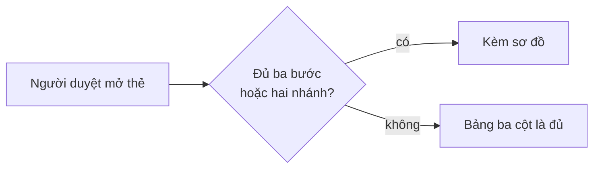

# Luật ngôn ngữ mặt người — Implementation Plan

> **For agentic workers:** REQUIRED SUB-SKILL: Use superpowers:subagent-driven-development (recommended) or superpowers:executing-plans to implement this plan task-by-task. Steps use checkbox (`- [ ]`) syntax for tracking.

**Goal:** Chuyển luật ngôn ngữ mặt người từ trạng thái thành văn (spec §4.1) sang trạng thái nhúng vào chỗ nghẽn đầu ra — một bản luật thi hành, tám chỗ sinh chữ-cho-người bắt buộc nạp nó, hai khuôn trình bày đặt một chỗ có marker, và quyền trả lại tại cổng.

**Architecture:** Một file nguồn `skills/acceptance/references/human-facing-language.md` chứa bảng luật (bọc marker, khớp từng ký tự với spec §4.1), hai khuôn trình bày (bảng ba cột + sơ đồ mermaid), và danh sách từ mới. Tám file sinh-đầu-ra trỏ tới nó bằng **ba dạng đường dẫn khác nhau tuỳ gói** — sáu chỗ cùng gói dùng biến gốc-plugin, hai chỗ khác gói phải đi qua `resolve-plugin.mjs`. Tám case mới trong `tests/plugins/run-tests.sh` (P89–P96), mỗi case có đối chứng dương trước rồi mới đột biến.

**Tech Stack:** Markdown (skills/commands/SKILL.md), bash test harness (`tests/plugins/run-tests.sh` với helper `run "<tên>" <cmd>`), python3 + node cho case, `scripts/sync-plugin-packages.sh` cho mirror.

## Global Constraints

- **Mirror là sản phẩm sinh máy.** Sửa nguồn xong PHẢI chạy `bash scripts/sync-plugin-packages.sh` và commit `plugins/` cùng lượt. Không bao giờ sửa tay dưới `plugins/`.
- **Assertion âm-tính-một-mình là assertion không sống.** Mọi case dựng bản sao rồi kết luận từ đột biến PHẢI chạy bản NGUYÊN VẸN trước và bản đó phải XANH, VÀ ghim đúng thông điệp mong đợi (không chỉ mã thoát).
- **Đường dẫn suy từ `$ROOT`** (`ROOT="$(cd "$(dirname "${BASH_SOURCE[0]}")/../.." && pwd)"` đã có sẵn ở đầu `run-tests.sh`). Cấm hardcode checkout của tác giả.
- **Fixture do code sinh trong chính lần chạy** — rút từ marker của bên VIẾT, không viết tay khuôn ở bên ĐỌC.
- **Literal dùng trong case mà cũng nằm trong file bị quét phải ghép mảnh** (bẫy P80: nếu để nguyên chuỗi, phép tìm khớp chính source của case).
- **Grep 0 hit là triệu chứng grep hỏng**, không phải bằng chứng sạch → mọi case quét diện rộng phải có bộ đếm sanity.
- Bảng luật N1–N6 phải **khớp từng ký tự** giữa `skills/acceptance/references/human-facing-language.md` và `docs/specs/workflow-v2-spec.md` §4.1.
- Tiền tố sổ quyết định đã chốt, nguyên văn: `lỗ-kit — ngôn ngữ mặt người`.
- Tên hai marker khuôn đã chốt: `PLAN-SUMMARY-TABLE-TEMPLATE`, `DECISION-DIAGRAM-TEMPLATE`. Marker bảng luật: `HFL-LAW-TABLE`. Marker từ mới: `HFL-GLOSSARY-TERMS`.
- Ba tên cột đã chốt, nguyên văn: `Người dùng thấy gì khác` · `Đụng đâu` · `Phục vụ tiêu chí`.
- Ngưỡng kích hoạt sơ đồ đã chốt: **từ ba bước nối tiếp hoặc từ hai nhánh rẽ trở lên**.

---

## File Structure

| File | Trách nhiệm | Task |
|---|---|---|
| `skills/acceptance/references/human-facing-language.md` (tạo) | Bản luật thi hành: phạm vi, bảng luật, hai phép thử, ví dụ TRƯỚC/SAU, hai khuôn, từ mới, quyền trả lại | 1 |
| `docs/specs/workflow-v2-spec.md` (sửa) | Bọc bảng luật §4.1 bằng marker + trỏ tới bản thi hành | 1 |
| `CONTEXT.md` (sửa) | Ba mục từ điển mới | 1 |
| `commands/acceptance-card.md` (sửa) | Nạp luật + quyền trả lại | 2 |
| `commands/acceptance-report.md` (sửa) | Nạp luật | 2 |
| `commands/acceptance-status.md` (sửa) | Nạp luật | 2 |
| `feature-loop/skills/feature-loop/SKILL.md` (sửa) | Nạp luật qua bộ giải + khuôn cho mọi lần trình | 2 |
| `codex/acceptance-gate/skills/acceptance-card/SKILL.md` (sửa) | Bản Codex của card | 2 |
| `codex/acceptance-gate/skills/acceptance-report/SKILL.md` (sửa) | Bản Codex của report | 2 |
| `codex/acceptance-gate/skills/acceptance-status/SKILL.md` (sửa) | Bản Codex của status | 2 |
| `codex/feature-loop-codex/skills/feature-loop-codex/SKILL.md` (sửa) | Bản Codex của vòng lặp | 2 |
| `tests/plugins/run-tests.sh` (sửa) | P89, P92, P96 | 3 |
| `tests/plugins/run-tests.sh` (sửa) | P90, P91, P93, P94, P95 | 4 |
| 5 file `plugin.json` + `plugins/**` (sửa) | Bump version + mirror | 5 |

**Thứ tự bắt buộc:** Task 1 → 2 → 3 → 4 → 5. Task 3 và 4 cùng ghi vào `tests/plugins/run-tests.sh` nên KHÔNG chạy song song được.

---

### Task 1: Bản luật thi hành + marker ở spec + từ điển

`independent: false` — mọi task sau đều trỏ vào file này.
**Phục vụ:** E1, E2, E3, E4, E8 (một nửa), E9, E10, E14 → AC-1, AC-2, AC-3, AC-7, AC-8, AC-9, AC-13

**Files:**
- Create: `skills/acceptance/references/human-facing-language.md`
- Modify: `docs/specs/workflow-v2-spec.md:192-199` (bọc bảng luật bằng marker) và thêm một dòng trỏ tới bản thi hành sau đoạn "Cưỡng chế"
- Modify: `CONTEXT.md` (thêm ba mục vào phần `### Evidence vocabulary` hoặc một mục mới `### Song diện`)

**Interfaces:**
- Produces: bốn cặp marker mà Task 3/4 rút bằng regex — `HFL-LAW-TABLE`, `PLAN-SUMMARY-TABLE-TEMPLATE`, `DECISION-DIAGRAM-TEMPLATE`, `HFL-GLOSSARY-TERMS`. Dạng marker theo tiền lệ `OPP-FRONTMATTER-TEMPLATE`: `<!-- <<<NAME -->` … `<!-- NAME>>> -->` cho khối markdown hiển thị được, và `<<<NAME` … `NAME>>>` trần cho khối trong fence.
- Produces: đường dẫn `skills/acceptance/references/human-facing-language.md` mà Task 2 nhúng vào tám file.

- [ ] **Step 1: Tạo bản luật thi hành**

Tạo `skills/acceptance/references/human-facing-language.md` với nội dung ĐÚNG như dưới đây. Bảng giữa cặp `HFL-LAW-TABLE` phải khớp TỪNG KÝ TỰ với bảng hiện có ở `docs/specs/workflow-v2-spec.md` dòng 192–199 — chép, đừng gõ lại.

````markdown
# Ngôn ngữ mặt người — luật bắt buộc khi trình cho người

Nguồn quyết định: `docs/specs/workflow-v2-spec.md` §4.1 (Manh, 2026-08-01).
File này là **bản thi hành**: bộ dựng thẻ, bảng tóm tắt kế hoạch và báo cáo
checkpoint NẠP file này trước khi viết chữ đầu tiên cho người đọc. Mỗi lần
render là một lần đọc — luật không sống trong trí nhớ.

## Áp ở đâu — và KHÔNG áp ở đâu

**ÁP** cho mọi thứ trình cho người để đọc/quyết: thẻ cổng, bảng tóm tắt kế
hoạch, báo cáo checkpoint và tổng kết, tin nhắn tại điểm quyết định, handbook,
release notes.

**KHÔNG ÁP** cho mặt máy: `evals.yaml`, `run-log.jsonl`, frontmatter,
`contract.md` phần Given/When/Then, mã nguồn, thông điệp lỗi của script, tên
file. Ở đó **tên chính xác là bắt buộc** — "dịch cho dễ đọc" một khoá
frontmatter hay một `id:` của eval là làm hỏng hợp đồng máy, không phải làm
tốt cho người.

## Sáu luật

<!-- <<<HFL-LAW-TABLE -->
| # | Luật |
|---|---|
| N1 | **Chủ ngữ là người dùng hoặc sản phẩm, không phải file.** Câu nói *người dùng sẽ thấy gì khác*, không nói *sửa gì ở đâu*. |
| N2 | **Tên kỹ thuật (file/hàm/biến/bảng) xuống cột phụ hoặc ngoặc** — không bao giờ làm chủ ngữ. |
| N3 | **Mã số là tra cứu, không phải nội dung.** Lần đầu xuất hiện ở mặt người phải kèm 3–5 chữ nói nó là gì. |
| N4 | **Một dòng một ý** — không nhồi nhiều việc vào một ô bằng dấu phân cách. |
| N5 | **Hình trước, chữ là chú thích** tại mọi điểm quyết định (bảng có cột rõ · sơ đồ · bản bấm được). Câu hỏi cho người phải trả lời được bằng có/không hoặc a/b. |
| N6 | **Không dùng biệt ngữ nội bộ chưa có trong từ điển sản phẩm.** |
<!-- HFL-LAW-TABLE>>> -->

**Ngưỡng kích hoạt sơ đồ (N5):** điểm quyết định có **từ ba bước nối tiếp hoặc
từ hai nhánh rẽ trở lên** thì bắt buộc kèm sơ đồ; ít hơn thì bảng ba cột là đủ.
Ngưỡng này đếm được — liếc là biết, không phải phán.

**Từ điển sản phẩm sống ở đâu (N6):** `CONTEXT.md` ở gốc kho đang làm. Từ chưa
có mục trong đó thì hoặc thêm mục trước, hoặc viết bằng chữ thường ai cũng
hiểu. "Từ điển sản phẩm" không phải một khái niệm trừu tượng — nó là một file.

## Hai phép thử (vài giây, làm được ngay)

- **Xoá-tên-máy**: xoá hết tên file/hàm/biến/mã số khỏi câu — còn nghĩa cho
  người không đọc code thì ĐẠT; thành rỗng hoặc mơ hồ thì viết lại.
- **Người-thứ-ba**: một người trong đội không đọc code kể lại được *"sau việc
  này người dùng thấy gì khác"* không?

## Ví dụ TRƯỚC/SAU

| Luật | TRƯỚC (ngôn ngữ máy) | SAU (ngôn ngữ mặt người) |
|---|---|---|
| N1 | Bộ dựng thẻ đọc thêm khoá độ phủ từ hợp đồng | Người duyệt thấy ngay bộ tiêu chí đã phủ hết những gì |
| N2 | Sửa bước lập kế hoạch trong SKILL của vòng lặp | Bước trình kế hoạch nạp bản luật trước khi viết (trong SKILL của vòng lặp) |
| N3 | Phục vụ AC-7, E12 | Phục vụ AC-7 (luật chỉ nằm một chỗ) và E12 (khuôn áp mọi lần trình) |
| N4 | Thêm marker, sửa bên đọc, thêm phép đo, chạy đóng gói | Bốn dòng riêng, mỗi dòng một việc |
| N5 | Ba đoạn văn mô tả một luồng có ba nhánh | Một sơ đồ ba nhánh, chữ là chú thích dưới hình |
| N6 | Bật CT-S cho slug này | Bật lưới chống sót tiêu chí cho việc này |

## Khuôn bảng tóm tắt kế hoạch

Dùng cho MỌI lần trình kế hoạch hoặc tiến độ cho người. Cột một phải qua được
phép thử Xoá-tên-máy. Một dòng một việc — cấm nhồi nhiều việc vào một ô bằng
dấu chấm giữa hay dấu chấm phẩy.

<!-- <<<PLAN-SUMMARY-TABLE-TEMPLATE -->
| Người dùng thấy gì khác | Đụng đâu | Phục vụ tiêu chí |
|---|---|---|
| <một câu, chủ ngữ là người dùng hoặc sản phẩm> | `<tên kỹ thuật>` | <mã> (<3–5 chữ nói nó là gì>) |
| Người duyệt đọc được bảng kế hoạch bằng tiếng sản phẩm | `human-facing-language.md` | AC-1 (bản luật đủ sáu điều) |
<!-- PLAN-SUMMARY-TABLE-TEMPLATE>>> -->

## Khuôn sơ đồ điểm quyết định

Dùng khi vượt ngưỡng kích hoạt của N5. Nhãn nút chịu đúng N1/N2: nhãn là chữ
cho người, tên file xuống chú thích dưới hình.

<!-- <<<DECISION-DIAGRAM-TEMPLATE -->

<!-- DECISION-DIAGRAM-TEMPLATE>>> -->

## Từ mới feature này đưa vào từ điển

Mỗi từ dưới đây phải có mục trong `CONTEXT.md` — nếu không, chính kit vi phạm
luật N6 nó vừa đặt ra.

<!-- <<<HFL-GLOSSARY-TERMS -->
- mặt người
- mặt máy
- lỗ-kit
<!-- HFL-GLOSSARY-TERMS>>> -->

## Vi phạm tại cổng — người duyệt có quyền TRẢ LẠI

Thấy vi phạm ở thứ được trình, người duyệt **trả lại tại cổng** — không phải
duyệt cho xong rồi góp ý sau. Trả lại là một lỗ của bộ công cụ, không phải lỗi
của người viết: ghi vào sổ quyết định `_acceptance/<slug>/decisions.jsonl` một
entry `revisit` có `decision` bắt đầu đúng chuỗi `lỗ-kit — ngôn ngữ mặt người`
kèm câu vi phạm, để đợt nâng bộ thẻ đọc lại bằng số thay vì bằng trí nhớ.
````

- [ ] **Step 2: Bọc bảng luật ở spec bằng cùng cặp marker**

Trong `docs/specs/workflow-v2-spec.md`, chèn `<!-- <<<HFL-LAW-TABLE -->` ngay TRƯỚC dòng `| # | Luật |` (dòng 192) và `<!-- HFL-LAW-TABLE>>> -->` ngay SAU dòng N6 (dòng 199). Không đổi một ký tự nào của sáu dòng luật.

- [ ] **Step 3: Trỏ spec tới bản thi hành**

Trong `docs/specs/workflow-v2-spec.md`, ngay sau đoạn bắt đầu `**Cưỡng chế (không dựa vào trí nhớ):**`, thêm một dòng:

```markdown
Bản thi hành: `skills/acceptance/references/human-facing-language.md` — bảng luật ở hai nơi được giữ khớp từng ký tự bằng case P93.
```

- [ ] **Step 4: Thêm ba mục từ điển vào CONTEXT.md**

Trong `CONTEXT.md`, thêm một mục `### Song diện` ngay trước `### Evidence vocabulary`:

```markdown
### Song diện

**Mặt người**:
Nửa artifact dành cho người đọc và quyết: thẻ cổng, bảng tóm tắt kế hoạch,
báo cáo checkpoint, tin nhắn tại điểm quyết định. Chịu luật ngôn ngữ mặt
người (`skills/acceptance/references/human-facing-language.md`).
_Avoid_: UI (đó là surface của sản phẩm tiêu thụ), bản đẹp.

**Mặt máy**:
Nửa artifact dành cho hook/CI/script đọc: frontmatter, `evals.yaml`,
`run-log.jsonl`, mã nguồn. Ở đây tên chính xác là bắt buộc — luật ngôn ngữ
mặt người KHÔNG áp vào đây.
_Avoid_: backend, internal.

**Lỗ-kit**:
Vi phạm luật ngôn ngữ mặt người bị người duyệt bắt tại cổng, ghi vào sổ quyết
định bằng entry `revisit` có `decision` mở đầu `lỗ-kit — ngôn ngữ mặt người`.
Là lỗ của bộ công cụ chứ không phải lỗi của người viết — đếm được để đợt nâng
bộ thẻ đọc lại bằng số.
_Avoid_: bug, lỗi trình bày.
```

- [ ] **Step 5: Kiểm tay trước khi commit — bảng luật hai nơi phải giống nhau**

Chạy:

```bash
python3 - "$PWD" <<'PY'
import re, sys
from pathlib import Path
root = Path(sys.argv[1])
RX = re.compile(r"<!-- <<<HFL-LAW-TABLE -->\n([\s\S]*?)<!-- HFL-LAW-TABLE>>> -->")
a = RX.search((root / "skills/acceptance/references/human-facing-language.md").read_text(encoding="utf-8"))
b = RX.search((root / "docs/specs/workflow-v2-spec.md").read_text(encoding="utf-8"))
assert a and b, f"thieu marker: ref={bool(a)} spec={bool(b)}"
assert a.group(1) == b.group(1), "bang luat LECH giua hai file"
assert len(re.findall(r"^\| N[1-6] \|", a.group(1), re.M)) == 6, "khong du 6 luat"
print("OK: bang luat khop tung ky tu, du 6 luat")
PY
```

Expected: `OK: bang luat khop tung ky tu, du 6 luat`

- [ ] **Step 6: Chạy suite hiện có để chắc không làm hỏng gì**

Run: `bash tests/plugins/run-tests.sh`
Expected: không có dòng `FAIL:` nào.

- [ ] **Step 7: Commit**

```bash
git add skills/acceptance/references/human-facing-language.md docs/specs/workflow-v2-spec.md CONTEXT.md
git commit -m "feat(acceptance): bản thi hành luật ngôn ngữ mặt người + 2 khuôn có marker"
```

---

### Task 2: Tám chỗ trỏ nạp luật, ba dạng đường dẫn

`independent: false` — cần file của Task 1 tồn tại.
**Phục vụ:** E5, E6, E7, E12, E13 → AC-4, AC-5, AC-6, AC-11, AC-12

**Files:**
- Modify: `commands/acceptance-card.md` (bước 3 Translate + phần kết)
- Modify: `commands/acceptance-report.md` (bước 3 Print)
- Modify: `commands/acceptance-status.md` (bước 3 Print)
- Modify: `feature-loop/skills/feature-loop/SKILL.md` (mục S2 — PLAN)
- Modify: `codex/acceptance-gate/skills/acceptance-card/SKILL.md`
- Modify: `codex/acceptance-gate/skills/acceptance-report/SKILL.md`
- Modify: `codex/acceptance-gate/skills/acceptance-status/SKILL.md`
- Modify: `codex/feature-loop-codex/skills/feature-loop-codex/SKILL.md` (mục `## S2 - Plan`)

**Interfaces:**
- Consumes: `skills/acceptance/references/human-facing-language.md` (Task 1), hai tên marker khuôn.
- Produces: ba literal mà Task 4 ghim — đường dẫn `skills/acceptance/references/human-facing-language.md`, cụm mệnh lệnh `TRƯỚC khi viết`, tiền tố sổ `lỗ-kit — ngôn ngữ mặt người`.

- [ ] **Step 1: Ba lệnh bản Claude — chèn mệnh lệnh nạp**

Vào `commands/acceptance-card.md`, ngay đầu bước `3. **Translate**`, chèn đoạn (giữ nguyên phần còn lại của bước 3):

```markdown
   **Nạp luật TRƯỚC khi viết:** đọc `${CLAUDE_PLUGIN_ROOT}/skills/acceptance/references/human-facing-language.md`
   (sáu luật N1–N6, hai phép thử, khuôn trình bày) TRƯỚC khi viết bất kỳ câu
   nào sẽ hiện cho người. Mỗi lần render là một lần đọc — luật không sống
   trong trí nhớ. Biến gốc-plugin không có thì giải như bước 1.
```

Vào `commands/acceptance-report.md`, ngay đầu bước `3. **Print:**`, chèn:

```markdown
   **Nạp luật TRƯỚC khi viết:** đọc `${CLAUDE_PLUGIN_ROOT}/skills/acceptance/references/human-facing-language.md`
   (sáu luật N1–N6, hai phép thử, khuôn trình bày) TRƯỚC khi viết bất kỳ câu
   nào sẽ hiện cho người — bảng tổng kết là mặt người, không phải mặt máy.
```

Vào `commands/acceptance-status.md`, ngay trước `3. Print:`, chèn một mục đánh số lại thành bước 3 (và dời các bước sau xuống một số):

```markdown
3. **Nạp luật TRƯỚC khi viết:** đọc `${CLAUDE_PLUGIN_ROOT}/skills/acceptance/references/human-facing-language.md`
   (sáu luật N1–N6, hai phép thử, khuôn trình bày) TRƯỚC khi viết bất kỳ câu
   nào sẽ hiện cho người.
```

- [ ] **Step 2: Ba skill bản Codex — cùng mệnh lệnh, đổi tên biến gốc**

Chèn cùng đoạn vào ba file, dùng `${PLUGIN_ROOT}` thay cho `${CLAUDE_PLUGIN_ROOT}`, đặt ngay trước mục dựng câu chữ cho người của từng skill:

- `codex/acceptance-gate/skills/acceptance-card/SKILL.md` → trước mục dịch sang ngôn ngữ sản phẩm
- `codex/acceptance-gate/skills/acceptance-report/SKILL.md` → trước mục in báo cáo
- `codex/acceptance-gate/skills/acceptance-status/SKILL.md` → trước mục in bảng

Đoạn chèn (bản tiếng Anh cho khớp giọng file Codex):

```markdown
## Load the language rules first

Read `${PLUGIN_ROOT}/skills/acceptance/references/human-facing-language.md`
(six rules N1–N6, two quick tests, the presentation templates) TRƯỚC khi viết
bất kỳ câu nào sẽ hiện cho người. Every render re-reads the file — the rules
do not live in memory.
```

- [ ] **Step 3: Hai SKILL vòng lặp — nạp qua bộ giải, KHÔNG ghép thẳng gốc gói**

Gói `feature-loop` và `feature-loop-codex` KHÔNG chứa bản luật, nên ghép thẳng gốc gói là con trỏ chết. Vào `feature-loop/skills/feature-loop/SKILL.md`, thay mục `## S2 — PLAN` mục 3 hiện tại bằng:

```markdown
3. **Trình cho người bằng tiếng sản phẩm — áp cho MỌI lần trình, không riêng T3.** Nạp bản luật TRƯỚC khi viết: `node "$WORKFLOWS_DIR/../scripts/resolve-plugin.mjs" --plugin acceptance-gate --require skills/acceptance/references/human-facing-language.md` rồi đọc file `<kết quả>/skills/acceptance/references/human-facing-language.md`. Mọi lần trình kế hoạch hoặc tiến độ cho người dùng khuôn `PLAN-SUMMARY-TABLE-TEMPLATE` trong file đó; điểm quyết định từ ba bước nối tiếp hoặc hai nhánh rẽ trở lên thì kèm sơ đồ theo khuôn `DECISION-DIAGRAM-TEMPLATE`. **T3: GATE 1.5** — trình tóm tắt plan theo đúng khuôn đó rồi chờ duyệt. T2: đi tiếp luôn, không dừng.
```

Vào `codex/feature-loop-codex/skills/feature-loop-codex/SKILL.md`, mục `## S2 - Plan`, thêm ngay sau câu về `independent: true|false`:

```markdown
Load the language rules TRƯỚC khi viết anything a human will read: run
`node "${PLUGIN_ROOT}/scripts/resolve-plugin.mjs" --plugin acceptance-gate --require skills/acceptance/references/human-facing-language.md`
then read that file. Present every plan or progress summary — MỌI lần trình,
không riêng the T3 review stop — with the `PLAN-SUMMARY-TABLE-TEMPLATE` table;
a decision point with three or more sequential steps or two or more branches
also needs a diagram from `DECISION-DIAGRAM-TEMPLATE`.
```

- [ ] **Step 4: Quyền trả lại — chỉ hai bản lệnh dựng thẻ**

Vào `commands/acceptance-card.md`, thêm mục 7 sau mục 6 hiện có:

```markdown
7. **Người duyệt có quyền TRẢ LẠI thẻ.** Thẻ vi phạm luật ngôn ngữ mặt người
   thì người duyệt trả lại tại cổng, không duyệt cho xong rồi góp ý sau. Trả
   lại là lỗ của bộ công cụ chứ không phải lỗi của người viết: ghi vào
   `_acceptance/<slug>/decisions.jsonl` một entry `revisit` có `decision` mở
   đầu đúng chuỗi `lỗ-kit — ngôn ngữ mặt người` kèm câu vi phạm.
```

Vào `codex/acceptance-gate/skills/acceptance-card/SKILL.md`, thêm mục cuối:

```markdown
## The reviewer may reject the card

A card that breaks the human-facing language rules is rejected at the gate —
not approved with a comment for later. A rejection is a kit defect, not an
author mistake: append to `_acceptance/<slug>/decisions.jsonl` a `revisit`
entry whose `decision` starts with the exact string
`lỗ-kit — ngôn ngữ mặt người`, quoting the offending sentence.
```

- [ ] **Step 5: Kiểm tay — tám chỗ trỏ và dạng đường dẫn**

```bash
python3 - "$PWD" <<'PY'
import sys
from pathlib import Path
root = Path(sys.argv[1])
REF = "skills/acceptance/references/human-facing-language.md"
same_pkg = ["commands/acceptance-card.md", "commands/acceptance-report.md",
            "commands/acceptance-status.md",
            "codex/acceptance-gate/skills/acceptance-card/SKILL.md",
            "codex/acceptance-gate/skills/acceptance-report/SKILL.md",
            "codex/acceptance-gate/skills/acceptance-status/SKILL.md"]
resolver = ["feature-loop/skills/feature-loop/SKILL.md",
            "codex/feature-loop-codex/skills/feature-loop-codex/SKILL.md"]
bad = []
for rel in same_pkg + resolver:
    t = (root / rel).read_text(encoding="utf-8")
    if REF not in t: bad.append(f"{rel}: thieu duong dan ban luat")
    if "TRƯỚC khi viết" not in t: bad.append(f"{rel}: thieu menh lenh nap")
for rel in resolver:
    t = (root / rel).read_text(encoding="utf-8")
    if f"--plugin acceptance-gate --require {REF}" not in t:
        bad.append(f"{rel}: phai nap qua bo giai plugin")
    if "PLUGIN_ROOT}/" + REF in t:
        bad.append(f"{rel}: ghep thang goc goi — goi nay khong chua ban luat")
    if "PLAN-SUMMARY-TABLE-TEMPLATE" not in t: bad.append(f"{rel}: thieu ten khuon bang")
assert not bad, bad
print(f"OK: {len(same_pkg)+len(resolver)} cho tro dung dang")
PY
```

Expected: `OK: 8 cho tro dung dang`

- [ ] **Step 6: Chạy suite hiện có**

Run: `bash tests/plugins/run-tests.sh`
Expected: không có dòng `FAIL:` nào.

- [ ] **Step 7: Commit**

```bash
git add commands/ feature-loop/skills/feature-loop/SKILL.md codex/
git commit -m "feat(acceptance): 8 chỗ sinh chữ-cho-người nạp bản luật, 2 harness"
```

---

### Task 3: Case P89, P92, P96 — nội dung bản luật, hai khuôn, từ điển

`independent: false` — cùng file với Task 4.
**Phục vụ:** E1, E2, E3, E4, E9, E10, E14 → AC-1, AC-2, AC-3, AC-8, AC-9, AC-13

**Files:**
- Modify: `tests/plugins/run-tests.sh` (chèn sau case P88, trước dòng tổng kết cuối file)

**Interfaces:**
- Consumes: bốn cặp marker của Task 1.
- Produces: helper không có — mỗi case là một khối `run "..." python3 - "$ROOT" <<'PY' … PY` độc lập, theo đúng khuôn P79/P83/P85 đã có trong file.

- [ ] **Step 1: Viết P89 (nội dung bản luật) — đối chứng dương trước, hai đột biến sau**

Chèn vào `tests/plugins/run-tests.sh`:

```bash
run "P89 ban luat: du N1-N6 + 2 phep thu + vi du 6 luat + ve mien tru + nguong N5 + tu dien" \
  python3 - "$ROOT" <<'PY'
import re, sys
from pathlib import Path
root = Path(sys.argv[1])
REF = root / "skills/acceptance/references/human-facing-language.md"
t = REF.read_text(encoding="utf-8")

def check(text):
    errs = []
    m = re.search(r"<!-- <<<HFL-LAW-TABLE -->\n([\s\S]*?)<!-- HFL-LAW-TABLE>>> -->", text)
    if not m:
        return ["KHONG rut duoc HFL-LAW-TABLE"]
    for n in range(1, 7):
        if not re.search(rf"^\| N{n} \| \S", m.group(1), re.M):
            errs.append(f"thieu luat N{n}")
    for name in ("Xoá-tên-máy", "Người-thứ-ba"):
        if name not in text:
            errs.append(f"thieu phep thu {name}")
    # vi du TRUOC/SAU: moi luat >=1 cap, dem trong bang vi du (ngoai marker luat)
    outside = text.replace(m.group(0), "")
    for n in range(1, 7):
        if not re.search(rf"^\| N{n} \| .+ \| .+ \|", outside, re.M):
            errs.append(f"luat N{n} chua co vi du TRUOC/SAU")
    for machine in ("evals.yaml", "run-log.jsonl", "frontmatter"):
        if machine not in text:
            errs.append(f"ve mien tru khong goi dich danh {machine}")
    if "KHÔNG ÁP" not in text:
        errs.append("thieu ve pham vi KHONG ap")
    if not re.search(r"ba bước nối tiếp hoặc.*hai nhánh rẽ", text, re.S):
        errs.append("N5 khong co nguong kich hoat")
    if "CONTEXT.md" not in text:
        errs.append("N6 khong chi dich tu dien")
    return errs

assert check(t) == [], check(t)                      # doi chung DUONG

mut1 = re.sub(r"^\| N4 \|.*$", "", t, count=1, flags=re.M)
assert "thieu luat N4" in check(mut1), "dot bien xoa luat N4 khong do dung thong diep"

mut2 = t.replace("ba bước nối tiếp hoặc", "nhiều bước hoặc")
assert "N5 khong co nguong kich hoat" in check(mut2), "dot bien xoa nguong khong do dung thong diep"

mut3 = t.replace("KHÔNG ÁP", "xxx", 1)
assert "thieu ve pham vi KHONG ap" in check(mut3), "dot bien xoa ve mien tru khong do dung thong diep"
PY
```

- [ ] **Step 2: Chạy P89 và xác nhận XANH**

Run: `bash tests/plugins/run-tests.sh 2>&1 | grep -A1 "^P89"`
Expected: `  PASS: P89 …`

- [ ] **Step 3: Viết P92 (hai khuôn + round-trip) — năm đột biến, mỗi cái một thông điệp**

```bash
run "P92 hai khuon trinh bay: marker duy nhat + round-trip bang 3 cot + so do mermaid" \
  python3 - "$ROOT" <<'PY'
import re, sys
from pathlib import Path
root = Path(sys.argv[1])
REF = root / "skills/acceptance/references/human-facing-language.md"
t = REF.read_text(encoding="utf-8")
COLS = ["Người dùng thấy gì khác", "Đụng đâu", "Phục vụ tiêu chí"]

def block(text, name):
    m = re.search(rf"<!-- <<<{name} -->\n([\s\S]*?)<!-- {name}>>> -->", text)
    return m.group(1) if m else None

# --- luat tach o bang markdown cua kit (cung luat gate-card.js dung) ---
def rows(md):
    out = []
    for l in md.splitlines():
        if not l.strip().startswith("|"):
            continue
        cells = [c.strip() for c in l.split("|")[1:-1]]
        if not cells or all(re.fullmatch(r":?-+:?", c) for c in cells):
            continue
        out.append(cells)
    return out

def check(text):
    errs = []
    tb = block(text, "PLAN-SUMMARY-TABLE-TEMPLATE")
    dg = block(text, "DECISION-DIAGRAM-TEMPLATE")
    if tb is None:
        errs.append("khong rut duoc khuon bang")
    if dg is None:
        errs.append("khong rut duoc khuon so do")
    if tb is not None:
        r = rows(tb)
        if not r or r[0] != COLS:
            errs.append(f"khuon bang sai tieu de cot: {r[0] if r else None}")
        for i, row in enumerate(r):
            if len(row) != 3:
                errs.append(f"dong {i} khong du 3 o (co {len(row)})")
            for c in row:
                if "·" in c or ";" in c:
                    errs.append("o bang nhoi nhieu viec — N4")
        if len(r) < 2:
            errs.append("khuon bang thieu dong vi du")
    if dg is not None:
        f = re.search(r"```(\w+)\n([\s\S]*?)```", dg)
        if not f or f.group(1) != "mermaid":
            errs.append("khoi so do khong khai mermaid")
        else:
            body = f.group(2)
            labels = re.findall(r"[\[\{]([^\]\}]+)[\]\}]", body)
            if len(labels) < 2:
                errs.append("so do it hon 2 nut")
            if "-->" not in body:
                errs.append("so do khong co canh")
            for lb in labels:
                if re.search(r"[\w-]+\.(md|js|mjs|json|yaml|sh)\b|/", lb):
                    errs.append(f"nhan nut la ten may: {lb}")
    return errs

assert check(t) == [], check(t)                       # doi chung DUONG
assert t.count("<<<PLAN-SUMMARY-TABLE-TEMPLATE") == 1, "khuon bang khong duy nhat"
assert t.count("<<<DECISION-DIAGRAM-TEMPLATE") == 1, "khuon so do khong duy nhat"

def has(errs, frag):
    return any(frag in e for e in errs)

m1 = t.replace("| Đụng đâu ", "", 1)
assert has(check(m1), "sai tieu de cot"), "dot bien bo 1 cot khong do dung thong diep"

m2 = t.replace("| Phục vụ tiêu chí |", "| Phục vụ tiêu chí | Cột thừa |", 1)
assert has(check(m2), "sai tieu de cot"), "dot bien them cot 4 khong do dung thong diep"

m3 = t.replace("Người duyệt đọc được bảng kế hoạch bằng tiếng sản phẩm",
               "Sửa bên viết · sửa bên đọc", 1)
assert has(check(m3), "nhoi nhieu viec"), "dot bien nhoi 2 viec vao 1 o khong do dung thong diep"

m4 = t.replace("```mermaid", "```", 1)
assert has(check(m4), "khong khai mermaid"), "dot bien bo khai bao ngon ngu khong do dung thong diep"

m5 = t.replace("A[Người duyệt mở thẻ]", "A[gate-card.js]", 1)
assert has(check(m5), "nhan nut la ten may"), "dot bien nhan nut ten file khong do dung thong diep"
PY
```

- [ ] **Step 4: Chạy P92 và xác nhận XANH**

Run: `bash tests/plugins/run-tests.sh 2>&1 | grep -A1 "^P92"`
Expected: `  PASS: P92 …`

- [ ] **Step 5: Viết P96 (từ điển) — rút danh sách từ marker, tra CONTEXT.md**

```bash
run "P96 tu dien: rut tu qua marker HFL-GLOSSARY-TERMS roi tra CONTEXT.md" \
  python3 - "$ROOT" <<'PY'
import re, sys
from pathlib import Path
root = Path(sys.argv[1])
ref = (root / "skills/acceptance/references/human-facing-language.md").read_text(encoding="utf-8")
ctx = (root / "CONTEXT.md").read_text(encoding="utf-8")
m = re.search(r"<!-- <<<HFL-GLOSSARY-TERMS -->\n([\s\S]*?)<!-- HFL-GLOSSARY-TERMS>>> -->", ref)
assert m, "KHONG rut duoc HFL-GLOSSARY-TERMS"
terms = [l.strip()[2:].strip() for l in m.group(1).splitlines() if l.strip().startswith("- ")]
assert len(terms) >= 3, f"chi rut duoc {len(terms)} tu — parser hong hoac danh sach rong"

def check(glossary):
    return [f"tu '{x}' chua co muc trong tu dien" for x in terms
            if not re.search(rf"^\*\*{re.escape(x)}\*\*:", glossary, re.M | re.I)]

assert check(ctx) == [], check(ctx)                   # doi chung DUONG
mut = re.sub(rf"^\*\*{re.escape(terms[0])}\*\*:.*?(?=^\*\*|\Z)", "", ctx,
             count=1, flags=re.M | re.S | re.I)
assert check(mut) == [f"tu '{terms[0]}' chua co muc trong tu dien"], \
    "dot bien xoa muc tu dien khong do dung thong diep"
PY
```

- [ ] **Step 6: Chạy toàn suite**

Run: `bash tests/plugins/run-tests.sh`
Expected: không có dòng `FAIL:` nào; thấy `PASS: P89`, `PASS: P92`, `PASS: P96`.

- [ ] **Step 7: Commit**

```bash
git add tests/plugins/run-tests.sh
git commit -m "test(plugins): P89 P92 P96 — nội dung bản luật, hai khuôn, từ điển"
```

---

### Task 4: Case P90, P91, P93, P94, P95 — chỗ trỏ, một-nguồn, quyền trả lại, gói đã đóng

`independent: false` — cùng file với Task 3, phải chạy sau.
**Phục vụ:** E5, E6, E7, E8, E11, E12, E13 → AC-4, AC-5, AC-6, AC-7, AC-10, AC-11, AC-12

**Files:**
- Modify: `tests/plugins/run-tests.sh` (chèn sau P96)

**Interfaces:**
- Consumes: tám chỗ trỏ của Task 2, marker `HFL-LAW-TABLE` của Task 1, mirror của Task 5 (P95 chạy trên `plugins/**` — nên Task 5 phải chạy sync TRƯỚC khi P95 xanh; xem ghi chú thứ tự ở Step 6).

- [ ] **Step 1: Viết P90 (tám chỗ trỏ + mệnh đề mọi-lần-trình)**

```bash
run "P90 tam cho tro nap ban luat + 2 SKILL vong lap ap khuon MOI lan trinh" \
  python3 - "$ROOT" <<'PY'
import sys
from pathlib import Path
root = Path(sys.argv[1])
REF = "skills/acceptance/references/human-facing-language.md"
SITES = ["commands/acceptance-card.md", "commands/acceptance-report.md",
         "commands/acceptance-status.md",
         "feature-loop/skills/feature-loop/SKILL.md",
         "codex/acceptance-gate/skills/acceptance-card/SKILL.md",
         "codex/acceptance-gate/skills/acceptance-report/SKILL.md",
         "codex/acceptance-gate/skills/acceptance-status/SKILL.md",
         "codex/feature-loop-codex/skills/feature-loop-codex/SKILL.md"]
LOOPS = SITES[3], SITES[7]

def check(read):
    errs = []
    for rel in SITES:
        t = read(rel)
        if REF not in t: errs.append(f"{rel}: thieu duong dan ban luat")
        if "TRƯỚC khi viết" not in t: errs.append(f"{rel}: thieu menh lenh nap")
    for rel in LOOPS:
        t = read(rel)
        if "PLAN-SUMMARY-TABLE-TEMPLATE" not in t:
            errs.append(f"{rel}: thieu ten khuon bang")
        if "MỌI lần trình" not in t and "MOI lan trinh" not in t:
            errs.append(f"{rel}: pham vi khuon bi thu hep")
        if "DECISION-DIAGRAM-TEMPLATE" not in t:
            errs.append(f"{rel}: thieu ten khuon so do")
    return errs

live = lambda rel: (root / rel).read_text(encoding="utf-8")
assert check(live) == [], check(live)                 # doi chung DUONG
assert len(SITES) == 8, "danh sach cho tro khong du 8"

gone = SITES[5]
m1 = lambda rel: live(rel).replace(REF, "xxx") if rel == gone else live(rel)
assert f"{gone}: thieu duong dan ban luat" in check(m1), \
    "dot bien go pointer khoi 1 file khong do dung thong diep"

lp = LOOPS[0]
m2 = lambda rel: live(rel).replace("MỌI lần trình", "riêng T3") if rel == lp else live(rel)
assert f"{lp}: pham vi khuon bi thu hep" in check(m2), \
    "dot bien thu hep pham vi khuon khong do dung thong diep"
PY
```

- [ ] **Step 2: Viết P91 (con trỏ trỏ vào file thật trên cây nguồn)**

```bash
run "P91 con tro RUT TU file tro vao vat that tren cay nguon (+ dem sanity 8)" \
  python3 - "$ROOT" <<'PY'
import re, sys
from pathlib import Path
root = Path(sys.argv[1])
SITES = ["commands/acceptance-card.md", "commands/acceptance-report.md",
         "commands/acceptance-status.md",
         "feature-loop/skills/feature-loop/SKILL.md",
         "codex/acceptance-gate/skills/acceptance-card/SKILL.md",
         "codex/acceptance-gate/skills/acceptance-report/SKILL.md",
         "codex/acceptance-gate/skills/acceptance-status/SKILL.md",
         "codex/feature-loop-codex/skills/feature-loop-codex/SKILL.md"]
RX = re.compile(r"skills/acceptance/references/[\w.-]+\.md")

def check(base):
    errs, found = [], 0
    for rel in SITES:
        hits = set(RX.findall((base / rel).read_text(encoding="utf-8")))
        if not hits:
            errs.append(f"{rel}: khong rut duoc con tro nao")
            continue
        found += 1
        for h in hits:
            if not (base / h).is_file():
                errs.append(f"{rel}: con tro tro file khong ton tai — {h}")
    if found != 8:
        errs.append(f"chi rut duoc con tro tu {found}/8 file — grep hong")
    return errs

assert check(root) == [], check(root)                 # doi chung DUONG
import shutil, tempfile
tmp = Path(tempfile.mkdtemp())
try:
    for rel in SITES + ["skills/acceptance/references/human-facing-language.md"]:
        (tmp / rel).parent.mkdir(parents=True, exist_ok=True)
        shutil.copy2(root / rel, tmp / rel)
    assert check(tmp) == [], f"ban sao NGUYEN VEN phai XANH truoc: {check(tmp)}"
    (tmp / "skills/acceptance/references/human-facing-language.md").rename(
        tmp / "skills/acceptance/references/doi-ten.md")
    errs = check(tmp)
    assert any("tro file khong ton tai" in e for e in errs), \
        f"dot bien doi ten vat dich khong do dung thong diep: {errs}"
finally:
    shutil.rmtree(tmp)
PY
```

- [ ] **Step 3: Viết P93 (một-nguồn: bảng luật hai nơi khớp + tên cột một chỗ)**

Chú ý bẫy P80: literal tên cột ghép mảnh để không tự khớp source của chính case.

```bash
run "P93 mot-nguon: bang luat khop tung ky tu + ten cot chi o 1 file (+ dem sanity)" \
  python3 - "$ROOT" <<'PY'
import re, sys
from pathlib import Path
root = Path(sys.argv[1])
REF = root / "skills/acceptance/references/human-facing-language.md"
SPEC = root / "docs/specs/workflow-v2-spec.md"
RX = re.compile(r"<!-- <<<HFL-LAW-TABLE -->\n([\s\S]*?)<!-- HFL-LAW-TABLE>>> -->")
COL = "Người dùng thấy" + " gì khác"        # ghep manh — bay P80
DIAG = "Đủ ba bước<br/>" + "hoặc hai nhánh?"

def law(text):
    m = RX.search(text)
    return m.group(1) if m else None

def compare(a_text, b_text):
    a, b = law(a_text), law(b_text)
    if a is None or b is None:
        return [f"thieu marker bang luat: ref={a is not None} spec={b is not None}"]
    if a != b:
        return ["bang luat lech giua skills/acceptance/references/human-facing-language.md"
                " va docs/specs/workflow-v2-spec.md"]
    return []

assert compare(REF.read_text(encoding="utf-8"), SPEC.read_text(encoding="utf-8")) == [], \
    compare(REF.read_text(encoding="utf-8"), SPEC.read_text(encoding="utf-8"))   # doi chung DUONG
mut = SPEC.read_text(encoding="utf-8").replace("Một dòng một ý", "Mot dong mot y", 1)
errs = compare(REF.read_text(encoding="utf-8"), mut)
assert errs and "bang luat lech" in errs[0], "dot bien sua 1 chu khong do dung thong diep"

SCAN = ["skills", "commands", "feature-loop", "codex", "lib", "scripts", "hooks", "docs"]
files = [p for d in SCAN for p in (root / d).rglob("*")
         if p.is_file() and p.suffix in (".md", ".js", ".mjs", ".sh", ".json")]
files += [p for p in root.glob("*.md")]
assert len(files) >= 40, f"chi quet duoc {len(files)} file — vung quet hong"

def count(paths, extra=None):
    c = {COL: [], DIAG: []}
    for p in paths:
        t = p.read_text(encoding="utf-8", errors="ignore")
        for k in c:
            if k in t:
                c[k].append(str(p.relative_to(root)))
    if extra:
        for k in c:
            if k in extra[1]:
                c[k].append(extra[0])
    return c

c = count(files)
assert len(c[COL]) == 1, f"ten cot xuat hien o {len(c[COL])} file — khuon bang phai mot cho: {c[COL]}"
assert len(c[DIAG]) == 1, f"than so do xuat hien o {len(c[DIAG])} file — khuon so do phai mot cho: {c[DIAG]}"
c2 = count(files, extra=("gia-file-thu-hai.md", COL + DIAG))
assert len(c2[COL]) == 2 and len(c2[DIAG]) == 2, \
    "dot bien chep khuon sang file thu hai khong bi bat"
PY
```

- [ ] **Step 4: Viết P94 (quyền trả lại, hai bản lệnh dựng thẻ)**

```bash
run "P94 quyen tra lai tai cong + tien to so, ca hai ban lenh dung the" \
  python3 - "$ROOT" <<'PY'
import sys
from pathlib import Path
root = Path(sys.argv[1])
CARDS = ["commands/acceptance-card.md",
         "codex/acceptance-gate/skills/acceptance-card/SKILL.md"]
PREFIX = "lỗ-kit — ngôn ngữ mặt người"

def check(read):
    errs = []
    for rel in CARDS:
        t = read(rel)
        if PREFIX not in t:
            errs.append(f"{rel}: thieu tien to so quyet dinh")
        if "revisit" not in t:
            errs.append(f"{rel}: khong noi ghi vao so bang entry nao")
        if "TRẢ LẠI" not in t and "reject the card" not in t:
            errs.append(f"{rel}: thieu quyen tra lai tai cong")
    return errs

live = lambda rel: (root / rel).read_text(encoding="utf-8")
assert check(live) == [], check(live)                 # doi chung DUONG
gone = CARDS[1]
mut = lambda rel: live(rel).replace(PREFIX, "xxx") if rel == gone else live(rel)
assert f"{gone}: thieu tien to so quyet dinh" in check(mut), \
    "dot bien go quyen tra lai khoi 1 harness khong do dung thong diep"
PY
```

- [ ] **Step 5: Viết P95 (con trỏ giải được TRONG GÓI ĐÃ ĐÓNG) — răng P0 của gap-probe**

```bash
run "P95 con tro giai duoc TRONG GOI da dong (goi khac goi phai qua bo giai)" \
  python3 - "$ROOT" <<'PY'
import re, shutil, sys, tempfile
from pathlib import Path
root = Path(sys.argv[1])
REF = "skills/acceptance/references/human-facing-language.md"
IN_PKG = ["skills/acceptance-card/SKILL.md", "skills/acceptance-report/SKILL.md",
          "skills/acceptance-status/SKILL.md"]

def check(pkg_ag, pkg_fl):
    errs = []
    for rel in IN_PKG:                      # cung goi: ghep goc goi phai ra vat that
        t = (pkg_ag / rel).read_text(encoding="utf-8")
        for h in set(re.findall(r"skills/acceptance/references/[\w.-]+\.md", t)):
            if not (pkg_ag / h).is_file():
                errs.append(f"pointer trong goi acceptance-gate tro file khong ton tai — {h}")
    fl = pkg_fl / "skills/feature-loop-codex/SKILL.md"
    t = fl.read_text(encoding="utf-8")
    if f"--plugin acceptance-gate --require {REF}" not in t:
        errs.append("goi feature-loop-codex khong chua ban luat — phai qua bo giai plugin")
    if "PLUGIN_ROOT}/" + REF in t:
        errs.append("goi feature-loop-codex khong chua ban luat — phai qua bo giai plugin")
    if not (pkg_fl / "scripts/resolve-plugin.mjs").is_file():
        errs.append("bo giai plugin vang trong goi feature-loop-codex")
    return errs

AG, FL = root / "plugins/acceptance-gate", root / "plugins/feature-loop-codex"
assert check(AG, FL) == [], check(AG, FL)             # doi chung DUONG — goi nguyen ven
tmp = Path(tempfile.mkdtemp())
try:
    a2, f2 = tmp / "ag", tmp / "fl"
    shutil.copytree(AG, a2); shutil.copytree(FL, f2)
    assert check(a2, f2) == [], f"ban sao goi NGUYEN VEN phai XANH truoc: {check(a2, f2)}"
    (a2 / REF).rename(a2 / "skills/acceptance/references/doi-cho.md")
    e1 = check(a2, f2)
    assert any("tro file khong ton tai" in x for x in e1), f"dot bien di chuyen ban luat: {e1}"
    shutil.rmtree(a2); shutil.copytree(AG, a2)
    fl2 = f2 / "skills/feature-loop-codex/SKILL.md"
    fl2.write_text(fl2.read_text(encoding="utf-8").replace(
        f"--plugin acceptance-gate --require {REF}", "${PLUGIN_ROOT}/" + REF), encoding="utf-8")
    e2 = check(a2, f2)
    assert any("phai qua bo giai plugin" in x for x in e2), f"dot bien ghep thang goc goi: {e2}"
finally:
    shutil.rmtree(tmp)
PY
```

- [ ] **Step 6: Đồng bộ mirror TRƯỚC khi chạy suite (P95 đọc `plugins/**`)**

Run: `bash scripts/sync-plugin-packages.sh`
Expected: `Synced Codex packages: …`

- [ ] **Step 7: Chạy toàn suite**

Run: `bash tests/plugins/run-tests.sh`
Expected: không có dòng `FAIL:` nào; thấy `PASS: P90` … `PASS: P96`.

- [ ] **Step 8: Commit**

```bash
git add tests/plugins/run-tests.sh plugins/
git commit -m "test(plugins): P90 P91 P93 P94 P95 — chỗ trỏ, một-nguồn, quyền trả lại, gói đã đóng"
```

---

### Task 5: Bump version + đóng gói lại + kiểm toàn bộ

`independent: false` — chạy cuối.
**Phục vụ:** E15 → AC-14

**Files:**
- Modify: `.claude-plugin/plugin.json`, `.codex-plugin/plugin.json`, `codex/acceptance-gate/.codex-plugin/plugin.json` (acceptance-gate: 1.27.0 → 1.28.0)
- Modify: `feature-loop/.claude-plugin/plugin.json`, `codex/feature-loop-codex/.codex-plugin/plugin.json` (feature-loop: 1.19.0 → 1.20.0)
- Modify: `plugins/**` (sinh máy)

**Interfaces:**
- Consumes: mọi thay đổi của Task 1–4.

- [ ] **Step 1: Bump ba manifest của acceptance-gate cùng lúc**

Case P03 đòi ba manifest KHỚP NHAU. Sửa cả ba `version` thành `1.28.0`, và cập nhật `description` để nhắc hành vi mới (bản luật ngôn ngữ mặt người + hai khuôn trình bày).

- [ ] **Step 2: Bump hai manifest của feature-loop**

Sửa `version` thành `1.20.0` ở cả hai; `description` nhắc "trình kế hoạch bằng khuôn ngôn ngữ mặt người".

- [ ] **Step 3: Đóng gói lại**

Run: `bash scripts/sync-plugin-packages.sh`
Expected: `Synced Codex packages: acceptance-gate@1.28.0 feature-loop-codex@1.20.0 design-loop@…`

- [ ] **Step 4: Kiểm mirror không lệch**

Run: `bash scripts/sync-plugin-packages.sh --check`
Expected: `plugins/ mirror in sync.` (exit 0)

- [ ] **Step 5: Chạy cả ba suite của cổng**

```bash
bash tests/scripts/run-tests.sh && bash tests/hooks/run-tests.sh && bash tests/plugins/run-tests.sh && bash tests/workflows/run-tests.sh
```
Expected: không có dòng `FAIL:` nào ở suite nào.

- [ ] **Step 6: Commit**

```bash
git add .claude-plugin .codex-plugin codex feature-loop/.claude-plugin plugins/
git commit -m "chore(release): acceptance-gate 1.28.0 + feature-loop 1.20.0 — luật ngôn ngữ mặt người"
```

---

## Self-Review

**1. Spec coverage** — 15 tiêu chí, mỗi cái có task:

| Tiêu chí | Task | Case |
|---|---|---|
| AC-1 nội dung bản luật + ngưỡng N5 | 1 | P89 |
| AC-2 vế miễn trừ mặt máy | 1 | P89 |
| AC-3 từ điển chỉ đích danh | 1 | P89 |
| AC-4 tám chỗ trỏ | 2 | P90 |
| AC-5 con trỏ sống trên cây nguồn | 2 | P91 |
| AC-6 con trỏ sống trong gói đã đóng | 2 + 5 | P95 |
| AC-7 luật hai nơi khớp từng ký tự | 1 | P93 |
| AC-8 hai khuôn, marker duy nhất | 1 | P92 |
| AC-9 round-trip hai khuôn | 1 | P92 |
| AC-10 khuôn một chỗ | 1 | P93 |
| AC-11 khuôn áp mọi lần trình | 2 | P90 |
| AC-12 quyền trả lại + tiền tố sổ | 2 | P94 |
| AC-13 từ mới vào từ điển | 1 | P96 |
| AC-14 đóng gói lại | 5 | `sync --check` |
| AC-15 văn tự tuân luật *(judgment)* | 1 + 2 | panel S4 |

**2. Placeholder scan** — không có "TBD"/"tương tự Task N"/"xử lý lỗi phù hợp"; mọi case có mã đầy đủ.

**3. Type consistency** — tên marker, tên cột, tiền tố sổ, danh sách tám chỗ trỏ dùng chung một literal ở mọi task; danh sách `SITES` xuất hiện ở P90 và P91 với thứ tự giống nhau (index 3 và 7 là hai SKILL vòng lặp ở cả hai case).

**4. Thứ tự bắt buộc** — P95 đọc `plugins/**` nên Task 4 Step 6 chạy `sync-plugin-packages.sh` trước khi chạy suite; Task 5 chạy lại sau khi bump version.
