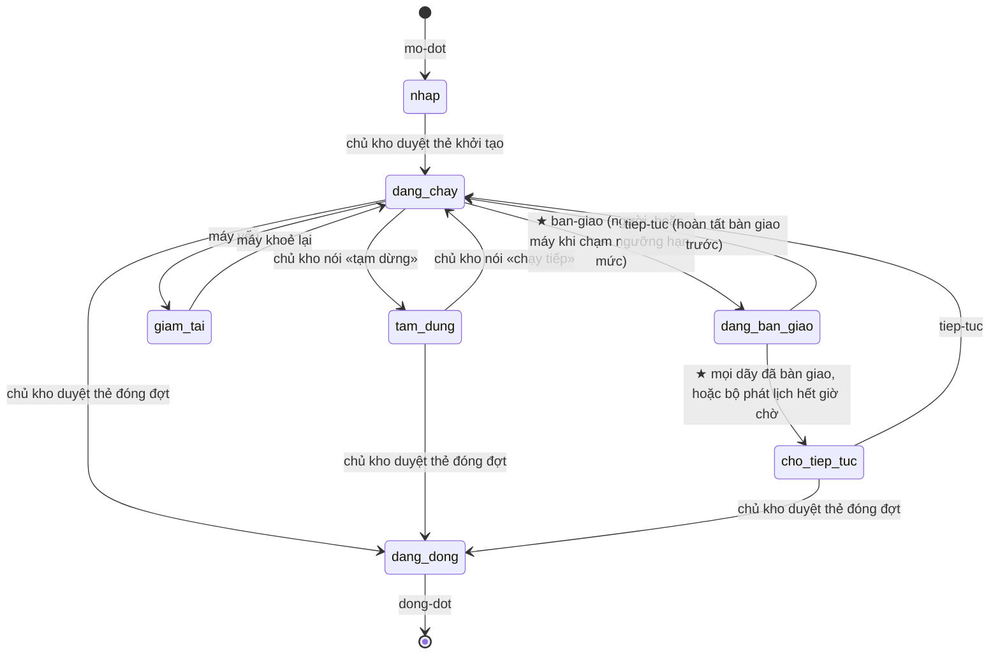

# Workflow Điều phối – Thợ trong kit — design

Gốc: [ô `dieu-phoi-tho-trong-kit`](../../../_acceptance/dieu-phoi-tho-trong-kit/opportunity.md) (Cổng
Đáng build 09/10) · chủ kho chọn «thiết kế trọn một lần» ngày 10/10 · spec phương pháp
[2026-10-05](2026-10-05-orchestrator-workers-hai-tang-design.md) §4.7–§4.12 · spec ô dù
[2026-10-09](2026-10-09-dieu-phoi-tho-trong-kit-design.md) · bản ghi nhu cầu 09/10 §3, §4.2.

Tài liệu này là **bản chung** cho ba hàng DP2 (mở và đóng đợt), DP3 (tiếp tục) và DP4 (đổi tài khoản).
Ba hàng làm theo đúng bản này, không mở thiết kế lại. Phương pháp 05/10 giữ nguyên. Tài liệu chỉ đưa
hành trình 05/10 vào hình dạng lệnh của kit, rồi thêm hai giai đoạn mới: **tiếp tục** và **đổi tài
khoản**. Ô đánh dấu **[chờ DP0]** sẽ được điền sau lần đổi tài khoản thật kế tiếp.

## 1. Nguyên tắc

1. **Mọi thứ cần để chạy tiếp nằm trong tệp, không nằm trong hội thoại.** Một phiên mới, dưới tài khoản
   nào cũng được, đọc tệp là đủ để chạy tiếp.
2. **Phần tính được do CLI Node làm.** Phiên Claude chỉ làm những việc mà chỉ công cụ của app làm được:
   Monitor, lịch hẹn, nhóm thanh bên, chip, tin liên phiên, đọc mức dùng.
3. **Mỗi tệp trao tay có đúng một bên viết, là CLI.** Khuôn của tệp nằm một chỗ có marker trong gói, và
   có ca round-trip: rút từ bên viết thật, đọc bằng bên đọc thật.
4. **Mọi lệnh chạy lại được.** Lệnh chẩn đoán trước, chỉ làm phần còn thiếu, rồi chẩn đoán lại. Chạy hai
   lần không sinh thêm gì.
5. **Nói tự nhiên là đủ** (05/10 §4.11). Tên lệnh để người nhớ được; anh nói «tiếp tục đợt» thì phiên
   giám sát gọi đúng lệnh đó.

## 2. Vai

| Vai | Là gì | Sống ở đâu | Sống qua đổi tài khoản? |
|---|---|---|---|
| Chủ kho | Người: mở đợt, quyết theo lô, ký cổng trong phiên thợ, đổi tài khoản, đóng đợt | — | — |
| Phiên giám sát | Một phiên Claude Code; chạy các lệnh `/dieu-phoi:…`, xử lý `can_phan` | Một worktree của kho; mã phiên ghi trong `vai.json` | Không. Phiên mới nhận vai qua «tiếp tục» |
| Phiên thợ | Mỗi dãy một phiên cấp cao nhất, chạy `/feature-loop` trên các hàng của dãy | Worktree riêng của dãy | Không. Phiên mới nối dãy qua chip «tiếp tục» |
| Bộ phát lịch | Tiến trình Node tách rời: khoá, hàng kế, sức khoẻ, sự kiện | Máy | Có. Tiến trình không gắn tài khoản (đo 08/10: sống qua lần cập nhật app) |
| Hook của gói | Chặn S4, chạm nhịp, ghi chờ người, ghi **nhịp sống** của phiên (§5.1); DP4 thêm hook hạn mức | Mỗi phiên của kho đã cài gói | Dự kiến có, vì gói cài theo kho chứ không theo tài khoản; **[chờ DP0]** câu 5 |
| Lịch 30′ | Lịch hẹn của app; mỗi lần chạy là một phiên mới, ngắn | `~/.claude/scheduled-tasks/` | **[chờ DP0]** |

## 3. Vòng đời đợt

Tám trạng thái. Bốn trạng thái của 05/10 giữ nguyên; hai trạng thái phụ của 05/10 giữ nguyên; thêm
hai trạng thái mới, đánh dấu ★.

| Trạng thái | Ai đặt | Bộ phát lịch cấp lượt mới? | Ghi ở |
|---|---|---|---|
| nháp | `mo-dot` | không | `dieu-khien.json` |
| đang chạy | duyệt thẻ khởi tạo · `tiep-tuc` · «chạy tiếp» | có | `dieu-khien.json` |
| tạm dừng | chủ kho | không; lượt đang chạy làm xong bước | `dieu-khien.json` |
| giảm tải | bộ phát lịch tự đặt | không cấp `s4`, `ghim-lai`, `duong-nen`; vẫn cấp `merge` | `trang-thai.json` (máy suy, như 05/10) |
| ★ đang bàn giao | `ban-giao` | không | `dieu-khien.json` |
| ★ chờ tiếp tục | `ban-giao` khi xong, hoặc **bộ phát lịch** khi hết `han_muc.cho_ban_giao_phut` | không | `dieu-khien.json` |
| đang đóng | duyệt thẻ đóng đợt | không; hoàn tất merge dở | `dieu-khien.json` |
| đã đóng | `dong-dot` | bộ phát lịch dừng, symlink gỡ, hook im | sự kiện cuối trong `su-kien.jsonl` |

`dieu-khien.json` chỉ do một mô-đun của lõi viết (`pha`), gọi từ CLI hoặc từ bộ phát lịch; không phiên nào sửa tay. Bộ phát lịch đọc nó mỗi nhịp, rồi
phản ánh trạng thái thật vào `trang-thai.json` và một sự kiện. Giảm tải là trạng thái máy suy ra, không
ghi vào `dieu-khien.json`, để hai bên không ghi đè nhau.

## 4. Lệnh

Mỗi lệnh `/dieu-phoi:…` là một lệnh của gói, chạy trong phiên giám sát, theo cùng một khuôn:
1. Gọi CLI `chan-doan --json`.
2. Làm đúng các mục mà chẩn đoán báo thiếu.
3. Gọi `chan-doan` lần nữa. Lệnh chỉ báo xong khi chẩn đoán không còn mục nào thiếu.

Phần CLI không cần app. Phần phiên dùng công cụ của app.

### 4.1 `/dieu-phoi:mo-dot <tên>` — hàng DP2

**Đầu vào:** gói đợt trong git của kho, mặc định `docs/plan/dot-<tên>/` (khuôn crm). Gói gồm:
- `dieu-phoi.config.json`;
- `hang-viec.json`, với mỗi dãy: id, worktree, nhánh, hàng;
- `LUAT-rieng.md`.

Đổi đường mặc định bằng đối số `--goi <thư mục>`. Kho chưa có gói đợt thì phiên giám sát khảo sát chỉ
đọc rồi dựng bản nháp, như 05/10 §4.11 giai đoạn 1.

| Bước | Ai | Việc |
|---|---|---|
| 1 | CLI `mo <tên> --goi <dir>` | Dựng thư mục đợt, chép gói đợt, ghép `LUAT.md` từ khuôn gói + `LUAT-rieng.md`, ghi `vai.json` (giám sát = phiên này), symlink, `pha nhap` |
| 2 | phiên | Trình **thẻ khởi tạo** (05/10): bảng dãy và hàng, ba quyết định có khuyến nghị (ưu tiên khi tranh chấp, làn veto, quyền tự merge), và **ngưỡng hạn mức** của đợt (§4.3) |
| 3 | chủ kho | Duyệt thẻ |
| 4 | CLI `pha dang-chay` rồi `chay` | Bộ phát lịch chạy |
| 5 | phiên | Giăng Monitor, tạo lịch 30′ (§5), dựng nhóm «Đợt <tên>» ở thanh bên, ghim phiên giám sát, mở chip cho từng dãy kèm lời ghi danh |
| 6 | CLI `chan-doan` | Không còn mục thiếu thì báo anh một dòng |

**Anh chạm:** một lệnh (hoặc một câu), một thẻ, N chip.

### 4.2 `/dieu-phoi:tiep-tuc` — hàng DP3

**Khi nào dùng:**
- app khởi động lại hoặc sập;
- phiên giám sát hết ngữ cảnh;
- Monitor hết hạn;
- sau một lần đổi tài khoản.

Chạy từ bất kỳ phiên nào trong kho. CLI tìm checkout chính qua `git --git-common-dir`.

| Bước | Ai | Việc |
|---|---|---|
| 1 | phiên | Gọi `get_usage`, ghi qua CLI `han-muc` (bắt buộc trước bước 6, §4.5) |
| 2 | CLI `chan-doan --json` | Kiểm và trả danh sách mục: có đợt không, đang ở trạng thái nào · bộ phát lịch sống không · giám sát trong `vai.json` có phải phiên này không · có `ban-giao.json` không · mỗi dãy: worktree còn, nhánh, trạng thái hồ sơ, **có nhịp sống mới không** (§5.1 — không dùng `list_sessions`, vì danh sách đó tách theo tài khoản), còn giữ khoá, còn đơn, còn yêu cầu chưa trả lời · hook của gói đã bắn trong chính phiên này chưa · việc chờ người, gồm `can_phan` chưa xử · môi trường (`gh` đã đăng nhập, remote, bản gói bằng bản lúc mở đợt) |
| 3 | CLI `vai --giam-sat <mã phiên>` | Phiên này nhận vai giám sát; mã cũ giữ trong lịch sử của `vai.json` |
| 4 | CLI `chay` | Chạy lại bộ phát lịch nếu đã chết |
| 5 | phiên | Giăng lại Monitor; tạo lại lịch 30′ và nhóm thanh bên nếu thiếu (sau đổi tài khoản thì có thể thiếu **[chờ DP0]**). Mỗi dãy: có nhịp sống mới (dưới 10′) hoặc còn giữ khoá → **không mở chip**; nếu dãy ấy còn đơn, khoá hay yêu cầu đang chờ thì nhắn nó «tiếp tục: giăng lại lệnh chờ» (lệnh nền chờ khoá chết theo app). Không có nhịp sống và không giữ khoá → mở chip, lời ghi danh dựng từ trạng thái sống của dãy (git + `status` hồ sơ + `tiep/`), `ban-giao.json` chỉ là lớp phủ khi mã bàn giao còn mở |
| 6 | CLI `pha dang-chay` | Đang «đang bàn giao» thì trước hết hoàn tất bàn giao (CLI `ban-giao`). Đang «chờ tiếp tục» thì chuyển `ban-giao.json` vào `ban-giao/lich-su/<mã>.json` và đánh dấu đã tiếp tục. Mức dùng của tài khoản hiện tại đã vượt `bao_truoc_pct` thì không chuyển, khuyên chờ đặt lại |
| 7 | CLI `chan-doan` | Báo anh một khối: «đợt X chạy lại · k dãy cần bấm chip · việc chờ anh: …» |

**Dạng nhẹ `--nhe`:** chỉ làm bước 2, 4, 5 phần Monitor, và bước 7. Phiên giám sát chạy dạng này mỗi lần
thức, nên Monitor hết hạn được giăng lại ngay trong lần thức kế.

**Anh chạm:** một lệnh. Thêm một chip cho mỗi dãy không còn phiên sống. Sau khi app khởi động lại mà
phiên thợ vẫn sống thì không cần chip nào.

### 4.3 `/dieu-phoi:ban-giao [lý do]` — hàng DP4

**Ba đường kích hoạt:**
- **Anh nói** «bàn giao» hoặc gõ lệnh.
- **Máy tự chạy** khi mức dùng chạm `han_muc.ban_giao_pct`. Ngưỡng khai trong cấu hình đợt và anh duyệt ở
  thẻ khởi tạo, nên lần chạy này không hỏi lại. Trước đó, khi mức dùng chạm `han_muc.bao_truoc_pct`, máy
  báo anh một dòng và không làm gì thêm. Mức dùng đọc theo §4.5.
- **Lưới cuối:** một thợ chết vì hạn mức, nhận biết bằng hook `StopFailure` với `error: "rate_limit"`
  **[chờ DP0]**. Hook (mã Node, không cần model) commit WIP ở worktree đó và ghi dấu cho dãy.

| Bước | Ai | Việc |
|---|---|---|
| 1 | CLI `pha dang-ban-giao` | Bộ phát lịch ngừng cấp lượt mới, kể cả đơn đã nằm trong `xin/` |
| 2 | phiên | Nhắn từng phiên thợ: «bàn giao: dừng ở ranh giới gần nhất, commit WIP, đẩy nhánh, rồi chạy `ban-giao-xong`». Còn cùng tài khoản nên tin liên phiên dùng được |
| 3 | phiên thợ | CLI `ban-giao-xong <dãy>` từ chối khi cây còn tệp chưa commit, nhánh chưa đẩy, hoặc còn đơn trong `xin/`, và nêu tên từng thứ. Dãy đang chạy S4 thì KHÔNG báo xong: nó được xếp «đang xong» và giữ khoá tới khi lượt hết |
| 4 | CLI `ban-giao`, hoặc **bộ phát lịch** khi hết `han_muc.cho_ban_giao_phut` | Dựng `ban-giao.json` **từ git và thư mục đợt**, không do model soạn; cùng một hàm dựng mục dãy với `tiep-tuc`. Đồng hồ chờ do bộ phát lịch giữ, vì nó không tốn hạn mức: giám sát cạn hạn mức giữa chừng thì đợt vẫn tự sang «chờ tiếp tục». Dãy chưa xong ghi «dở», dãy đang S4 ghi «đang xong» |
| 5 | `pha cho-tiep-tuc` | Đợt chuyển sang «chờ tiếp tục» khi không còn khoá `s4` nào giữ, hoặc nhịp của khoá đã cũ |
| 6 | phiên | Báo anh và đẩy thông báo: «Đã bàn giao đợt X lúc HH:MM. Đổi tài khoản, rồi mở một phiên trong kho và gõ `/dieu-phoi:tiep-tuc`.» |

**Luật với lượt chấm đang chạy:** không commit WIP vào một worktree có lượt S4 đang chạy. Kit đọc mọi
thay đổi cây giữa lượt là «cây đổi trong lượt chấm» (mã 6), và lượt ấy mất. Dãy đang S4 giữ khoá và
được xếp «đang xong»; `tiep-tuc` không mở chip cho dãy còn giữ khoá hay còn nhịp sống. Lượt chết giữa
chừng (phiên cạn hạn mức) không ghi dòng nào vào sổ chạy, nên lượt kế tự ra cùng round. Kit đếm lượt
từ sổ chạy, không từ `ban-giao.json`: tệp bàn giao chỉ ghi gợi ý cho phiên nối, không ai đếm từ nó (đo
lại ca này trong DP4).

**Anh chạm, mỗi lần đổi:** đăng nhập tài khoản kia, một lệnh `tiep-tuc`, N chip. Anh không phải kể lại
câu nào.

### 4.4 `/dieu-phoi:dong-dot` — hàng DP2

Giữ nguyên giai đoạn 5 của 05/10:
1. Anh duyệt thẻ đóng đợt.
2. CLI `pha dang-dong`: hoàn tất merge dở.
3. CLI `dong`: dừng bộ phát lịch, gỡ symlink, hook im.
4. Phiên: xoá lịch 30′, lưu trữ phiên thợ, dọn worktree đã gộp (kiểm `git status --porcelain` trước), viết
   báo cáo đợt.

### 4.5 Đọc mức dùng — hàng DP4

Ba nguồn, theo thứ tự ưu tiên, cùng ghi vào `han-muc.json` qua CLI `han-muc`:
- **Mod của gói** (§12, khi app ≥ 2.1.286): sự kiện `session.measure` bắn mỗi khi một cửa sổ hạn mức nhích
  một điểm; mod đọc `$.session.usage().rateLimits` (`five_hour`, `seven_day`, `percentUsed`) rồi gọi CLI
  `han-muc`. Không tốn lượt model, không phải sửa cài đặt người dùng, có số cả khi giám sát đang ngủ.
  Tài liệu kiểu của bản 2.1.293 ghi các trường này; còn phải thấy chúng có số trên app desktop **[chờ DP0]**.
- **Phiên giám sát**, mỗi lần thức: gọi `get_usage` (đã chạy thật 09/10), rồi gọi CLI `han-muc` với các số
  đọc được.
- **Lệnh dòng trạng thái** ghi trường `rate_limits` mỗi lượt. Chỉ dùng nếu mod không chạy được, vì thêm
  lệnh này là sửa cài đặt người dùng và cần anh đồng ý riêng.

Phiên ngắn của lịch 30′ cũng gọi `get_usage` rồi `han-muc`, để mức dùng có số mới cả khi giám sát đang
ngủ. Mỗi lần đọc ghi kèm mã phiên đã đọc và lúc đọc. Bộ phát lịch bỏ số cũ hơn 35′, và bỏ số đọc trước
lần nhận vai giám sát gần nhất (đổi tài khoản luôn đi qua `tiep-tuc`, nên số của tài khoản cũ không bao
giờ kích hoạt bàn giao lần nữa).

Bộ phát lịch so `han-muc.json` với hai ngưỡng ở mỗi nhịp, rồi phát `can_phan` loại `gan-han-muc` hoặc
`cham-han-muc`. Hai cửa sổ (5 giờ, tuần) xét riêng; cửa sổ nào chạm trước thì kích hoạt.

Trước khi bàn giao, máy so «chờ đặt lại» với «đổi tài khoản» theo chính sách anh duyệt ở thẻ khởi tạo:
nếu cửa sổ chạm trước sẽ đặt lại trong vòng `han_muc.cho_dat_lai_phut`, máy **tự chờ** (tạm dừng cấp
lượt) và báo một dòng, không hỏi. Lý do: đổi tài khoản tốn N chip, chờ thì không tốn chạm nào.

**Đường lùi nếu DP0 ra kết quả xấu nhất** (không có `rate_limits` trên app): chỉ còn đọc theo nhịp thức
(≤ 30′). Khi đó máy hạ `ban_giao_pct` xuống bằng ngưỡng khai trừ đi tốc độ đốt đo được nhân 30′, để còn
đủ hạn mức cho các thợ commit WIP.

## 5. Đánh thức phiên giám sát

Ngày 08/10, Monitor hết hạn trong lúc chờ anh trả lời, và hai việc bị lỡ 5 giờ. Lịch 30′ của 05/10 không
đánh thức được phiên giám sát: mỗi lần lịch chạy là một phiên mới.

Thiết kế mới:
- Mỗi lần thức, phiên giám sát chạy `tiep-tuc --nhe`. Lệnh này ghi nhịp thức `vai.json.giam_sat.thuc_luc`
  và giăng lại Monitor.
- Lịch 30′ chạy một phiên ngắn. Phiên đó gọi `chan-doan --json`. Nếu nhịp thức của giám sát cũ hơn 40′
  trong khi còn `can_phan` chưa xử, phiên ngắn gửi tin liên phiên tới phiên giám sát: «thức: chạy
  `/dieu-phoi:tiep-tuc --nhe`». Theo docs, một phiên đang rảnh nhận tin thì bắt đầu một lượt mới.
- Phiên giám sát không còn sống, tức không có nhịp sống (§5.1) cho mã phiên trong `vai.json` quá 10′: phiên ngắn
  đẩy thông báo cho anh kèm đúng câu `/dieu-phoi:tiep-tuc`.

Kết quả: quãng lỡ có trần khoảng 30′. Phần tin liên phiên phải đo trong DP3 trước khi tin.

**Một vai giám sát tại một thời điểm.** `tiep-tuc` chạy ở phiên mới trong khi phiên giám sát cũ còn sống
(ví dụ anh mở phiên mới vì phiên cũ chậm): `vai.json` chuyển vai sang phiên mới. Mỗi lần thức, phiên giám
sát so mã phiên của mình với `vai.json`; nếu khác, nó thôi vai: dừng Monitor, không ghi gì vào thư mục
đợt, báo một dòng «phiên này đã thôi giám sát đợt X». Lệnh con ghi của CLI cũng từ chối khi mã phiên gọi
không phải giám sát hiện tại, với các tệp chỉ giám sát được ghi (`tra-loi/`, `pha`, `vai`).

**Lúc không có giám sát** (trạng thái chờ tiếp tục, hoặc giám sát chết): bộ phát lịch vẫn chạy và vẫn ghi
`can_phan`. `chan-doan` của lần tiếp tục kế liệt kê các `can_phan` chưa xử, cũ nhất trước.

### 5.1 Nhịp sống của phiên — không phụ thuộc tài khoản

`list_sessions` chỉ thấy phiên của tài khoản hiện tại, nên không dùng được để biết một dãy còn phiên
sống sau lần đổi. Hook `PostToolUse` của gói ghi `song/<mã phiên>.json` (dãy, worktree, lúc) ở mỗi lời gọi
công cụ. Một dãy «có phiên sống» khi có tệp nhịp mới hơn 10′ cho worktree của nó. `chu.json` của khoá ghi
thêm mã phiên, không chỉ mã dãy. Bộ phát lịch: khoá vừa cấp mà trong 10′ không có nhịp của đúng phiên giữ
→ `can_phan` (lệnh nền chờ khoá của thợ đã chết theo app).

## 6. Tệp trao tay

Mọi tệp nằm trong thư mục đợt. Khuôn đặt trong `dieu-phoi/scripts/mau/` có marker; mỗi tệp có một ca
round-trip.

| Tệp | Bên viết | Bên đọc | Giữ gì | Hàng dựng |
|---|---|---|---|---|
| `vai.json` | CLI `mo`, `vai` | `chan-doan`, phiên ngắn của lịch 30′ | Giám sát hiện tại (mã phiên, worktree, `thuc_luc`) và lịch sử nhận vai; mỗi dãy: id, worktree, mã phiên đã ghi danh | DP2 |
| `dieu-khien.json` | CLI `pha` | bộ phát lịch, `chan-doan` | Trạng thái do người hoặc lệnh đặt; ai đặt, lúc nào, lý do | DP2 |
| `ban-giao.json` | CLI `ban-giao` hoặc bộ phát lịch, qua cùng một hàm | `tiep-tuc`, lời ghi danh của chip | Mã bàn giao, trạng thái (mở / đã tiếp tục), đợt, lúc, lý do, sha nhánh chính; mỗi dãy: hàng, slug, trạng thái hồ sơ, nhánh, đỉnh, đã đẩy, có commit WIP, «chấm lại cùng round», việc chờ người; khoá và đơn lúc bàn giao | DP4 |
| `han-muc.json` | CLI `han-muc` | bộ phát lịch | Nguồn, mã phiên đã đọc, % hai cửa sổ, giờ đặt lại, lúc đọc | DP4 |
| `song/<mã phiên>.json` | hook `PostToolUse` | `chan-doan`, bộ phát lịch | Dãy, worktree, lúc | DP3 |
| `ban-giao/lich-su/<mã>.json` | CLI `tiep-tuc` | người đọc khi soát | Các bàn giao đã dùng | DP4 |
| Đầu ra `chan-doan --json` | CLI | ba lệnh, phiên ngắn của lịch | Danh sách mục `{muc, trang_thai, viec}` | DP2 (khung), DP3 (đủ) |

`ban-giao.json` do máy dựng từ git và thư mục đợt, không do model soạn. Lý do: bên viết và bên đọc của
một vật do model soạn từng trôi khỏi nhau (luật kit «thước gắn vào vật»).

## 7. Hành trình của anh — bảng đếm chạm

Đếm theo từng bước của §4. «Trong thiết kế» là chạm anh quyết; «duyệt của app» là hộp xin quyền mà app
hiện khi phiên giám sát chạy ở chế độ quyền mặc định (dựng nhóm, ghim, đổi tên phiên — 05/10 §4.11 đã
ghi). Chế độ auto cho riêng phiên giám sát thì cột này về 0; đó là lựa chọn của anh, chưa đổi.

| Giai đoạn | Chạm trong thiết kế | Duyệt của app (chế độ mặc định) | So với hôm nay |
|---|---|---|---|
| Lần đầu trên một kho | 1: đồng ý thêm lệnh dòng trạng thái (§4.5), nếu DP0 cho thấy đường này sống | — | — |
| Mở đợt | 2 + N: một lệnh hoặc câu · duyệt thẻ khởi tạo (gồm chính sách hạn mức) · N chip | vài lần: dựng nhóm, ghim, đặt tên | Sáu bước tay, 7 tin + 7 chip (04/10) |
| Chạy | 0 | 0 | 20 tin «kiểm tra» (04/10) |
| Quyết theo lô | theo cổng thiết kế | — | Không đổi |
| Sự cố: app sập, hết ngữ cảnh | 1 + số dãy không còn nhịp sống | vài lần nếu phải dựng lại nhóm | 37 việc nền giăng tay (09/10) |
| Gần hạn mức, cửa sổ sắp đặt lại | 0: máy tự chờ theo chính sách đã duyệt | 0 | — |
| Đổi tài khoản | 2 + N: đăng nhập tài khoản kia · một lệnh `tiep-tuc` · N chip | vài lần: dựng lại nhóm, ghim (thanh bên tách theo tài khoản) | Bàn giao tay bằng tệp nhớ (05–06/10) |
| Đóng đợt | 1: duyệt thẻ đóng đợt | — | Chưa có nghi thức |

## 8. Một dãy qua một lần đổi tài khoản

1. Phiên thợ P2 đang ở S3 của hàng K3.
2. Nhận tin bàn giao, P2 commit WIP (`wip(ban-giao): …`), đẩy nhánh, chạy `ban-giao-xong P2`.
3. Anh đổi tài khoản. Phiên P2 cũ không còn trong thanh bên của tài khoản mới **[chờ DP0]**.
4. `tiep-tuc` mở chip «P2 · tiếp tục K3». Lời ghi danh gồm: thư mục đợt, «đọc `LUAT.md`», mục P2 trong
   `ban-giao.json`, và lệnh `/feature-loop:feature-loop <slug của K3>`.
5. Phiên mới nối theo `status` của hồ sơ (cơ chế sẵn có của feature-loop). Commit WIP ở lại trong lịch
   sử nhánh; gộp commit lúc mở PR là tuỳ.
6. Nếu lúc bàn giao P2 đang ở S4: P2 giữ khoá, được xếp «đang xong», và không có chip mới cho P2 chừng nào
   còn nhịp sống hoặc còn giữ khoá. Lượt chết giữa chừng không ghi sổ chạy, nên lượt kế ra cùng round.

## 9. Chia việc cho ba hàng

| Hàng | Làm các mục | Tệp dựng |
|---|---|---|
| DP2 | §4.1, §4.4, §3 (trạng thái nháp, đang chạy, tạm dừng, đang đóng), khung `chan-doan`, lệnh `/dieu-phoi:xem`, các câu thường của §13 | `vai.json`, `dieu-khien.json` |
| DP3 | §4.2, §5, §5.1, lệnh con ghi qua CLI (spec ô dù §2.3), `chan-doan` đủ mục | `song/` |
| DP4 | §4.3, §4.5 (gồm mod đọc mức dùng ở §12.2), trạng thái ★, đồng hồ bàn giao trong bộ phát lịch, hook hạn mức | `ban-giao.json`, `ban-giao/lich-su/`, `han-muc.json` |
| DP6 | §12: khung trạng thái đợt, chặn S4 bằng mod, tự bắt việc chờ người | — |

Thứ tự: DP2 và DP3 đi song song sau DP1. DP4 đi sau DP3 và sau DP0. DP6 đi sau DP3 (cần nhịp sống và lệnh con ghi qua CLI); nó không nằm trong ngưỡng SỐNG của ô nên không chặn timebox 31/10.

## 10. Giới hạn đã khai, kèm ngưỡng đang đếm

- **Chip thợ cần người bấm.** App khoá `start_session`. Ngưỡng mở lại: app cho phiên mở phiên mà không
  cần người bấm.
- **Tin liên phiên chỉ trong cùng tài khoản, cùng máy.** Bàn giao gửi tin lúc còn ở tài khoản cũ nên
  dùng được. Sau khi đổi, phiên cũ không còn nhận tin; nghiệm là mở phiên mới.
- **Thanh bên tách theo tài khoản** (suy từ cấu trúc đĩa 09/10, chờ DP0 xác nhận). `tiep-tuc` dựng lại
  nhóm nếu thiếu.
- **Một máy.** Nhiều máy và chuyển máy vẫn hoãn, như ô dù.
- **Đánh thức có trần khoảng 30′, không tức thì,** khi Monitor đã hết hạn. Ngưỡng mở lại: ≥2 lần một
  `can_phan` nằm quá 45′ không ai xử.

## 11. Câu hỏi giao cho DP0

| # | Câu hỏi | Ảnh hưởng mục |
|---|---|---|
| 1 | Sau khi đổi tài khoản, phiên cũ, nhóm thanh bên, lịch 30′ còn hiện và còn chạy không? | §2, §4.2 bước 5, §8 bước 3 |
| 2 | Trường `rate_limits` của dòng trạng thái có trên app desktop không, và có khớp `get_usage` không? | §4.5 |
| 3 | Hook `StopFailure` có bắn với `error: "rate_limit"` khi một lượt chết vì hạn mức không? | §4.3 lưới cuối |
| 4 | Phiên đang rảnh nhận tin liên phiên thì có bắt đầu lượt mới không? (Đo trong DP3, không cần đổi tài khoản) | §5 |
| 5 | Sau khi đổi tài khoản, gói `dieu-phoi` và hook của nó còn nạp trong phiên mới của kho không? Nếu không, lệnh `tiep-tuc` cũng không có | §2, §4.2 |
| 6 | `$.session.usage().rateLimits` của mod có số trên app desktop không, và có khớp `get_usage` không? | §4.5, §12.2 |

## 12. Lớp mod (Mods của Claude Code)

Chủ kho đồng ý đưa vào ngày 10/10, theo bản ghi nhu cầu §5 mục 6 (giám sát crm chuyển lời). Mod là
plugin có hàm chạy trong tiến trình Claude Code: nghe sự kiện, giữ hoặc sửa một lần gọi công cụ, vẽ khung,
thêm lệnh. Cần app desktop ≥ 2.1.286 hoặc CLI ≥ 2.1.287 (máy đang 2.1.293). Mod nằm ngay trong gói
`dieu-phoi`: `hooks/hooks.json` khai được cả `hooks` (hook thường) lẫn `modules` (mod).

### 12.1 Luật an toàn — máy giữ, không dặn bằng lời

Mod không có sandbox, chạy bằng quyền người dùng, và về kỹ thuật **tự duyệt được** một lần gọi công cụ, kể
cả lần đã bị luật `ask` hay hook chặn. Mod của kit chỉ được quan sát, giữ lại kèm lời từ chối, hoặc vẽ;
**không bao giờ trả lời «cho phép»** cho `tool.call` hay `PermissionRequest`. Răng:
- Mỗi lần phát hành chạy `claude plugin validate` trên gói. Bộ kiểm liệt kê mọi sự kiện và lời gọi của mod.
- Một ca quét mã nguồn mod: mọi nhánh trả kết quả cho `tool.call` và `PermissionRequest` chỉ là `deny` hoặc
  `next(e)` nguyên vẹn. Chiều đỏ: bản sao thêm một nhánh `allow` → đỏ, nêu tệp và dòng.

### 12.2 Bốn chỗ dùng

| Chỗ | Mod làm gì | Thay cho | Hàng |
|---|---|---|---|
| Đọc mức dùng | Nghe `session.measure`, đọc `rateLimits`, gọi CLI `han-muc` | Giám sát gọi `get_usage` mỗi lần thức; lệnh dòng trạng thái | DP4 |
| Khung trạng thái đợt | Khung cạnh hội thoại ở phiên giám sát (và dải trên ô nhập ở phiên thợ): ai giữ khoá S4 và hạn tới đâu, hàng chờ khoá, hàng gộp, việc chờ người kèm dòng lệnh, giảm tải. Đọc `trang-thai.json`; không ghi gì | Mở `bang.html`, hỏi giám sát | DP6 |
| Chặn S4 | Nghe `tool.call` của Workflow và Bash; phân loại bằng cấu trúc của lời gọi (đường script của Workflow, tách đối số của Bash), không so chuỗi con. Không có lượt → ghi đơn `xin/` qua CLI rồi trả `deny` kèm lời dặn chờ. Không bao giờ hỏi người: hỏi người là thêm một chạm | `hook-chan-s4.mjs` so chuỗi con, đã chặn nhầm một lệnh chỉ đọc của giám sát (10/10) | DP6 |
| Tự bắt việc chờ người | Ở phiên thợ: nghe `PermissionRequest` (gồm tác tử của Workflow nếu sự kiện bắn cho chúng) và `turn.complete` kết thúc bằng một câu hỏi → ghi `cho-nguoi/` hoặc đơn `can-nguoi` qua CLI, và báo giám sát bằng `session.send` | Giám sát so `started` với `result` trong `journal.jsonl` (đêm 09–10/10: S4 của K3b đứng 2 giờ 30 vì hộp duyệt quyền; luật 52) | DP6 |

Hook thường của DP1 ở lại, kể cả khi mod chạy, và không bao giờ nhường. Bộ phân loại «lệnh này có phải
S4 không» là MỘT hàm của lõi, hook và mod cùng gọi; sửa lỗi chặn nhầm là sửa hàm đó, nên hook cũng hết
chặn nhầm. Hai bên cùng chặn một lời gọi thì vô hại, vì cùng một quyết định. Còn nếu hook nhường theo một
dấu do mod ghi, một mod hỏng sau khi ghi dấu sẽ thành cửa mở.

### 12.3 Chưa kiểm — đo trong DP6 trước khi tin

1. Mod có nhận `PermissionRequest` và `tool.call` của tác tử con bên trong một Workflow không? Tài liệu kiểu
   ghi `agent.spawn` bắn cho tác tử Workflow, nhưng chưa ghi hộp duyệt của chúng.
2. Khung của mod có hiện cho phiên mở từ chip không, và ở bề rộng nào? Khung mở không do người bấm chỉ ngồi
   vào khi đủ 144 cột ở terminal.
3. Tin `session.send` có tới khi phiên nhận đang giữa lượt không? Tin liên phiên của đợt crm hay bị giữ tới
   hết lượt.
4. Mod ở phiên giám sát có tự đánh thức được phiên đó (thay cho Monitor) không? Nếu được, §5 bỏ được Monitor.

## 13. Anh tương tác thế nào — theo giai đoạn

Ba cách anh tác động lên đợt, và chỉ ba cách:
- **Nói câu thường** với phiên giám sát. Đây là cách chính (05/10 §4.11, nguyên tắc 5). Phiên giám sát tự
  dịch câu thành lệnh.
- **Gõ lệnh `/…`.** Lệnh là tên tắt của đúng việc mà câu thường làm. Lệnh hữu ích khi anh mở một phiên mới
  chưa biết gì, vì câu thường ở đó chưa có ai hiểu là việc của đợt.
- **Bấm trong app:** chip thợ, đăng nhập tài khoản, mở phiên có chấm «cần anh».

Anh không bao giờ gõ lệnh `node …` của CLI, không sửa tệp JSON nào, không giăng Monitor.

| Giai đoạn | Anh gõ câu thường | Hoặc gõ lệnh | Ở phiên nào | Máy đáp |
|---|---|---|---|---|
| Lần đầu cho một kho | — | `claude plugin install dieu-phoi@acceptance-gate-kit --scope project` (ở terminal), cùng một gói đợt `docs/plan/dot-<tên>/` trong git của kho | — | Kho đã bật; hook im tới khi có đợt |
| Khởi tạo | «Mở đợt sau-14-10: K2–K4 và làn Deal, mốc 07/12» | `/dieu-phoi:mo-dot sau-14-10` | Một phiên mới trong kho; phiên này thành giám sát | Thẻ khởi tạo (dãy, hàng, ưu tiên khi tranh chấp, quyền tự merge, chính sách hạn mức). Anh trả «duyệt» rồi bấm N chip |
| Đang chạy — xem | «Đợt đang thế nào?» | `/dieu-phoi:xem` | Phiên giám sát, hoặc bất kỳ phiên nào trong kho | Một khối trạng thái. Có lớp mod (DP6) thì khung hiện sẵn, và `/dieu-phoi:xem` trả lời ngay không tốn lượt model |
| Đổi kế hoạch | «Đẩy K3 lên trước K2» · «Thêm việc X cho P2» · «Cho P4 nghỉ» · «Tạm dừng đợt» / «Chạy tiếp» | — | Phiên giám sát | Một dòng xác nhận; bộ phát lịch áp từ nhịp kế |
| Quyết theo lô | Trả lời câu hỏi của thợ ngay trong phiên thợ | Lệnh cổng mà thẻ in sẵn, ví dụ `/acceptance-gate:approve <slug> duyệt` | Phiên thợ có chấm «cần anh» (thông báo dẫn thẳng tới) | Thợ chạy tiếp; tệp chờ người tự xoá |
| Resume sau app sập, phiên giám sát chết | «Tiếp tục đợt» | `/dieu-phoi:tiep-tuc` | Một phiên mới trong kho, hoặc phiên giám sát cũ nếu còn | Một khối: đã dựng lại gì, dãy nào cần bấm chip, việc chờ anh |
| Resume sau hết ngữ cảnh | Không gõ gì: phiên tự nén ngữ cảnh rồi chạy tiếp, và mỗi lần thức đã chạy `tiep-tuc --nhe` | — | — | — |
| Sắp hết hạn mức | Không gõ gì | — | — | Một dòng báo trước. Cửa sổ sắp đặt lại thì máy tự chờ; nếu không, máy tự bàn giao |
| Bàn giao chủ động | «Bàn giao, tôi đổi tài khoản» | `/dieu-phoi:ban-giao` | Phiên giám sát | «Đã bàn giao lúc HH:MM. Đổi tài khoản, rồi gõ `/dieu-phoi:tiep-tuc`» |
| Đổi tài khoản | Đăng xuất, đăng nhập tài khoản kia (trong app), rồi «tiếp tục đợt» | `/dieu-phoi:tiep-tuc` | Một phiên mới trong kho | Như Resume; bấm chip cho các dãy |
| Đóng đợt | «Đóng đợt» | `/dieu-phoi:dong-dot` | Phiên giám sát | Thẻ đóng đợt; anh trả «duyệt» |

Lệnh `/dieu-phoi:xem` là lệnh thứ năm. Nó chỉ đọc, nên nằm ở DP2; khi có lớp mod (DP6), nó thành lệnh của
mod và trả lời không qua model.
