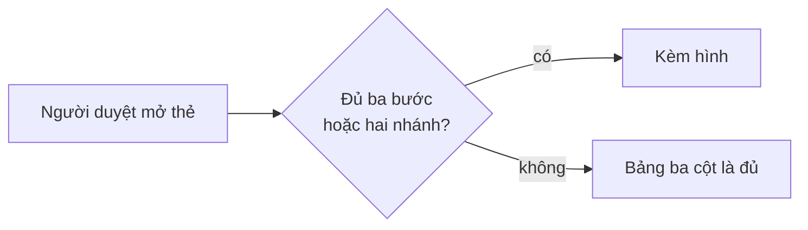

# Ngôn ngữ mặt người — luật bắt buộc khi trình cho người

Nguồn quyết định: `docs/specs/workflow-v2-spec.md` §4.1 (Manh, 2026-08-01).
File này là **bản thi hành**: bộ dựng thẻ, bảng tóm tắt kế hoạch và báo cáo
checkpoint NẠP file này trước khi viết chữ đầu tiên cho người đọc. Mỗi lần
render là một lần đọc — luật không sống trong trí nhớ.

## Áp ở đâu — và KHÔNG áp ở đâu

**ÁP** cho mọi thứ trình cho người để đọc/quyết: thẻ cổng, bảng tóm tắt kế
hoạch, báo cáo checkpoint và tổng kết, tin nhắn tại điểm quyết định, handbook,
release notes.

**KHÔNG ÁP** cho mặt máy: `evals.yaml`, `run-log.jsonl`, frontmatter, phần
Given/When/Then của `contract.md`, mã nguồn, thông điệp lỗi của script, tên
file. Ở đó **tên chính xác là bắt buộc** — "dịch cho dễ đọc" một khoá
frontmatter hay một `id:` của eval là làm hỏng hợp đồng máy, không phải làm
tốt cho người.

## Sáu luật

<!-- <<<HFL-LAW-TABLE -->
| # | Luật |
|---|---|
| N1 | **Chủ ngữ là người dùng hoặc sản phẩm, không phải file.** Câu nói *người dùng sẽ thấy gì khác*, không nói *sửa gì ở đâu*. |
| N2 | **Tên kỹ thuật (file/hàm/biến/bảng) xuống cột phụ hoặc ngoặc** — không bao giờ làm chủ ngữ. |
| N3 | **Mã số là tra cứu, không phải nội dung.** Lần đầu xuất hiện ở mặt người phải kèm 3–5 chữ nói nó là gì. |
| N4 | **Một dòng một ý** — không nhồi nhiều việc vào một ô bằng dấu phân cách. |
| N5 | **Hình trước, chữ là chú thích** tại mọi điểm quyết định (bảng có cột rõ · sơ đồ · bản bấm được). Câu hỏi cho người phải trả lời được bằng có/không hoặc a/b. |
| N6 | **Không dùng biệt ngữ nội bộ chưa có trong từ điển sản phẩm.** |
<!-- HFL-LAW-TABLE>>> -->

**Ngưỡng kích hoạt sơ đồ (N5):** điểm quyết định có **từ ba bước nối tiếp hoặc
từ hai nhánh rẽ trở lên** thì bắt buộc kèm sơ đồ; ít hơn thì bảng ba cột là đủ.
Ngưỡng này đếm được — liếc là biết, không phải phán.

**Từ điển sản phẩm sống ở đâu (N6):** `CONTEXT.md` ở gốc kho đang làm. Từ chưa
có mục trong đó thì hoặc thêm mục trước, hoặc viết bằng chữ thường ai cũng
hiểu. "Từ điển sản phẩm" không phải một khái niệm trừu tượng — nó là một file.

## Hai phép thử (rẻ, làm được trong vài giây)

- **Xoá-tên-máy**: xoá hết tên file/hàm/biến/mã số khỏi câu — còn nghĩa cho
  người không đọc code thì ĐẠT; thành rỗng hoặc mơ hồ thì viết lại.
- **Người-thứ-ba**: một người trong đội không đọc code kể lại được *"sau việc
  này người dùng thấy gì khác"* không?

## Ví dụ TRƯỚC/SAU

| Luật | TRƯỚC (ngôn ngữ máy) | SAU (ngôn ngữ mặt người) |
|---|---|---|
| N1 | Bộ dựng thẻ đọc thêm khoá độ phủ từ hợp đồng | Người duyệt thấy ngay bộ tiêu chí đã phủ hết những gì |
| N2 | Sửa bước lập kế hoạch trong SKILL của vòng lặp | Bước trình kế hoạch nạp bản luật trước khi viết (trong SKILL của vòng lặp) |
| N3 | Phục vụ AC-7, E12 | Phục vụ AC-7 (luật chỉ nằm một chỗ) và E12 (khuôn áp mọi lần trình) |
| N4 | Thêm marker, sửa bên đọc, thêm phép đo, chạy đóng gói | Bốn dòng riêng, mỗi dòng một việc |
| N5 | Ba đoạn văn mô tả một luồng có ba nhánh | Một sơ đồ ba nhánh, chữ là chú thích dưới hình |
| N6 | Bật CT-S cho slug này | Bật lưới chống sót tiêu chí cho việc này |

## Khuôn bảng tóm tắt kế hoạch

Dùng cho MỌI lần trình kế hoạch hoặc tiến độ cho người. Cột một phải qua được
phép thử Xoá-tên-máy. Một dòng một việc — cấm nhồi nhiều việc vào một ô bằng
dấu chấm giữa hay dấu chấm phẩy.

<!-- <<<PLAN-SUMMARY-TABLE-TEMPLATE -->
| Người dùng thấy gì khác | Đụng đâu | Phục vụ tiêu chí |
|---|---|---|
| <một câu, chủ ngữ là người dùng hoặc sản phẩm> | `<tên kỹ thuật>` | <mã> (<3–5 chữ nói nó là gì>) |
| Người duyệt đọc được bảng kế hoạch bằng tiếng sản phẩm | `human-facing-language.md` | AC-1 (bản luật đủ sáu điều) |
<!-- PLAN-SUMMARY-TABLE-TEMPLATE>>> -->

## Hình tại điểm quyết định

Vượt ngưỡng N5 thì bắt buộc có hình. **Hình là thứ người nhận NHÌN THẤY, không
phải một định dạng.** Chọn cách vẽ theo mặt phẳng đang trình, không theo thói
quen — tra bảng dưới đây.

Danh sách đóng các cơ chế vẽ:
`hình vẽ nội tuyến của phiên` ·
`trang HTML gửi kèm` ·
`hình bằng ký tự trong khối mã` ·
`khối mermaid`.

<!-- <<<DECISION-DIAGRAM-SURFACES -->
| Mặt phẳng đang trình | Vẽ bằng | Mặc định |
|---|---|---|
| Khung hội thoại | hình vẽ nội tuyến của phiên | ✔ mặc định |
| Panel bên hoặc file mở được | trang HTML gửi kèm | khi cần soi lâu, cần cuộn |
| Terminal thuần | hình bằng ký tự trong khối mã | chốt cuối, luôn chạy |
| Tài liệu trong kho | khối mermaid | khi hình sống trong tài liệu |
<!-- DECISION-DIAGRAM-SURFACES>>> -->

<!-- <<<DECISION-PICTURE-TEST -->
**Phép thử nhìn-thấy-hình:** thứ người nhận nhận được có phải là HÌNH chưa? Ca
trượt điển hình: dán một khối mã vào mặt phẳng thiếu bộ vẽ — người nhận thấy mã,
còn khó đọc hơn một cái bảng.
<!-- DECISION-PICTURE-TEST>>> -->

Nhãn nút chịu đúng N1/N2: nhãn là chữ cho người, tên file xuống chú thích dưới
hình. Khối dưới đây là ví dụ cho **một mặt phẳng cụ thể — tài liệu trong kho**,
là một trong các cách vẽ liệt kê ở bảng tra; chép nó sang mặt phẳng khác là ca
trượt của phép thử ngay trên.

<!-- <<<DECISION-DIAGRAM-TEMPLATE -->

<!-- DECISION-DIAGRAM-TEMPLATE>>> -->

Câu dưới đây là bản gốc DUY NHẤT của chỉ dẫn về hình trong vòng lặp tính năng.
Hai harness chép nguyên văn, không tự diễn đạt.

<!-- <<<LOOP-PICTURE-CLAUSE -->
Điểm quyết định vượt ngưỡng N5 thì kèm hình; chọn cách vẽ bằng bảng tra `DECISION-DIAGRAM-SURFACES` theo mặt phẳng đang trình, và kiểm lại bằng phép thử nhìn-thấy-hình.
<!-- LOOP-PICTURE-CLAUSE>>> -->

## Từ mới feature này đưa vào từ điển

Mỗi từ dưới đây phải có mục trong `CONTEXT.md` — nếu không, chính kit vi phạm
luật N6 nó vừa đặt ra.

<!-- <<<HFL-GLOSSARY-TERMS -->
- mặt người
- mặt máy
- lỗ-kit
<!-- HFL-GLOSSARY-TERMS>>> -->

## Vi phạm tại cổng — người duyệt có quyền TRẢ LẠI

Thấy vi phạm ở thứ được trình, người duyệt **trả lại tại cổng** — không phải
duyệt cho xong rồi góp ý sau. Trả lại là một lỗ của bộ công cụ, không phải lỗi
của người viết: ghi vào sổ quyết định `_acceptance/<slug>/decisions.jsonl` một
entry `revisit` có `decision` bắt đầu đúng chuỗi `lỗ-kit — ngôn ngữ mặt người`
kèm câu vi phạm, để đợt nâng bộ thẻ đọc lại bằng số thay vì bằng trí nhớ.
