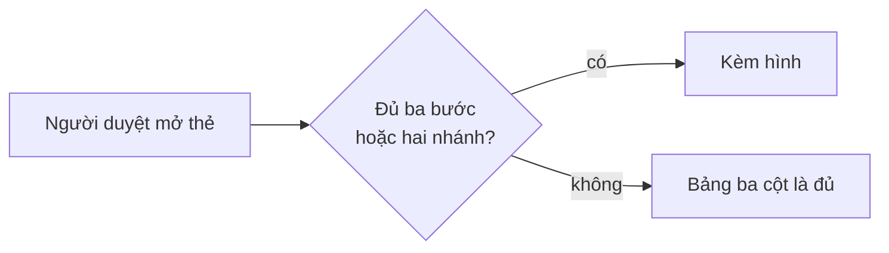

# Ngôn ngữ mặt người — luật bắt buộc khi trình cho người

Nguồn quyết định: `docs/specs/workflow-v2-spec.md` §4.1 (Manh, 2026-08-01).
File này là **bản thi hành**: bộ dựng thẻ, bảng tóm tắt kế hoạch và báo cáo
checkpoint NẠP file này trước khi viết chữ đầu tiên cho người đọc. Mỗi lần
render là một lần đọc — luật không sống trong trí nhớ.

## Áp ở đâu — và KHÔNG áp ở đâu

**ÁP** cho mọi thứ trình cho người để đọc/quyết: thẻ cổng, bảng tóm tắt kế
hoạch, báo cáo checkpoint và tổng kết, tin nhắn tại điểm quyết định, handbook,
release notes.

**KHÔNG ÁP** cho mặt máy: `evals.yaml`, `run-log.jsonl`, frontmatter, phần
Given/When/Then của `contract.md`, mã nguồn, thông điệp lỗi của script, tên
file. Ở đó **tên chính xác là bắt buộc** — "dịch cho dễ đọc" một khoá
frontmatter hay một `id:` của eval là làm hỏng hợp đồng máy, không phải làm
tốt cho người.

## Sáu luật

<!-- <<<HFL-LAW-TABLE -->
| # | Luật |
|---|---|
| N1 | **Chủ ngữ là người dùng hoặc sản phẩm, không phải file.** Câu nói *người dùng sẽ thấy gì khác*, không nói *sửa gì ở đâu*. |
| N2 | **Tên kỹ thuật (file/hàm/biến/bảng) xuống cột phụ hoặc ngoặc** — không bao giờ làm chủ ngữ. |
| N3 | **Mã số là tra cứu, không phải nội dung.** Lần đầu xuất hiện ở mặt người phải kèm 3–5 chữ nói nó là gì. |
| N4 | **Một dòng một ý** — không nhồi nhiều việc vào một ô bằng dấu phân cách. |
| N5 | **Hình trước, chữ là chú thích** tại mọi điểm quyết định (bảng có cột rõ · sơ đồ · bản bấm được). Câu hỏi cho người phải trả lời được bằng có/không hoặc a/b. |
| N6 | **Không dùng biệt ngữ nội bộ chưa có trong từ điển sản phẩm.** |
<!-- HFL-LAW-TABLE>>> -->

**Ngưỡng kích hoạt sơ đồ (N5):** điểm quyết định có **từ ba bước nối tiếp hoặc
từ hai nhánh rẽ trở lên** thì bắt buộc kèm sơ đồ; ít hơn thì bảng ba cột là đủ.
Ngưỡng này đếm được — liếc là biết, không phải phán.

**Từ điển sản phẩm sống ở đâu (N6):** `CONTEXT.md` ở gốc kho đang làm. Từ chưa
có mục trong đó thì hoặc thêm mục trước, hoặc viết bằng chữ thường ai cũng
hiểu. "Từ điển sản phẩm" không phải một khái niệm trừu tượng — nó là một file.

## Hai phép thử (rẻ, làm được trong vài giây)

- **Xoá-tên-máy**: xoá hết tên file/hàm/biến/mã số khỏi câu — còn nghĩa cho
  người không đọc code thì ĐẠT; thành rỗng hoặc mơ hồ thì viết lại.
- **Người-thứ-ba**: một người trong đội không đọc code kể lại được *"sau việc
  này người dùng thấy gì khác"* không?

## Ví dụ TRƯỚC/SAU

| Luật | TRƯỚC (ngôn ngữ máy) | SAU (ngôn ngữ mặt người) |
|---|---|---|
| N1 | Bộ dựng thẻ đọc thêm khoá độ phủ từ hợp đồng | Người duyệt thấy ngay bộ tiêu chí đã phủ hết những gì |
| N2 | Sửa bước lập kế hoạch trong SKILL của vòng lặp | Bước trình kế hoạch nạp bản luật trước khi viết (trong SKILL của vòng lặp) |
| N3 | Phục vụ AC-7, E12 | Phục vụ AC-7 (luật chỉ nằm một chỗ) và E12 (khuôn áp mọi lần trình) |
| N4 | Thêm marker, sửa bên đọc, thêm phép đo, chạy đóng gói | Bốn dòng riêng, mỗi dòng một việc |
| N5 | Ba đoạn văn mô tả một luồng có ba nhánh | Một sơ đồ ba nhánh, chữ là chú thích dưới hình |
| N6 | Bật CT-S cho slug này | Bật lưới chống sót tiêu chí cho việc này |

## Khuôn bảng tóm tắt kế hoạch

Dùng cho MỌI lần trình kế hoạch hoặc tiến độ cho người. Cột một phải qua được
phép thử Xoá-tên-máy. Một dòng một việc — cấm nhồi nhiều việc vào một ô bằng
dấu chấm giữa hay dấu chấm phẩy.

<!-- <<<PLAN-SUMMARY-TABLE-TEMPLATE -->
| Người dùng thấy gì khác | Đụng đâu | Phục vụ tiêu chí |
|---|---|---|
| <một câu, chủ ngữ là người dùng hoặc sản phẩm> | `<tên kỹ thuật>` | <mã> (<3–5 chữ nói nó là gì>) |
| Người duyệt đọc được bảng kế hoạch bằng tiếng sản phẩm | `human-facing-language.md` | AC-1 (bản luật đủ sáu điều) |
<!-- PLAN-SUMMARY-TABLE-TEMPLATE>>> -->

## Hình tại điểm quyết định

Vượt ngưỡng N5 thì bắt buộc có hình. **Hình là thứ người nhận NHÌN THẤY, không
phải một định dạng.** Chọn cách vẽ theo mặt phẳng đang trình, không theo thói
quen — tra bảng dưới đây.

<!-- <<<DECISION-DRAW-MECHANISMS -->
Danh sách đóng các cơ chế vẽ:
`hình vẽ nội tuyến của phiên` ·
`trang HTML gửi kèm` ·
`hình bằng ký tự trong khối mã` ·
`khối mermaid`.
<!-- DECISION-DRAW-MECHANISMS>>> -->

<!-- <<<DECISION-DIAGRAM-SURFACES -->
| Mặt phẳng đang trình | Vẽ bằng | Mặc định |
|---|---|---|
| Khung hội thoại | hình vẽ nội tuyến của phiên | ✔ mặc định |
| Panel bên hoặc file mở được | trang HTML gửi kèm | khi cần soi lâu, cần cuộn |
| Terminal thuần | hình bằng ký tự trong khối mã | chốt cuối, luôn chạy |
| Tài liệu trong kho | khối mermaid | khi hình sống trong tài liệu |
<!-- DECISION-DIAGRAM-SURFACES>>> -->

<!-- <<<DECISION-PICTURE-TEST -->
**Phép thử nhìn-thấy-hình:** thứ người nhận nhận được có phải là HÌNH chưa? Ca
trượt điển hình: dán một khối mã vào mặt phẳng thiếu bộ vẽ — người nhận thấy mã,
còn khó đọc hơn một cái bảng.
<!-- DECISION-PICTURE-TEST>>> -->

Nhãn nút chịu đúng N1/N2: nhãn là chữ cho người, tên file xuống chú thích dưới
hình. Khối dưới đây là ví dụ cho **một mặt phẳng cụ thể — tài liệu trong kho**,
là một trong các cách vẽ liệt kê ở bảng tra; chép nó sang mặt phẳng khác là ca
trượt của phép thử ngay trên.

<!-- <<<DECISION-DIAGRAM-TEMPLATE -->

<!-- DECISION-DIAGRAM-TEMPLATE>>> -->

Câu dưới đây là bản gốc DUY NHẤT của chỉ dẫn về hình trong vòng lặp tính năng.
Hai harness chép nguyên văn, không tự diễn đạt.

<!-- <<<LOOP-PICTURE-CLAUSE -->
Điểm quyết định vượt ngưỡng N5 thì kèm hình; chọn cách vẽ bằng bảng tra `DECISION-DIAGRAM-SURFACES` theo mặt phẳng đang trình, và kiểm lại bằng phép thử nhìn-thấy-hình.
<!-- LOOP-PICTURE-CLAUSE>>> -->

## Mời cổng — hỏi như đồng nghiệp

Đề bài gốc: sổ vấp 2026-08-10 (hành vi owner #8) — việc-cần-làm rải giữa thân
bài. Chip ② (11/08) chữa bằng một khối cứng N-mục-ba-vế + «Trả lời mẫu» ở cuối
mọi tin mời cổng; owner 16/08 gọi tên hệ quả: tin thành form, người điền hộ
máy, «ok» hết là câu trả lời, ví dụ thật 5 quyết định lồng nhau + hỏi phút dù
đã bỏ phút. Chẩn đoán: bảo hiểm cho một tin viết dở, trả phí ở mọi tin — nên
BỎ khuôn, không thay khuôn (hồ sơ cat-khoi-viec-cua-anh-tren-tin). Câu dưới
đây là bản gốc DUY NHẤT của điều khoản mời-cổng; các bên chép nguyên văn:

<!-- <<<GATE-INVITE-CLAUSE -->
Mời cổng như đồng nghiệp hỏi: một câu hỏi đóng, nói ngả máy khuyên và vì sao, kèm ĐÚNG MỘT dòng lệnh máy đã điền sẵn mọi ô có khuyến nghị — người chỉ gõ chữ quyết định hoặc sửa ô mình nghĩ khác, rồi máy nói mình làm gì tiếp; máy không viết sẵn CHỮ QUYẾT của người và không hỏi phút.
<!-- GATE-INVITE-CLAUSE>>> -->

Ba luật âm đi kèm — không tốn một chữ nào trong tin, chỉ cấm:

- **Máy không viết sẵn CHỮ QUYẾT của người.** Máy ĐƯỢC và PHẢI điền sẵn mọi ô
  đã có khuyến nghị máy (đề xuất cho mục ngoài hợp đồng, «đồng ý cắt», «phê
  hết») — đó là nhận thức máy gánh, luật (c) CLAUDE.md, owner quyết 01/09. Máy
  KHÔNG BAO GIỜ soạn hộ lời chấp thuận, chữ ký, hay verdict cho mục người phải
  tự chấm: những chỗ đó luôn để trống. Kit khoá không cho máy GỌI thao tác cổng
  (ADR 0002); ranh nằm ở AI PHÁT NGÔN CUỐI, không ở việc ô có được điền sẵn hay
  không (ca thật vẫn cấm: thẻ Cổng 2 vòng 2 chip ② từng in sẵn «E9 Đạt» cho mục
  máy vừa khai «chưa chắc» — đó là điền verdict).
- **Máy không hỏi phút.** Kit thôi đo phút người (hồ sơ cat-hinh-thuc); vế
  «phút» người quen tay gõ thì bỏ qua lặng.
- **Tin chỉ-báo không hỏi.** Tin không có việc cho người thì kết bằng một câu
  nói thẳng máy đang làm gì tiếp — không câu hỏi, không nhãn việc-của-anh.

Danh sách dưới đây là các mặt mời-cổng NGUỒN — phạm vi do người quyết, nên nó
được khai tay. Số sau mỗi đường dẫn là SỐ BẢN CHÉP PHẢI CÓ trong site đó: ít
hơn hay nhiều hơn đều đỏ — thêm/bớt một chỗ mời-cổng là quyết định người, phải
sửa số này cùng lượt; dòng thiếu số là lỗi kêu to, phép đo không tự đoán.

<!-- <<<GATE-INVITE-SITES -->
skills/acceptance/SKILL.md 2
commands/acceptance-card.md 1
feature-loop/skills/feature-loop/SKILL.md 2
<!-- GATE-INVITE-SITES>>> -->

## Câu gộp tại cổng — một-lượt-gõ cho lệnh cổng người

Đề bài gốc: sổ vấp 2026-08-10 — thẻ dạy owner một câu «Trả lời mẫu», nhưng
lệnh cổng lại hỏi từng bước (người phải trả lời lại thứ đã trả lời), và
người phải nhảy đúng phiên đúng repo mới gõ được lệnh. Ba lệnh có-câu-hỏi
nhận CHÍNH câu «Trả lời mẫu» đó làm MỘT CÂU GỘP — người gõ một lượt, lệnh
tự điền các trường. Ngữ pháp sống DUY NHẤT ở đây; sáu thân lệnh cổng người
chép điều khoản `GATE-ONESHOT-CLAUSE` nguyên văn và trỏ về khối này, không tự
diễn đạt.

<!-- <<<GATE-ONESHOT-GRAMMAR -->
Cú pháp gõ (một dòng, đúng thứ tự này): `<lệnh> [<slug>] [--repo <path>]
[--as "<tên>"] <câu gộp>` — câu gộp là TOÀN BỘ phần còn lại của dòng, không
cần dấu nháy; `;` chỉ ngăn các nhãn bên trong câu gộp. Ngày là điều máy
biết: `approved_at` ghi ngày lệnh chạy; «Ký» vắng ngày → ngày lệnh chạy.

Câu gộp theo lệnh:

- `/acceptance-gate:approve [<slug>] <câu gộp>` — trả lời chỗ trống «duyệt hay sửa: ___»
  của thẻ Cổng 1: `duyệt[: <tên> [<ngày>]][, phút <số>]` hoặc
  `sửa: <điều cần đổi>`.
- `/acceptance-gate:signoff [<slug>] <câu gộp>` — chuỗi `nhãn: giá trị` phân cách bằng `;`,
  đúng các nhãn dòng «Trả lời mẫu» của thẻ Cổng 2 («Ngoài-<số>» ·
  «<mã eval>» · «cắt/hoãn» · «Treo»), kết bằng `Ký[: <tên> [<ngày>]][, phút
  <số>]` (chỗ trống «ký hay trả») hoặc `Trả lại: <lý do>`.
- `/acceptance-gate:start [<slug>]` — chọn-trước bằng slug: slug nằm trong nhóm nào của lần
  quét thì bàn giao thẳng theo lối nhóm đó và hiển thị lại nhóm đã khớp;
  không thấy slug trong nhóm nào → trình thẻ như cũ.

Luật đi kèm — hai nguyên tắc gốc (owner 11/08): MÁY GÁNH NHẬN THỨC, NGƯỜI
GIỮ QUYẾT ĐỊNH — người chỉ khai điều chỉ người biết; máy khuyến nghị
trước, hỏi mở là đường cùng:

- Câu gộp là câu NGƯỜI gõ — máy dựng sẵn dòng lệnh và điền mọi ô đã có khuyến
  nghị, nhưng không bao giờ điền sẵn verdict hay chữ ký thay người, và ô người
  phải tự chấm thì để trống
  (cùng bất biến với luật âm mời-cổng ở trên, cùng gốc ADR 0002).
- Vắng câu gộp → lệnh hỏi từng bước như cũ (các câu hỏi còn lại đều là câu
  hỏi QUYẾT ĐỊNH); không trường ghi nào đổi tên, không trường nào thêm bắt
  buộc. Hai luật danh-tính và phút dưới đây áp cho CẢ đường từng-bước.
- Đuôi tự do người viết thêm sau các nhãn nhận ra được → GIỮ NGUYÊN VĂN và
  ghi lại (sổ quyết định hoặc Notes của hợp đồng), cấm nuốt lặng lẽ.
- Phần câu mơ hồ hoặc không nhận ra được → máy NÊU cách hiểu khả dĩ nhất
  kèm CĂN CỨ trích từ hồ sơ (khối Out of scope đã duyệt, sổ quyết định,
  trạng thái hồ sơ) và xin xác nhận một chạm; CHỈ hỏi mở khi thật sự không
  có cách hiểu trội hơn hoặc hiểu-sai-thì-đắt-khó-đảo. Ca mẫu (sự cố thật
  11/08): cụm «không cắt» đọc được hai chiều → đề xuất «đồng ý phạm vi đã
  khai» kèm căn cứ từ khối Out of scope, không hỏi mở.
- Tên người duyệt/ký và ngày là ĐIỀU MÁY BIẾT — người khai thì nhận
  nguyên nghĩa (câu kiểu cũ «duyệt: <tên>» · «Ký: <tên> <ngày>» vẫn chạy nguyên;
  khai tường minh thì ghi thẳng, không hỏi xác nhận). Vắng thì máy TỰ
  SUY, không hỏi — bốn luật TÁCH BẠCH, đọc hết rồi mới làm:
  - **ĐỌC**: luôn đọc CẢ `git config user.name` LẪN `signoff.approvers`,
    không có điều kiện nào chặn việc đọc. Đây là hai nguồn đối chiếu.
  - **CHỌN**: giá trị lấy ở nấc CAO NHẤT còn tên, theo bậc câu-người-gõ →
    cờ `--as` → `git config user.name` → `signoff.approvers` khi danh
    sách đúng một tên. Chữ ký thuộc NGƯỜI ĐANG GÕ: git config là
    thực-tại-máy, approvers chỉ là kỳ-vọng-hồ-sơ.
  - **CẢNH BÁO**: tên sắp ghi KHÔNG có trong `signoff.approvers` (danh
    sách dài bao nhiêu cũng vậy) → nêu một cảnh báo nhẹ: tên đang dùng kèm
    nguồn VÀ (các) tên trong danh sách, để người sửa một chạm khi máy đang
    đứng tên người khác. Luật này áp cho CẢ tên người tự gõ (khi đó in
    cảnh báo thành một dòng riêng, vì không có dòng xác nhận nào để kèm).
    Cảnh báo KHÔNG chặn ghi và KHÔNG đẻ thêm lượt hỏi — người im lặng thì
    máy vẫn ghi tên đã chọn.
  - **CẠN**: mọi nấc đều trống (hoặc chỉ còn approvers mà danh sách nhiều
    tên) → đây là ca đường-cùng hợp lệ: HỎI tên, đúng một câu — nhưng vẫn
    theo luật khuyến-nghị-trước: có danh sách thì LIỆT nó ra để người chọn
    một chạm, chỉ hỏi trắng khi không còn ứng viên nào.
  Suy xong: hai nguồn độc lập KHỚP TUYỆT ĐỐI (`signoff.approvers` đúng một
  tên VÀ bằng `git config user.name`) → GHI THẲNG rồi hiển thị lại «với danh
  tính: <tên> <ngày> (từ <nguồn suy>)», KHÔNG chờ xác nhận: hai nguồn đã đồng
  ý thì lượt chờ đó không thêm bảo đảm nào, chỉ thêm một chạm — và người vẫn
  sửa được bằng một câu ngay sau đó. Mọi ca khác (một nguồn trống · hai nguồn
  lệch · danh sách nhiều tên) thì HIỂN THỊ LẠI theo khuôn
  «với danh tính: <tên> <ngày> (từ <nguồn suy>) — Enter xác nhận» TRƯỚC
  khi ghi — khuôn PHẢI in cả nguồn suy (nấc nào của bậc thang đã bắn: câu
  anh gõ / cờ `--as` / `git config` / `signoff.approvers`), vì hiển thị
  tên mà giấu xuất xứ là sai-tên-âm-thầm trên máy dùng chung. Mọi trả lời
  MANG NGHĨA KHẲNG ĐỊNH đều là xác nhận, dài hay ngắn, kể cả tin nhắn
  trống (Enter) — chỉ trả lời nêu một tên hoặc ngày khác mới là sửa danh
  tính, và người sửa được cả tên lẫn ngày ở cùng dòng đó, kể cả ngày ở
  cổng không có ô ngày trong câu gộp: giá trị người nêu ở dòng xác nhận
  LUÔN thắng ngày máy suy. Người tự khai phần nào thì phần đó ghi thẳng;
  còn phần máy suy vẫn hiện trong dòng xác nhận (khai tên mà thiếu ngày →
  vẫn hiện để xác nhận ngày, và ngược lại), khai đủ cả hai → không hỏi.
  Máy KHÔNG hỏi và KHÔNG ghi số phút. Vế `, phút <số>` ở cuối câu gộp vẫn
  ĐƯỢC CHẤP NHẬN và BỎ QUA lặng — không lỗi, không hỏi lại; người quen tay gõ
  nó theo phản xạ thì câu vẫn chạy trọn. Trường `time_human_minutes` ở lại
  trong schema để hồ sơ cũ đọc được, chỉ thôi được ghi mới.
- Hồ-sơ cũng là điều máy biết: vắng slug mà đúng MỘT ứng viên đang chờ
  đúng cổng đó → dùng nó và hiển thị lại tên hồ sơ trong cùng lượt trả
  lời; nhiều ứng viên → bảng chọn như cũ.
- Ranh giới với bất biến không-điền-sẵn: máy ĐƯỢC đề xuất cách hiểu + căn
  cứ + xin một cái gật rẻ; lời chấp thuận là PHÁT NGÔN CUỐI của người —
  Enter xác nhận chỉ xác nhận DANH TÍNH sau khi người đã tự gõ quyết định;
  chữ ký vẫn là hành vi người (khoá ADR 0002 + commit chỉ-trường-người,
  git tự ghi author/date).
- «<mã eval>» nhận dạng theo khuôn `E\w+` — đúng khuôn mã mà thẻ đưa lên
  dòng «Trả lời mẫu».
<!-- GATE-ONESHOT-GRAMMAR>>> -->

Danh sách nhãn chỗ trống máy-đọc — cột một là cổng (`g1`/`g2`) hoặc `extra`
(nhãn ngoài-thẻ: thân lệnh dạy, thẻ không render nên round-trip không đòi):

<!-- <<<GATE-ONESHOT-SLOTS -->
g1 duyệt hay sửa
g2 Ngoài-<số>
g2 <mã eval>
g2 cắt/hoãn
g2 Treo
g2 ký hay trả
extra tên
extra phút
<!-- GATE-ONESHOT-SLOTS>>> -->

Câu dưới đây là bản gốc DUY NHẤT của điều khoản một-lượt-gõ. Mười hai thân
lệnh cổng người chép nguyên văn, không tự diễn đạt; số bản phải có của từng
site khai ở manifest ngay dưới — thêm/bớt site hay bản chép là quyết định
người, sửa manifest cùng lượt; dòng thiếu số là lỗi kêu to.

<!-- <<<GATE-ONESHOT-CLAUSE -->
Ba lệnh có-câu-hỏi (`/acceptance-gate:approve` · `/acceptance-gate:signoff` · `/acceptance-gate:start`) nhận MỘT CÂU GỘP theo ngữ pháp `GATE-ONESHOT-GRAMMAR` trong bản luật ngôn ngữ mặt người — câu gộp là câu NGƯỜI gõ — cờ và ngữ pháp này không mở đường cho máy gọi lệnh; vắng câu gộp thì hỏi từng bước như cũ. Mọi lệnh cổng người nhận cờ `--repo <path>`: mọi đọc/ghi/git của lệnh chạy trên gốc `<path>` (`git -C <path>`, script kèm `--root <path>`); vắng cờ thì gốc là thư mục hiện tại như cũ. Đầu ra theo bản luật ngôn ngữ mặt người.
<!-- GATE-ONESHOT-CLAUSE>>> -->

<!-- <<<GATE-ONESHOT-SITES -->
commands/approve.md 1
commands/signoff.md 1
commands/acceptance-init.md 1
commands/acceptance-status.md 1
commands/acceptance-report.md 1
commands/start.md 1
<!-- GATE-ONESHOT-SITES>>> -->

## Tên lệnh bấm được — một nguồn

Harness chỉ bảo đảm dạng `/<plugin>:<tên>`; dạng trần (tên không có tiền tố plugin) chỉ chạy khi không lệnh
nào khác dùng tên đó — tức may mắn theo máy. Bảng dưới là NGUỒN DUY NHẤT của tên lệnh
kit in cho người; dạng trần chỉ được xuất hiện ở cột một của chính bảng này.

<!-- <<<COMMAND-NAMES -->
| Tên trần | Lệnh bấm được | Loại |
|---|---|---|
| start | /acceptance-gate:start | command |
| approve | /acceptance-gate:approve | command |
| signoff | /acceptance-gate:signoff | command |
| acceptance-card | /acceptance-gate:acceptance-card | command |
| acceptance-init | /acceptance-gate:acceptance-init | command |
| acceptance-status | /acceptance-gate:acceptance-status | command |
| acceptance-report | /acceptance-gate:acceptance-report | command |
| uat-session | /acceptance-gate:uat-session | skill |
| feature-loop | /feature-loop:feature-loop | skill |
| goal | /goal | harness |
<!-- COMMAND-NAMES>>> -->

<!-- <<<COMMAND-NAMES-CLAUSE -->
Khi nêu một lệnh cho người bấm hay chép — trong thẻ, tin mời cổng, câu trả lời — dùng đúng cột «Lệnh bấm được» của bảng `COMMAND-NAMES`, không dùng dạng trần.
<!-- COMMAND-NAMES-CLAUSE>>> -->

## Từ mới feature này đưa vào từ điển

Mỗi từ dưới đây phải có mục trong `CONTEXT.md` — nếu không, chính kit vi phạm
luật N6 nó vừa đặt ra.

<!-- <<<HFL-GLOSSARY-TERMS -->
- mặt người
- mặt máy
- lỗ-kit
- mặt phẳng
- nhìn-thấy-hình
- known-limits
- dogfood
- single-source
- run_id
- machine-lane
- fixture
- carry
- kind:panel
<!-- HFL-GLOSSARY-TERMS>>> -->

## Biệt ngữ trong lời ký — chú giải thay vì viết lại

Lời người ký là nguyên văn, luật N4 CẤM viết lại nó. Nhưng lời ký hay mang
biệt ngữ nội bộ mà người quyết kinh doanh không có nghĩa vụ biết. Đường ra:
**chú giải**. Mỗi từ dưới đây, khi xuất hiện trong thứ trình cho người, được
kèm một dòng nghĩa ở khối "Từ điển" cuối trang — lời người giữ nguyên, người
đọc vẫn hiểu. Từ nào vào khối này PHẢI có trong `HFL-GLOSSARY-TERMS` ở trên
(và do đó có mục trong `CONTEXT.md`) — phép đo P155 canh quan hệ đó.

<!-- <<<SIGNOFF-JARGON-GLOSS -->
- known-limits — giới hạn đã biết, người ký chấp nhận trước khi phát hành
- dogfood — chính đội tự dùng sản phẩm mình làm để thử
- single-source — một chỗ duy nhất giữ sự thật, nơi khác đọc lại
- run_id — mã một lượt chạy, dùng để đối chiếu bằng chứng
- machine-lane — làn máy chạy trọn bộ kiểm, không có người can thiệp
- fixture — hồ sơ dựng sẵn để thử, không phải hồ sơ thật
- carry — mang kết quả lượt trước sang lượt sau thay vì chạy lại
- kind:panel — dòng biên bản hội đồng trong sổ chạy của máy
<!-- SIGNOFF-JARGON-GLOSS>>> -->

## Vi phạm tại cổng — người duyệt có quyền TRẢ LẠI

Thấy vi phạm ở thứ được trình, người duyệt **trả lại tại cổng** — không phải
duyệt cho xong rồi góp ý sau. Trả lại là một lỗ của bộ công cụ, không phải lỗi
của người viết: ghi vào sổ quyết định `_acceptance/<slug>/decisions.jsonl` một
entry `revisit` có `decision` bắt đầu đúng chuỗi `lỗ-kit — ngôn ngữ mặt người`
kèm câu vi phạm, để đợt nâng bộ thẻ đọc lại bằng số thay vì bằng trí nhớ.
